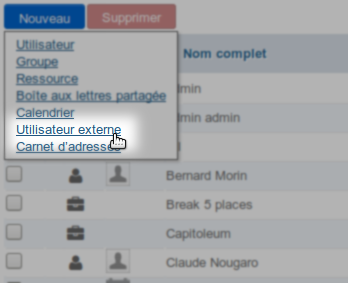
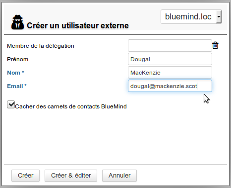
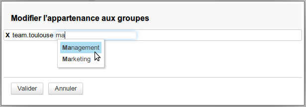
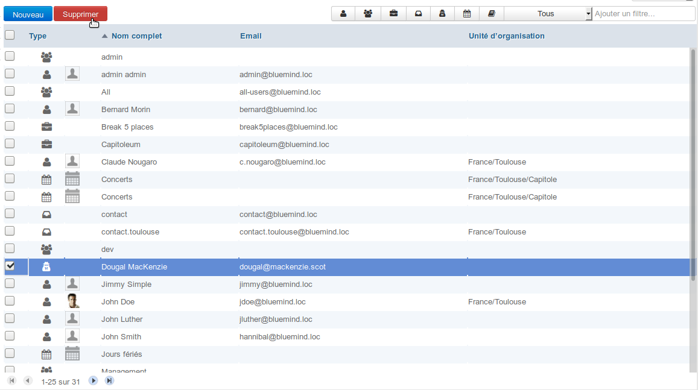

# Externe Benutzer

## Präsentation

Externe Benutzer sind Benutzer, die nicht wie reguläre Benutzer ein eigenes Konto in BlueMind haben, sondern eine **E-Mail-Adresse außerhalb** von BlueMind haben. ****Benutzer dieses Typs können zu BlueMind-Gruppen hinzugefügt werden, um an sie gerichtete Nachrichten zu erhalten.****

Ein externer Benutzer wird in BlueMind durch ein spezielles Symbol gekennzeichnet: 

## Erstellung

Ab BlueMind 3.5.10 finden Sie in den Verknüpfungen der Verzeichnisverwaltungs-Startseite, aber auch im Menü zur Erstellung von Entitäten einen neuen Typ:

Wenn Sie auf den Link klicken, gelangen Sie in das Fenster zum Anlegen externer Benutzer, mit eingeschränkten Eigenschaften im Vergleich zu BlueMind-Benutzern:

- **Mitglied der Delegation**: der Benutzer kann Mitglied einer Organisationseinheit sein (siehe [Delegierte Verwaltung](/Guide_de_l_administrateur/Gestion_des_entités/Utilisateurs/L_administration_déléguée/))
- **Vornamen**: -fakultativ-
- **Name**: Pflichtfeld
- **Email**: Pflichtfeld - muss eine gültige Email-Adresse enthalten
- **BlueMind-Adressbücher ausblenden**: Der Kontakt kann Mitglied einer Gruppe sein, wird aber nicht im Verzeichnis angezeigt – diese Option ist standardmäßig aktiviert und kann bei der Erstellung, aber auch jederzeit danach deaktiviert/aktiviert werden

Wenn das Formular ausgefüllt ist, klicken Sie auf:

- &lt;Erstellen> um den Benutzer direkt zu erstellen
- &lt;Erstellen & Editieren>, um den Benutzer zu erstellen und Zugriff auf die Verwaltung seiner kompletten Administrationsdatei zu erhalten

## Verwaltung

### Benutzer

In der Registerkarte "Allgemein" eines Benutzerstammsatzes können die beim Erstellen des Benutzers ausgefüllten Felder vervollständigt/geändert werden, aber auch die Gruppen, zu denen er gehört, geändert werden:

### Kontaktdatensatz

Die Registerkarte "Benutzerinformationen" dient zum Ausfüllen der Kontaktinformationen des Benutzers, um sie im Verzeichnis freizugeben:

### Hinzufügen zu einer Gruppe

Der Benutzer kann auf 2 Arten zu einer Gruppe hinzugefügt werden:

1. In seiner Administrationsdatei auf den Link "Gruppenzugehörigkeit ändern" klicken und die gewünschten Gruppen eingeben:
2. In der Administrationsdatei einer Gruppe den Benutzer suchen und wie jeden anderen Benutzer hinzufügen:

:::info

Das Hinzufügen zu einer Gruppe ist sofort wirksam, der Benutzer beginnt, an die Gruppe adressierte Nachrichten zu empfangen (entweder über die Adresse der Gruppe oder durch Hinzufügen seiner Adresse zu der der anderen Mitglieder, wenn die Gruppe keine eigene Adresse hat).

:::

### Löschung

Einen externen Benutzer löschen:

- Gehen Sie zur Verwaltung des BlueMind-Verzeichnisses
- Wählen Sie den Benutzer aus und klicken Sie auf "Löschen" :

:::info

Entfernen aus Gruppen

Der Benutzer wird automatisch aus allen Gruppen gelöscht, denen er angehörte.

:::

