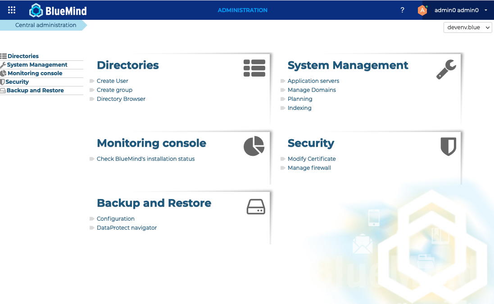

# Die Administrationskonsole

Die Administrationskonsole ist der Teil, der dem globalen Administrator und den Domänenadministratoren den Zugriff auf die Funktionen der Systemkonfiguration und der Verwaltung von Servern, Domänen, geplanten Aufgaben und Dokumentation ermöglicht.

 

 

 

