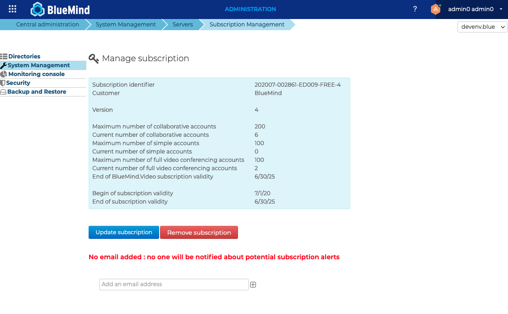
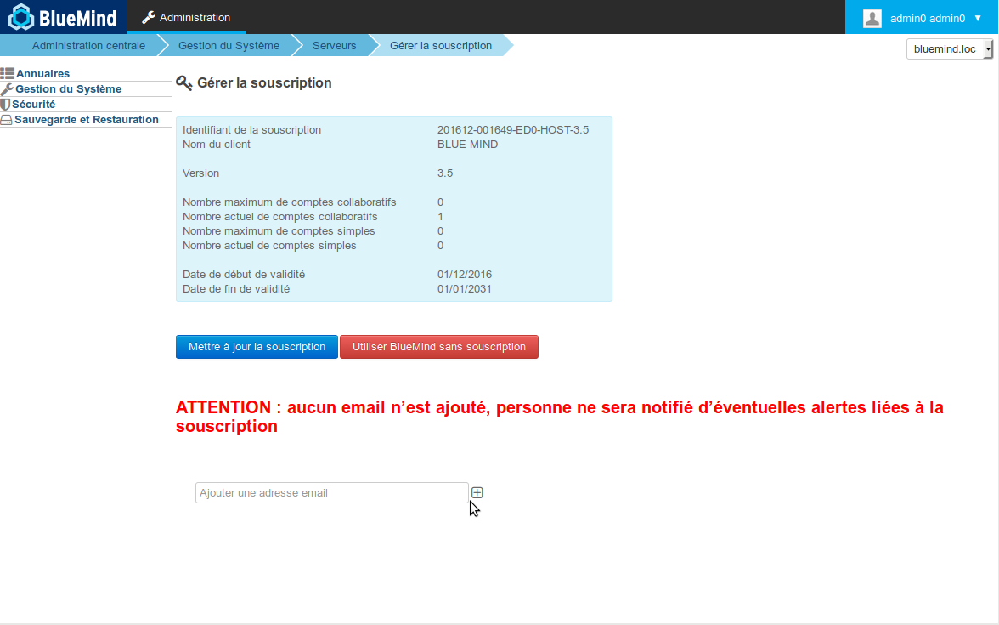
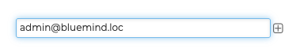
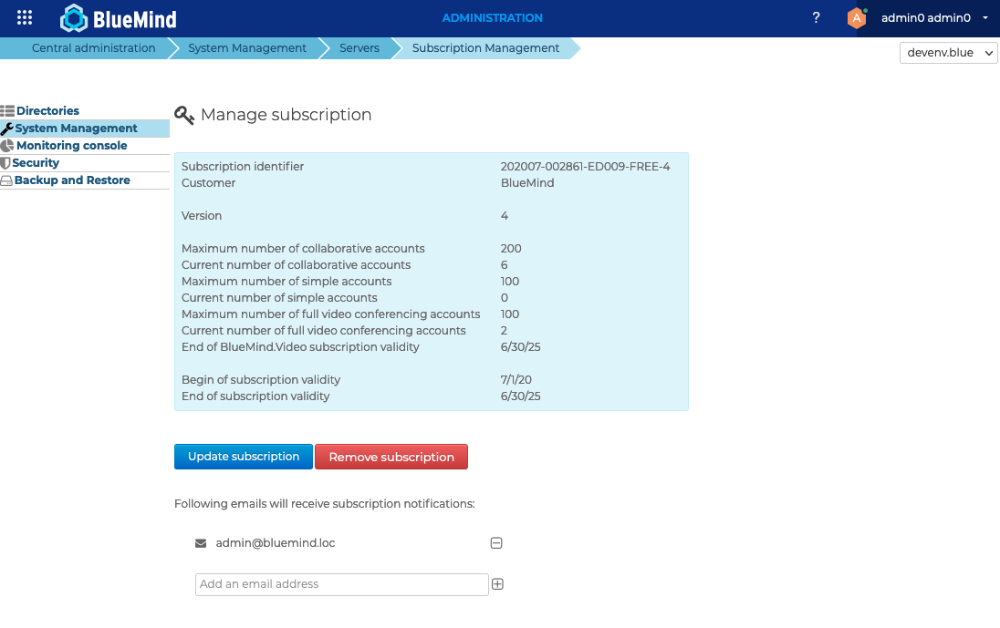
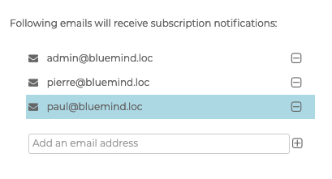

# Das BlueMind-Abonnement

## BlueMind – Open-Source-Lösung und professionelles Angebot

### Die BlueMind-Lösung

BlueMind ist eine moderne Open-Source-Lösung für kollaboratives Messaging und einheitliche Kommunikation. BlueMind bietet eine vereinfachte Ergonomie, eine sehr reaktive Weboberfläche, ein komplettes Mobilitätsmanagement und wird durch eine moderne und offene Architektur unterstützt (disconnected web mode, native Webservices und API, die 100 % des Umfangs abdecken, Plugins,...).

### Das professionelle Angebot von BlueMind

Rund um die Open Source Software bietet BlueMind SAS ein professionelles Angebot, dessen Ziel es ist, einen langfristigen und reibungslosen Einsatz in der Produktion zu ermöglichen.

Das professionelle Angebot basiert auf Versionen, die von BlueMind SAS garantiert und unterstützt werden und deren Nachverfolgung sichergestellt ist. Das Abonnement bietet Zugang zu Updates und Upgrades. Außerdem sind zusätzliche Komponenten und Tools enthalten, die den Betrieb und die Integration in ein Informationssystem vereinfachen.

Das professionelle Angebot BlueMind Subscription ist die unverzichtbare Lösung, um Ihr Open Source BlueMind in betriebsbereitem Zustand zu halten.

## Inhalt des Abonnements

Das BlueMind-Abonnement beinhaltet:

- die BlueMind OpenSource-Software in garantierten und unterstützten Versionen
- [korrigierende Updates](../Guide_d_installation/Mise_à_jour_de_BlueMind.md)
- mit neuen Versionen von BlueMind Upgrade-fähige Updates
- volle Nutzung von Outlook für Windows ohne Konnektoren
- ein Administrationswerkzeug, das die einfache und grafische Anwendung von Updates, Patches und Upgrades ermöglicht
- Zusatzkomponenten:
    - einen [Active Directory](./Gestion_des_entités/Synchronisation_Active_Directory.md)-Konnektor

:::tip

Über Updates benachrichtigt werden

Das Abonnement ermögicht das Update von BlueMind, vergessen Sie daher nicht, den speziellen Newsletter zu abonnieren, um Informationen über neue Versionen, Upgrades und Patches zu erhalten: [https://lists.bluemind.net/mailman/listinfo/bluemind](https://lists.bluemind.net/mailman/listinfo/bluemind)

:::

### Garantierte Versionen und Support durch den Herausgeber

Das BlueMind-Abonnement bietet Versionen, die vom Herausgeber identifiziert und unterstützt werden, der Patches und Upgrades sicherstellt. 

### Update-Tool

Der [BlueMind-Aktualisierung-Prozess](../Guide_d_installation/Mise_à_jour_de_BlueMind.md) ist einfach, sicher und schnell, damit die Updates nicht virtuell bleiben und effektiv angewendet werden.

Um die Weiterentwicklung zu gewährleisten, ist in das Abonnement ein grafisches Verwaltungstool integriert, mit dem sich Korrekturen und Erweiterungen der Software einfach und zeitsparend durchführen lassen. Der Kunde entscheidet, wann die Aktualisierung erfolgen soll, und das Tool führt sie durch.

## Abo-Arten

Das BlueMind-Abonnement wird je nach Verwendungszweck und Art des Endanwenders in verschiedenen Varianten angeboten:

- Prod / Host
- Evaluierung (Tests, Preprod, Dev...)
- Kostenfrei

### Prod / Host

Ein Produktions- (Typ PROD) oder Hosting-Abonnement (Typ HOST) ermöglicht dem Kunden die Installation und Wartung der BlueMind-Lösung gemäß den mit dem Anbieter vertraglich vereinbarten Eigenschaften.

Hinweis: Host-Abonnements sind unseren Hosting-Partnern vorbehalten.

### Evaluierung

Ein Evaluierungsabonnement (Typ TRIAL) kann für Test-, Entwicklungs- oder Vorproduktionsumgebungen zur Verfügung gestellt werden, es ermöglicht die volle Nutzung des professionellen Angebots für eine begrenzte Dauer und Anzahl von Benutzern.

### Kostenfrei

Ein kostenloses und vollständiges Abonnement kann für bestimmte Zielgruppen angeboten werden, wie z.B.:

- Gemeinnützige Vereine, die im Bereich Open Source arbeiten,
- Verfasser von bedeutenden Beiträgen
- Einzelpersonen, die es für ihren persönlichen Gebrauch nutzen, bis zu einem Limit von 10 Konten.

## Grenzen der Gültigkeit

:::info

Wer ist ein Administrator?

[Benutzer mit der Rolle](./Gestion_des_entités/Utilisateurs/Les_rôles_droits_d_accès_et_d_administration.md) "BlueMind-Abonnement verwalten" werden als Abonnement-Administratoren betrachtet. Es ist wichtig, die Rolle "Administrationskonsole" gemeinsam zu aktivieren, damit der Benutzer darauf zugreifen kann, um das Abonnement zu installieren und zu aktualisieren.

:::

:::tip

Kontinuität des Dienstes

Während der Zeit, in der sich die Benutzer nicht mehr einloggen können, arbeitet das System weiter; BlueMind ist nicht blockiert, nur der **Zugang zu BlueMind** ist gestört: Eingehende E-Mails werden weiterhin vom Server empfangen und verarbeitet, die Benutzer finden sie in ihrem Posteingang, wenn der Zugang wieder hergestellt ist.

:::

### Gültigkeitsdatum

Das BlueMind-Abonnement ist bis zu einem bestimmten Datum gültig.

Bei einem Produktionsabonnement (Typ PROD oder HOST) werden die Administratoren des Abonnements regelmäßig über das Herannahen dieses Datums informiert

1. 2 Monate vor dem Ablaufdatum: eine E-Mail wird an die Domain-Administratoren gesendet
2. 1 Monat vor dem Ablaufdatum: Eine E-Mail wird an die Domain-Administratoren gesendet und ein Banner erscheint in deren Oberfläche sowie in der des Superadministrators admin0
3. Am Ablaufdatum:
    - Ein Informationsbanner erscheint für alle Benutzer
    - Die Administratoren werden bei der Anmeldung automatisch auf die Seite zur Abonnementverwaltung geleitet, um die nötigen Maßnahmen zu ergreifen
    - alle 2 Tage wird eine E-Mail an die Administratoren gesendet
4. 10 Tage nach Ablauf des Ablaufdatums:
    - Alle Benutzer sind gesperrt: der Zugriff auf BlueMind ist nicht mehr möglich, auch nicht im Fernzugriff (Mobilgeräte, Software von Drittanbietern...)
    - Die Administratoren werden bei der Anmeldung automatisch auf die Seite zur Abonnementverwaltung geleitet, um die nötigen Maßnahmen zu ergreifen

Bei einem Bewertungsabonnement (Typ TRIAL) wird das System am Ablaufdatum gesperrt:

- Benutzer können sich nicht mehr mit BlueMind verbinden
- Administratoren können sich anmelden und werden automatisch auf die Seite für die Abonnementverwaltung weitergeleitet, um die nötigen Maßnahmen zu ergreifen

### Anzahl der Benutzer

Das BlueMind-Abonnement gibt Anspruch auf eine bestimmte Anzahl von Benutzern.

Es wird jedoch eine Toleranz von 10 % Überschreitung gewährt, bis das Abonnement angepasst ist.

Die Administratoren werden wie folgt informiert:

1. **Wenn zusätzliche Benutzer angelegt werden** und solange die Anzahl der Benutzer die maximale Anzahl der Abonnements überschreitet:
    - ein Info-Banner erscheint in ihrer Oberfläche, auf der Administrationskonsole sowie in ihren Anwendungen (Posteingang, Terminplaner, etc.)
    - eine Info-Mail wird alle 7 Tage an sie gesendet.
2. **Wenn nach einem Monat** keine Maßnahmen ergriffen wurden (Löschung von Benutzern oder Anpassung des Abonnements): 
    - Alle Benutzer sind gesperrt: der Zugriff auf BlueMind ist nicht mehr möglich, auch nicht im Fernzugriff (Mobilgeräte, Software von Drittanbietern...)
    - wird eine Info-Mail an die Administratoren gesendet
    - Administratoren mit den entsprechenden Rechten können sich in der Administrationskonsole anmelden, um entsprechende Schritte zu unternehmen.

**Wenn die Toleranzgrenze von 10 % erreicht ist, ist das Anlegen neuer Benutzer nicht mehr möglich**. Im BlueMind der Administratoren (Administrationskonsole, Posteingang, Terminplaner usw.) erscheint ein Infobanner.

## Empfangen von Alarmen

Wenn sich eine Gültigkeitsgrenze (Anzahl der Benutzer oder Datum) nähert oder erreicht ist, wird Administratoren und/oder Benutzern ein Warnbanner angezeigt (siehe vorheriges Kapitel) und es werden E-Mail-Benachrichtigungen ausgegeben.

Dazu  **muss**  auf der Seite für die Abonnementverwaltung mindestens eine **Empfängeradresse** eingegeben werden, um sicherzustellen, dass mindestens eine Person diese Benachrichtigungen erhält, da das System das Abonnement sperren kann, wenn es nicht rechtzeitig aktualisiert wird (siehe vorheriges Kapitel). Solange keine Adresse eingerichtet ist, erscheint auf jeder Seite der Administrationskonsole ein Infobanner für Benutzer mit der [entsprechenden Rolle](./Gestion_des_entités/Utilisateurs/Les_rôles_droits_d_accès_et_d_administration.md):

Mit einem Klick auf den Bannertext gelangen Sie direkt auf die Seite der Abonnementverwaltung. Auf dieser Seite erscheint eine Warnung sowie ein Feld zum Ausfüllen einer Adresse:

Um eine E-Mail-Adresse hinzuzufügen, füllen Sie einfach das Feld aus und klicken Sie auf die Schaltfläche  neben:

Die E-Mail wird sofort hinzugefügt und die Warnung verschwindet:

Gehen Sie auf die gleiche Weise vor, um so viele Empfängeradressen wie gewünscht hinzuzufügen:

:::info

Als ‚unerwünscht‘ markieren

Bei externen Adressen werden einige Anti-Spam-Systeme die Nachricht ggf. filtern: Denken Sie daran, den Empfänger darauf hinzuweisen, seinen Spam-Ordner regelmäßig zu überprüfen.

Aus diesem Grund ist es immer vorzuziehen, mindestens einen internen Empfänger zu haben.

:::

Um eine E-Mail-Adresse zu entfernen, klicken Sie auf die Schaltfläche  neben:

:::tip

Übernahme

Ein Validieren oder Speichern ist nicht norwenig, Ergänzungen und Löschungen werden sofort übernommen.

:::

