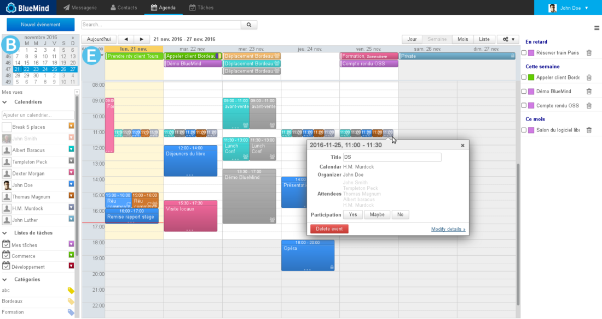
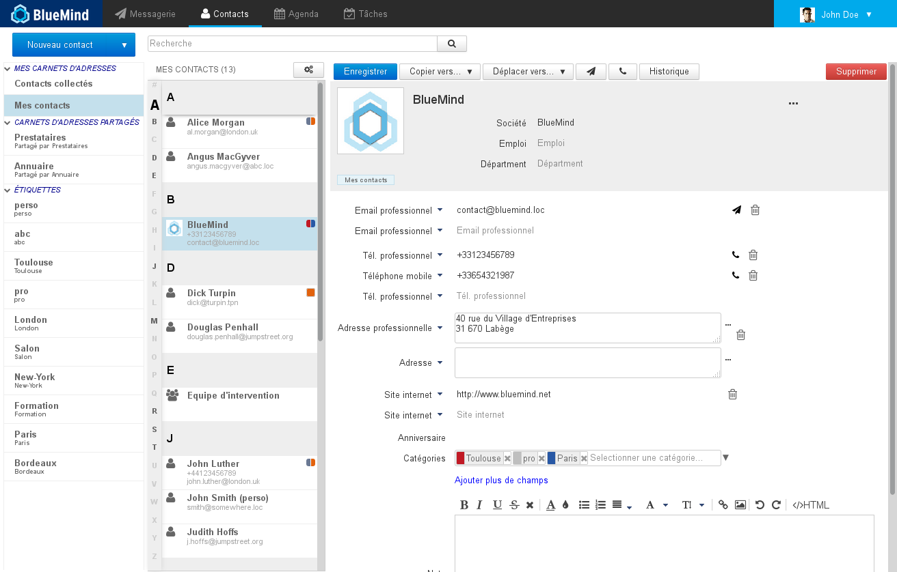
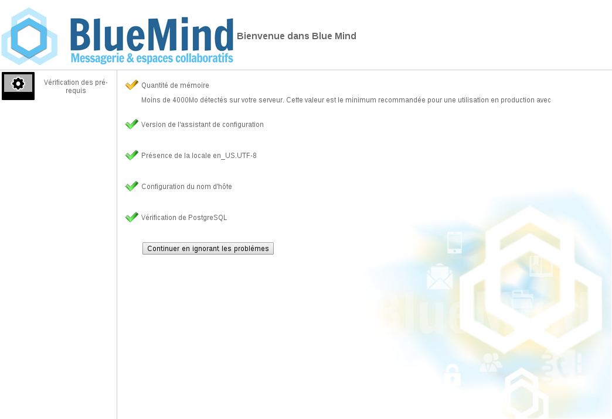
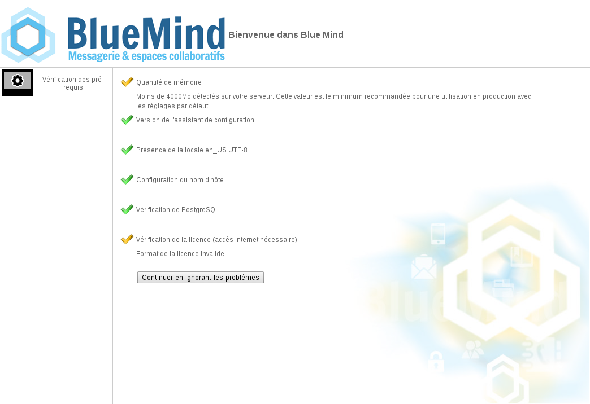

# Anwendungen und Komponenten

## Benutzeranwendungen

### Webmailer

Die Webmailer-Anwendung ist vollständig mit anderen BlueMind-Anwendungen integriert.

Die wichtigsten Merkmale sind:

- eine 3-Felder-Ansicht
- Einladungen zu Terminen können beantwortet werden, ohne die Webmailer-Anwendung zu verlassen
- Autovervollständigung von BlueMind-Kontakten und Verteilerlisten
- erweiterte Volltext- und Multi-Ordner-Suche

### Kalender

Eine der Hauptfunktionen der Kalenderanwendung ist:

- Unterstützung des Offline-Modus
- Multi-Kalender-Anzeige
- Verwaltung von Tags
- Ressourcenverwaltung

### Kontakte

Die Kontaktverwaltungsanwendung verfügt unter anderem über die Funktionen:

- Unterstützung des Offline-Modus
- Verwaltung von Tags
- Verwaltung von Kontaktlisten
- Verwaltung der Kontakte und Adressbücher des Benutzers

### Einstellungen und Voreinstellungen

Die Anwendung Verwaltung von Einstellungen und Voreinstellungen ermöglicht es dem Benutzer, seine persönlichen Vorlieben für die Einstellung und Anzeige von BlueMind zu ändern.

Sie kann durch Klicken auf das Schraubenschlüssel-Symbol in der oberen rechten Ecke des Fensters aufgerufen werden:

Accéder à la gestion des préférences de Blue Mind

## Die Anwendungen des Administrators

### Installationsassistent

Mit der Anwendung Installationsassistent (IW) können Sie BlueMind auf einem neuen Server installieren. Die Anwendung konfiguriert alle BlueMind-Systemkomponenten und alle BlueMind-Einstellungen, so dass die Installation von BlueMind vollständig, konsistent und effizient erfolgt.

:::info
Mit dem Installationsassistenten kann das BlueMind-System nicht aktualisiert werden. Nur der Einrichtungsassistent ermöglicht diesen Schritt.
:::

### Einrichtungsassistent

Die Anwendung Einrichtungsassistent (SW) ist ein Assistent für die Installation und Aktualisierung von BlueMind.

Die im Rahmen des [BlueMind-Abonnements](http://www.blue-mind.net/solutions/article/solution-professionnelle) bereitgestellte Anwendung Einrichtungsassistent ermöglicht zusätzlich zu mit denen der Anwendung Installationsassistent identischen Aktionen die Aktualisierung einer bereits vorhandenen BlueMind-Installation, auch in einer verteilten Umgebung und bei Hauptversionsänderungen.

## Server-Komponenten

### Kern

Die Kern(Core)-Server-Komponente ist der Haupt-Webdienst von BlueMind. Sie ermöglicht die Verwaltung von:

- Geschäftslogik
- Datenbankzugriffen
- BlueMind-API-Aufrufen

### Anwendungsserver

Alle Webschnittstellen zum Endanwender laufen auf einem JEE-Webserver. Die gehosteten Anwendungen sind:

- Kalender
- Kontaktverwaltung
- Administrationskonsole
- Einstellungsverwaltung
- Installationsassistent und Einrichtungsassistent
- Apache Solr-Anwendung
- Client-Schnittstelle des XMPP-Servers (ab BlueMind v3)

### SMTP und IMAP

Die Standard-Nachrichtenprotokolle werden von BlueMind unterstützt:

- SMTP dank Postfix
- IMAP und POP mit Cyrus IMAPd

### MQ-Server

Hazelcast ist ein Paket und für den Austausch von Terminen zwischen BlueMind-Anwendungen vollständig in BlueMind integriert. Diese Komponente wird verwendet für:

- Senden von Benachrichtigungen über Kalendertermin (z. B. Core-Termine, die von EAS abgehört werden)
- Senden von Benachrichtigungen über Termine aus der Kontaktverwaltung (z. B. Termine aus Core und von EAS abgehört)
- Senden von Benachrichtigungen über zugestellte E-Mails (Termin, der vom LMTP-Daemon kommt und z. B. von EAS abgehört wird)
- Senden von Benachrichtigungen über Anmelde- und Abmeldetermin (Termine, die von Core kommen und z. B. von HPS abgehört werden)

Der Hazelcast-Cluster besteht aus 3 Knoten, die von den Diensten core, EAS und bm-webserver bereitgestellt werden. Es ist sehr wichtig, dass der Cluster für die ordnungsgemäße Funktion von BlueMind vollständig ist, sein Status kann über [Bm-Tick-Monitoring](/Guide_de_l_administrateur/Supervision/Monitoring_Bm_Tick/)überwacht werden.

### EAS

EAS ist ein Synchronisationsserver für mobile Geräte (Smartphones, Tablets usw.). Er verwaltet die nativen Protokolle dieses Gerätetyps und ermöglicht daher die Verwendung nativer Anwendungen von Smartphones zur Synchronisierung von E-Mails / Kalendern / Kontakten.

### Locator

Die Locator-Komponente kann als ein interner BlueMind-Server zur Namensauflösung betrachtet werden. Sie ermöglicht die Verknüpfung von Komponenten untereinander.

Mit Locator kann die EAS-Komponente z. B. den Namen des IMAP-Servers erfahren, dem die Mailbox eines bestimmten Benutzers gehört.

### HPS

HPS ist ein Reverse-Proxy HTTP-Authentifizierungsserver. Er befindet sich zwischen dem [Nginx-Reverse-Proxy](http://wiki.nginx.org/Main) und den Benutzeranwendungen.

Ist eine Authentifizierung erforderlich, präsentiert HPS dem Benutzer das Anmeldeformular, wenn der Benutzer noch nicht authentifiziert ist, oder leitet die Anfrage an die angeforderten Dienste weiter.

Diese Komponente ist für die SSO (Single Sign-On / Single Sign-Out) Logik an den Benutzerschnittstellen zuständig.

### SASL-Daemon

Diese Komponente mit dem Namen YSNP ist der BlueMind SASL-Authentifizierungs-Daemon. Sie validiert Passwörter für die Core-Komponente und bietet Authentifizierung auf IMAP-Komponentenebene für Benutzer, die über Webschnittstellen verbunden sind

## Plugins

BlueMind kann erweitert werden mit Hilfe von*Add-Ons* (Zusatzmodulen) oder Zusatzprogrammen, die von der Community auf dem [MarketPlace](https://marketplace.bluemind.net/)geteilt werden.

Um mehr über die Entwicklung dieser Plugins zu erfahren, können Sie die Seite [Zu BlueMind beitragen](/Guide_du_développeur/Contribuer_à_BlueMind/)einsehen.

