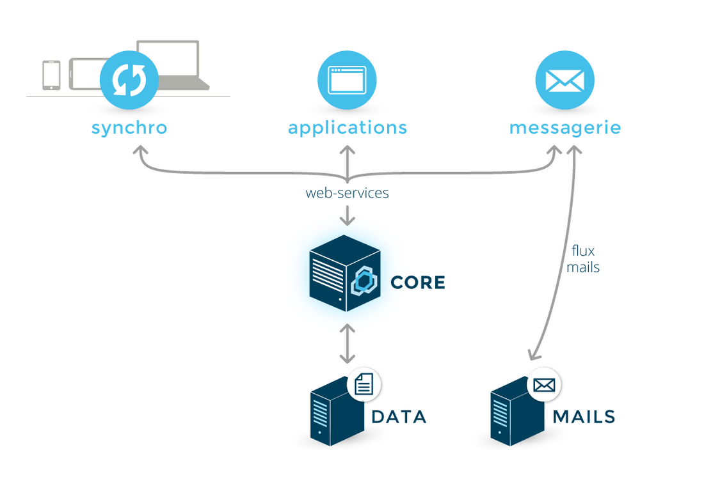
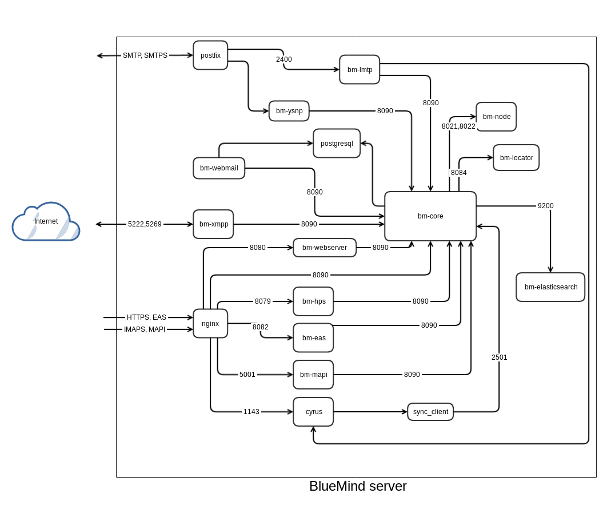

# Die Dienste

Liste der von BlueMind verwendeten Dienste, Pakete, Daten und Protokolle

## Dienstarchitektur

- BM-Core ist die Kernkomponente von BlueMind. Es handelt sich um die zentrale Verwaltungsstelle für Daten und Geschäftsregeln. Als einzige Komponente greift sie auf die Datenbank zu.

- Alle Funktionen sind in eb Services exponiert und können daher von anderen Anwendungen gesteuert werden.

- Alle Komponenten, ob intern oder extern, nutzen die Webdienste. Dies hat den Vorteil, dass die Ströme zu und von der BlueMind Mailbox (die auf Webdienste und Malbox-Ströme beschränkt sind) eingeschränkt werden und die Verwendung homogener Verwaltungsregeln unabhängig vom Eintrittspunkt einer Änderung sichergestellt wird.

## Mit BlueMind gelieferte Pakete

Die Pakete sind in `/var/spool/bluemind-pkgs/`verfügbar

Die Befehle aptitude([Debian](https://wiki.debian.org/fr/Aptitude)/[Ubuntu](https://doc.ubuntu-fr.org/aptitude)) und yum[(RedHat](http://www.linuxcommand.org/man_pages/yum8.html)) werden verwendet, um verfügbare und/oder installierte Pakete zu suchen und aufzulisten.

## Von BlueMind verwendete Dienste

| Dienst | Verwendung |
| --- | --- |
| net.bluemind.eas.push | Synchronisation von mobilen Geräten über das Exchange Active Sync-Protokoll |
| net.bluemind.dav.server.dav | cardDav- und CalDav-Synchronisation von Apple-Clients |
| net.bluemind.milter.milter | Milter Dienst |
| net.bluemind.xmpp.server.launcher.tigase | Instant Messaging |
| net.bluemind.core.launcher.core | Hauptdienst |
| net.bluemind.node.server.nodelauncher | Kommunikation zwischen den verschiedenen Servern bei einer Multi-Server-Installation |
| net.bluemind.tika.server.tika | Erkennung und Extraktion von Metadaten und Dokumententexten |
| net.bluemind.proxy.http.launcher.hpslauncher | Authentifizierungs-Proxy |
| exchange.http | Kommunikation mit MAPI |
| net.bluemind.webmodules.launcher.webLauncher | HTTP-Proxy für Webdienste |
| net.bluemind.locator.app | Dienst zum Auffinden verschiedener Server bei einer Multi-Server-Installation |
| org.elasticsearch.bootstrap.Elasticsearch | Index- und Suchdienst |
| net.bluemind.ysnp.ysnp | SMTP- und IMAP-Authentifizierung |
| net.bluemind.lmtp | lokaler Mailweiterleitungsdienst |
| postgresql | Datenbank |
| postfix | Mailbox-Server |
| nginx | HTTP-Proxy + IMAP|
| php-fpm | PHP-Interpreter für Webanwendungen (Webmailer) |
| cyrus (imapd und pop3d) | Dienst für die imap- und pop-Synchronisation der Mailbox-Software anderer Hersteller (heavy oder mobil) |

## Von BlueMind verwendete Daten

### Sicherung

- /var/backups/bluemind

### /etc

Die in `/etc/` befindlichen Dateien und Verzeichnisse enthalten die Konfigurationen der von BlueMind verwendeten Komponenten:

| Datei/Verzeichnis | Inhalt |
| --- | --- |
| 
bm | bm.ini, die Zertifikate und ssh-Schlüssel von bm-node. |
| bm-node | rsync.excludes |
| bm-webmail | Konfiguration von php5-fpm für BlueMind und nginx-webmail.conf |
| cyrus.conf | Cyrus-Konfiguration |
| imapd.conf | IMAP-Konfiguration (generiert von bm-core) |
| nginx | nginx-Konfiguration |
| php5 | php5-Konfiguration |
| postfix | Postfix-Konfiguration, einschließlich Transport-Maps :warning: Zusätzliche Postfix-Karten können hinzugefügt werden, aber unter keinen Umständen dürfen bestehende, von BlueMind verwendete Karten entfernt oder verändert werden.|
| postgresql | postgresql-Konfiguration |

### /usr/share

Unterverzeichnisse, die sich in `/usr/share/` befinden, enthalten die Module und Webanwendungen. Die Daten in diesen Verzeichnissen werden von den BlueMind-Paketen installiert und dürfen nicht verändert werden

- bm-conf/logs: Standardkonfiguration der Anwendungsprotokolle (log4)

### /var/spool

Die Unterverzeichnisse von `/var/spool/` enthalten die von BlueMind verwendeten Daten (mit Ausnahme der in der postgresql-Datenbank enthaltenen Daten):

| Verzeichnis | Daten | Speichertyp |
| --- | --- | --- |
| bm-docs | BlueMind-Dokumente (Anwender-/Ressourcenfotos) | alle |
| bm-elasticsearch | ElasticSearch-Index | Block Device |
| bm-hsm | archivierte E-Mails | alle |
| bm-filehosting | Abgetrennte E-Mail-Anlagen | alle |
| cyrus/daten | E-Mails | alle |
| cyrus/meta | E-Mail-Metadaten | Block Device |
| postfix | Postfix-Warteschlangen | alle |
| sieve | Sieve-Skript | alle |
| bluemind-pkgs | Installationsdaten von BlueMind - werden bei der Installation und solange Sie kein Abonnement haben, verwendet | alle |

### /var/lib

Die Daten in `/var/lib/` sollten nicht manuell geändert werden:

| Verzeichnis | Inhalt |
| --- | --- |
| bm-ca | bei der Installation erzeugte Zertifizierungsstelle |
| postgresql | postgresql-Datenbank |
| cyrus | administrative Informationen von Cyrus - Liste der BALs, ACLs, Quoten, verwendete Kontingente |

### Schätzung der Dateigröße

Die Größe bestimmter Dateien kann wie folgt geschätzt werden:

| Datei | Geschätzte Größe |
| --- | --- |
| /var/spool/bm-elasticsearch | ~10% von /var/spool/cyrus/data + /var/spool/bm-hsm **Die Größe der Partition muss MINDESTENS das 2-fache des enthaltenen Datenvolumens betragen.** Im Idealfall wird dieser Ordner ausgelagert und in 2 getrennte Partitionen aufgeteilt, die die gleiche Größenbeschränkung einhalten: /var/spool/bm-elasticsearch/data und /var/spool/bm-elasticsearch/repo |
| /var/spool/cyrus/meta | ~10% von /var/spool/cyrus/data + /var/spool/bm-hsm |
| /var/spool/sieve | ~1MB/(Benutzer+E-Mail-Freigabe) |

| Datei | Montageart | Geschätzte Größe |
| --- | --- | --- |
| /var/lib/cyrus | Block Device | ~10GB |
| /var/lib/postgresql | Block Device | ~20GB |

:::info

Hierbei handelt es sich um Schätzungen, die je nach Einrichtung und Entwicklung der Organisation variieren können. Daher ist es vorzuziehen, Technologien zu verwenden, die eine einfache Erweiterung der FS ermöglichen.

:::

## Protokolle

Die Protokolle werden in die Unterverzeichnisse des Verzeichnisses `/var/log/` geschrieben:

| Verzeichnis | Inhalt |
| --- | --- |
| bm | Core Protokolle |
| bm-elasticsearch | Elasticsearch-Protokolle |
| bm-hps | HPS-Protokolle |
| bm-lmtpd | LMTP-Dienst-Protokolle |
| bm-locator | Locator-Protokolle |
| bm-mapi | MAPI-Dienstprotokolle |
| bm-node | Knoten-Protokolle |
| bm-tika | Tika-Protokolle |
| bm-webserver | Webserver-Protokolle |
| bm-webmail | Webmailer-Protokolle |
| bm-xmpp | XMPP-Protokolle |
| bm-ysnp | YNSP-Protokolle |

Für sonstige Komponenten, deren Überwachung möglich ist, können die folgenden Dateien oder Unterverzeichnisse verwendet werden:

| Datei/Verzeichnis | Inhalt |
| --- | --- |
| mail.err | Postfix/Cyrus-Fehler |
| mail.log | Postfix/Cyrus-Protokolle |
| nginx | NGinx-Protokolle |
| bm-php5-fpm/ | FPM-Protokolle (/var/log/bm-php-fpm/ auf RedHat) |
| postgresql/ | PostgreSQL-Protokolle |

Weitere Details finden Sie auf der entsprechenden Seite [Logs - Protokolldateien](/Guide_de_l_administrateur/Supervision/Logs_Fichiers_journaux/)

