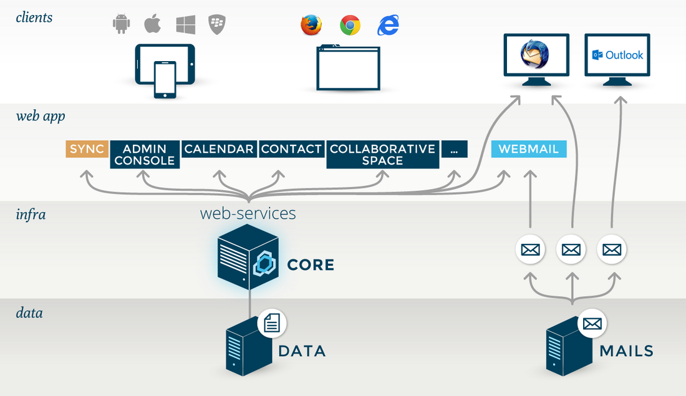

# Produktpräsentation

BlueMind ist zu 100 % webbasiert.

Alle BlueMind-Funktionen sind für einen Webbrowser konzipiert und über ihn verfügbar. Alle Funktionen sind über einen Webbrowser zugänglich. Die Verwendung von E-Mail-Clients ist somit nicht mehr notwendig und die Bereitstellung wird erheblich erleichtert.

BlueMind unterstützt die Browser:

- Mozilla ab Version ESR 52
- Chrome: neueste Version
- Internet Explorer ab Version 11
- Safari ab Version 5.

#### Full JavaScript-Benutzerschnittstellen

BlueMind bietet  Fat-Client-Ergonomie von einfachen Browsern:

- Kein Neuladen der Seite
- Webmodus im Browser abgeschaltet

#### Nachrichten-Warteschlange (MOM)

BlueMind verwendet Nachrichtenwarteschlangen, um unnötigen Datenverkehr zu begrenzen und einen Teil der Verarbeitung zu zentralisieren. Dies ist insbesondere der Fall für:

- Push-E-Mail (neue E-Mails werden bei Bedarf an mobile Geräte gepusht, wodurch der mit der Überprüfung neuer Nachrichten verbundene Datenverkehr entfällt),
- Sitzungsreplikation zwischen allen BlueMind-Servern,
- Lastverteilung und hohe Verfügbarkeit.

#### Integriertes SSO

BlueMind integriert ein eigenes SSO, mit dem nahtlos von einer Anwendung zur anderen gewechselt werden kann. So authentifiziert sich ein Benutzer im Webmodus, unabhängig vom Browser, beim Zugriff auf BlueMind. Sobald diese Authentifizierung bestätigt ist, kann er auf alle BlueMind-Anwendungen (Mailbox, Kalender, Kontakte, Administrationskonsole usw.) ohne erneute Authentifizierung zugreifen.

Zudem ermöglicht SSO eine Einzelabmeldung, die den Benutzer von allen BlueMind Registerkarten oder Fenstern trennt, wenn er von einem Fenster abmeldet.

#### Microsoft-Umgebung

BlueMind vermeidet die erneute Authentifizierung bei der Verwendung in einer Microsoft-Umgebung.

Wenn beispielsweise ein Windows-Benutzer, der Outlook verwendet, sich bei der Anmeldung an Active Directory authentifiziert, wird die Authentifizierung übernommen, wenn Outlook gestartet wird. Die Verbindung zu BlueMind ist daher transparent.

Speichern

