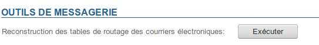

# Probleme beim Senden und Empfangen von Nachrichten


## Bekannte Probleme

### E-Mails kommen nicht bei einer vorhandenen Adresse an

****Symptome******:** E-Mails werden nicht an eine vorhandene Adresse zugestellt und der Absender erhält keine Fehlermeldung

****Ursache****: Die Änderung der E-Mail-Adresse (z.B. nach einer Änderung des Logins) wurde vom System nicht korrekt in die Postfix-Maps übertragen

****Lösung****: Die Postfix-Maps neu generieren, indem Sie in der Administrationskonsole > Systemadministration > Mail-Wartung > auf die Schaltfläche "Ausführen" klicken:



Es ist nicht erforderlich, den Dienst neu zu starten, die Änderungen werden wirksam, sobald der Vorgang abgeschlossen ist.

Wenn das Problem dadurch nicht behoben wird, lesen Sie die folgenden Kapitel zur weiteren Untersuchung.


## Prüfen Sie, ob eine E-Mail auf dem Server angekommen ist

Es kann verschiedene Gründe geben, warum eine vermeintlich angekommene E-Mail nicht im Posteingang eines Benutzers vorhanden ist.

- Die E-Mail wird von einem Antispam blockiert, bevor sie auf dem BlueMind-Server ankommt, in diesem Fall müssen Sie in den Log-Dateien Ihrer Antispam-Lösung nachsehen
- Die E-Mail wird in der Postifx-Warteschlange des BlueMind-Servers blockiert. Dies geschieht insbesondere dann, wenn ein Benutzer 100 % seines Kontingents erreicht hat, die E-Mail wird in diesem Fall für 3 Tage im Postfix in die Warteschlange gesetzt. Wenn die Mail nach 3 Tagen noch immer nicht zugestellt werden konnte, erhält der Absender eine *Unzustellbarkeitsmeldung*. Mit dem folgenden Befehl können Sie sehen, ob die E-Mail in der *Postfix-Warteschlange* vorhanden ist:


```
[root@bluemind ~]# postqueue -p
-Queue ID- --Size-- ----Arrival Time---- -Sender/Recipient-------
4E4D83AF8E      943 Thu Mar  2 07:10:58  full@bluemind.net
(host 192.168.124.72[192.168.124.72] said: 452 4.2.2 Over quota SESSIONID=<cyrus-4311-1488438658-1> (in reply to RCPT TO command))
                                         full@bluemind.net
```

Um die Blockierung der Nachricht aufzuheben, bitten Sie den Benutzer, E-Mails zu löschen oder sein Kontingent zu erhöhen; warten Sie dann auf die Zustellung der Nachricht oder zwingen Sie Postfix, mit dem Befehl postqueue -f zu einem erneuten Zustellungsversuch.


Wenn die E-Mail nicht blockiert ist, sind die Traces ihres Eingangs in den Postfix-Logdateien (`/var/log/maillog` oder `/var/log/mail.log`) zu finden:


```
Mar  1 20:45:32 bluemind postfix/lmtp[16928]: C5BF3135FAF: to=<user@bluemind.net>, relay=192.168.124.72[192.168.124.72]:2400, delay=0.32, delays=0.21/0.02/0.01/0.09, dsn=2.1.5, status=sent (250 2.1.5 Ok SESSIONID=<cyrus-12823-1488397532-1> [bluemind.net!user.user.INBOX () 2294])
```


Diese Logzeile zeigt, dass die E-Mail mit der ID C5BF3135FAF am 1. März um 20:45 Uhr in den Posteingang des Benutzers "user@bluemind.net" zugestellt wurde.

Sie können weitere Informationen über die E-Mail, einschließlich der Adresse des Absenders, finden, indem Sie nach der ID suchen:


```
[root@bluemind ~]# grep C5BF3135FAF /var/log/maillog
Mar  1 20:45:32 bluemind postfix/smtpd[16923]: C5BF3135FAF: client=smtp.domain.net[192.168.120.30]
Mar  1 20:45:32 bluemind postfix/cleanup[16927]: C5BF3135FAF: message-id=<AM5PR04MB3219A293B59D96973D338B01D2290>
Mar  1 20:45:32 bluemind postfix/qmgr[364]: C5BF3135FAF: from=<user2@domain.net>, size=8386, nrcpt=1 (queue active)
Mar  1 20:45:32 bluemind postfix/lmtp[16928]: C5BF3135FAF: to=<user@bluemind.net>, relay=192.168.124.72[192.168.124.72]:2400, delay=0.32, delays=0.21/0.02/0.01/0.09, dsn=2.1.5, status=sent (250 2.1.5 Ok SESSIONID=<cyrus-12823-1488397532-1> [bluemind.net!user.user.INBOX () 2294])
Mar  1 20:45:32 bluemind postfix/qmgr[364]: C5BF3135FAF: removed
```


Hier ist zu sehen, dass user2@domain.net der Absender der E-Mail AM5PR04MB3219A293B59D96973D338B01D2290 ist und diese unserem Benutzer tatsächlich zugestellt wurde.

Die message-id ist die eindeutige Kennung der Nachricht, sie ist in den Kopfzeilen der E-Mail zu finden

Die letzte Zahl in der lmtp-Zeile (hier 2294) entspricht der ID der E-Mail im *INBOX*-Ordner des Benutzers, die E-Mail ist folglich in `/var/spool/cyrus/data/b/bluemind_net/b/bluemind*.net/u/user/2294*`zu finden.

## Die Historie einer E-Mail verfolgen

### Bei einer bekannte E-Mail-Adresse

Sobald die UID der E-Mail gefunden wurde (siehe oben), können Sie mit dem Kommandozeilenwerkzeug bm-cli die Bewegungshistorie einer Nachricht abrufen:


```
bm-cli mail history-imap --email <email> --imapUid <imapUid>
```


Wo:

- Email: die E-Mail-Adresse des betreffenden Benutzers
- imapUid: UID der E-Mail, gefunden über die Logdateien oder vorhanden auf dem Server im Ordner des Benutzers


Zum Beispiel:


```
[root@centos7 test]# bm-cli mail history-imap --email john.test@local.lan --imapUid 1
+------------------------------+---------+--------------------+---------------------------------------+--------+---------------+----------------+
| Date                         | Type    | Owner              | Folder-UID                            | Folder | Item/IMAP-UID | Flags          |
+------------------------------+---------+--------------------+---------------------------------------+--------+---------------+----------------+
| Thu Jun 13 13:11:14 GMT 2019 | Created |   John Test (USER) | mbox\_records\_nqjg0zo2avnp9p8i121e8czq |  INBOX |        12617. |                |
+------------------------------+---------+--------------------+---------------------------------------+--------+---------------+----------------+
| Thu Jun 13 13:11:25 GMT 2019 | Updated |   John Test (USER) | mbox\_records\_nqjg0zo2avnp9p8i121e8czq |  INBOX |        12617. | Seen,Important |
+------------------------------+---------+--------------------+---------------------------------------+--------+---------------+----------------+
| Thu Jun 13 13:11:25 GMT 2019 | Created | admin admin (USER) | mbox\_records\_xyum8ijpaahokdnpnhvr6vwp |  Trash |        12617. |                |
+------------------------------+---------+--------------------+---------------------------------------+--------+---------------+----------------+
| Thu Jun 13 13:11:25 GMT 2019 | Updated |   John Test (USER) | mbox\_records\_nqjg0zo2avnp9p8i121e8czq |  INBOX |        12617. |        Deleted |
+------------------------------+---------+--------------------+---------------------------------------+--------+---------------+----------------+
```


### Mit einer Stichwortsuche

Mit dem Kommandozeilenwerkzeug kann ebenfalls nach Schlüsselwörtern gesucht werden:


```
bm-cli mail history-query --email <email> --query <query>
```


Als Beispiel wird hier nach den Erinnerungs-E-Mails eines Benutzers gesucht, um zu sehen, ob sie empfangen/verschoben/gelöscht wurden:


```
# bm-cli mail history-query --email jdoe@blue-mind.net --query Rappel
+------------------------------+---------+-----------------+---------------------------------------------------+--------+---------------+-------+
| Date                         | Type    | Owner           | Folder-UID                                        | Folder | Item/IMAP-UID | Flags |
+------------------------------+---------+-----------------+---------------------------------------------------+--------+---------------+-------+
| Sat Apr 13 06:45:17 GMT 2019 | Created | John Doe (USER) | mbox\_records\_0ad3865e-6336-4c98-b4b8-1706fc05e73f |  INBOX |            7. |       |
+------------------------------+---------+-----------------+---------------------------------------------------+--------+---------------+-------+
+------------------------------+---------+-----------------+---------------------------------------------------+--------+---------------+--------------+
| Date                         | Type    | Owner           | Folder-UID                                        | Folder | Item/IMAP-UID | Flags        |
+------------------------------+---------+-----------------+---------------------------------------------------+--------+---------------+--------------+
| Sun Apr 14 06:45:18 GMT 2019 | Created | John Doe (USER) | mbox\_records\_0ad3865e-6336-4c98-b4b8-1706fc05e73f |  INBOX |            8. |              |
+------------------------------+---------+-----------------+---------------------------------------------------+--------+---------------+--------------+
| Thu Jun 13 14:09:35 GMT 2019 | Updated | John Doe (USER) | mbox\_records\_0ad3865e-6336-4c98-b4b8-1706fc05e73f |  INBOX |            8. |              |
+------------------------------+---------+-----------------+---------------------------------------------------+--------+---------------+--------------+
| Thu Jun 13 14:09:41 GMT 2019 | Created | John Doe (USER) | mbox\_records\_6330f080-7b22-4a9d-b181-7ca99e226878 |  Trash |            3. |         Seen |
+------------------------------+---------+-----------------+---------------------------------------------------+--------+---------------+--------------+
| Thu Jun 13 14:09:42 GMT 2019 | Updated | John Doe (USER) | mbox\_records\_0ad3865e-6336-4c98-b4b8-1706fc05e73f |  INBOX |            8. | Seen,Deleted |
+------------------------------+---------+-----------------+---------------------------------------------------+--------+---------------+--------------+
```


1. Eine E-Mail (id 7) wurde nur empfangen, sie befindet sich noch im Posteingang des Benutzers, der sie nicht abgerufen hat
2. Eine weitere E-Mail (id 8) wurde gelesen und in den Papierkorb verschoben:
    - sie wird in den Papierkorb verschoben, wo sie die id 3 erhält
    - das Original, id 8, wird aus dem Posteingang gelöscht
    - beide Versionen sind als gelesen markiert


Ein anderes Beispiel: Wenig später stellen wir fest, dass die E-Mail der ID 7 "verschwunden" ist:


```
# bm-cli mail history-imap --email jdoe@blue-mind.net --imapUid 7
+------------------------------+---------+------------------------+---------------------------------------------------+------------+---------------+--------------+
| Date                         | Type    | Owner                  | Folder-UID                                        | Folder     | Item/IMAP-UID | Flags        |
+------------------------------+---------+------------------------+---------------------------------------------------+------------+---------------+--------------+
| Sat Apr 13 06:45:17 GMT 2019 | Created |        John Doe (USER) | mbox\_records\_0ad3865e-6336-4c98-b4b8-1706fc05e73f |      INBOX |            7. |              |
+------------------------------+---------+------------------------+---------------------------------------------------+------------+---------------+--------------+
| Thu Jun 13 14:09:42 GMT 2019 | Updated |        John Doe (USER) | mbox\_records\_0ad3865e-6336-4c98-b4b8-1706fc05e73f |      INBOX |            7. |              |
+------------------------------+---------+------------------------+---------------------------------------------------+------------+---------------+--------------+
| Thu Jun 13 14:13:54 GMT 2019 | Created |     projet (MAILSHARE) |                     mbox\_records\_32d9e5e24fb3a25a |     projet |           56. |              |
+------------------------------+---------+------------------------+---------------------------------------------------+------------+---------------+--------------+
| Thu Jun 13 14:13:55 GMT 2019 | Updated |        John Doe (USER) | mbox\_records\_0ad3865e-6336-4c98-b4b8-1706fc05e73f |      INBOX |            7. | Seen,Deleted |
+------------------------------+---------+------------------------+---------------------------------------------------+------------+---------------+--------------+
```


→ die E-Mail wurde in den geteilten Posteingang "Projekt" verschoben:

- die E-Mail wird in diesem Posteingang erstellt, wo diese Kopie die id 56 erhält
- das Original wird als gelesen markiert und aus dem Posteingang des Benutzers gelöscht


:::info

In diesem Fall wird die E-Mail nicht in den Papierkorb verschoben und die Datei erscheint nicht mehr auf dem Server, da es sich nicht um eine Löschung im eigentlichen Sinne handelt, sondern um eine Verschiebung in einen anderen Ordner, auch wenn es sich dabei um einen geteilten Ordner handelt.

:::

## Wiederherstellung

Die Löschung im Modus *delayed* wurde auf Cyrus-Ebene implementiert. Das bedeutet, dass die Mails erst nach 7 Tagen tatsächlich vom Server gelöscht werden. Während dieser Zeit sind sie auf dem Datenträger vorhanden, aber nicht in IMAP sichtbar.
Dieser Löschmodus bereitet die zukünftige Double-Bottom-Trash-Funktionalität vor.

Verwenden Sie den folgenden Befehl, um die gelöschten Mails eines Benutzers aufzulisten:


```
unexpunge -l user/john@domain.net
```


Wiederherstellung einer Mail:


```
unexpunge -u -d user/john@domain.net 46908
```


*Wobei 46908 die ID der Nachricht ist.*

Wiederherstellung aller E-Mails des Benutzers:


```
unexpunge -a -d user/john@domain.net
```


Weitere Informationen zu diesen Befehlen und dem Umgang damit finden Sie in der cyrus-Dokumentation: [https://www.cyrusimap.org/imap/reference/manpages/systemcommands/unexpunge.html](https://www.cyrusimap.org/imap/reference/manpages/systemcommands/unexpunge.html)


