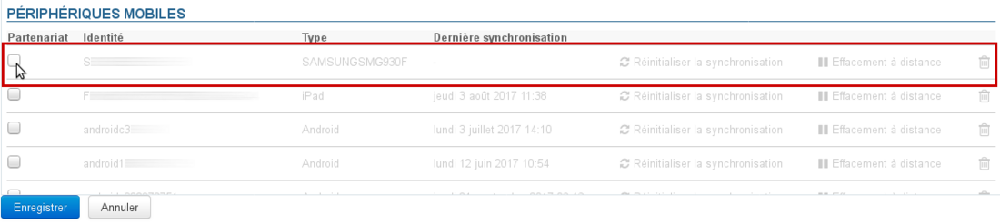

# Probleme bei der mobilen Synchronisation

Die folgenden Elemente dienen zur Untersuchung und Kontrolle, wenn ein, mehrere oder alle mobilen Geräte Probleme bei der Synchronisierung mit BlueMind haben.

## Verbindungsproblem

** **Symptome:** ** Die Verbindung schlägt fehl, obwohl die eingegebenen Serverparameter und Anmeldedaten korrekt sind

** **Aktionen:** ** Stellen Sie sicher, dass das mobile Endgerät eine Verbindung zum Server herstellen darf:

- **Globale Autorisierung**: Die Berechtigung, ein mobiles Gerät zu verbinden, kann allgemein für alle BlueMind-Benutzer erteilt werden. Gehen Sie dazu in die Systemadministration > Systemkonfiguration > Registerkarte EAS-Server und aktivieren Sie das Kontrollkästchen "Unbekannte Geräte zulassen": 
- **Namentliche Autorisierung**: Wenn obige Autorisierung nicht aktiviert ist, kann sie für einen bestimmten Benutzer und ein bestimmtes Gerät erteilt werden. Vorgehensweise:
    - Das mobile Gerät parametrieren und eine Verbindungsanfrage starten
    - Gehen Sie in die Administrationsdatei des betreffenden Benutzers > Registerkarte WartungDas Gerät muss dort sichtbar sein, die entsprechende Zeile ist ausgegraut und es gibt kein Datum der letzten Synchronisation: 
    - Kreuzen Sie das Kästchen am Anfang der Zeile an.Hinweis: Wenn eine globale Autorisierung vorliegt, sind diese Kästchen nicht aktiv
    - Validieren Sie den AutorisierungsantragHinweis: Es ist nicht notwendig, auf "Speichern" zu klicken, die Autorisierung ist sofort wirksam
    - Neustart einer Synchronisation auf dem Telefon

## Probleme bei der Synchronisation von Nachrichten

** **Symptome:** ** es fehlen Ordner oder der Inhalt des Posteingangs wird nicht angezeigt

** **Ursache:** ** Die Hierarchie der Dateien ist sicherlich beschädigt

** **Aktionen:** ** Der betreffende Posteingang muss repariert werden:

1. starten Sie die Operation "Validieren und reparieren“ *(check&repair)*: Gehen Sie in dieAdministrationsdatei des betreffenden Benutzers, Registerkarte "Wartung", und klicken Sie auf die Schaltfläche "Ausführen" im Abschnitt "Benutzer bestätigen": 
2. Wenn dies nicht funktioniert und der Benutzer weiter die gleichen Probleme hat, sehen Sie sich während des *check&repair* die EAS-Logs (`/var/log/bm-eas/eas.log` und `/var/log/bm-eas/user-eas-<identifiant>.log`) sowie die Core-Logs (`/var/log/bm/core.log`) an:
    - durch Einsichtnahme in die Dateien zu dem Zeitpunkt, an dem der obige Vorgang stattfand
    - indem Sie den Vorgang neu starten, nachdem Sie einen *Tail* der Dateien aktiviert haben.
Ein Ticket mit den gefundenen Informationen eröffnen, wenn die Ursache und die Lösung für die Probleme anhand dieser Schritte nicht gefunden werden konnte.

