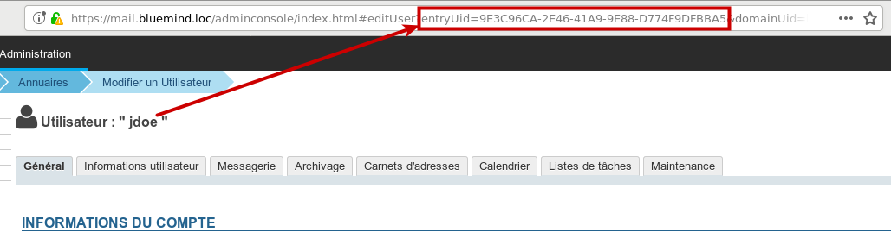
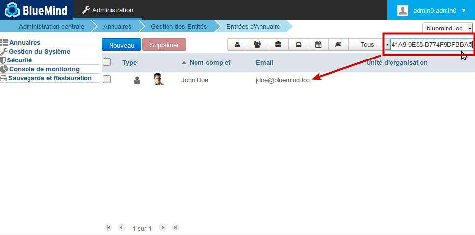

# Verschwinden und Änderungen von Terminen


## Präsentation

Die an Kalendertermin durchgeführten Aktionen (Erstellung, Änderung, Löschung) werden auf dem Server im Verzeichnis `/var/log/bm/audit` in Dateien protokolliert, die jeweils einem Kalender entsprechen.

Dateinamen haben die Form `audit-<uid des Kalenders>@domaine.log`

Die Datei, die dem Standardkalender des Benutzers John Doe auf unserem Demoserver entspricht, heißt z.B.: audit-calendar: `audit-calendar:Default:9E3C96CA-2E46-41A9-9E88-D774F9DFBBA5@bluemind.loc.log`


:::tip

uid und Benutzeridentifizierung

Wenn die Benutzeridentifizierung eines Benutzers bekannt ist, kann seine uid in der Administrationsdatei abgerufen werden: die uid ist dann in der url sichtbar:


Wenn Sie eine uid haben und wissen wollen, welchem Benutzer sie entspricht, einfach nur in der Benutzerverwaltung nach dieser uid suchen:


:::

Die im Verzeichnis aufgeführten Dateinamen können eine andere Form haben. Als Beispiel die Auflistung unten:


```
root@bluemind.loc:/var/log/bm/audit# ll
total 12980
drwxr-xr-x 2 root root   12288 janv. 11 14:46 ./
drwxr-xr-x 3 root root    4096 janv.  4 17:36 ../
-rw-r--r-- 1 root root     640 nov.   9 14:35 audit-2C0728BF-770D-4C2B-8365-AC1B168EE427@bluemind.loc.log
-rw-r--r-- 1 root root    2712 janv. 11 14:33 audit-8DEEA368-C34F-4F94-B711-0967C4460584@bluemind.loc.log
-rw-r--r-- 1 root root  311419 déc.  21 11:57 audit-calendar:079FC452-5725-4F50-B606-6EEEDA8BCDBF@bluemind.loc.log
-rw-r--r-- 1 root root     660 nov.   6 15:43 audit-calendar:ADC181A0-4124-42D8-BB92-4AF9031B3C46@bluemind.loc.log
-rw-r--r-- 1 root root     670 nov.  13 09:22 audit-calendar:Default:09F20F61-1904-4872-8B12-552693652163@bluemind.loc.log
-rw-r--r-- 1 root root     671 déc.  20 16:36 audit-calendar:Default:0C905A1A-D337-4208-8804-2B00EFA3FE2B@bluemind.loc.log
...
```


Das hat die folgenden Gründe:

- die Zeichenfolge `"calendar:`" ist in der uid der Standard-Benutzer- und Ressourcenkalender enthalten

- die Zeichenfolge "`Default:`" ist in der uid der Standardkalender der Benutzer enthalten


Folgende Elemente können über den Dateinamen identifiziert werden:

- `audit-XYZ123`: Benutzer-Nebenkalender oder Domain-Kalender
- `audit-**calendar:**XYZ123`: Ressourcenkalender
- `audit-**calendar:Default:**XYZ123`: Benutzer-Standardkalender


*Hinweis: uids wie calendar_calendar_57 oder calendar:Default:user_entity_156492 sind uid von Entitäten, die aus BlueMind 3.0 migriert wurden (hier jeweils ein Domain-Kalender und ein Benutzer).*

## Dekodierung einer einzelnen Terminprotokollzeile


:::info

Das Kommandozeilen-Tool bm-cli ermöglicht die Filterung und übersichtlichere Darstellung des Inhalts der Log-Dateien. Weitere Infos über die Verwendung und mögliche Optionen erhalten Sie in der [zugehörige Dokumentation](/Guide_de_l_administrateur/Administration_avancée/Client_CLI_pour_l_administration/) oder in der Online-Hilfe des Tools:


```
bm-cli help calendar log
```


:::


:::tip

Um nach Informationen über einen Termin zu suchen, können Sie den Befehl "grep" auf dessen Titel (ganz oder teilweise) anwenden, anstatt die Datei des Benutzers zu durchsuchen

:::

Ich suche zum Beispiel nach Informationen über den Termin "Trade Meeting" meines Benutzers John Doe:


```
root@mail:/var/log/bm/audit# grep commerce audit-calendar:Default:9E3C96CA-2E46-41A9-9E88-D774F9DFBBA5@bluemind.loc.log
2018-02-13 10:55:27,347 INFO - 1518519326822 9bd44f3a-6201-44ed-972a-5e787fbae9fc : (actor:9E3C96CA-2E46-41A9-9E88-D774F9DFBBA5@bluemind.loc meta: {session=02907900-87a0-407b-bcb7-6fa48b9801b5, origin=bm-hps, remote=192.168.122.1,127.0.0.1}) -> (action:create, ro:false, meta: {sanitized-value="{\"main\":{\"dtstart\":{\"iso8601\":\"2018-02-15T14:00:00.000+01:00\",\"timezone\":\"Europe/Paris\",\"precision\":\"DateTime\"},\"summary\":\"Réunion commerce\",\"classification\":\"Public\",\"location\":\"\",\"description\":\"\",\"priority\":5,\"alarm\":null,\"status\":\"Confirmed\",\"attendees\":[],\"organizer\":null,\"categories\":[],\"exdate\":null,\"rdate\":null,\"rrule\":null,\"url\":\"\",\"dtend\":{\"iso8601\":\"2018-02-15T15:00:00.000+01:00\",\"timezone\":\"Europe/Paris\",\"precision\":\"DateTime\"},\"transparency\":\"Opaque\"},\"occurrences\":[],\"properties\":null,\"icsUid\":\"489eddbe-b669-4bdc-b8ba-e9ffe672f8e2\"}", item-uid="80e03821-6fcd-4c02-b45f-fc320c5461cb", value="{\"main\":{\"dtstart\":{\"iso8601\":\"2018-02-15T14:00:00.000+01:00\",\"timezone\":\"Europe/Paris\",\"precision\":\"DateTime\"},\"summary\":\"Réunion commerce\",\"classification\":\"Public\",\"location\":\"\",\"description\":\"\",\"priority\":5,\"alarm\":null,\"status\":\"Confirmed\",\"attendees\":[],\"organizer\":null,\"categories\":[],\"exdate\":null,\"rdate\":null,\"rrule\":null,\"url\":\"\",\"dtend\":{\"iso8601\":\"2018-02-15T15:00:00.000+01:00\",\"timezone\":\"Europe/Paris\",\"precision\":\"DateTime\"},\"transparency\":\"Opaque\"},\"occurrences\":[],\"properties\":null,\"icsUid\":\"489eddbe-b669-4bdc-b8ba-e9ffe672f8e2\"}", sendNotif="false"}) on (object:calendar:Default:9E3C96CA-2E46-41A9-9E88-D774F9DFBBA5@bluemind.loc meta: {container-json="{\"id\":27,\"uid\":\"calendar:Default:9E3C96CA-2E46-41A9-9E88-D774F9DFBBA5\",\"type\":\"calendar\",\"name\":\"John Doe\",\"owner\":\"9E3C96CA-2E46-41A9-9E88-D774F9DFBBA5\",\"createdBy\":\"system\",\"updatedBy\":\"system\",\"created\":1475668302446,\"updated\":1475668302446,\"domainUid\":\"bluemind.loc\",\"defaultContainer\":true,\"readOnly\":false}"}) succeed
2018-02-13 10:56:06,389 INFO - 1518519366020 4b5d4721-8600-4639-ab24-e99bf7d8831c : (actor:030835FF-B045-448D-AFAE-EAA8CFA0F3F6@bluemind.loc meta: {session=d26c1876-d92e-4ecd-855c-a536398cc9e4, origin=bm-hps, remote=192.168.122.1,127.0.0.1}) -> (action:delete, ro:false, meta: {previous-value="{\"main\":{\"dtstart\":{\"iso8601\":\"2018-02-15T14:00:00.000+01:00\",\"timezone\":\"Europe/Paris\",\"precision\":\"DateTime\"},\"summary\":\"Réunion commerce\",\"classification\":\"Public\",\"location\":\"\",\"description\":\"\",\"priority\":5,\"alarm\":null,\"status\":\"Confirmed\",\"attendees\":[],\"organizer\":null,\"categories\":[],\"exdate\":null,\"rdate\":null,\"rrule\":null,\"url\":\"\",\"dtend\":{\"iso8601\":\"2018-02-15T15:00:00.000+01:00\",\"timezone\":\"Europe/Paris\",\"precision\":\"DateTime\"},\"transparency\":\"Opaque\"},\"occurrences\":[],\"properties\":{},\"icsUid\":\"489eddbe-b669-4bdc-b8ba-e9ffe672f8e2\"}", item-uid="80e03821-6fcd-4c02-b45f-fc320c5461cb", sendNotif="false"}) on (object:calendar:Default:9E3C96CA-2E46-41A9-9E88-D774F9DFBBA5@bluemind.loc meta: {container-json="{\"id\":27,\"uid\":\"calendar:Default:9E3C96CA-2E46-41A9-9E88-D774F9DFBBA5\",\"type\":\"calendar\",\"name\":\"John Doe\",\"owner\":\"9E3C96CA-2E46-41A9-9E88-D774F9DFBBA5\",\"createdBy\":\"system\",\"updatedBy\":\"system\",\"created\":1475668302446,\"updated\":1475668302446,\"domainUid\":\"bluemind.loc\",\"defaultContainer\":true,\"readOnly\":false}"}) succeed
```


Die Hauptinformationen in diesen Zeilen sind:

- **2018-02-13 10:55:27,347**: das Datum, an dem die Aktion durchgeführt wurdeAchtung: dies ist die GMT-Zeit, daher kann es einen Zeitunterschied zu der Zeit geben, zu der die Aktion in der jeweiligen Zeitzone durchgeführt wurde. Da die Aktion hier in Frankreich während der Winterzeit stattfindet, wurde sie tatsächlich um 11:55 Uhr durchgeführt und protokolliert
- **origin**: Herkunft der Aktion
In unserem Beispiel bedeutet bm-hps eine hps-Verbindung, entweder eine Verbindung über Webmailer oder Thunderbird-Connector


:::tip

Die möglichen Ursprünge sind:

- ** **bm-hps****: Webmailer oder Thunderbird
- ** **bm-connector-outlook-&lt;version>****: Zum Beispiel *Outlook: origin=bm-connector-outlook-3.1.25071 otlk:16.0.0.4266*
- ** **bm-eas** ** in EAS verbundenes Mobilgerät


:::

- **actor**: **die uid des Benutzers, der die Aktion ausgeführt hat** In unserem Beispiel :
    - Erste Zeile: 9E3C96CA-2E46-41A9-9E88-D774F9DFBBA5@bluemind.loc: entspricht dem Benutzer John Doe
    - Zweite Zeile: 030835FF-B045-448D-AFAE-EAA8CFA0F3F6@bluemind.loc: entspricht dem Benutzer John Smith
- **action**: **die durchgeführte Aktion** In unserem Beispiel:
    - 1. Zeile: action:create: Erstellung des Termin
    - 2. Zeile: action:delete: Löschung des Termins


Informationen über den Termin:

- mit **dtstart** und **dtend** können die Start- und Endzeit des Termins festgelegt werdenIn unserem Beispiel:
    - dtStart: 2018-02-15T14:00:00.000+01:00: am 15.02.2018 um 15:00, GMT+1 Zeit der Zeitzone Europa/Paris
    - dtend: 2018-02-15T15:00:00.000+01:00: am 15.02.2018 um 15 Uhr
- **summary**: Titel des TerminIn unserem Beispiel:
    - \"summary\":\"Vertriebsbesprechung\": der Titel lautet "Vertriebsbesprechung"
- **\"attendees\":[]**:  hier gibt es keine Gäste; wenn der Termin Gäste hat, umgeben die eckigen Klammern die Liste der Gäste (siehe unten die Logs einer Besprechung)
- **\“organizer“:null**: hier ist kein Organisator angegeben, es handelt sich um einen Einzeltermin im eigenen Kalender des Organisators (siehe unten die Logs einer Besprechung)
- **object:calendar** ermöglicht es, den betreffenden Kalender zu überprüfen, seine Informationen stehen in Klammern.In unserem Beispiel enthält er:
    - die Identifizierung des betreffenden Kalenders (entspricht dem Namen der Logdatei)
    - **name**: der Name des Benutzers: John Doe
    - **owner**: uid des Benutzers: 9E3C96CA-2E46-41A9-9E88-D774F9DFBBA5


## Logs einer Besprechung

Beobachten wir den Lebenszyklus am Beispiel einer Besprechung:

1. der Organisator erstellt die Besprechung mit 2 Gästen:


```
2018-02-13 12:39:23,734 INFO - 1518525563613 f7ed4a4e-6627-44aa-92bf-5b9b6d1fc5e6 : (actor:9E3C96CA-2E46-41A9-9E88-D774F9DFBBA5@bluemind.loc meta: {session=96a513b4-add8-4a7f-849f-aabcb87333b8, origin=bm-hps, remote=192.168.122.1,127.0.0.1}) -> (action:create, ro:false, meta: {sanitized-value="{\"main\":{\"dtstart\":{\"iso8601\":\"2018-02-15T15:00:00.000+01:00\",\"timezone\":\"Europe/Paris\",\"precision\":\"DateTime\"},\"summary\":\"Réunion de suivi\",\"classification\":\"Public\",\"location\":\"Agence de Toulouse\",\"description\":\"\",\"priority\":5,\"alarm\":[],\"status\":\"Confirmed\",\"attendees\":[{\"cutype\":\"Individual\",\"member\":null,\"role\":\"RequiredParticipant\",\"partStatus\":\"NeedsAction\",\"rsvp\":true,\"delTo\":null,\"delFrom\":null,\"sentBy\":null,\"commonName\":\"John Smith\",\"dir\":\"bm://bluemind.loc/users/030835FF-B045-448D-AFAE-EAA8CFA0F3F6\",\"lang\":null,\"mailto\":\"hannibal@bluemind.loc\",\"uri\":\"addressbook\_bluemind.loc/030835FF-B045-448D-AFAE-EAA8CFA0F3F6\",\"internal\":true,\"responseComment\":null},{\"cutype\":\"Individual\",\"member\":null,\"role\":\"RequiredParticipant\",\"partStatus\":\"NeedsAction\",\"rsvp\":true,\"delTo\":null,\"delFrom\":null,\"sentBy\":null,\"commonName\":\"client@somewhere.loc\",\"dir\":null,\"lang\":null,\"mailto\":\"client@somewhere.loc\",\"uri\":null,\"internal\":false,\"responseComment\":null}],\"organizer\":{\"uri\":null,\"commonName\":\"John Doe\",\"mailto\":\"jdoe@bluemind.loc\",\"dir\":\"bm://bluemind.loc/users/9E3C96CA-2E46-41A9-9E88-D774F9DFBBA5\"},\"categories\":[],\"exdate\":[],\"rdate\":null,\"rrule\":null,\"url\":\"\",\"dtend\":{\"iso8601\":\"2018-02-15T17:00:00.000+01:00\",\"timezone\":\"Europe/Paris\",\"precision\":\"DateTime\"},\"transparency\":\"Opaque\"},\"occurrences\":[],\"properties\":null,\"icsUid\":\"90318754-e081-4974-b54f-68c711727a85\"}", item-uid="50cdb282-f8f1-4d50-bdfd-3ef06e70f37e", value="{\"main\":{\"dtstart\":{\"iso8601\":\"2018-02-15T15:00:00.000+01:00\",\"timezone\":\"Europe/Paris\",\"precision\":\"DateTime\"},\"summary\":\"Réunion de suivi\",\"classification\":\"Public\",\"location\":\"Agence de Toulouse\",\"description\":\"\",\"priority\":5,\"alarm\":[],\"status\":\"Confirmed\",\"attendees\":[{\"cutype\":\"Individual\",\"member\":null,\"role\":\"RequiredParticipant\",\"partStatus\":\"NeedsAction\",\"rsvp\":true,\"delTo\":null,\"delFrom\":null,\"sentBy\":null,\"commonName\":\"John Smith\",\"dir\":null,\"lang\":null,\"mailto\":\"hannibal@bluemind.loc\",\"uri\":\"addressbook\_bluemind.loc/030835FF-B045-448D-AFAE-EAA8CFA0F3F6\",\"internal\":false,\"responseComment\":null},{\"cutype\":\"Individual\",\"member\":null,\"role\":\"RequiredParticipant\",\"partStatus\":\"NeedsAction\",\"rsvp\":true,\"delTo\":null,\"delFrom\":null,\"sentBy\":null,\"commonName\":\"client@somewhere.loc\",\"dir\":null,\"lang\":null,\"mailto\":\"client@somewhere.loc\",\"uri\":null,\"internal\":false,\"responseComment\":null}],\"organizer\":{\"uri\":null,\"commonName\":\"John Doe\",\"mailto\":null,\"dir\":\"bm://bluemind.loc/users/9E3C96CA-2E46-41A9-9E88-D774F9DFBBA5\"},\"categories\":[],\"exdate\":[],\"rdate\":null,\"rrule\":null,\"url\":\"\",\"dtend\":{\"iso8601\":\"2018-02-15T17:00:00.000+01:00\",\"timezone\":\"Europe/Paris\",\"precision\":\"DateTime\"},\"transparency\":\"Opaque\"},\"occurrences\":[],\"properties\":null,\"icsUid\":\"90318754-e081-4974-b54f-68c711727a85\"}", sendNotif="true"}) on (object:calendar:Default:9E3C96CA-2E46-41A9-9E88-D774F9DFBBA5@bluemind.loc meta: {container-json="{\"id\":27,\"uid\":\"calendar:Default:9E3C96CA-2E46-41A9-9E88-D774F9DFBBA5\",\"type\":\"calendar\",\"name\":\"John Doe\",\"owner\":\"9E3C96CA-2E46-41A9-9E88-D774F9DFBBA5\",\"createdBy\":\"system\",\"updatedBy\":\"system\",\"created\":1475668302446,\"updated\":1475668302446,\"domainUid\":\"bluemind.loc\",\"defaultContainer\":true,\"readOnly\":false}"}) succeed
```


    - **actor:9E3C96CA-2E46-41A9-9E88-D774F9DFBBA5@bluemind.loc**: unser Organisator John Doe
    - **action**:create
    - **dtStart**: 2018-02-15T15:00:00.000+01:00: am 15.02.2018 um 15 Uhr
    - **dtend**: 2018-02-15T17:00:00.000+01:00: am 15.02.2018 um 17 Uhr
    - **summary**: Nachbesprechung
    - **attendees**: stellt die Gästeliste (in Klammern) dar, jeder Gast erscheint zwischen Klammern. Für jeden sind die folgenden Elemente zu sehen:
        - **commonName**: der Name (John Smith und client@somewhere.loc, dieser zweite Gast ist nicht Teil der Kontakte)
        - **dir**: null, wenn der Gast kein Benutzer der Domain ist, andernfalls ist dort die uid zu finden
        - **mailTo**: die E-Mail Adresse des Gastes
        - **uri** : null, wenn der Gast nicht Teil der Domain ist, ansonsten finden wir seine "Adresse" im BlueMind-Verzeichnis, einschließlich seiner uid
    - **organizer**: ermöglicht es, den Organisator der Besprechung zu finden, der Teil zwischen den Klammern ist ähnlich wie bei den Gästen: hier sind die gleichen Daten, einschließlich commonName, dir, mailTo, uri, zu finden
    - **on (object:calendar**: wie für der Einzeltermin, ermöglicht die Überprüfung der Informationen des betreffenden Kalenders
2. Die Einladungs-E-Mails werden gesendet:


```
2018-02-13 12:39:23,973 INFO - 1518525563723 3bc532fe-e480-4db5-9666-ce8db3e9fc8c : (actor:9E3C96CA-2E46-41A9-9E88-D774F9DFBBA5@bluemind.loc meta: {session=96a513b4-add8-4a7f-849f-aabcb87333b8, origin=bm-hps, remote=192.168.122.1,127.0.0.1}) -> (action:send-mail, ro:false, meta: {ics="BEGIN:VCALENDAR\r\nPRODID:-//BlueMind//BlueMind Calendar//FR\r\nVERSION:2.0\r\nCALSCALE:GREGORIAN\r\nMETHOD:REQUEST\r\nBEGIN:VEVENT\r\nDTSTAMP:20180213T123923Z\r\nUID:90318754-e081-4974-b54f-68c711727a85\r\nDTSTART;TZID=Europe/Paris:20180215T150000\r\nSUMMARY:Réunion de suivi\r\nCLASS:PUBLIC\r\nLOCATION:Agence de Toulouse\r\nPRIORITY:5\r\nSTATUS:CONFIRMED\r\nATTENDEE;CUTYPE=INDIVIDUAL;ROLE=REQ-PARTICIPANT;PARTSTAT=NEEDS-ACTION;RSVP=TRUE;CN=John Smith;DIR=\"bm://bluemind.loc/users/030835FF-B045-448D-AFAE-EAA8CFA0F3F6\":MAILTO:hannibal@bluemind.loc\r\nATTENDEE;CUTYPE=INDIVIDUAL;ROLE=REQ-PARTICIPANT;PARTSTAT=NEEDS-ACTION;RSVP=TRUE;CN=client@somewhere.loc:MAILTO:client@somewhere.loc\r\nORGANIZER;CN=John Doe:mailto:jdoe@bluemind.loc\r\nVERSION:2.0\r\nDTEND;TZID=Europe/Paris:20180215T170000\r\nTRANSP:OPAQUE\r\nX-MICROSOFT-DISALLOW-COUNTER:TRUE\r\nX-MICROSOFT-CDO-BUSYSTATUS:BUSY\r\nX-MOZ-LASTACK:20180213T123923Z\r\nEND:VEVENT\r\nBEGIN:VTIMEZONE\r\nTZID:Europe/Paris\r\nTZURL:http://tzurl.org/zoneinfo-outlook/Europe/Paris\r\nX-LIC-LOCATION:Europe/Paris\r\nBEGIN:DAYLIGHT\r\nTZOFFSETFROM:+0100\r\nTZOFFSETTO:+0200\r\nTZNAME:CEST\r\nDTSTART:19700329T020000\r\nRRULE:FREQ=YEARLY;BYMONTH=3;BYDAY=-1SU\r\nEND:DAYLIGHT\r\nBEGIN:STANDARD\r\nTZOFFSETFROM:+0200\r\nTZOFFSETTO:+0100\r\nTZNAME:CET\r\nDTSTART:19701025T030000\r\nRRULE:FREQ=YEARLY;BYMONTH=10;BYDAY=-1SU\r\nEND:STANDARD\r\nEND:VTIMEZONE\r\nEND:VCALENDAR\r\n", mailTo="hannibal@bluemind.loc"}) on (object:calendar:Default:9E3C96CA-2E46-41A9-9E88-D774F9DFBBA5@bluemind.loc meta: {container-json="{\"id\":27,\"uid\":\"calendar:Default:9E3C96CA-2E46-41A9-9E88-D774F9DFBBA5\",\"type\":\"calendar\",\"name\":\"John Doe\",\"owner\":\"9E3C96CA-2E46-41A9-9E88-D774F9DFBBA5\",\"createdBy\":\"system\",\"updatedBy\":\"system\",\"created\":1475668302446,\"updated\":1475668302446,\"domainUid\":\"bluemind.loc\",\"defaultContainer\":true,\"readOnly\":false}"}) succeed
2018-02-13 12:39:24,198 INFO - 1518525563986 701820e7-bdd7-4cf4-81a0-085c3eed246c : (actor:9E3C96CA-2E46-41A9-9E88-D774F9DFBBA5@bluemind.loc meta: {session=96a513b4-add8-4a7f-849f-aabcb87333b8, origin=bm-hps, remote=192.168.122.1,127.0.0.1}) -> (action:send-mail, ro:false, meta: {ics="BEGIN:VCALENDAR\r\nPRODID:-//BlueMind//BlueMind Calendar//FR\r\nVERSION:2.0\r\nCALSCALE:GREGORIAN\r\nMETHOD:REQUEST\r\nBEGIN:VEVENT\r\nDTSTAMP:20180213T123923Z\r\nUID:90318754-e081-4974-b54f-68c711727a85\r\nDTSTART;TZID=Europe/Paris:20180215T150000\r\nSUMMARY:Réunion de suivi\r\nCLASS:PUBLIC\r\nLOCATION:Agence de Toulouse\r\nPRIORITY:5\r\nSTATUS:CONFIRMED\r\nATTENDEE;CUTYPE=INDIVIDUAL;ROLE=REQ-PARTICIPANT;PARTSTAT=NEEDS-ACTION;RSVP=TRUE;CN=John Smith;DIR=\"bm://bluemind.loc/users/030835FF-B045-448D-AFAE-EAA8CFA0F3F6\":MAILTO:hannibal@bluemind.loc\r\nATTENDEE;CUTYPE=INDIVIDUAL;ROLE=REQ-PARTICIPANT;PARTSTAT=NEEDS-ACTION;RSVP=TRUE;CN=client@somewhere.loc:MAILTO:client@somewhere.loc\r\nORGANIZER;CN=John Doe:mailto:jdoe@bluemind.loc\r\nVERSION:2.0\r\nDTEND;TZID=Europe/Paris:20180215T170000\r\nTRANSP:OPAQUE\r\nX-MICROSOFT-DISALLOW-COUNTER:TRUE\r\nX-MICROSOFT-CDO-BUSYSTATUS:BUSY\r\nX-MOZ-LASTACK:20180213T123923Z\r\nEND:VEVENT\r\nBEGIN:VTIMEZONE\r\nTZID:Europe/Paris\r\nTZURL:http://tzurl.org/zoneinfo-outlook/Europe/Paris\r\nX-LIC-LOCATION:Europe/Paris\r\nBEGIN:DAYLIGHT\r\nTZOFFSETFROM:+0100\r\nTZOFFSETTO:+0200\r\nTZNAME:CEST\r\nDTSTART:19700329T020000\r\nRRULE:FREQ=YEARLY;BYMONTH=3;BYDAY=-1SU\r\nEND:DAYLIGHT\r\nBEGIN:STANDARD\r\nTZOFFSETFROM:+0200\r\nTZOFFSETTO:+0100\r\nTZNAME:CET\r\nDTSTART:19701025T030000\r\nRRULE:FREQ=YEARLY;BYMONTH=10;BYDAY=-1SU\r\nEND:STANDARD\r\nEND:VTIMEZONE\r\nEND:VCALENDAR\r\n", mailTo="client@somewhere.loc"}) on (object:calendar:Default:9E3C96CA-2E46-41A9-9E88-D774F9DFBBA5@bluemind.loc meta: {container-json="{\"id\":27,\"uid\":\"calendar:Default:9E3C96CA-2E46-41A9-9E88-D774F9DFBBA5\",\"type\":\"calendar\",\"name\":\"John Doe\",\"owner\":\"9E3C96CA-2E46-41A9-9E88-D774F9DFBBA5\",\"createdBy\":\"system\",\"updatedBy\":\"system\",\"created\":1475668302446,\"updated\":1475668302446,\"domainUid\":\"bluemind.loc\",\"defaultContainer\":true,\"readOnly\":false}"}) succeed
```

1 Zeile pro Gast erscheint mit:

    - **action**:send-mail
    - **mailTo**: die E-Mail-Adresse des Gastes. Achten Sie darauf, dies nicht mit den MAILTO-Schlagwörtern zu verwechseln, die zuvor in derselben Zeile bei der Adresse jedes Gastes vorhanden waren.
3. John Smith, der das Recht hat, in den Terminplaner von John Doe zu schreiben, löscht die Besprechung:


```
2018-02-13 12:39:54,110 INFO - 1518525594028 34bf638c-e9b5-46d2-9685-cd3b6028b9d5 : (actor:030835FF-B045-448D-AFAE-EAA8CFA0F3F6@bluemind.loc meta: {session=642532de-7613-491c-81e5-9dd63e6afb69, origin=bm-hps, remote=192.168.122.1,127.0.0.1}) -> (action:delete, ro:false, meta: {previous-value="{\"main\":{\"dtstart\":{\"iso8601\":\"2018-02-15T15:00:00.000+01:00\",\"timezone\":\"Europe/Paris\",\"precision\":\"DateTime\"},\"summary\":\"Réunion de suivi\",\"classification\":\"Public\",\"location\":\"Agence de Toulouse\",\"description\":\"\",\"priority\":5,\"alarm\":null,\"status\":\"Confirmed\",\"attendees\":[{\"cutype\":\"Individual\",\"member\":null,\"role\":\"RequiredParticipant\",\"partStatus\":\"Accepted\",\"rsvp\":false,\"delTo\":null,\"delFrom\":null,\"sentBy\":null,\"commonName\":\"John Smith\",\"dir\":\"bm://bluemind.loc/users/030835FF-B045-448D-AFAE-EAA8CFA0F3F6\",\"lang\":null,\"mailto\":\"hannibal@bluemind.loc\",\"uri\":\"addressbook\_bluemind.loc/030835FF-B045-448D-AFAE-EAA8CFA0F3F6\",\"internal\":true,\"responseComment\":null},{\"cutype\":\"Individual\",\"member\":null,\"role\":\"RequiredParticipant\",\"partStatus\":\"NeedsAction\",\"rsvp\":true,\"delTo\":null,\"delFrom\":null,\"sentBy\":null,\"commonName\":\"client@somewhere.loc\",\"dir\":null,\"lang\":null,\"mailto\":\"client@somewhere.loc\",\"uri\":null,\"internal\":false,\"responseComment\":null}],\"organizer\":{\"uri\":null,\"commonName\":\"John Doe\",\"mailto\":\"jdoe@bluemind.loc\",\"dir\":\"bm://bluemind.loc/users/9E3C96CA-2E46-41A9-9E88-D774F9DFBBA5\"},\"categories\":[],\"exdate\":null,\"rdate\":null,\"rrule\":null,\"url\":\"\",\"dtend\":{\"iso8601\":\"2018-02-15T17:00:00.000+01:00\",\"timezone\":\"Europe/Paris\",\"precision\":\"DateTime\"},\"transparency\":\"Opaque\"},\"occurrences\":[],\"properties\":{},\"icsUid\":\"90318754-e081-4974-b54f-68c711727a85\"}", item-uid="50cdb282-f8f1-4d50-bdfd-3ef06e70f37e", sendNotif="true"}) on (object:calendar:Default:9E3C96CA-2E46-41A9-9E88-D774F9DFBBA5@bluemind.loc meta: {container-json="{\"id\":27,\"uid\":\"calendar:Default:9E3C96CA-2E46-41A9-9E88-D774F9DFBBA5\",\"type\":\"calendar\",\"name\":\"John Doe\",\"owner\":\"9E3C96CA-2E46-41A9-9E88-D774F9DFBBA5\",\"createdBy\":\"system\",\"updatedBy\":\"system\",\"created\":1475668302446,\"updated\":1475668302446,\"domainUid\":\"bluemind.loc\",\"defaultContainer\":true,\"readOnly\":false}"}) succeed
```


    - **actor**:030835FF-B045-448D-AFAE-EAA8CFA0F3F6@bluemind.loc: John Smith
    - **action**:delete
4. Auch hier werden Info-Mails an jeden Gast verschickt:


```
2018-02-13 12:39:54,298 INFO - 1518525594114 f0d9ab6a-7bda-40db-9df1-d201c8f146e4 : (actor:030835FF-B045-448D-AFAE-EAA8CFA0F3F6@bluemind.loc meta: {session=642532de-7613-491c-81e5-9dd63e6afb69, origin=bm-hps, remote=192.168.122.1,127.0.0.1}) -> (action:send-mail, ro:false, meta: {ics="BEGIN:VCALENDAR\r\nPRODID:-//BlueMind//BlueMind Calendar//FR\r\nVERSION:2.0\r\nCALSCALE:GREGORIAN\r\nMETHOD:CANCEL\r\nBEGIN:VEVENT\r\nDTSTAMP:20180213T123954Z\r\nUID:90318754-e081-4974-b54f-68c711727a85\r\nDTSTART;TZID=Europe/Paris:20180215T150000\r\nSUMMARY:Réunion de suivi\r\nCLASS:PUBLIC\r\nLOCATION:Agence de Toulouse\r\nPRIORITY:5\r\nSTATUS:CONFIRMED\r\nATTENDEE;CUTYPE=INDIVIDUAL;ROLE=REQ-PARTICIPANT;PARTSTAT=ACCEPTED;RSVP=FALSE;CN=John Smith;DIR=\"bm://bluemind.loc/users/030835FF-B045-448D-AFAE-EAA8CFA0F3F6\":MAILTO:hannibal@bluemind.loc\r\nATTENDEE;CUTYPE=INDIVIDUAL;ROLE=REQ-PARTICIPANT;PARTSTAT=NEEDS-ACTION;RSVP=TRUE;CN=client@somewhere.loc:MAILTO:client@somewhere.loc\r\nORGANIZER;CN=John Doe:mailto:jdoe@bluemind.loc\r\nVERSION:2.0\r\nDTEND;TZID=Europe/Paris:20180215T170000\r\nTRANSP:OPAQUE\r\nX-MICROSOFT-DISALLOW-COUNTER:TRUE\r\nX-MICROSOFT-CDO-BUSYSTATUS:BUSY\r\nX-MOZ-LASTACK:20180213T123954Z\r\nEND:VEVENT\r\nBEGIN:VTIMEZONE\r\nTZID:Europe/Paris\r\nTZURL:http://tzurl.org/zoneinfo-outlook/Europe/Paris\r\nX-LIC-LOCATION:Europe/Paris\r\nBEGIN:DAYLIGHT\r\nTZOFFSETFROM:+0100\r\nTZOFFSETTO:+0200\r\nTZNAME:CEST\r\nDTSTART:19700329T020000\r\nRRULE:FREQ=YEARLY;BYMONTH=3;BYDAY=-1SU\r\nEND:DAYLIGHT\r\nBEGIN:STANDARD\r\nTZOFFSETFROM:+0200\r\nTZOFFSETTO:+0100\r\nTZNAME:CET\r\nDTSTART:19701025T030000\r\nRRULE:FREQ=YEARLY;BYMONTH=10;BYDAY=-1SU\r\nEND:STANDARD\r\nEND:VTIMEZONE\r\nEND:VCALENDAR\r\n", mailTo="hannibal@bluemind.loc"}) on (object:calendar:Default:9E3C96CA-2E46-41A9-9E88-D774F9DFBBA5@bluemind.loc meta: {container-json="{\"id\":27,\"uid\":\"calendar:Default:9E3C96CA-2E46-41A9-9E88-D774F9DFBBA5\",\"type\":\"calendar\",\"name\":\"John Doe\",\"owner\":\"9E3C96CA-2E46-41A9-9E88-D774F9DFBBA5\",\"createdBy\":\"system\",\"updatedBy\":\"system\",\"created\":1475668302446,\"updated\":1475668302446,\"domainUid\":\"bluemind.loc\",\"defaultContainer\":true,\"readOnly\":false}"}) succeed
2018-02-13 12:39:54,481 INFO - 1518525594299 7729d1a7-c170-4bc4-a8cf-c79df1bdea02 : (actor:030835FF-B045-448D-AFAE-EAA8CFA0F3F6@bluemind.loc meta: {session=642532de-7613-491c-81e5-9dd63e6afb69, origin=bm-hps, remote=192.168.122.1,127.0.0.1}) -> (action:send-mail, ro:false, meta: {ics="BEGIN:VCALENDAR\r\nPRODID:-//BlueMind//BlueMind Calendar//FR\r\nVERSION:2.0\r\nCALSCALE:GREGORIAN\r\nMETHOD:CANCEL\r\nBEGIN:VEVENT\r\nDTSTAMP:20180213T123954Z\r\nUID:90318754-e081-4974-b54f-68c711727a85\r\nDTSTART;TZID=Europe/Paris:20180215T150000\r\nSUMMARY:Réunion de suivi\r\nCLASS:PUBLIC\r\nLOCATION:Agence de Toulouse\r\nPRIORITY:5\r\nSTATUS:CONFIRMED\r\nATTENDEE;CUTYPE=INDIVIDUAL;ROLE=REQ-PARTICIPANT;PARTSTAT=ACCEPTED;RSVP=FALSE;CN=John Smith;DIR=\"bm://bluemind.loc/users/030835FF-B045-448D-AFAE-EAA8CFA0F3F6\":MAILTO:hannibal@bluemind.loc\r\nATTENDEE;CUTYPE=INDIVIDUAL;ROLE=REQ-PARTICIPANT;PARTSTAT=NEEDS-ACTION;RSVP=TRUE;CN=client@somewhere.loc:MAILTO:client@somewhere.loc\r\nORGANIZER;CN=John Doe:mailto:jdoe@bluemind.loc\r\nVERSION:2.0\r\nDTEND;TZID=Europe/Paris:20180215T170000\r\nTRANSP:OPAQUE\r\nX-MICROSOFT-DISALLOW-COUNTER:TRUE\r\nX-MICROSOFT-CDO-BUSYSTATUS:BUSY\r\nX-MOZ-LASTACK:20180213T123954Z\r\nEND:VEVENT\r\nBEGIN:VTIMEZONE\r\nTZID:Europe/Paris\r\nTZURL:http://tzurl.org/zoneinfo-outlook/Europe/Paris\r\nX-LIC-LOCATION:Europe/Paris\r\nBEGIN:DAYLIGHT\r\nTZOFFSETFROM:+0100\r\nTZOFFSETTO:+0200\r\nTZNAME:CEST\r\nDTSTART:19700329T020000\r\nRRULE:FREQ=YEARLY;BYMONTH=3;BYDAY=-1SU\r\nEND:DAYLIGHT\r\nBEGIN:STANDARD\r\nTZOFFSETFROM:+0200\r\nTZOFFSETTO:+0100\r\nTZNAME:CET\r\nDTSTART:19701025T030000\r\nRRULE:FREQ=YEARLY;BYMONTH=10;BYDAY=-1SU\r\nEND:STANDARD\r\nEND:VTIMEZONE\r\nEND:VCALENDAR\r\n", mailTo="client@somewhere.loc"}) on (object:calendar:Default:9E3C96CA-2E46-41A9-9E88-D774F9DFBBA5@bluemind.loc meta: {container-json="{\"id\":27,\"uid\":\"calendar:Default:9E3C96CA-2E46-41A9-9E88-D774F9DFBBA5\",\"type\":\"calendar\",\"name\":\"John Doe\",\"owner\":\"9E3C96CA-2E46-41A9-9E88-D774F9DFBBA5\",\"createdBy\":\"system\",\"updatedBy\":\"system\",\"created\":1475668302446,\"updated\":1475668302446,\"domainUid\":\"bluemind.loc\",\"defaultContainer\":true,\"readOnly\":false}"}) succeed

```


    - **actor**:030835FF-B045-448D-[AFAE-EAA8CFA0F3F6@bluemind.loc](mailto:AFAE-EAA8CFA0F3F6@bluemind.loc): John Smith
    - **action**:send-mail


