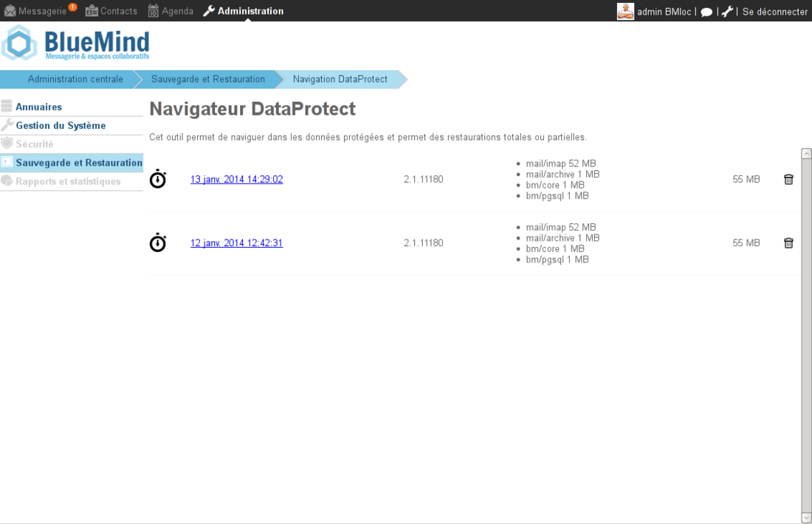
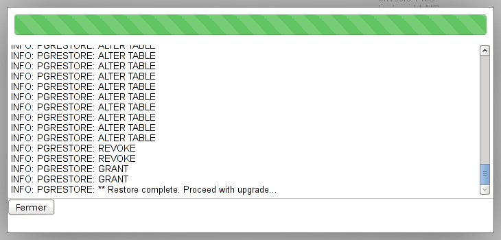
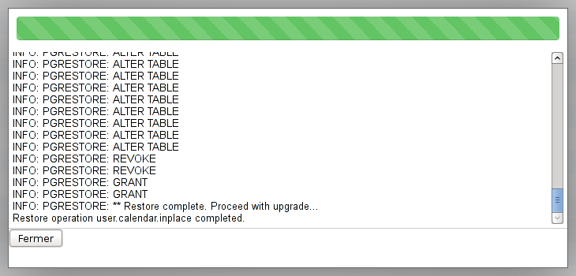
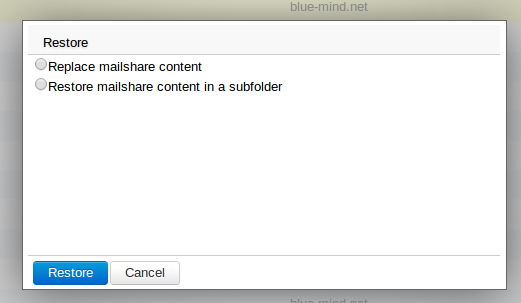

# Einheit wiederherstellen - DataProtect-Navigation

## Präsentation

Die Unit Restore-Funktion von BlueMind macht es möglich, die Daten eines einzelnen Benutzers mühelos und schnell wiederherzustellen. Die Wiederherstellung erfolgt grafisch und erlaubt die Auswahl des Objekttyps (Entität: Benutzer, E-Mail, Kalender geteilter Posteingang, etc...) und des Objekts, dessen Daten wiederhergestellt werden müssen

Auch diese Funktionalität stützt sich zur Auswahl des Datums der zu speichernden Daten auf die Datenhistorisierung.

## Wiederherstellen der Daten eines Benutzers oder eines geteilten Posteingangs

Der DataProtect Browser ermöglicht eine einfache und grafische Navigation durch die Backup-Daten von der BlueMind-Administrationsoberfläche aus.

Wiederherstellung der Daten:

- gehen Sie als Administrator in die Administrationsoberfläche > Sichern und Wiederherstellen > DataProtect-Navigation :  Die Seite zeigt die von BlueMind erstellten und aktuell zugänglichen Backups an.
- klicken Sie auf den gewünschten Backup, das System startet eine temporäre Wiederherstellung der Daten und Sie können durch den Backup durchsuchen:  
- Klicken Sie auf Schließen, um auf die Daten zuzugreifen
- Der Browser zeigt die Backup-Daten nach Entität an:  Oben auf der Seite können mit den Suchwerkzeugen die angezeigten Entitäten gefiltert und durchsucht werden:
    -  Domains anzeigen/verbergen
    -  Benutzer anzeigen/verbergen
    -  Geteilte Posteingänge anzeigen/verbergen
Das Suchfeld ermöglicht eine Textsuche, mit der Schaltfläche  kehren Sie zur Startseite der DataProtect-Navigation zurück.

### Wiederherstellen der Daten eines Benutzers

- Klicken Sie für den gewünschten Benutzer auf den Link "Wiederherstellen". Daraufhin zeigt ein Popup die Wiederherstellungsoptionen an:  
    - **Posteingang in einem Unterordner wiederherstellen**: stellt den gesamten Posteingang des Benutzers in einem Unterordner des Posteingangs wieder her
    - **Inhalt des Posteingangs ersetzen**: Ersetzt den gesamten Inhalt des Posteingangs des Benutzers. Dadurch wird der Zustand des Posteingangs am Tag des Backups wiederhergestellt. Alle Änderungen (empfangene oder gesendete Nachrichten, Verschieben in Ordner usw.), die seither vorgenommen wurden, gehen verloren.
    - **Benutzeradressbücher ersetzen**: Ersetzt alle Benutzeradressbücher mit den Benutzeradressbüchern zum Zeitpunkt des Backups
    - **VCards per E-Mail exportieren**: Exportiert die Adressbücher des Benutzers im [VCard-Format](http://fr.wikipedia.org/wiki/VCard) und versendet sie per E-Mail
    - **ICS-Export per E-Mail senden**: Führt einen Export des Terminplaners des Benutzers im [ICS-Format](http://fr.wikipedia.org/wiki/.ics) durch und sendet ihn per E-Mail
    - **Kalenderinhalt überschreiben**: stellt den gesamten Kalender zum Datum des Backups wieder her. Alle Änderungen (neue Termine, Löschungen, Verschiebungen usw.), die seither vorgenommen wurden, gehen verloren.
    - **Ersetzen des Benutzers und seiner Daten**: Stellt alle Daten des Benutzers (Nachrichten, Kontakte, Terminplaner, Einstellungen usw.) zum Datum des Backups wieder her. Alle Änderungen, die seitdem vorgenommen wurden, gehen verloren.
- Wählen Sie die gewünschte Option und klicken Sie auf "Wiederherstellen".Das Popup informiert über den Fortschritt des Vorgangs durch einen Fortschrittsbalken und die Anzeige des Logs in Echtzeit: 
- Wenn Sie fertig sind, klicken Sie auf Schließen, um zur Liste der Entitäten kehren.

### Wiederherstellen eines geteilten Posteingangs

Die Wiederherstellung eines geteilten Posteingangs verläuft wie folgt.

Klicken Sie auf den Link "Wiederherstellen", der dem gewünschten geteilten Posteingang entspricht. Daraufhin zeigt ein Popup die Wiederherstellungsoptionen an:

- Inhalt des Posteingangs in einem Unterordner wiederherstellen: stellt den gesamten Inhalt des geteilten Posteingangs in einem Unterordner des geteilten Posteingangs wieder her
- Inhalt des Posteingangs ersetzen: ersetzt den gesamten Posteingang des geteilten Posteingangs. Dadurch wird der Zustand des Posteingangs am Tag des Backups wiederhergestellt. Alle Änderungen (empfangene oder gesendete Nachrichten, Verschieben in Ordner usw.), die seither vorgenommen wurden, gehen verloren.

- Wählen Sie die gewünschte Option und klicken Sie auf "Wiederherstellen".  Das Popup informiert über den Fortschritt des Vorgangs durch einen Fortschrittsbalken und die Anzeige des Logs in Echtzeit.
- Wenn Sie fertig sind, klicken Sie auf Schließen, um zur Liste der Entitäten kehren.

### Skripting nach dem Backup

Nach jedem Backup sucht DataProtect nach einem Skript, das auf dem gesicherten Server platziert wird und den Namen */usr/bin/bm-post-full-backup.sh* trägt, und führt es ggf. aus. Dieses Skript muss vom Benutzer erstellt werden und kann verwendet werden, um Nachbearbeitungsaufgaben durchzuführen, wie z. B. das Kopieren von an einem anderen Ort gespeicherten Daten.

