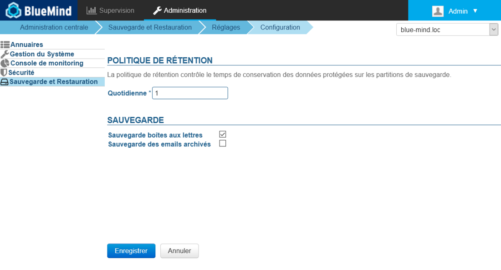

# Backup und Wiederherstellung


## Präsentation

BlueMind erstellt automatisch regelmäßige Backups der Daten, um eine schnelle Wiederherstellung über die Administrationsoberfläche zu ermöglichen.

Der komplette Backup der Systemdaten (Kalender/Ansprechpartner/E-Mail) wird in regelmäßigen Abständen durchgeführt und in einem Systemverzeichnis gespeichert. Ein sekundäres Backup-System (Bacula, Tina, etc...) kann diese Backups kopieren, um die Backups auf Bänder oder auf das externe Backup-System auszulagern.

Die Struktur der Backupdaten ermöglicht es, in der Zeit zurückzugehen und so die Benutzerdaten zu einem bestimmten Zeitpunkt wiederherzustellen.

Die Häufigkeit der Backups ist konfigurierbar und hängt vom verfügbaren Speicherplatz auf Ihrem Speichermedium ab. Beachten Sie, dass die Mindestdauer zwischen zwei Backups einen Tag beträgt.

Die auf diese Weise erstellten Backups können mit einer zentralen Unternehmensbackupsoftware (Time Navigator, NetBackup, etc.) verbunden werden.


## Die Vorteile des integrierten Backup-Systems

- **Zeitersparnis** Backups sind inkrementell, nur Unterschiede (neue Nachrichten, Löschungen,...) werden übertragen.
- **Funktionserweiterung** Der Backup verwaltet die Historie der Daten.
- **Platzsparend** Der Backup historisiert Daten, ohne sie zu duplizieren. Jeder Backup ist eigenständig (Snapshot-Typ), auch wenn nur die Unterschiede übertragen wurden. So können somit 10 Backups für einen Speicherplatz haben, der der Größe Ihres Mail-Repository entspricht.
- **Optimierungen** Daten werden automatisch dedupliziert.
- **Vollständiges Backup** Das integrierte Backup-Tool stellt sicher, dass alle aktuellen und zukünftigen Daten automatisch gesichert werden, egal ob es sich um E-Mail-Daten (als Dateien gespeicherte E-Mails), Kalender- und Adressbuchdaten (in einer Datenbank gespeichert) oder Konfigurationsdateien handelt. 
- **Backup-Kompatibilität** Backups bleiben unabhängig vom Zeitpunkt ihrer Erstellung mit allen Nebenversionen desselben Hauptrelease (z.B. 3.5.x oder 4.x) kompatibel. So kann ein Backup, das in einer bestimmten Version erstellt wurde, auf jeder neueren Nebenversion von BlueMind wiederhergestellt werden.Ein in 3.5.12 erstelltes Backup kann z.B. in 3.5.16-7 wiederhergestellt werden, und ein in 4.0.1 erstelltes in 4.4.3.
- **Leistung** Backups verursachen keine Dienstunterbrechung; sie werden kurzfristig ausgelöst und durchgeführt, um die Datenkonsistenz bei der Wiederherstellung zu gewährleisten. Diese Einschränkung ist der Kern des Designs des BlueMind-Backups. 
- **Historie** Ein Daten-Backup wird zwingend inkrementell durchgeführt und es muss eine Historie dieser Daten gespeichert werden. Diese Historisierungsfunktion ist vor allem interessant, wenn keine große Backup-Infrastruktur vorhanden ist: Ein Datenbestand ist nur in einem Backup vorhanden und die neuen Daten werden in einem Inkrement gespeichert.Um eine sichere Wiederherstellung zu gewährleisten, rekonstruiert das Programm die zu sichernden Daten aus einem Backup und einem oder mehreren Inkrementen. Dies ist für den Administrator transparent, und er entscheidet, zu welchem Zeitpunkt die Daten wiederhergestellt werden sollen.


## Technische Architektur des Backups

- **Speicher- und Historisierungskomponente** BlueMind stützt sich auf die Open-Source-Software rsync. Mit diesem Werkzeug ist es möglich, inkrementelle Kopien zu erstellen. Die Daten im Mail-Spool werden durch Anlegen von symbolischen Links seit dem letzten Backup gesichert, nur neue Mails werden auf diese Weise gesichert.
- **BlueMind-Module und Backups** BlueMind basiert auf einer Architektur, die es erlaubt, Dienste auf verschiedene Server aufzuteilen. Abhängig von den Diensten, die auf den einzelnen Servern gehostet werden, werden ihnen verschiedene geeignete Backupmethoden mit den auf diesem Anwendungsknoten gespeicherten Daten zugewiesen (Mail-Spool, Datenbank, Index, Archivierung, etc...). So gibt es für jede Rolle, die den BueMind Servern zugewiesen werden kann, ein spezifisches Backup-Verfahren, um die optimale und vollständige Wiederherstellung der Daten zu gewährleisten. 
- **Speicherort der Backups** Die Backup-Daten werden normalerweise auf einen separaten Server ausgelagert. BlueMind bietet 2 Lösungen an, um die Speicherorte der gesicherten Daten zu konfigurieren:
    1. Einrichten eines NFS-Mounts auf dem Dateisystem des Produktionsservers.
    2. Verwenden Sie einen Knoten (einen Server) der dedizierten BlueMind-Architektur, der nur als Backup-Server fungiert.
Je nach Verfügbarkeit und Art der Infrastruktur können beide Lösungen verwendet werden. Das Ziel ist aber, die Produktionsdaten von den gesicherten Daten zu trennen, um die Fähigkeit zum Rollback der Dienste im Falle eines Datenverlusts oder einer Datenbeschädigung sicherzustellen.- **Integration in eine Backup-Infrastruktur** Ein Informationssystem ist oft mit einer Backup-Infrastruktur ausgestattet. Software wie Atempo Time Navigator, Tivoli Storage Manager, Net Backup und andere zentralisieren Backupmethoden und verwalten die Historie Ihres Backups eigenständig.Diese Tools lassen sich gut mit BlueMind verbinden. Für die Erhaltung der BlueMind-Backup-Historie ist eine spezielle Konfiguration erforderlich.Der BlueMind-Server sorgt für einen sicheren und vollständigen Hot-Backup der Produktionsdaten. Die Backupsoftware des Kunden muss so konfiguriert sein, dass sie keine Datenarchivierung durchführt. Auf diese Weise stellt die Backupsoftware des Drittanbieters den Inhalt des BlueMind-Backups wieder her und überträgt ihn auf Band oder andere Medien.


## NFS-Montagekonfiguration


:::info

Das Backupverzeichnis muss von allen BlueMind-Domainknoten aus zugänglich sein; daher müssen die folgenden Mount- und Verifizierungsvorgänge auf **allen betroffenen Servern** durchgeführt werden.

:::

Für NFS-, ext3- oder ext4-Mountpunkte sollten die Optionen *nodiratime* und *noatime* angewendet werden, um den Festplattenzugriff zu beschleunigen. Mit fortgeschrittenen Dateisysteme wie NTFS, ext3/4, kann das Datum des letzten Zugriffs auf Dateien abgerufen werden. So gibt es bei jedem Lesen einer Datei einen zusätzlichen Schreibvorgang, um das Datum des letzten Zugriffs zu ändern und zu überprüfen. Hier ist ein Beispiel für das Mounten der Datei */etc/fstab*:


```
# Point de montage NFS
nas.mydomain.lab:/backup  /var/backups/bluemind  nfs  rw,soft,noatime,nodiratime,vers=3,exec 0 0
```


Um das NFS-Mounting zu aktivieren, führen Sie Folgendes als *root*-User aus:


```
mount /var/backups/bluemind
```


Es ist dann ratsam, die korrekte Funktion des Mounts zu testen, indem Sie die folgenden Befehle auf der Kommandozeile ausführen, auch hier als *Root*-User des BlueMind-Servers:


```
cd /var/backups/bluemind
touch test

```


Diese Testdatei anschließend löschen:


```
rm test
```


:::tip

Permanenter Zugriff auf das letzte Backup

Um über den gleichen Pfad auf das neueste Backup zuzugreifen, können Sie das Skript `/usr/bin/bm-post-full-backup.sh` mit folgendem Inhalt verwenden:


```
#!/bin/bash
parts=("bm/es" "bm/pgsql" "filehosting/data" "mail/imap" "mail/archive")
server\_ip="192.168.124.72"

for part in ${parts[@]}
do
        echo "creating last directory for part : $part"
        # get last backup directory
        last\_version=`ls -tr /var/backups/bluemind/dp\_spool/rsync/$server\_ip/$part | grep -v "last" | tail -1`
        echo " last version : $last\_version"
        # create link
        rm /var/backups/bluemind/dp\_spool/rsync/$server\_ip/$part/last
        ln -s /var/backups/bluemind/dp\_spool/rsync/$server\_ip/$part/$last\_version /var/backups/bluemind/dp\_spool/rsync/$server\_ip/$part/last
done

```


Zu beachten:

- Das Skript kann erstellt werden, wenn es nicht bereits auf dem Server vorhanden ist
- Das Skript kann mit diesem Inhalt vervollständigt werden, wenn es bereits vorhanden ist
- Es muss ein Verzeichnis mit dem Namen „last“ angelegt werden, das immer auf das zuletzt erstellte Backup zeigt


:::

## Backup-Konfiguration

In der Administrationskonsole wird die Anzahl der täglichen Backups konfiguriert, die aufbewahrt werden sollen.

Zur Implementierung einer Backup-Richtlinie gehen Sie zur BlueMind-Administration > Sichern und Wiederherstellen > Einstellungen > Konfiguration:



- **Aufbewahrungsrichtlinie**: Geben Sie die Anzahl der Tage an, die ein Backup (hier: tägliche Backups) aufbewahrt werden muss
- **Posteingang**: Bei Aktivierung dieser Option werden E-Mails gesichert, ohne Aktivierung nur Kontakt-, Terminplaner- und Aufgaben-Daten gesichert. Dadurch werden Duplikate vermieden, wenn Nachrichten bereits von einem anderen dedizierten System gespeichert wurden.


:::info

Leistung

Wir raten dringend davon ab, diese Option zu aktivieren, wenn der von E-Mails belegte Speicherplatz sehr groß ist (~1 TB, die Grenze der Leistungsfähigkeit des Backup-Systems kann je nach Leistung des gewählten Backup-Speichers variieren).

Es gibt mehrere Alternativen:

 - Hypervisor-Tools (Sicherung der virtuellen Festplatte des Spools, der VMs...)
 - In das System integrierte Technologien (z. B. LVM-Snapshots)
 – direkt in den Speicher integrierte Technologien (Snapshots auf Feldebene)

So kann das BlueMind-Backup-System nur für die anderen Daten (Kontakte/Terminplaner/Aufgaben) verwendet werden, die über die Administrationskonsole wiederherstellbar sind, und ein externes System für voluminösere E-Mails.

:::

- **Backup von archivierten E-Mails**: Wenn diese Option aktiviert ist, werden auch archivierte E-Mails gesichert.Standardmäßig ist diese Option nicht aktiviert, es werden nur nicht archivierte E-Mails gesichert.


## Aktionen nach dem Backup

Am Ende des Backups wird automatisch das Skript `/usr/bin/bm-post-full-backup.sh` ausgeführt, falls es vorhanden ist.

Es kann bestimmte Vorgänge enthalten, die nach einem erfolgreichen Backup durchzuführen sind.

## Wiederherstellung

Dasselbe BlueMind-Backup ermöglicht sowohl die Wiederherstellung eines Disaster Recovery Plan als auch die Wiederherstellung von Einzeldaten (die Daten oder ein Teil der Daten eines Benutzers).

### Disaster Recovery Plan (DRP)


:::info

Versionen

 Damit die Wiederherstellung funktioniert, muss der Server die gleiche IP-Adresse und die gleiche Version von BlueMind haben wie der Ursprungsserver.

:::

Bei der Installation (oder Neuinstallation) von BlueMind werden die kompletten Daten wiederhergestellt.

Während der Installationsschritte von BlueMind mit dem Setup Wizard-Tool haben Sie die Wahl, entweder ein leeres BlueMind-System zu installieren oder eine globale Wiederherstellung durchzuführen. Die globale Wiederherstellung ermöglicht die Wiederherstellung des gesamten Servers aus einem Backup und entspricht einer DRP-Wiederherstellung.

Mit dieser Lösung ist es möglich, einen neuen BlueMind-Server einfach, schnell und sicher neu zu Mounten.

### Wiederherstellung von Einzeldaten

Die Unit Restore-Funktion von BlueMind macht es möglich, die Daten eines einzelnen Benutzers mühelos und schnell wiederherzustellen. Die Wiederherstellung erfolgt grafisch und erlaubt die Auswahl des Objekttyps (Entität: Benutzer, E-Mail, Kalender geteilter Posteingang, etc...) und des Objekts, dessen Daten wiederhergestellt werden müssen

Auch diese Funktionalität stützt sich zur Auswahl des Datums der zu speichernden Daten auf die Datenhistorisierung.


