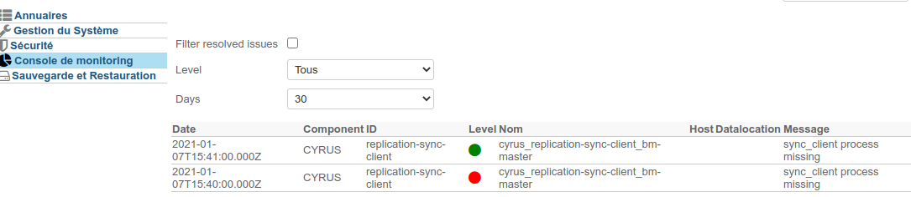

# Monitoringkonsole

:::info

Die Monitoringkonsole in Version 4.0 ist obsolet. Das Monitoring erfolgt nun über [das integrierte bm-tick Tool](#).

:::

Ab BlueMind Version 4.4 werden auf der Seite Monitoringkonsole der Administrationskonsole die von [TICK](/Guide_de_l_administrateur/Supervision/Monitoring_Bm_Tick/) ausgelösten Alarme angezeigt:

