# Daten mit bm-tick durchsuchen und analysieren


## Der Datenexplorer

Unter der Registerkarte *DataExplorer* können Datenbankdaten, d.h. die Historie der gesammelten Metriken, durchsucht werden.


:::info

Im Anhang unserer Dokumentation finden Sie die [Referenz der gesammelten Metriken](/Guide_de_l_administrateur/Supervision/Monitoring_Bm_Tick/Référence_des_métriques/), um mehr über die gesammelten Metriken und deren Inhalt zu erfahren.

:::

Der obere Teil des Fensters dient zum Schreiben oder Erzeugen der Abfrage:

- entweder durch direktes Schreiben in das dafür vorgesehene Feld;
- oder durch Auswahl der gewünschten Indikatoren über den Datenbrowser:
    - **DB.RetentionPolicy**: die Datenbank, die abgefragt werden soll. In diesem Fall interessiert uns hauptsächlich die Datenbank **telegraf.autogen**, die die betreffenden Daten enthält; die anderen sind Systemdatenbanken, die interne Betriebsdaten enthalten.
    - **Measurements & Tags:** die gesuchte Metrik
    - **fields**: das Feld oder die Felder, das/die für diese Daten gewünscht wird/werden.


Die Anzeige im unteren Teil des Fensters zeigt Ihnen die der Abfrage entsprechende Grafik an. Sie unterliegt den Aktualisierungs- und Zeitraumregeln, wie sie oben auf der Seite sowie in den Dashboards definiert sind:
 


** **Eine Metrik suchen und analysieren:** **

1. wählen Sie in der 1. Spalte die Datenbank telegraf.autogen
2. geben Sie in das Suchfeld der zweiten Spalte *"Measurements & tags"*, z.B. den Namen der BlueMind-Komponente ein, um zu sehen, welche Metriken für sie verfügbar sind: 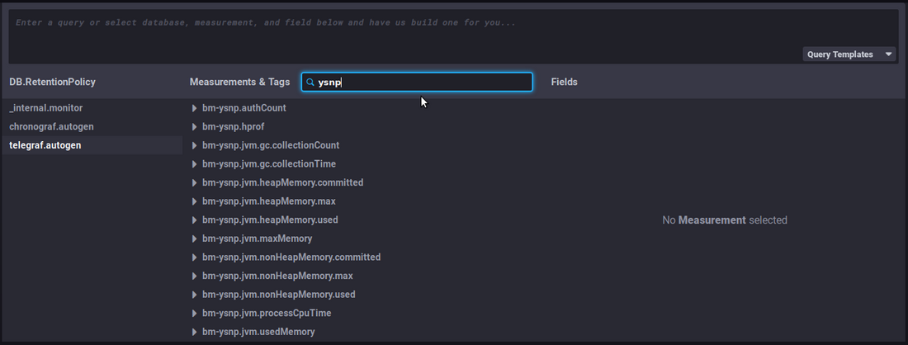
3. Wählen Sie eine Metrik aus, indem Sie auf ihren Namen klicken - in diesem Beispiel "`bm-ysnp-authCount`"
4. Navigieren Sie durch den Teilbaum der Metrik, um die gewünschten Daten zu verfeinern:

    - **datalocation**: Servername
    - **host**: Name oder IP des Hosts
    - **meterType**: Art der Daten. Dieses Feld ist besonders wichtig, da es die Art der in dieser Metrik enthaltenen Informationen angibt
        - *gauge*: momentane Messung
        - *counter*: inkrementaler Zähler
        - *[distsum](#Exploreretanalyserlesdonneesavecbmtick-distsum)* : Datenpaar, das z. B. aus einem Zähler und einer Menge besteht:
            - bm-lmtpd.emailSize = (Anzahl der Emails, Gesamtgröße der Emails)
            - bm-lmtpd.emailRecipients = (Anzahl der Emails, Anzahl der Empfänger)
        - *timer*: wie distsum, aber die Menge wird immer in Nanosekunden angegeben
    - **status**: je nach Art der Daten kann es sich um einen *ok/failed* Status handeln (z.B. erfolgreiche/fehlgeschlagene Anfrage), *success/failure* (z.B. erfolgreiche/fehlgeschlagene Authentifizierung) usw.


:::tip

Generell empfiehlt es sich, die Daten nach Servern zu gruppieren, indem Sie die Schaltfläche "Group by host" wählen, die erscheint, wenn Sie mit der Maus über die Zeile "Host" fahren, oder indem Sie diese Baumstruktur aufklappen:

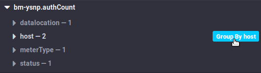

Dadurch können die Daten nach Host gruppiert werden, anstatt einen Durchschnitt der Daten von jedem Server zu erhalten.

Abhängig von den beobachteten Metriken kann es auch relevant sein, die **Gruppierung nach status**, code oder *datalocation* zu verwenden.

:::
5. Wählen Sie das Feld in der 3. Spalte aus, je nachdem, welche endgültigen Daten benötigt werden. Es wird die entsprechende Grafik angezeigt: 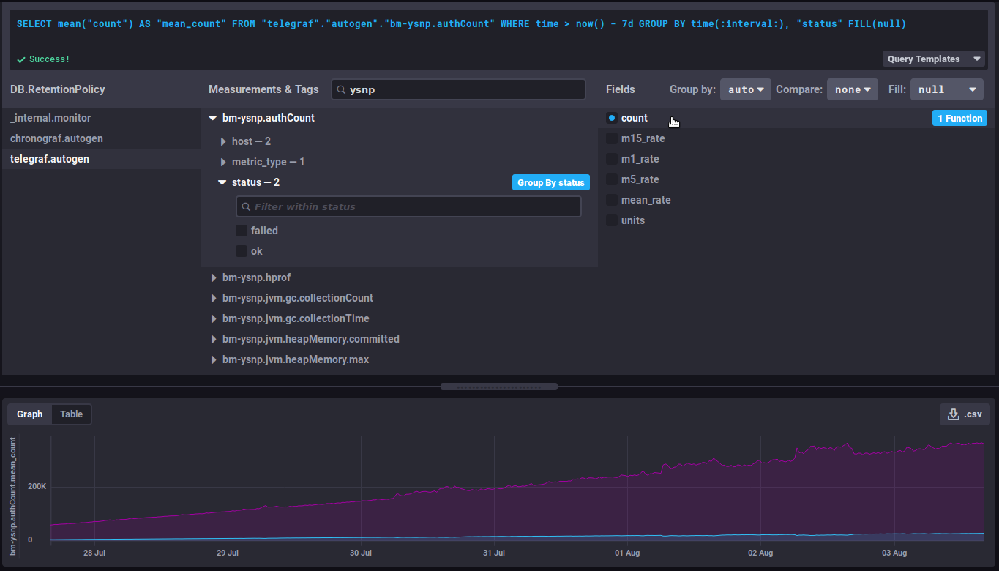


### Nützliche Funktionen/Verfeinerung der Abfrage

#### Ändern der angezeigten Dauer

Dieser Teil der Abfrage definiert die anzuzeigende Dauer:


```
WHERE time > now() - 7d
```


In Worten ausgedrückt: Daten, deren Zeit größer ist als heute minus 7 Tage (7d = 7 *Tage*), d.h. die Daten der letzten 7 Tage

 auf die gewünschte Anzahl von Tagen/Stunden ändern, um die Ansicht der Grafik zu vergrößern oder zu verkleinern

#### Entwicklung eines Zählers

Daten vom Typ *counter* sind kumulativ und erhöhen sich daher regelmäßig. In diesem Fall ist ihre Entwicklung interessanter als der Wert selbst.

Zum Beispiel zählt `bm-ysnp.authCount` die Anzahl der verarbeiteten Authentifizierungen: bei Aufrufen der Rohdaten erhalten wir in einem Moment T die Anzahl der vom Server verarbeiteten Authentifizierungen seit Beginn der Sammlung, was an sich keine interessante Zahl ist. Andererseits gibt die Entwicklung dieser Zahl Aufschluss über die Anzahl der verarbeiteten Authentifizierungen im Laufe der Zeit.

##### non_negative_difference

Um diese Entwicklung zu beobachten, können wir die Funktion["non_negative_difference](https://docs.influxdata.com/influxdb/v1.6/query_language/functions/#non-negative-difference)" verwenden, die die nichtnegative Differenz zwischen 2 Punkten des Diagramms angibt.

Am Beispiel der Anzahl der Authentifizierungen zeigt das folgende Diagramm ohne angewendete Funktion die durchschnittliche Anzahl der von der ysnp-Komponente verarbeiteten Authentifizierungen über die letzten 24 Stunden, nach Server und nach Status:

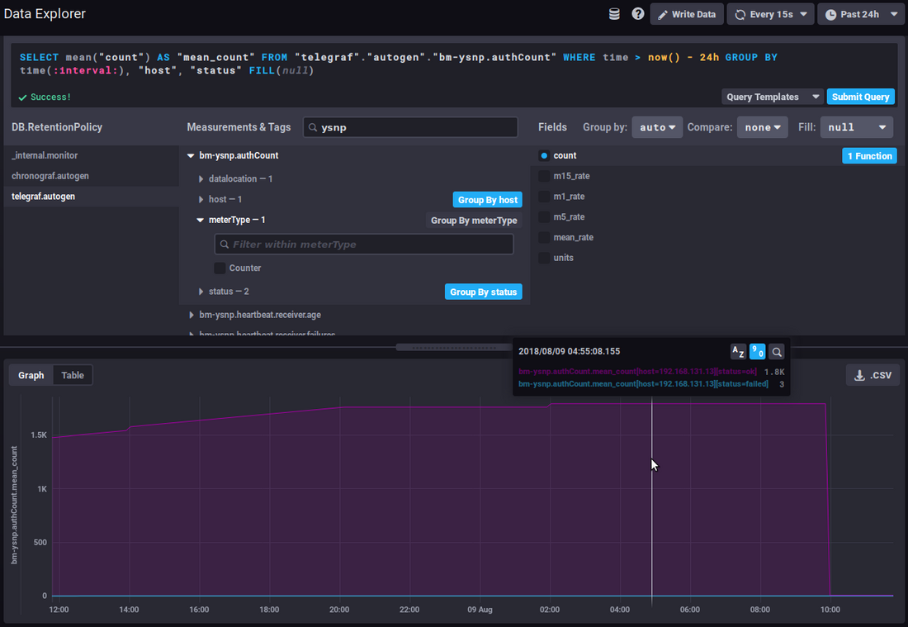

 der Durchschnitt steigt weiter an, da immer mehr Authentifizierungen verarbeitet werden

Unter Verwendung der Intervalldifferenzfunktion gibt das Diagramm die Anzahl der Authentifizierungen für jedes Zeitintervall an, so dass wir sehen können, wie sich die Menge der verarbeiteten Authentifizierungen entwickelt:

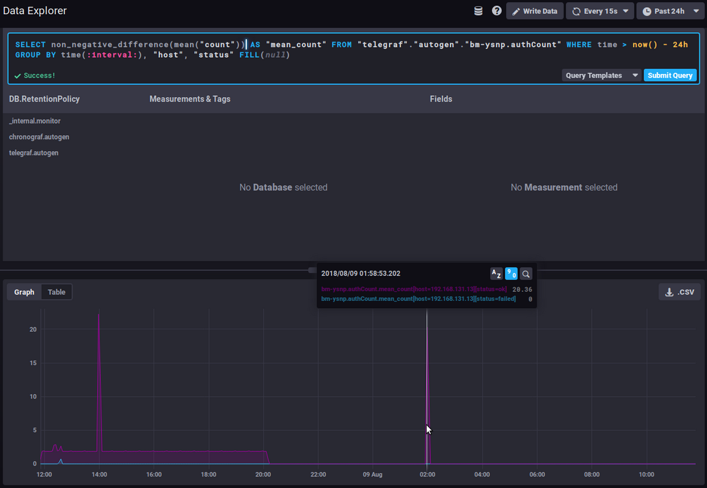

 Eine starke und anhaltende Spitze in der Kurve des fehlgeschlagenen Status könnte ein Zeichen für einen Angriff von Spammern sein, die versuchen, den Server zum Versenden von E-Mails zu verwenden.

##### non_negative_derivative

Eine andere Funktion ermöglicht es, die Entwicklungskurve der Daten zu erhalten, aber mit einer zusätzlichen Parametereinstellung: [non_negative_derivative](https://docs.influxdata.com/influxdb/v1.6/query_language/functions/#non-negative-derivative).

Diese Funktion bietet ebenfalls die Berechnung der Differenz zwischen 2 Punkten, erlaubt aber zusätzlich die Angabe der Einheit.
Mit der Funktion *non_negative_difference* berechnet das System eigenständig ein automatisches Intervall entsprechend der angezeigten Dauer (*"where time*...") und der Gruppierung der Daten (*"group by time*..."). Mit der Funktion *non_negative_derivative* können Sie die Einheit erzwingen, um z. B. eine Rate pro Minute, Stunde, Tag usw. zu erhalten.

Die folgende Abfrage zeigt somit die durchschnittliche Anzahl der Verbindungen *(mean("count")*) pro Minute (*non_negative_derivative(...,1m)*) während der letzten 24 Stunden *(mit time > now() - 1d)* für jede Stunde (*group by time(1h))*:

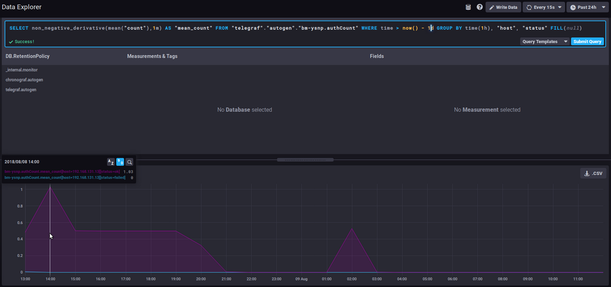

 um 14 Uhr gab es durchschnittlich 1,03 Verbindungen pro Minute, um 15 Uhr waren es 0,5/min usw.

#### *distsum*

Die Metriken vom Typ *distsum* enthalten 2 Informationen:

1. die erste Zahl ist ein Konto
2. die 2. Zahl ist eine Menge


So haben wir z.B. die folgenden Paare:

- `bm-lmtpd.emailSize` = (Anzahl der Emails, Gesamtgröße der Emails)
- `bm-lmtpd.emailRecipients` = (Anzahl der Emails, Anzahl der Empfänger)


Nehmen wir als Beispiel die Metrik `emailSize`: Bei jeder Speicherung wird die Anzahl der gezählten E-Mails für den Zeitraum (seit der letzten Speicherung) und die Gesamtgröße, die diese E-Mails darstellten, aufgezeichnet.

Anhand dieser Daten lassen sich Durchschnittswerte für die Größe pro Nachricht ermitteln, um zu sehen, ob eine plötzliche und anormale Entwicklung der durchschnittlichen Größe der Nachrichten stattfindet.
Zum Beispiel ist ein regelmäßiger Anstieg der durchschnittlichen Größe im Laufe der Zeit festzustellen, was auf die Verbesserung der Verbindungen, Server, Benutzergewohnheiten usw. zurückzuführen ist. Wenn sich aber plötzlich, innerhalb weniger Tage, die durchschnittliche Größe der Nachrichten verdoppelt (oder mehr), ist das nicht normal und wir müssen nach dem Grund suchen: Wurde eine Firmenunterschrift gesetzt? Sie kann ein Bild enthalten, das nicht verkleinert wurde und jede Nachricht noch schwerer macht und damit die Belastung der Servern erhöht.

#### Nützliche Links

Für weitere Infos zur Abfragesprache InfluxQL lesen Sie bitte die entsprechende Dokumentation:

[https://docs.influxdata.com/influxdb/v1.6/query_language/](https://docs.influxdata.com/influxdb/v1.6/query_language/)

Siehe insbesondere die Funktionen: [https://docs.influxdata.com/influxdb/v1.6/query_language/functions/](https://docs.influxdata.com/influxdb/v1.6/query_language/functions/)

Und Gruppierungen nach Zeit: [https://docs.influxdata.com/influxdb/v1.6/query_language/data_exploration/#advanced-group-by-time-syntax](https://docs.influxdata.com/influxdb/v1.6/query_language/data_exploration/#advanced-group-by-time-syntax)

### Diagramme optimal nutzen

Das Diagrammwerkzeug des *DataExplorers* bietet nur eingeschränkte Möglichkeiten, es ist z.B. nicht möglich, ein gestapeltes Diagramm zu erstellen, um die Summen von 2 Kurven zu sehen.

Dazu müssen die Dashboard-Kurven aufgerufen werden (siehe unten):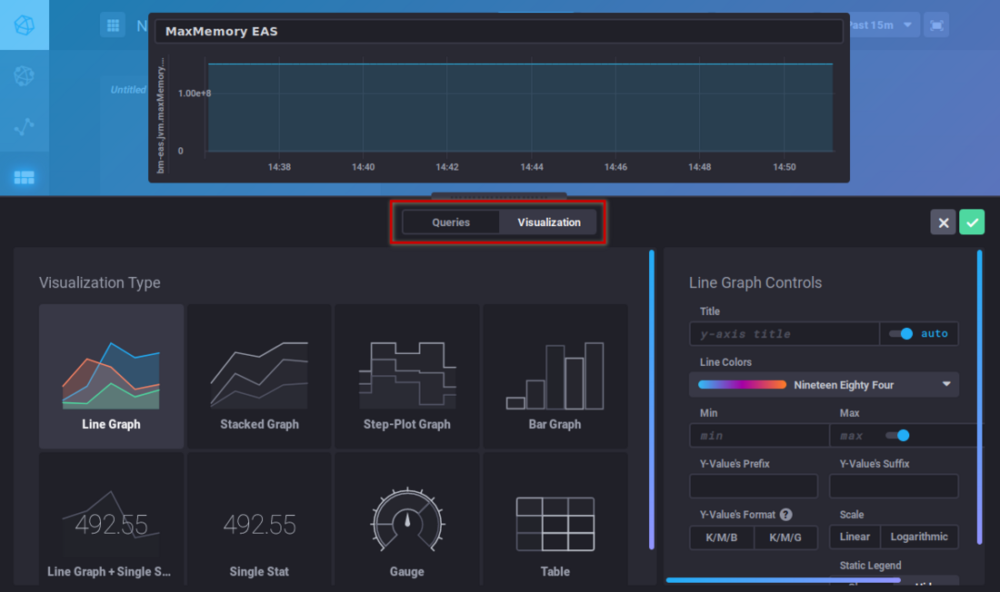

## Dashboards

Über die Registerkarte *Dashboards* können Sie auf die Dashboards zugreifen. Auf diesen Seiten können Sie Daten Ihrer Wahl gruppieren.

Standardmäßig sind 3 Dashboards vorkonfiguriert und als Beispiele angegeben:

- ** **JVMs Memory Usage****: JVMs Speichernutzung; hier finden Sie die Nutzung jeder BlueMind-Komponente (EAS, Core, milter, ElasticSearch, HPS, etc.) und können einen übermäßigen Verbrauch oder im Gegenteil das Fehlen von Daten, die darauf hinweisen, dass ein Dienst gestoppt ist, kontrollieren
- ** **Mail insights****: Messaging-Daten (Anzahl der zugestellten E-Mails, durchschnittliche Nachrichtengröße, Anzahl der IMAP-Prozesse usw.)
- ** **Monitoring system status**: **Systemdaten, die das Monitoringtool selbst betreffen (Menge der gesammelten Daten, Größe der Datenbank usw.)


:::info

Automatisches Zurücksetzen der Standard-Dashboards

Die Standard-Dashboards von BlueMind werden bei jeder Aktualisierung zurückgesetzt.

So werden sie neu erstellt, wenn sie gelöscht wurden, und auf den Standardinhalt zurückgesetzt, wenn sie geändert wurden. Zur Anpassung einer dieser 3 Tabellen ist es daher besser, sie zu klonen (siehe unten) und die Änderungen am Klon vorzunehmen oder die Tabelle einfach umzubenennen.

:::

Sie können so viele Tabellen hinzufügen, wie Sie möchten, um personalisierte Ansichten auf die Daten zu haben, die Sie interessieren, und die Daten nach Typ, Relevanz, Modul usw. gruppieren.


:::tip

Tabellen können direkt in der Hauptliste dupliziert oder gelöscht werden. Wenn Sie die Maus über eine Dashboard-Zeile bewegen, erscheinen die Aktionsschaltflächen am Ende der entsprechenden Zeile:

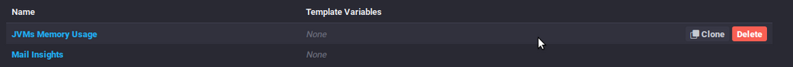

:::

Um ein neues Dashboard zu erstellen, gehen Sie auf die Startseite der Registerkarte *"Dashboard"* und klicken Sie auf die Schaltfläche *"Dashboard erstellen"*:

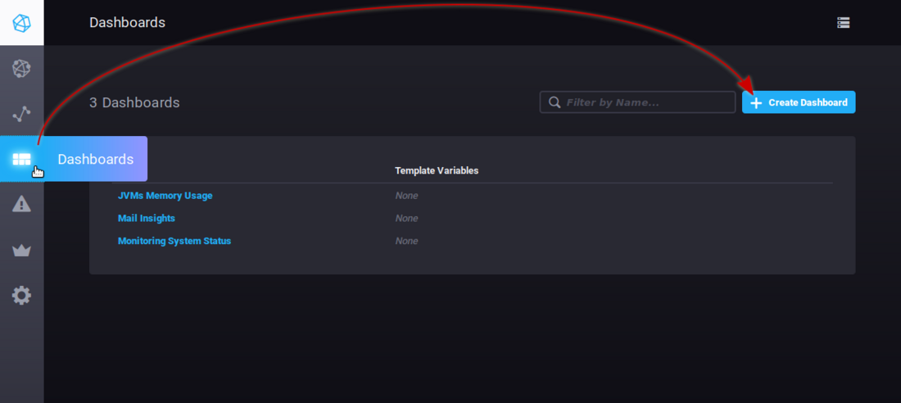

Die Tabelle wird sofort erstellt, es erscheint eine neue leere Ansicht:

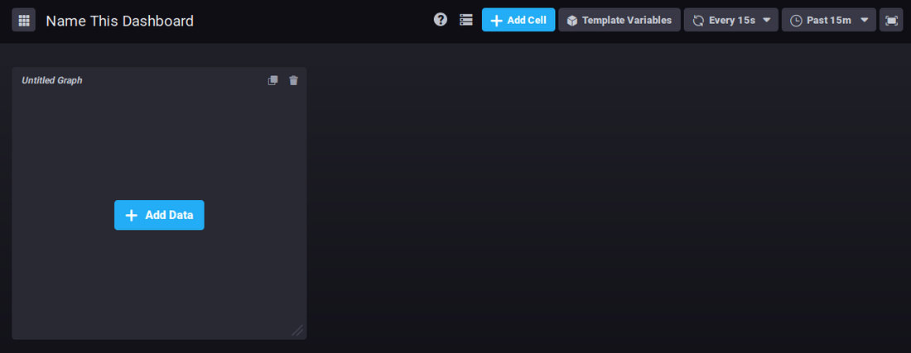

Klicken Sie auf "*Name this dashboard*", um das Feld editierbar zu machen, und geben Sie dann einen Namen für Ihr Dashboard ein:


Um dem bereits vorhandenen Bereich ein Diagramm hinzuzufügen, klicken Sie auf 

Es erscheint der Abfrage-Editor, mit dem Sie Ihre Abfrage entweder durch direkte Eingabe oder über den Datenbank-Browser erstellen können, und bietet Ihnen eine Echtzeit-Ansicht des entsprechenden Diagramms:

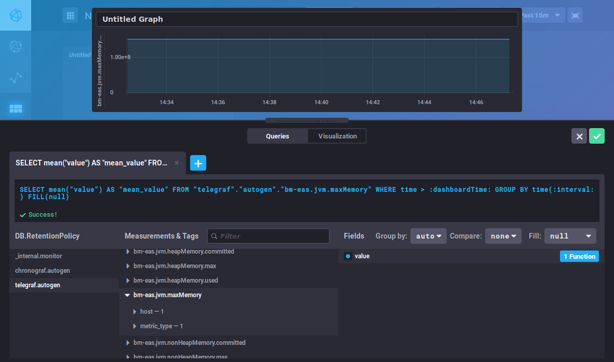

Dieser Editor ähnelt dem des *DataExplorers*, für die Suche nach Metriken und die Erstellung von Abfragen können Sie sich auf den vorherigen Abschnitt beziehen.

Über die Schaltfläche "***Visualization***" können Sie die Art des Diagramms wählen und es anpassen:


Wenn Sie Ihr Diagramm erstellt haben, klicken Sie auf "Speichern" in der oberen rechten Ecke des Editors, um es zu speichern und dem Bereich hinzuzufügen:

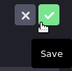

Klicken Sie auf , um so viele Grafikbereiche hinzufügen, wie Sie möchten:

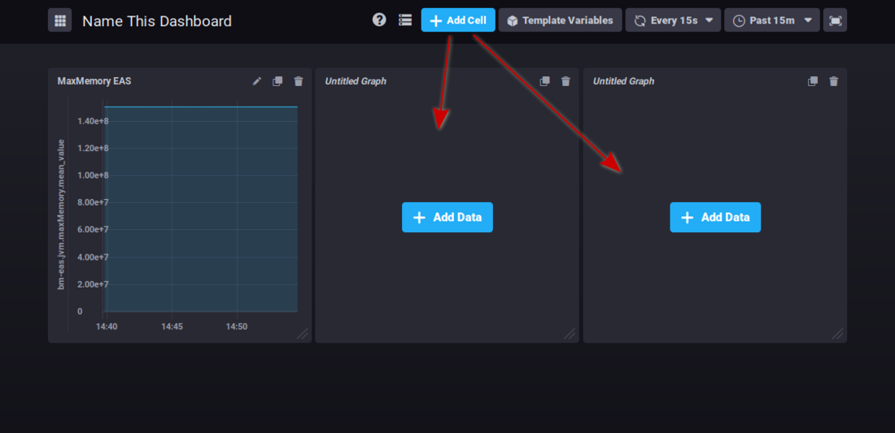

Oben rechts in jeder Zelle befinden sich Schaltflächen für verschiedene Vorgänge:

-  : bearbeiten, Anmerkungen hinzufügen oder Daten im csv-Format herunterladen
-  : Diagramm klonen, ein neuer Bereich mit demselben Diagramm wird am Ende des Dashboards hinzugefügt
-  : Diagramm löschen


Klicken Sie auf das gewünschte Symbol, um das Menü der möglichen Aktionen aufzurufen.


:::tip

Diagramme können per Drag-and-Drop neu angeordnet werden, indem Sie auf ihren Titelbereich klicken:


:::


:::info

Es gibt keine Schaltfläche zum Speichern von Änderungen: Alle Änderungen werden während des Änderungsvorgangs gespeichert, und es besteht nicht die Gefahr, alle vorgenommenen Arbeiten zu verlieren, wenn das Speichern vergessen wird.

:::

## Alarme

Die Registerkarte *Alerting* ermöglicht den Zugriff auf die Verwaltung von Alarmen sowie auf die Historie der ausgelösten Alarme.

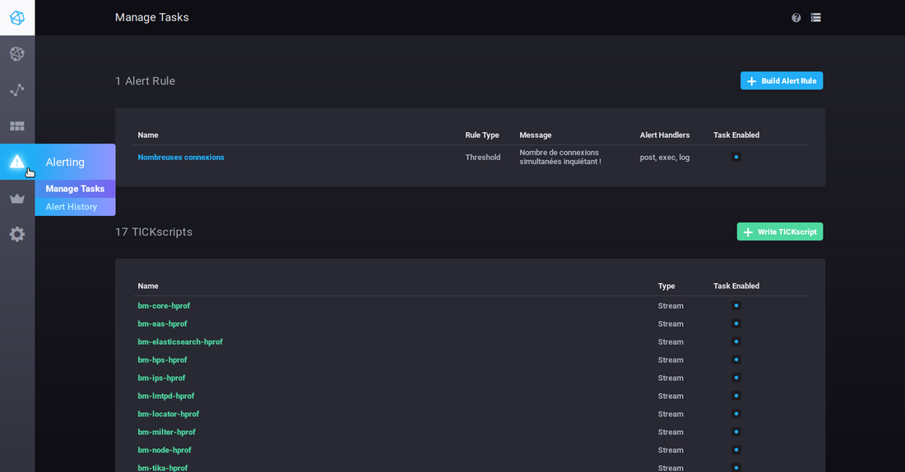

Alarme können in Form von Skripten oder Alarmregeln erfolgen.

Standardmäßig ist bei der Installation keine Alarmregel vorhanden, jedoch sind eine Reihe von Skripten vorkonfiguriert, die Sie nach Belieben ändern und/oder hinzufügen können.


:::info

Bei den von BlueMind vorkonfigurierten Alarmen handelt es sich um wichtige Warnungen zum Gesundheitszustand des Servers, denen besondere Aufmerksamkeit gewidmet werden muss, wenn einer von ihnen ausgelöst wird.

:::

### Alarme

- Um einen Alarm zu erstellen, klicken Sie auf die Schaltfläche 
- Um einen Alarm zu bearbeiten, klicken Sie auf seinen Namen in der Liste.


Füllen Sie dann die verschiedenen Teile des Formulars aus (oder korrigieren Sie sie):

- ** **Name this alert rule****: Name des Alarms
- ** **Alert type****:Art des Alarms, Details werden unten definiert
    - **Threshold**: Schwelle - der Alarm wird ausgelöst, wenn die Daten den eingestellten Wert erreichen, überschreiten oder unterschreiten
    - **Relative**: bezogen auf die Alarm-Historie – der Alarm wird aufgehoben, wenn eine Wertänderung vorliegt, die die definierten Bedingungen überschreitet
    - **Deadman**: tot – der Alarm wird ausgelöst, wenn für die eingestellte Zeit keine Werte mehr erkannt werden
- ** **Time series****: Überwachte Datenreihen – verwenden Sie den Browser, um die gewünschte Reihe zu finden
    - **DB.RetentionPolicy**: die betroffene Datenbank. Uns interessiert in erster Linie die Datenbank **telegraf.autogen**, die die betreffenden Daten enthält; die anderen Datenbanken sind Systemdatenbanken, die die Daten der Datenbank selbst enthalten.
    - **Measurements & Tags**: die gesuchte Metrik; ein Feld am oberen Rand der Spalte ermöglicht zur Vereinfachung der Suche das Filtern nach Namen.
    - **fields**: das Feld oder die Felder, das/die für diese Daten gewünscht wird/werden.
- ** **Conditions****: Nach Auswahl des Felds werden hier die Bedingungen entsprechend dem zuvor gewählten Alarmtyp eingestellt.Wenn ein Wert eingegeben wird, bietet das Display eine Echtzeitvorschau der erfassten Daten und ermöglicht möglicherweise die Positionierung oder Anpassung des Wertes.Zum Beispiel mit dem folgenden Formular: 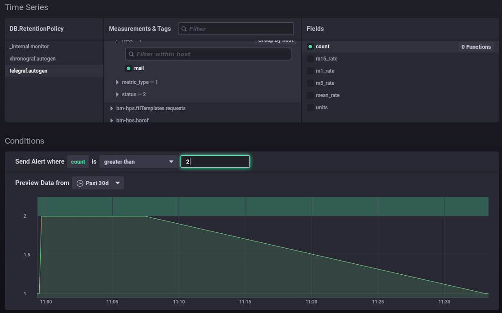 
    - Ich setze einen Alarm, wenn die Anzahl der Verbindungen 2 überschreitet.
    - Die Grafik zeigt die Anzahl der Verbindungen im vergangenen Monat (grüne Kurve).
    - Der grüne Bereich oben stellt den Bereich dar, in dem der Alarm aufgehoben worden wäre.
    -  Ich sehe, dass meine Werte immer darunter lagen. Eine Überschreitung dieses Werts wäre anormal, daher scheint mir der Alarm bei diesem Schwellenwert relevant zu sein
Somit können Sie Ihren Wert so gut wie möglich entsprechend Ihrer Daten und deren Historie positionieren: über den üblichen Werten, mit oder ohne Peaks usw.In diesem zweiten Beispiel wird ein Alarm während der Speicherverbrauchspeaks ausgelöst, die alle paar Tage auftreten: 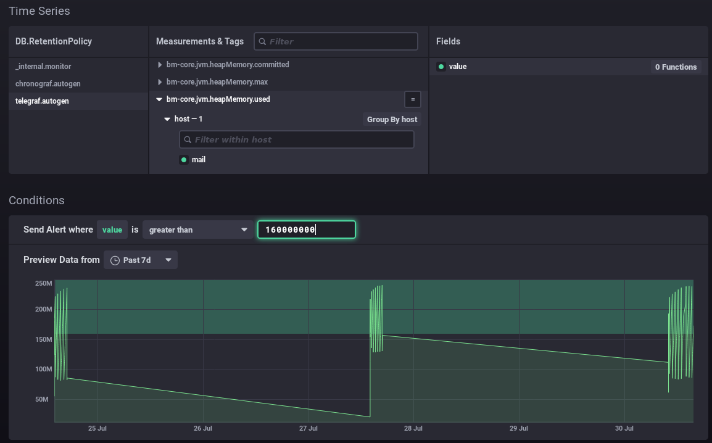- ** **Alert** ** handlers:**** Manager von auszuführenden AktionenFügen Sie über die Dropdown-Liste einen oder mehrere Empfänger des Alarms hinzu:
    - post: sendet eine http-Anfrage vom Typ "post" an die angegebene url
    - tcp: Sendet eine Anfrage über das tcp-Protokoll an die angegebene Adresse
    - exec: Befehlszeile zur Ausführung auf dem Server
    - log: schreibt eine Meldung in die vorgesehene Logdatei
    - ...
Hier sendet der Alarm eine http-Anfrage, startet einen Befehl auf dem Server und schreibt eine Meldung in die dedizierte Log-Datei: 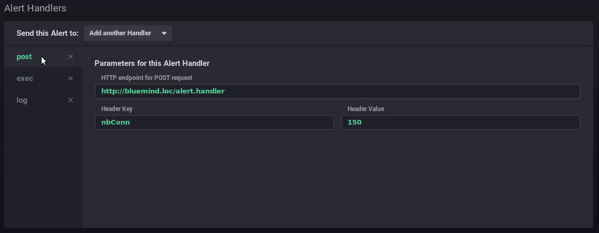- ** **Message:**** die Nachricht, die über den/die oben angegebenen Handler geschrieben oder gesendet werden soll 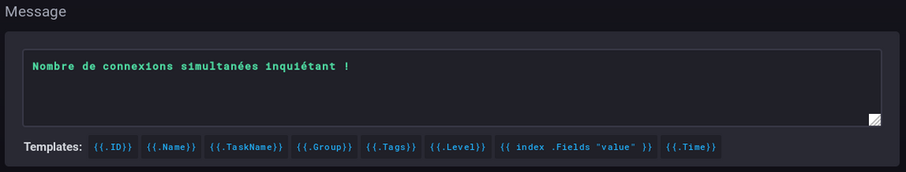


### Die Skripte

Skripte ermöglichen eine verfeinerte Verwaltung von Alarmen. Jeder als Regel angelegte Alarm ist auch als Skript vorhanden und kann so bearbeitet werden.

- Um ein Skript zu erstellen, klicken Sie auf die Schaltfläche 
- Um ein Skript zu bearbeiten, klicken Sie auf seinen Namen in der Liste.


Weitere Informationen zum Schreiben von Skripten finden Sie in der Produktdokumentation:

[https://docs.influxdata.com/kapacitor/v1.5/tick/](https://docs.influxdata.com/kapacitor/v1.5/tick/)

[https://www.influxdata.com/blog/tick-script-templates/](https://www.influxdata.com/blog/tick-script-templates/)

### Alarm-Historie

Das Untermenü *Alerting* > *Alert history* bietet Zugriff auf die Historie der ausgelösten Alarme:

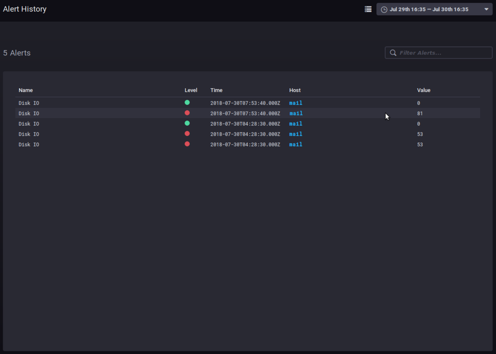

Im Verlauf können Sie den Namen, die Ebene, die Zeit, den beteiligten Host und den Wert der Daten bei Aufheben des Alarm sehen.

Ein Klick auf den Hostnamen führt zu dessen Überwachungs-Dashboard.

## Andere Registerkarten

### Hosts

Die Registerkarte *Host List* zeigt Ihnen eine Liste der überwachten Host-Server zusammen mit den darin enthaltenen Anwendungen:

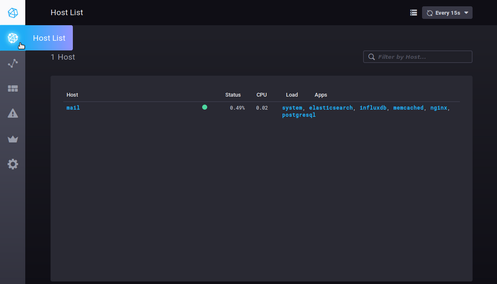

Wenn Sie auf einen Server oder eine Anwendung klicken, gelangen Sie zum spezifischen Dashboard für dieses Element.


