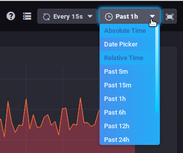

# Bm-Tick-Monitoring

## Präsentation

:::info
 Das Überwachungstool ist in BlueMind 4 standardmäßig installiert und darf und kann nicht deinstalliert werden
:::

Das von BlueMind verwendete Tick-Überwachungstool ermöglicht es, alle Serverdaten in Echtzeit zu überwachen und dank der Datenbankspeicherung deren Historie aufzurufen. Gleichzeitig ermöglicht es eine genaue und individuelle Parametrierung von Alarmen in verschiedenen Formen: Alarm in der Schnittstelle, Kommandozeilen-Aktion, Schreiben in eine spezielle Log-Datei, etc.

Das Tick-Paket enthält die folgenden Produkte:

- **Telegraf**: Tool zur Datenerfassung und -berichterstattung
- **InfluxDB**: spezialisierte Datenbank für Metriken, Termine und deren Echtzeitanalyse
- **Chronograf**: Web-basierte Datenpräsentationsanwendung zur Visualisierung und Überwachung
- **Kapacitor**: Tool zur Verarbeitung, Überwachung und Ausgabe von Zeitreihendaten-Alarmen.

Zusätzlich zu dieser Reihe von Produkten enthält das BlueMind-Paket:

- die Standardkonfiguration, die für BlueMind bestimmt ist
- die automatische Konfiguration von Telegraf und das Hinzufügen seiner Plugins
- die automatische Konfiguration von Standard-Dashboards und -Warnungen

Darüber hinaus enthält das BlueMind-Paket die Überwachung einer sehr großen Datenmenge, um eine möglichst vollständige, genaue und personalisierte Überwachung zu ermöglichen. Es ermöglicht auch den **Zugriff auf die Historie dieser Daten**, die für einen Zeitraum von einem Monat aufbewahrt werden, und erlaubt so die Abfrage, die Entwicklung und den Vergleich vergangener Daten mit den vorhandenen, um Anomalien zu erkennen und sie im Nachhinein analysieren zu können.

Die Installations-, Betriebs- und Verwendungs-Informationen sind in unserer Dokumentation aufgeführt.

- [Installation und Zugang](/Guide_de_l_administrateur/Supervision/Monitoring_Bm_Tick/Installation_et_Accès/)
- [Daten mit bm-tick durchsuchen und analysieren](/Guide_de_l_administrateur/Supervision/Monitoring_Bm_Tick/Explorer_et_analyser_les_données_avec_bm_tick/)
- [Metrik-Referenz](/Guide_de_l_administrateur/Supervision/Monitoring_Bm_Tick/Référence_des_métriques/)

## Schnittstelle

Die Startseite enthält die wichtigen Informationen:

- Statistiken der Warnungen
- Warnungen
- Produktinformationsfluss
- Nützliche Links

Unter der Registerkarte [DataExplorer](/Guide_de_l_administrateur/Supervision/Monitoring_Bm_Tick/Explorer_et_analyser_les_données_avec_bm_tick/) können Abfragen zur Anzeige und Analyse der gesammelten Metriken durchgeführt werden.

Die "Dashboards" genannten Bildschirme zeigen die Echtzeit-Datengrafiken an:

Wenn Sie den Mauszeiger über ein Diagramm bewegen, werden detaillierte Informationen zu den Daten, über die der Mauszeiger bewegt wird, als Popup angezeigt. Auch in alle anderen Diagrammen wird zu dem mit der Maus angezeigten Zeitpunkt eine weiße Linie übertragen, um das gleichzeitige Ablesen der verschiedenen Daten zu erleichtern.

Sie können in ein bestimmtes Diagramm hineinzoomen, indem Sie einen Zeitbereich direkt im Diagramm mit der Maus auswählen. Ein Doppelklick in den Bereich bringt Sie zurück zur Standardanzeige der Grafik.

Zwei Dropdown-Listen oben rechts in jedem Dashboard ermöglichen es, die Aktualisierungszeit und den anzuzeigenden Zeitraum zu ändern (oder einzufrieren) :
 

:::tip

Diese Daten bleiben bei der Navigation zwischen den Tabellen erhalten.

:::

