# Thunderbird-Konfiguration

## Thunderbird installieren

Laden Sie den E-Mail-Client auf der Website des Herausgebers herunter und installieren Sie ihn: http: [//www.mozilla.org/thunderbird/](http://www.mozilla.org/thunderbird/)


## Konfiguration des IMAP-Mailkontos

Beim 1. Öffnen schlägt Thunderbird das Anlegen eines Benutzerkontos und anschließend das Anlegen einer neuen E-Mail Adresse vor. Wählen Sie die Option „Diesen Schritt überspringen und meine bestehende Adresse verwenden“.


:::info

Wenn Thunderbird bereits mit einem Benutzerkonto und dessen Mailkonto installiert ist, gehen Sie in das Menü Datei > Neu > Bestehendes Mailkonto

:::

- Die für die Verbindung mit dem BlueMind-Server erforderlichen Namen, E-Mail-Adresse und Passwort eingeben und auf „Weiter“ klicken.
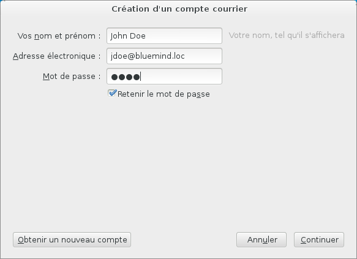

- Thunderbird versucht mit diesen Informationen eine Verbindung zu einem Server herzustellen und zeigt dann die getesteten bzw. gefundenen Informationen an: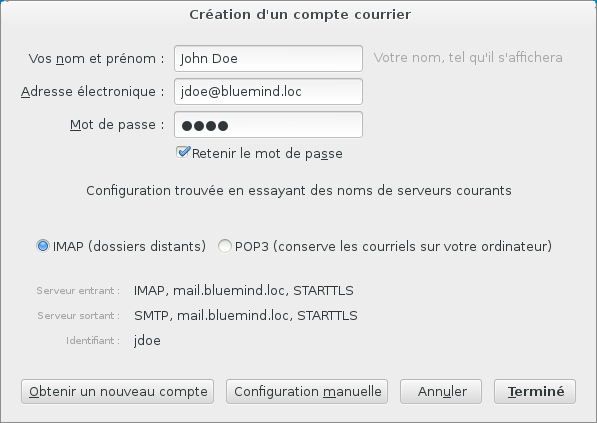
- Thunderbird bietet eine abgekürzte Kennung, die auf dem ersten Teil der E-Mail-Adresse basiert. Die vom BlueMind-Server erwartete Kennung entspricht der vollständigen E-Mail-Adresse.
Sie müssen daher in den manuellen Konfigurationsmodus wechseln (Schaltfläche am unteren Rand des Fensters), um dies zu korrigieren:
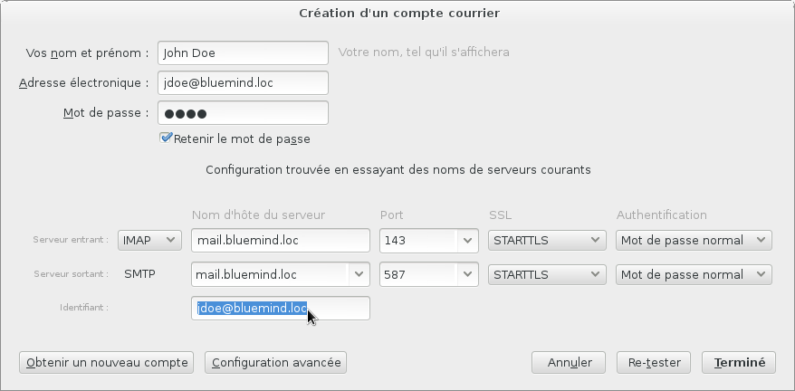


:::info

Wenn Thunderbird die Adressen der Eingangs- und Ausgangsserver nicht „erraten“ kann, schlägt es automatisch das manuelle Eingabeformular vor und die Schaltfläche „Fertig“ ist ausgegraut. Geben Sie die richtigen Adressen und Login-Daten ein und klicken Sie auf „Re-test“, um die Verbindungen zu validieren und den Vorgang abzuschließen.

:::


:::info

- Der Vor- und Nachname sind frei wählbar und erscheinen in den vom Benutzer gesendeten Nachrichten.
- Die E-Mail-Adresse ist diejenige, die vom BlueMind-Administrator festgelegt wurde 
- Die Posteingangs- und Postausgangsserver müssen von Ihrem Administrator angegeben werden, sie haben in der Regel das Format &lt;Servername>.domain.com 
- Der Benutzername ist der **vollständige **Benutzername mit der Domäne** **. 
- Das Passwort ist das vom Administrator vergebene Passwort, mit dem Sie sich bei BlueMind anmelden.


:::

- Klicken Sie auf die Schaltfläche „Fertig“.
- Thunderbird zeigt das Hauptfenster an und ruft die Mails von dem eingestellten Konto ab.

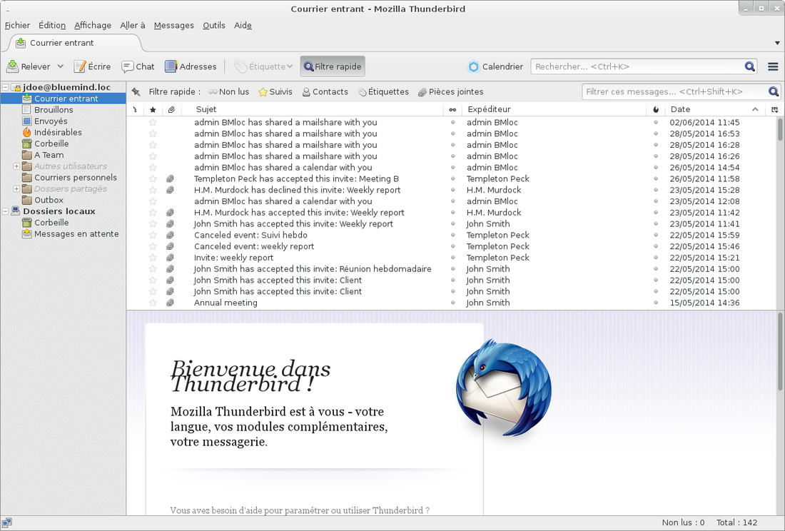

## Verbindung mit einer freigegebenen Mailbox

Um auf eine freigegebene Mailbox zuzugreifen, müssen Sie sie in Thunderbird „abonnieren“.

Klicken Sie dazu mit der rechten Maustaste in den linken Bereich des Fensters und wählen Sie im Menü die Option „Abonnieren“:

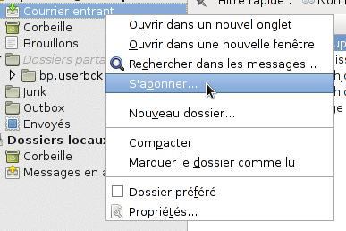

Ein Fenster wird geöffnet, in dem die Liste der für den Benutzer zugänglichen Ordner angezeigt wird.

Erweitern Sie das ausgegraute Menü „Gemeinsame Ordner“ (Doppelklick auf den Namen oder Einfachklick auf den Pfeil am Zeilenanfang) und aktivieren Sie das/die Kästchen für den/die gewünschten Ordner und klicken Sie dann auf „OK“:

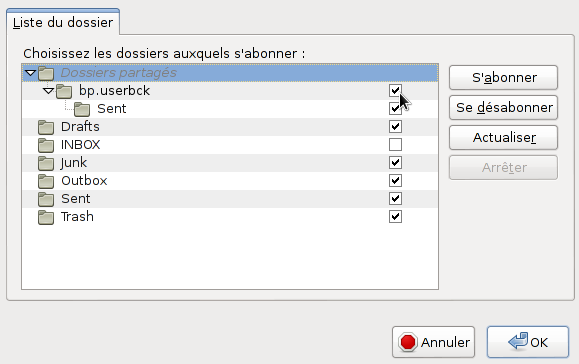

Das freigegebene Feld erscheint im Hauptfenster mit den anderen Ordnern des Kontos in einem Unterbaum namens „Gemeinsame Ordner“:

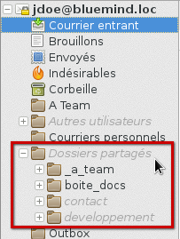


:::tip

Thunderbird kann auch so konfiguriert werden, dass alle freigegebenen Ordner des Benutzers angezeigt werden, ohne dass er sie abonnieren muss:

- gehen Sie in das Menü *Bearbeiten* (oder *Tools*) > *Kontoeinstellungen*

- gehen Sie in das Menü *Servereinstellungen* des betreffenden Kontos*

- klicken Sie auf die Schaltfläche *„Erweitert“*

- deaktivieren Sie die Option *„Nur Ordner mit Abonnement anzeigen“*


:::

Je nach Zugriffsrechten des Benutzers auf die freigegebene Mailbox kann der Benutzer die Nachrichten in ihr einsehen oder Nachrichten aus seiner Mailbox, z. B. aus seinem Ordner „Posteingang“, kopieren/verschieben.


:::info

ACHTUNG

Wenn Sie eine E-Mail mit der Maus in diese Mailbox ziehen, wird die Mail **verschoben** und verschwindet aus der ursprünglichen Mailbox.

**Um eine Nachricht zu kopieren**, klicken Sie mit der rechten Maustaste auf den Nachrichtenkopf im rechten Teil des Fensters und wählen Sie Kopieren in > Benutzer-Mailbox > Freigegebene Ordner > wählen Sie die freigegebene Mailbox und dann den Speicherort über die Option „Hierher kopieren“ im Untermenü, das dem gewünschten Ordner entspricht:

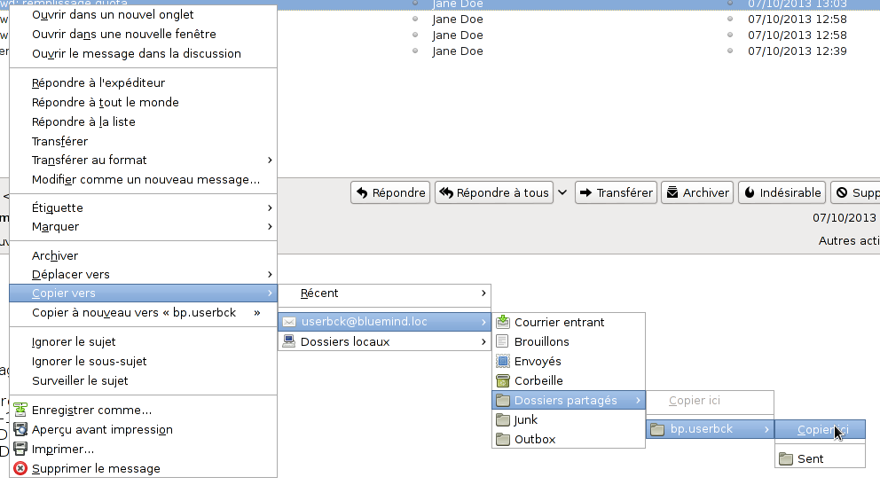

:::

## Der BlueMind-Connector

Der von BlueMind bereitgestellte Connector ermöglicht die Synchronisation von BlueMinds Kalender und Adressbüchern mit Thunderbird. Er bietet außerdem Zugriff auf die Aufgabenverwaltung und das [Abtrennen von großen Anlagen](../La_messagerie/Ajouter_des_pièces_jointes.md) beim Schreiben von Nachrichten.

### Installation des Connectors

So installieren Sie den BlueMind-Connector:

- laden Sie die Installationsdatei von der Verwaltungsschnittstelle der BlueMind-Einstellungen herunter, Rubrik Downloads


:::info

Falls der Connector nicht in den Downloads angeboten wird, wenden Sie sich bitte an Ihren Systemadministrator, um [ihn zu installieren](../../Guide_de_l_administrateur/BlueMind_et_mobilité/Les_connecteurs_BlueMind_pour_clients_lourds.md).

:::

- gehen Sie in Thunderbird zu Tools > Zusatzmodule
- ziehen Sie die Datei aus dem Datei-Explorer in das Thunderbird-Hauptfenster oder wählen Sie im Menü „Modultools“ die Option zur Installation eines neuen Moduls:
- folgen Sie den Installationsanweisungen für Thunderbird und starten Sie es neu
- gehen Sie zu Tools > Moduloptionen > BlueMind Connector und stellen Sie die Serveradresse ein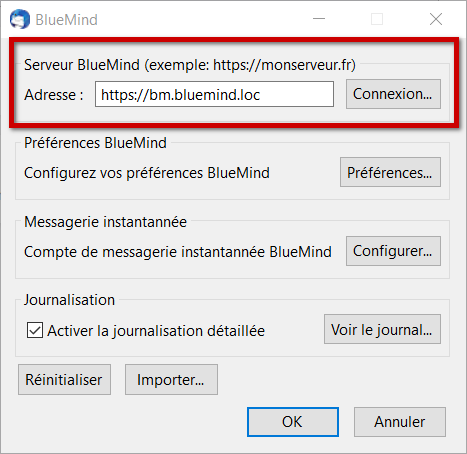Hinweis: Je nach Betriebssystem und Thunderbird-Version kann der Zugriff auf verschiedene Arten erfolgen:
    - Tools > Zusatzmodule > Schaltfläche „Optionen“ am entsprechenden Modul
    - Tools (oder Voreinstellungen) > Optionen > Registerkarte BlueMind
- Klicken Sie zum Beenden auf OK
- Der Connector stellt eine erste Verbindung her und fragt nach dem Benutzernamen und dem Passwort des Benutzers.


:::info

Der Thunderbird-Connector synchronisiert automatisch alle Elemente alle 2 Minuten. Die Synchronisation kann jederzeit manuell über das Menü Tools > BlueMind > Synchronisieren erzwungen werden

:::

### BlueMind-Einstellungsmanagement

 BlueMind Version 4.1 bietet Thunderbird-Anwendern die Möglichkeit, all ihre BlueMind-Einstellungen direkt aus der Software heraus zu verwalten, ohne die BlueMind-Webanwendung aufrufen zu müssen.

Es gibt mehrere Möglichkeiten, auf die Einstellungsverwaltung zuzugreifen:

- Tools > BlueMind > BlueMind-Einstellungen
- im Fenster der Connector-Verwaltung:Tools > Moduloptionen > BlueMind Connector > Schaltfläche „Voreinstellungen“


Die Schnittstelle sieht genauso aus und funktioniert genauso wie die Verwaltung der Einstellungen in der BlueMind-Webanwendung:

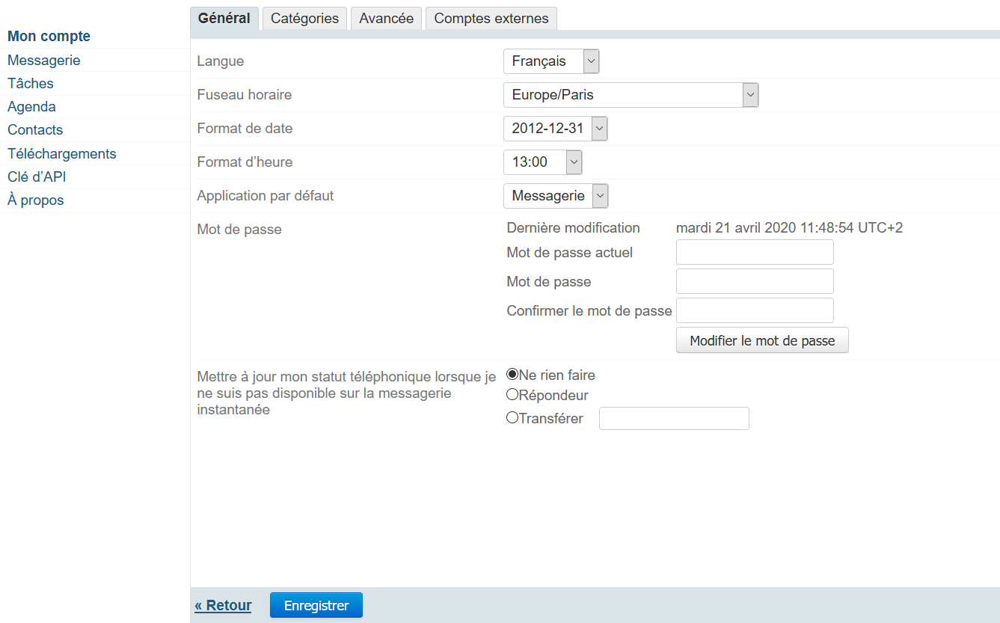


### Abtrennen von Anlagen

Ist der Connector installiert, ist die Funktion zum [Abtrennen von Anlagen](../La_messagerie/Ajouter_des_pièces_jointes.md) direkt im Texteingabefenster zugänglich.

#### Grundlegende Bedienung

Fügen Sie Ihre Anlage auf die übliche Weise hinzu (mit der entsprechenden Schaltfläche oder über Drag & Drop). Wenn seine Größe die in BlueMind eingestellte automatische Abtrennschwelle überschreitet, bietet Thunderbird Ihnen die Abtrennung der Datei an:


Die Datei wird dann automatisch an den Server gesendet und mit der Nachricht verbunden:

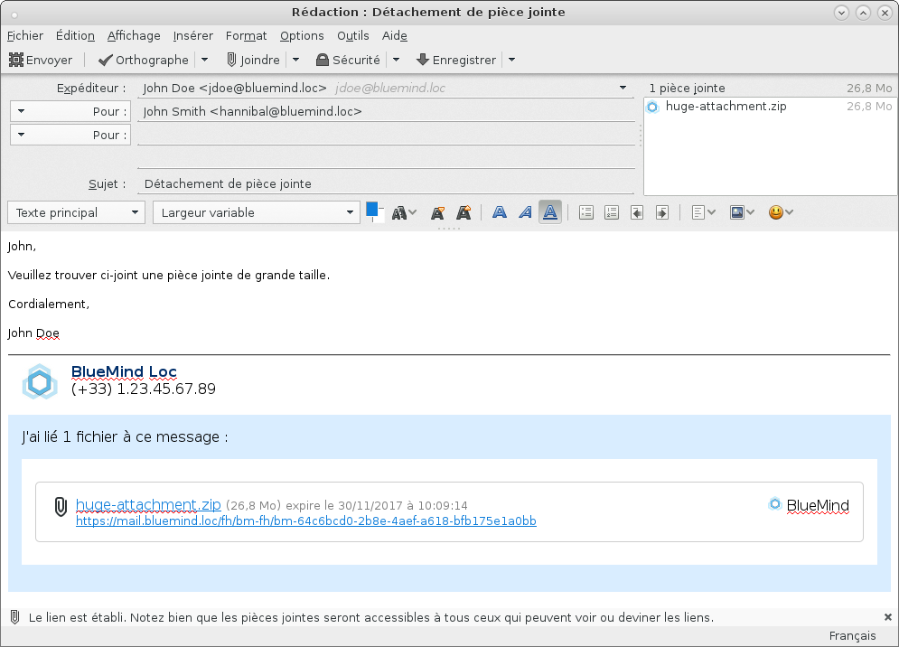

Wie bei der Abtrennung vom BlueMind-Webmailer wird der Download-Block unabhängig vom E-Mail-Client des Empfängers beim Empfänger angezeigt.


:::info

Bei der 1. Verwendung werden Sie aufgefordert, den zu verwendenden Dienst zu wählen:


1. BlueMind auswählen
2. Klicken Sie auf die Schaltfläche „Konto einrichten“
3. Eventuell wird eine Warnung angezeigt, bestätigen Sie die für das Zertifikat angeforderte Ausnahme und klicken Sie erneut auf „Konto einrichten“
4. Das Popup-Fenster schließt sich und die Datei wird an die Nachricht angehängt


:::

#### Erzwungene Abtrennung

Um eine Datei abzutrennen, die bereits an die Nachricht angehängt ist, klicken Sie mit der rechten Maustaste auf den Namen des Anhangs und wählen Sie Umwandeln in > BlueMind:

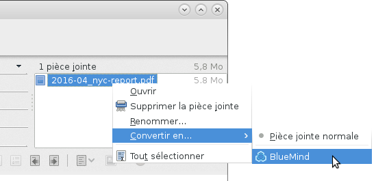

Umgekehrt können Sie eine abgetrennte Datei wieder integrieren, indem Sie Konvertieren in > Normale Anlage wählen. Die Datei wird an die Nachricht angehängt und der Download-Block wird gelöscht.

Eine Datei kann auch direkt als Anlage an die Nachricht angehängt werden. Klicken Sie dazu auf den Pfeil der Schaltfläche „Anhängen“, um im Optionsmenü nach unten zu scrollen, und wählen Sie Dateibereich > BlueMind

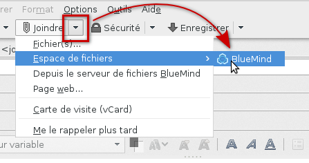

Die Dateiauswahl Ihres Systems öffnet sich und sobald die Datei ausgewählt ist, wird sie automatisch und sofort an den Server gesendet und mit der Nachricht:

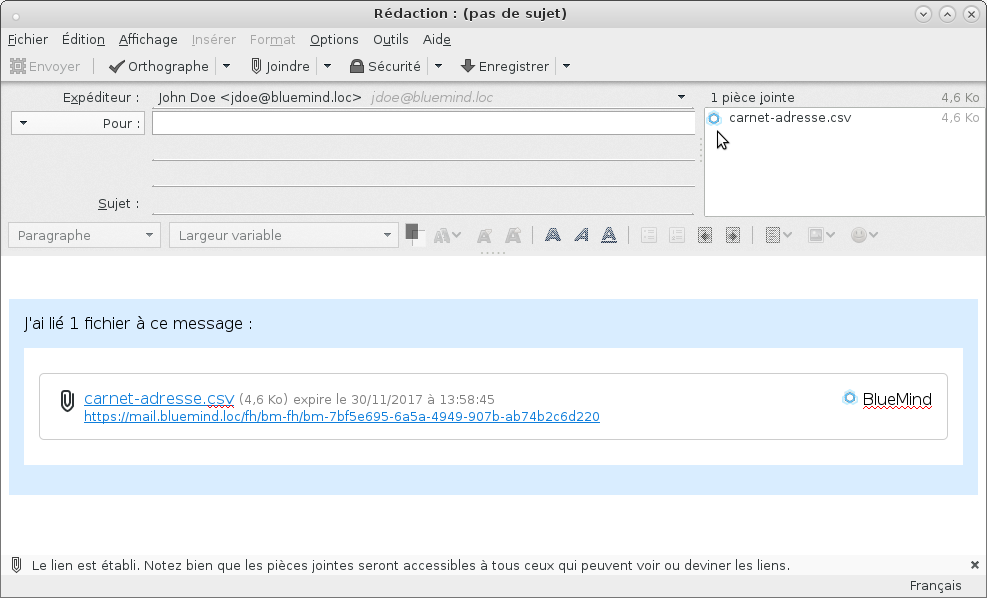

#### BlueMind Dateiauswahl

Wie von BlueMind Webmailer gewohnt, können Sie auf die Dateiauswahl zugreifen, die es Ihnen ermöglicht, Dateien zu senden, die sich bereits in Ihrem Online-Speicher befinden (Dateien, die Sie bereits gesendet und abgetrennt haben).

Um darauf zuzugreifen, klicken Sie auf den Pfeil der Schaltfläche „Anhängen“, um das Optionsmenü aufzurufen und wählen Sie „Vom BlueMind-Dateiserver“:

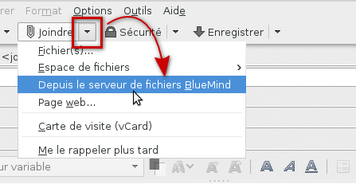Die BlueMind-Dateiauswahl wird geöffnet, so dass Sie die verfügbaren Dateien auswählen können. Klicken Sie auf eine oder mehrere Dateien und dann auf die Schaltfläche „Auswählen“, um sie der Nachricht hinzuzufügen:

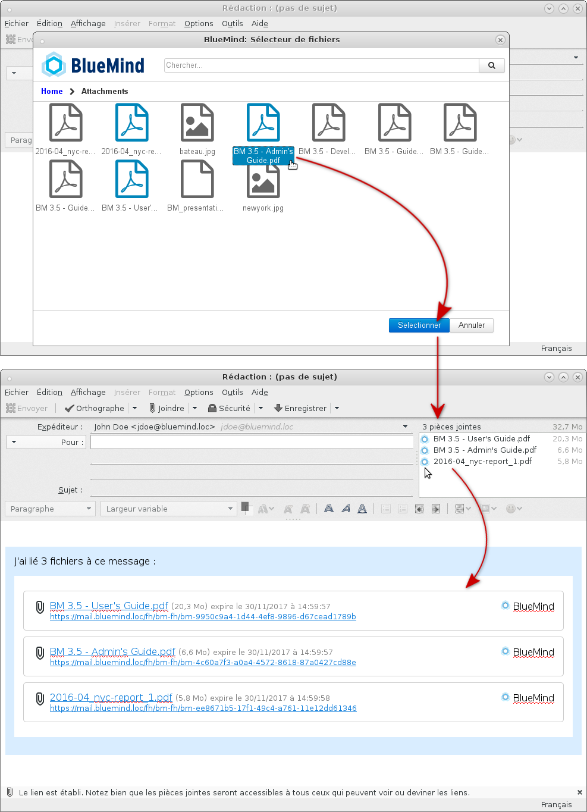

#### Parametrierung

In den Thunderbird-Einstellungen, Registerkarte Anlagen, können Sie die automatische Abtrennung von Anlagen oberhalb eines bestimmten Schwellenwertes deaktivieren, indem Sie das Kontrollkästchen aktivieren oder deaktivieren:


:::info

Der Schwellenwert kann in diesem Fenster geändert werden, er wird jedoch bei jedem Start von Thunderbird mit dem BlueMind-Server synchronisiert, so dass der geänderte Wert bei der nächsten Sitzung überschrieben wird.

:::

### Kalender

#### Anzeige

Ist der Connector installiert und die Verbindung hergestellt, ist der Kalender über das Menü Tools > BlueMind > Kalender oder über eine neue Schaltfläche auf der Thunderbird-Hauptschnittstelle zugänglich:

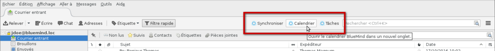

Er hat die gleichen Anzeigefunktionen und die gleiche Bedienung wie der [Online-Kalender](../L_agenda/Découvrir_l_agenda.md):

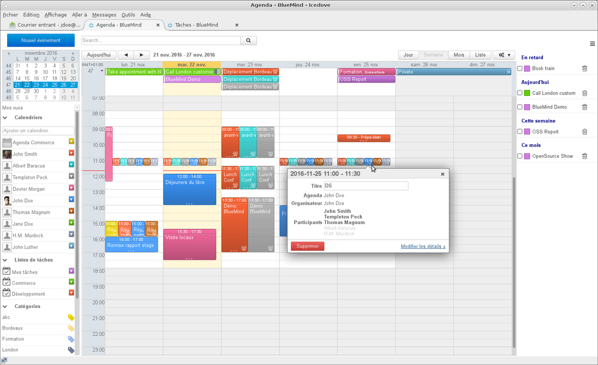

#### Einstellungen und Kalender

Die Verwaltung der angezeigten Kalender sowie das Anlegen von Nebenkalendern oder die Vergabe von Freigaberechten an andere Benutzer erfolgt innerhalb der Einstellungsverwaltung (siehe oben): Menü Tools > BlueMind > BlueMind-Einstellungen > Bereich Kalender.

Ausführlichere Informationen finden Sie auf der Seite [Kalendereinstellungen](../L_agenda/Paramétrer_l_agenda.md)

### Die Aufgaben

Wie der Kalender ist auch die Aufgabenverwaltung auf einer separaten Registerkarte zugänglich und bietet online die gleiche Schnittstelle wie in BlueMind:

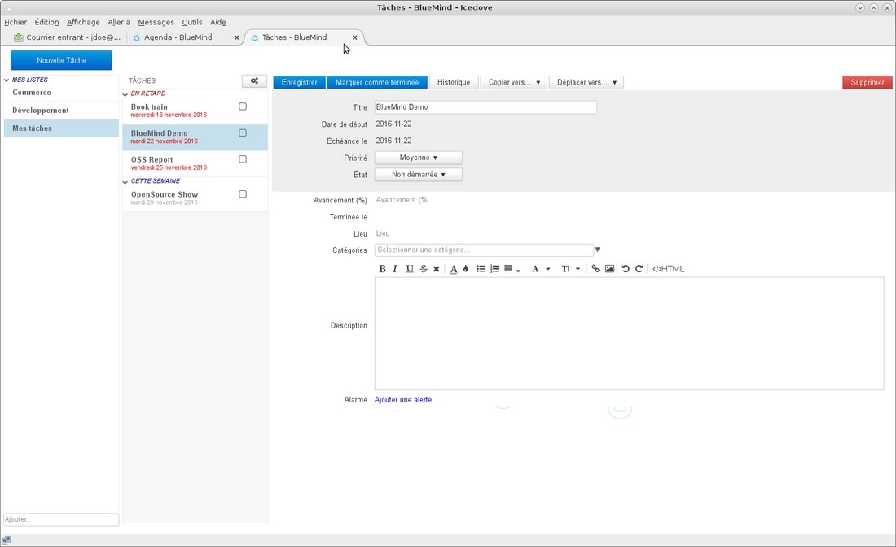

Um mehr über die Funktionsweise zu erfahren, können Sie die entsprechende Seite einsehen: [Die Aufgaben](../Les_tâches/Découvrir_les_tâches.md)

### Kontakte

Alle BlueMind-Adressbücher des Benutzers können mit Thunderbird synchronisiert werden und sind über den Adressbuchverwalter (Menü Tools > Adressbuch) zugänglich:

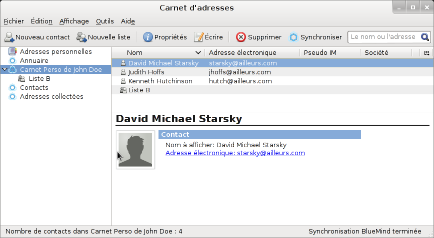

Damit ein Adressbuch in Thunderbird sichtbar ist, müssen Sie es zunächst in BlueMind abonnieren, egal ob es sich um ein persönliches Adressbuch oder ein von einem anderen Benutzer freigegebenes handelt.

So fügen Sie einem Adressbuch ein Abonnement hinzu:

- Sobald die Freigabe aktiviert ist (durch den Benutzer für ein persönliches Adressbuch oder durch den Administrator für ein Domänen-Adressbuch), gehen Sie zur Verwaltung der BlueMind-Einstellungen: Tools > BlueMind > BlueMind-Einstellungen > Abschnitt Kontakte > Registerkarte Abonnements

- beginnen Sie im Eingabefeld mit der Eingabe des Namens des Adressbuchs, der dann von der Autovervollständigung vorgeschlagen wird:

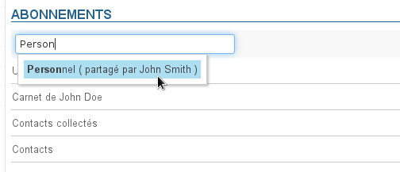 
Hinweis: Die persönlichen Adressbücher des Benutzers werden automatisch hinzugefügt, wenn sie erstellt werden


:::tip

Abonnement und Synchronisation

Mit der Schaltfläche „Synchronisation“ können Sie für jedes Adressbuch eine differenzierte Synchronisation einrichten.

- **Ist die Synchronisation aktiviert,** wird das Adressbuch angezeigt, die Datensätze können eingesehen werden und sind offline verfügbar
- **Wenn die Synchronisation deaktiviert ist:** das Adressbuch wird mit einem anderen Symbol als die anderen Adressbücher angezeigt und die Datensätze sind nur für die Suche (Adressbuch) und die Autovervollständigung (Nachrichtenverfassung) zugänglich


:::info

Verzeichnis-Synchronisation

Um Probleme aufgrund einer großen Anzahl von Benutzern in der Domäne zu vermeiden, wird das Verzeichnisbuch standardmäßig nicht synchronisiert.

:::

Weitere Informationen finden Sie auf der Seite [Adressbuchverwaltung](../Les_contacts/Utiliser_un_carnet_d_adresses_partagé.md)

:::

- Zurück zum Adressbuchmodul
- Klicken Sie auf die Schaltfläche „Synchronisieren“ oder verwenden Sie das Menü Tools > BlueMind > Synchronisieren. Das Adressbuch wird angezeigt: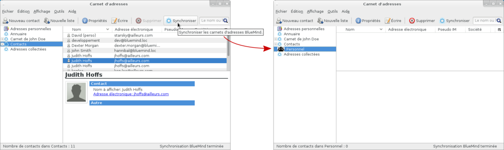


### Firmenunterschrift

Wenn eine [Firmenunterschrift](../../Guide_de_l_administrateur/Configuration/Signatures_d_entreprise.md) eingestellt ist, wird sie nach dem Senden vom Server automatisch am Ende der Nachricht hinzugefügt.

Im Bearbeitungsfenster wird eine Vorschau angeboten, damit der Benutzer sehen kann, dass eine Unterschrift vorhanden ist und welche, wenn mehrere Unterschriften eingestellt sind (intern, extern, für eine Gruppe, usw.):

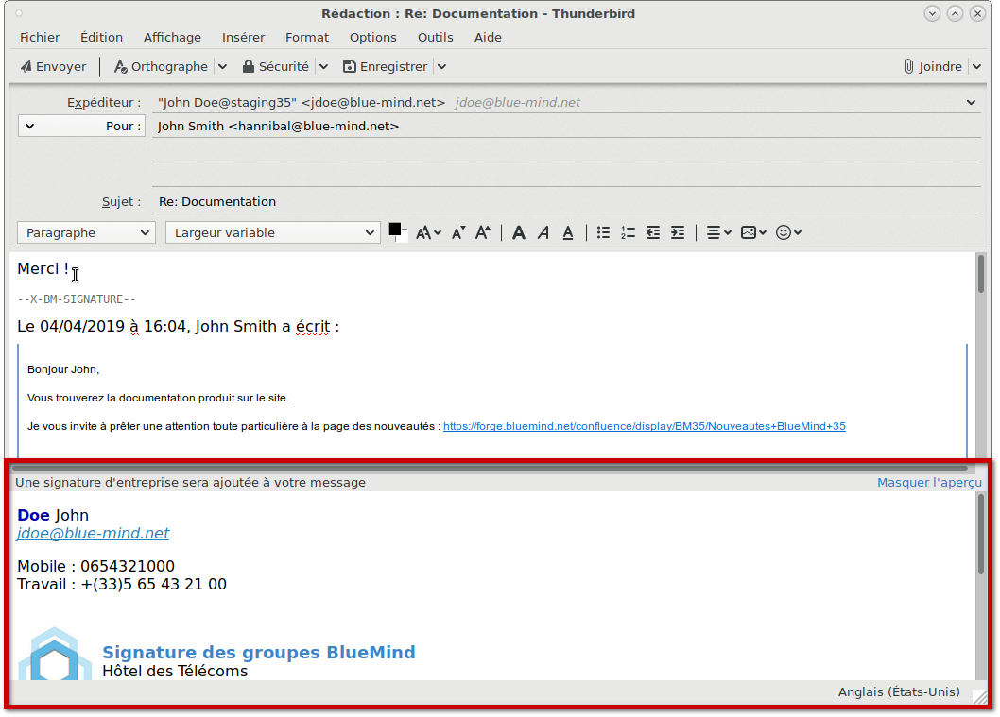

#### Einfügen der Unterschrift

Wenn der Administrator die entsprechende Option aktiviert hat, können Benutzer das Einfügen ihrer Unterschrift wählen.

**Dazu die Zeichenfolge (Tag) `--X-BM-SIGNATURE--` an der gewünschten Stelle in der E-Mail einfügen.**

Um das Einfügen zu erleichtern, kann der Benutzer diese Zeichenkette als Standardunterschrift in Thunderbird festlegen:

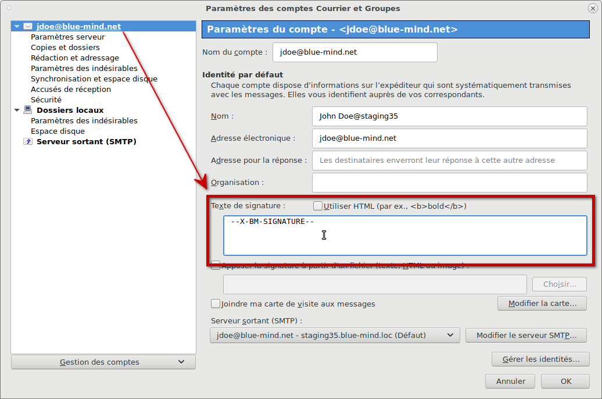

Beim Verfassen oder beim Beantworten einer E-Mail wird das Tag dann automatisch in der Nachricht angebracht:

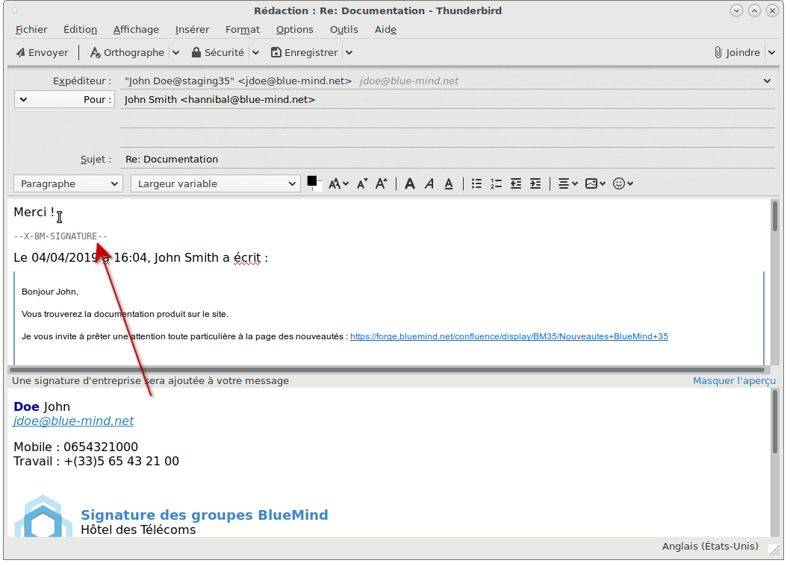


:::tip

Auch im vorliegenden Fall einer Platzierung durch Thunderbird kann das Tag vom Benutzer manuell verschoben werden, wenn er die Unterschrift vorübergehend an einer anderen Stelle anbringen möchte.

:::

Die Unterschrift wird dann von dem Server eingefügt, auf dem sich das Tag befindet:

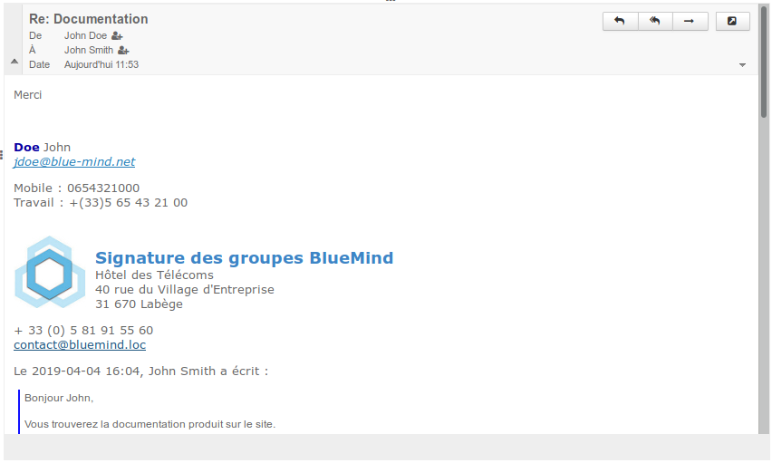


:::info

Bei fehlendem oder gelöschtem Tag wird die Unterschrift ganz ans Ende der Nachricht gesetzt.

:::

#### Verwendung einer persönlichen Unterschrift

Im Gegensatz zum Webmailer kann BlueMind bei der Verwendung von Thunderbird keine persönliche Unterschrift erkennen, um sie zu ersetzen. Wird beispielsweise in Thunderbird eine persönliche Unterschrift verwendet, wird die Firmenunterschrift in Nachrichten **zusätzlich zu dieser** hinzugefügt.

Daher sollte eine persönliche Unterschrift nicht verwendet werden, wenn eine Firmenunterschrift vorhanden ist, es sei denn, sie liefert zusätzliche relevante und gewünschte Informationen, oder das Tag zum Platzieren wird als Unterschrift benutzt (siehe voriger Abschnitt).

## Fehlersuche

### Zurücksetzen des Connectors

Beim Auftreten von Störungen, die nicht durch den Neustart der Software behoben werden, besteht der erste Schritt im Zurücksetzen des Connectors: Dieser Vorgang setzt die Synchronisation zurück und löscht den Browser-Cache.

Dies geschieht wie folgt:

- zu den Connectoreinstellungen gehen
- klicken Sie auf die Schaltfläche „Zurücksetzen“: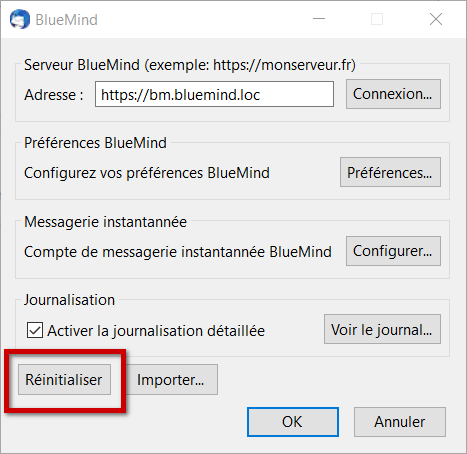
- Beenden durch Klicken auf OK


### Die Protokolle des Connectors

#### Detaillierte Protokolle erhalten

Wenn Probleme ohne offensichtliche Ursache auftreten, muss die detaillierte Protokollierung des Connectors aktiviert werden, um vollständige Protokolle zu erhalten, die Aufschluss über den Fortschritt der Connector-Synchronisation geben.

Vorgehensweise:

- zu den Connectoreinstellungen gehen
- aktivieren Sie das Kontrollkästchen „Detaillierte Protokollierung aktivieren“:
- Bestätigen Sie mit der „OK“-Taste
- Thunderbird neu starten


#### Die Protokolle einsehen

Im Bereich „Protokoll-Aktivierung“ (siehe oben) können Sie auf die Protokolle zugreifen, indem Sie auf die Schaltfläche“Protokoll einsehen...“ klicken

## Bekannte Probleme

### Die Registerkarte „Kalender“ hat eine leere Seite

Wenn das Zurücksetzen des Connectors (siehe oben) nicht ausreicht, um das Adressbuch wieder anzuzeigen, müssen 2 Lösungen umgesetzt werden:

#### Leeren Sie den Cache des integrierten Browsers manuell

Sie können den Cache wie folgt manuell zurücksetzen:

- öffnen Sie die Kalender-Registerkarte von Thunderbird
- gehen Sie zu Tools > Aktuellen Verlauf löschen
- wählen Sie „Alle“ im Dropdown-Menü und aktivieren Sie alle Kästchen
- klicken Sie auf „Jetzt löschen“
- schließen Sie die Kalender-Registerkarte von Thunderbird und öffnen Sie sie erneut


#### Erzwingen der Cache-Bereinigung

Neben dem manuellen Zurücksetzen und Leeren kann auch eine Zwangsbereinigung der Thunderbird-Caches durchgeführt werden:

1. Schließen Sie die Software
2. verwenden Sie die Befehlszeile:


```
"C:\Program Files (x86)\Mozilla Thunderbird\thunderbird.exe" -purgecaches
```

Weitere Informationen finden Sie unter [https://developer.mozilla.org/fr/docs/Mozilla/Command_Line_Options](https://developer.mozilla.org/fr/docs/Mozilla/Command_Line_Options)

3. Löschen Sie den lokalen Speicherordner:


```
C:\Users\John\AppData\Roaming\Thunderbird\Profiles\c05tkj52.default\storage\default\https+++bm.bluemind.loc
```

*Hinweis: Der Programm-Pfad kann von einer OS-Version zur anderen variieren*

4. Thunderbird neu starten


Wenn keine dieser Methoden das Adressbuch wiederherstellen kann, müssen Sie die detaillierte Protokollierung durchführen (siehe voriger Absatz) und die erhaltenen Protokolle an Ihre IT-Abteilung oder an den BlueMind-Support übermitteln.


