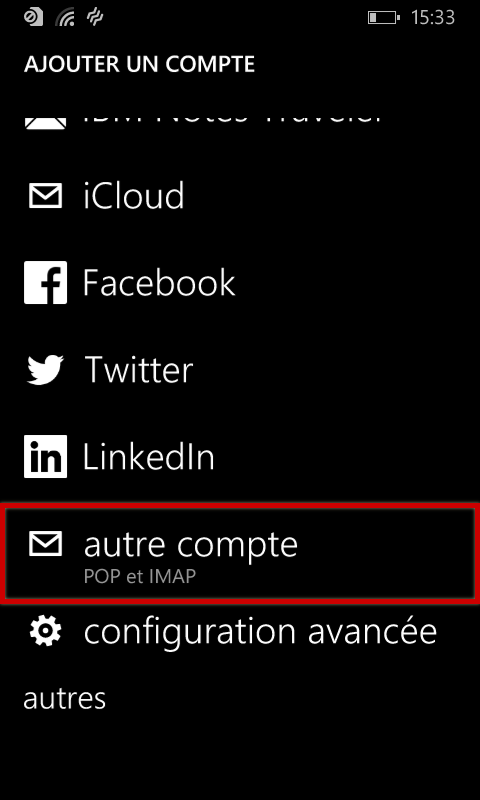
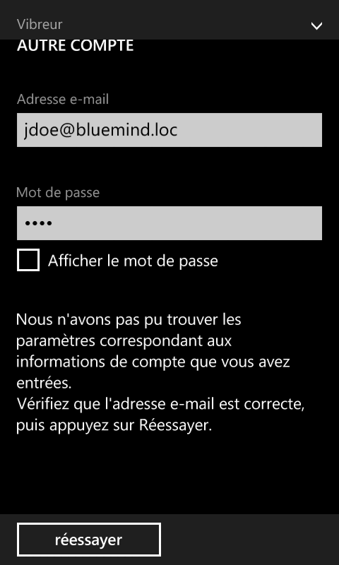
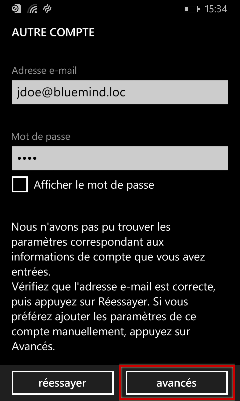
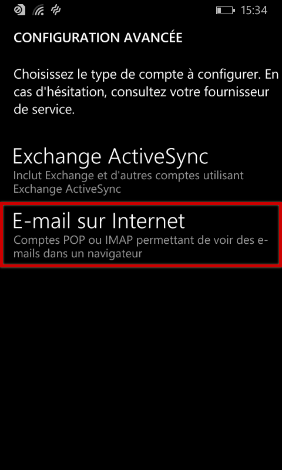
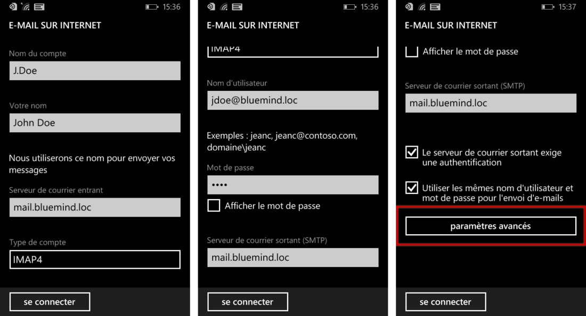
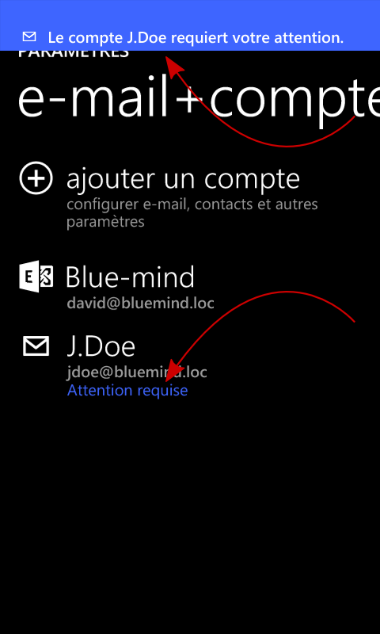
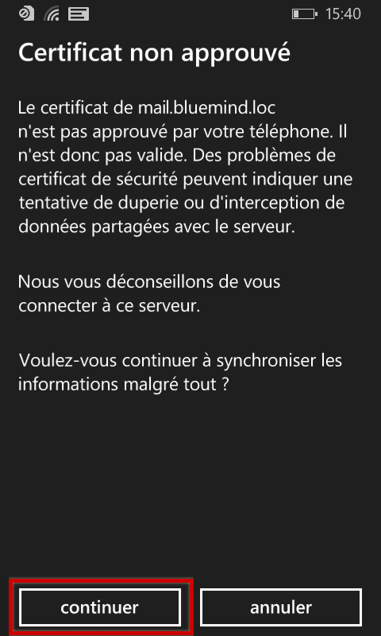
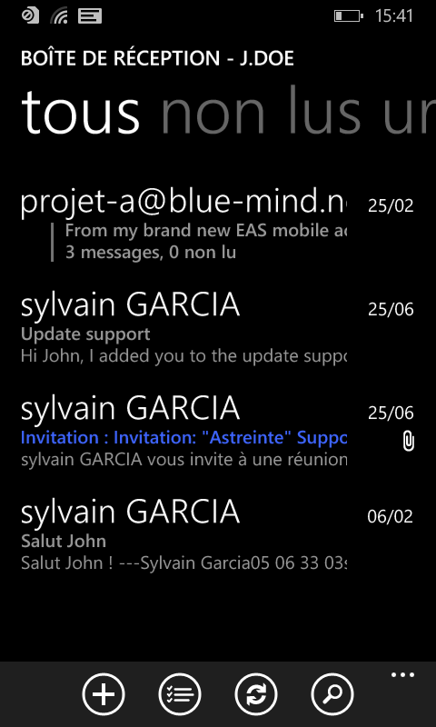

# IMAP-Synchronisierung unter Windows Phone

:::info

Diese Anleitung wurde mit einem Nokia Lumia 520 unter Lumia Black (Windows Phone 8.0) erstellt

Bei anderen Windows Phone-Handys ist die Bedienung gleich, auch wenn sich die Bildschirme erheblich unterscheiden können.

:::

## Konfiguration des neuen E-Mail-Kontos

Gehen Sie auf dem Startbildschirm oder in der Anwendungsliste zu den Einstellungen:

Wählen Sie „E-Mail+Konten“:

Wählen Sie „Neues Konto hinzufügen“:

Scrollen Sie nach unten, um den Kontotyp „anderes Konto | Pop und IMAP“ auszuwählen:

Geben Sie die Anmeldeinformationen für das Konto ein:

Das System teilt Ihnen mit, dass es sich nicht anmelden konnte:

Drücken Sie auf „erneut versuchen“, die Verbindung schlägt erneut fehl, aber eine Schaltfläche zum Zugriff auf die erweiterten Einstellungen erscheint:

Wählen Sie die „E-Mail im Internet“-Konfiguration:

Füllen Sie die Verbindungsinformationen für den Eingangs- und Ausgangsserver aus:

Tippen Sie unten im Formular auf „Erweiterte Einstellungen“, um neue Konfigurationsfelder aufzurufen.
Markieren Sie die beiden Kästchen, um das SSL-Protokoll zu aktivieren und wählen Sie nach Wunsch die Häufigkeit und Dauer der Nachrichtensynchronisation:

Die Konfiguration ist fast abgeschlossen.

Zurück auf der Seite der Kontoverwaltung werden Sie durch eine doppelte Meldung darauf hingewiesen, dass eine Aktion erwartet wird:

Tippen Sie auf den Namen des Kontos.

Eine Warnmmeldung weist Sie darauf hin, dass das Server-Zertifikat vertrauenswürdig sein muss. Bestätigen Sie mit „Weiter“:

Die Warnung verschwindet vom Kontoverwaltungsbildschirm, die Nachrichten sind nun abrufbar und in der Anwendung verfügbar:

 

 

