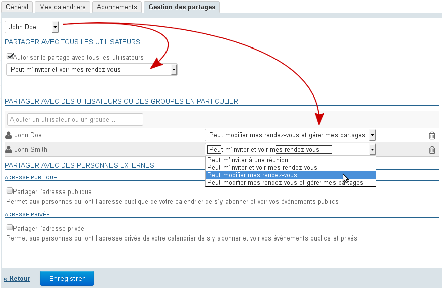
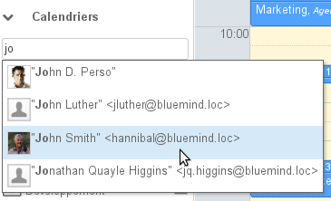
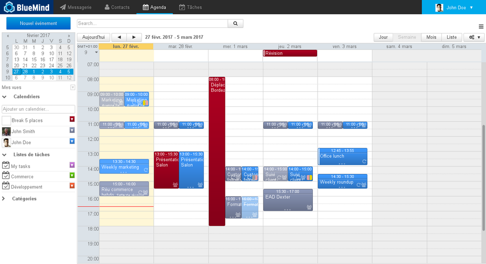
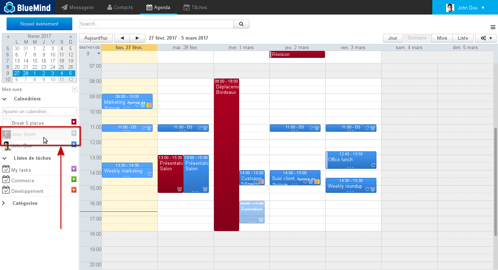
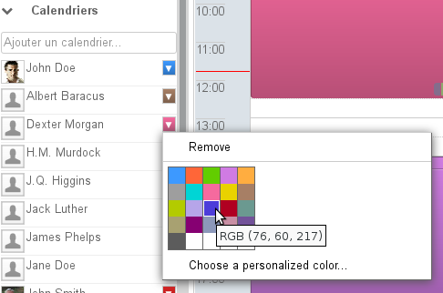
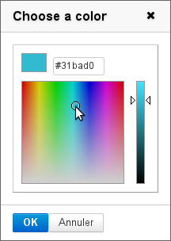
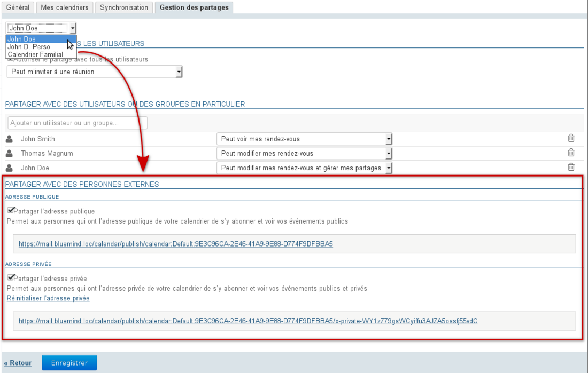

# Kalender-Freigabe

## Präsentation

Ab BlueMind 3.5 kann ein Benutzer über mehrere Kalender verfügen und ihre Freigabe verwalten: Hauptkalender von BlueMind, Nebenkalender, Kalender (Benutzer oder Domäne), für die er Administrationsrechte erhalten hat, oder synchronisierte externe Kalender.

Diese Kalender kann der Benutzer folglich für sich behalten oder für andere Benutzer bzw. Gruppenmitglieder freigeben, indem er verschiedene Zugriffsrechte gewährt.

## Freigeben und delegieren

Rechte können an alle Benutzer der Domäne (öffentliche Freigabe) oder nur an bestimmte Benutzer delegiert werden.

Die möglichen Rechte lauten wie folgt:

- **„Kann mich zu einem Termin einladen“**: kann die Termine des Benutzers nicht einsehen, ihn aber trotzdem einladen. Wenn dieses Mindestrecht nicht gewährt wird, schlägt die Autovervollständigung den Namen des Benutzers im Formular zum Hinzufügen eines Teilnehmers nicht zu einem Termin vor.
- **„Kann mich einladen und meine Termine sehen“**: kann die Kalender einsehen und den Benutzer einladen. Private Termin werden angezeigt, aber mit dem Wort „privat“ anstelle des Titels und nur mit den Angaben von Tag, Uhrzeit und Dauer.

- **„Kann meine Termine ändern“**: zusätzlich zum obigen Recht, kann die Termine des Benutzers akzeptieren und ändern.

- **„Kann meine Termine ändern und meine Freigaben verwalten“**: **Es handelt sich um eine vollständige Freigabe des Kalenders**: kann zusätzlich zu den vorherigen Rechten selbst Freigaberechte am Kalender des Benutzers gewähren  **und die Einzelheiten der privaten Termine des Benutzers anzeigen oder bearbeiten** .

Um Ihren Kalender zu delegieren, gehen Sie zur Verwaltung der Benutzereinstellungen („Mein Konto“) > Rubrik Kalender > Registerkarte Freigabeverwaltung:

1. Wählen Sie den gewünschten Kalender aus.

:::info

Sind verfügbar:

- der Standardkalender des Benutzers
- seine persönlichen Kalender, die in der Registerkarte „Meine Kalender“ angezeigt werden:
    - die persönlichen Kalender, die er in BlueMind erstellt hat
    - die externen, von ihm abonnierten Kalender
- die Kalender anderer Benutzer, für die er über das Recht zur Freigabeverwaltung verfügt

:::

2. Der Abschnitt „Mit allen Benutzern teilen“ entspricht der öffentlichen Freigabe des Kalenders, diese Rechte werden allen Benutzern der Domäne vergeben:
    1. aktivieren Sie das Kästchen „Freigabe für alle Benutzer zulassen“
    2. wählen Sie das gewünschte Recht in der Dropdown-Liste
3. Um die Freigabe für bestimmte Benutzer oder Gruppen zu erteilen, gehen Sie zum nächsten Abschnitt „Freigabe für bestimmte Benutzer oder Gruppen“:
    1. suchen Sie den Benutzer oder die Gruppe über die Felder „Benutzer oder Gruppe hinzufügen“.

:::tip

Die Eingabe einer E-Mail-Adresse ist nicht möglich, hier stehen nur Benutzer und Gruppen aus dem Verzeichnis zur Verfügung.
Zur externen Freigabe siehe das Kapitel [Freigabe nach außen](#Lepartaged'agenda-partage-exterieur)

:::

    2. bestätigen Sie durch Klicken auf den von der Autovervollständigung vorgeschlagenen Namen oder durch die Eingabetaste.
    3. wählen Sie das gewünschte Recht in der Dropdown-Liste

:::info

Kalender des Typs „Externer ICS“ werden im schreibgeschützten Modus synchronisiert, das Änderungsrecht ist zwar in der Liste der Rechte vorhanden, kann aber nicht angewendet werden: Die Änderungen oder Erstellungen, die der bezeichnete Benutzer vornehmen könnte, verschwinden bei der nächsten Synchronisierung.

:::

4. Den Vorgang für jeden Benutzer oder jede Gruppe wiederholen
5. Wenn Sie die Rechte wie gewünscht positioniert haben, bestätigen Sie mit der Taste ** „Speichern“ **

Die folgende Tabelle zeigt die Funktionen, auf die Benutzer entsprechend den ihnen zugewiesenen Rechten auf dem oben ausgewählten Kalender zugreifen können:

| Gewährte Funktionalität\Rechte | Einladung | Einladung+Sehen | Bearbeiten | Bearbeiten+Verwalten |
| --- | --- | --- | --- | --- |
| Einladen |  |  |  |  |
| Abonnieren des Kalenders |  |  |  |  |
| Öffentliche Termine einsehen |  |  |  |  |
| Private Termine einsehen |  |  |  |  |
| Details zu privaten Terminen einsehen |  |  |  |  |
| Ausstehende Einladungen einsehen |  |  |  |  |
| Akzeptieren/Ablehnen einer Einladung zu einem öffentlichen Termin |  |  |  |  |
| Akzeptieren/Ablehnen einer Einladung zu einem privaten Termin |  |  |  |  |
| Einen öffentlichen Termin erstellen |  |  |  |  |
| Ein privater Termin erstellen |  |  |  |  |
| Ändern einen öffentlichen Termin |  |  |  |  |
| Ändern einen privaten Termin |  |  |  |  |
| Zuweisen/Löschen eines Freigaberechts an Dritte |  |  |  |  |

:::tip

Ebenso erfahren Sie in dieser Tabelle, auf welche Funktionen Sie Zugriff haben in einem Kalender, der für Sie mit dem jeweiligen Recht freigegeben ist

:::

## Einen gemeinsamen Terminkalender anzeigen

Der Benutzer muss mindestens über Einsichts- oder Bearbeitungsrechte für die anzuzeigenden Kalendertermine verfügen.

### In BlueMind oder Thunderbird

Um einen Kalender in der eigenen Ansicht zu sehen, muss er nicht abonniert werden.

**Den gewünschten Kalender anzeigen**:

-  geben Sie im Feld „Kalender hinzufügen“ den Namen des gesuchten Benutzers ein.Die Autovervollständigung schlägt die Benutzer vor, die der Texteingabe entsprechen
- Wählen Sie den entsprechenden Namen in der Liste aus:
- Der ausgewählte Kalender wird in einer anderen Farbe angezeigt als die bereits angezeigten Kalender:

:::info

Gruppenspezifische Regeln

- Wenn Sie die Gruppe auswählen, werden die Kalender der Gruppenmitglieder angezeigt, die ihre Kalender für den Benutzer freigegeben haben.
- Wenn ein oder mehrere Benutzer ihren Kalender für eine Gruppe freigeben, können ihn alle Mitglieder der Gruppe einsehen.

:::

**Um einen der angezeigten Kalender vorübergehend auszublenden**, klicken Sie auf den entsprechenden Benutzer in der Liste, er erscheint ausgegraut und sein Kalender ist nicht mehr sichtbar:

** So ändern Sie die Farbe eines Kalenders:**

Die Farben der angezeigten Kalender können so angepasst werden, dass dem gleichen Benutzer immer die gleiche Farbe zugeordnet wird.

Dazu das Menü ausklappen, indem in der Liste der angezeigten Kalender auf das Farbsymbol am Ende der Zeile geklickt und die gewünschte Farbe gewählt wird:

Für weitere Informationen auf „Wählen einer personalisierten Farbe...“ klicken, um die Farbpalette anzuzeigen:

:::tip

Die Farbe wird für die Anzeige dieses Kalenders automatisch gespeichert, in den späteren Sitzungen verwendet und kann geändert werden.

:::

**Zum Entfernen eines Kalenders aus der Anzeige** in der Liste der angezeigten Kalender auf das farbige Symbol am Ende der Zeile klicken, um das Menü aufzurufen und auf „Remove“ klicken:

### In Outlook und auf mobilen Geräten

Um einen freigegebenen Kalender in Outlook oder auf einem mit EAS verbundenen mobilen Gerät anzuzeigen, muss dieser Kalender abonniert und seine Synchronisierung aktiviert werden.

Dies kann unter Verwendung der entsprechenden Links direkt aus der erhaltenen Info-Mail heraus geschehen oder jederzeit über den Bereich „Abonnements“ in den BlueMind-Kalendereinstellungen. Weitere Details zur Vorgehensweise und zu den Elementen, die synchronisiert werden, finden Sie im entsprechenden Abschnitt: [Kalender-Einstellungen - §4. Abonnements](/Guide_de_l_utilisateur/L_agenda/Préférences_de_l_agenda/#Preferencesdelagenda-abonnements)

## Domänen-Kalender

Der Administrator kann [Domänen-Kalender](/Guide_de_l_administrateur/Gestion_des_entités/Calendriers_de_domaines/), d. h. Kalender, die einem oder mehreren Benutzern gehören, zur Einsicht oder Änderung gemäß den ihnen zugewiesenen Rechten erstellen.

Wenn er zumindest über das Recht zur Einsicht verfügt, kann ein Benutzer dann auf die gleiche Weise darauf zugreifen wie auf den Kalender eines Benutzers: über das Suchfeld der Hauptansicht  (siehe oben) oder durch die Verwaltung seiner Abonnements (siehe [Kalendereinstellungen](/Guide_de_l_utilisateur/L_agenda/Préférences_de_l_agenda/)).

## Freigabe nach außen

Der BlueMind-Kalender kann extern über eine öffentliche Adresse oder über eine private Adresse freigegeben werden, um Details zu privaten Terminn anzuzeigen.

:::info

Durch die öffentliche Freigabe können Personen, die den Kalender einsehen, Details aller öffentlichen Termine sehen, und sie sehen nur die Informationen „belegt“ anstelle einen privaten Termin.

Die private Freigabe hingegen ermöglicht es, auch Details zu privaten Terminen einzusehen.

:::

Vorgehensweise:

- zur Einstellungsverwaltung > Bereich Kalender > Registerkarte „Freigabeverwaltung“ gehen
- wählen Sie in der Dropdown-Liste oben auf der Seite den betreffenden Kalender aus
- aktivieren Sie das Kontrollkästchen für die gewünschte Freigabe (öffentlich oder privat):

- **klicken Sie auf Speichern, um die Aktivierung zu berücksichtigen**

Die im ausgewählten Abschnitt angegebene Adresse kann dann an Personen außerhalb von BlueMind weitergegeben werden, damit diese den Kalender des Benutzers in ihrem ICS-kompatiblen Kalender synchronisieren können.

