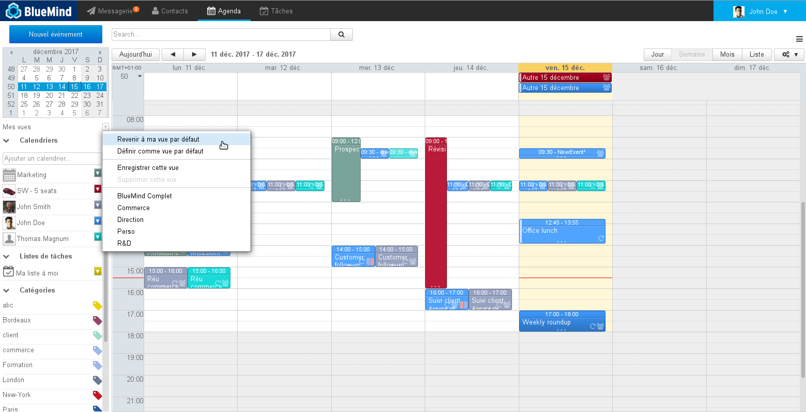
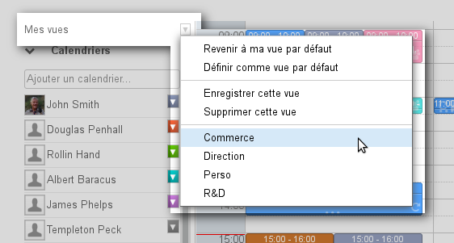
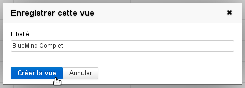
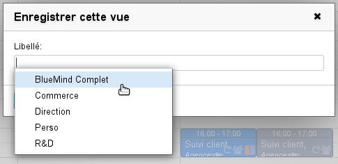
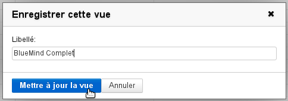
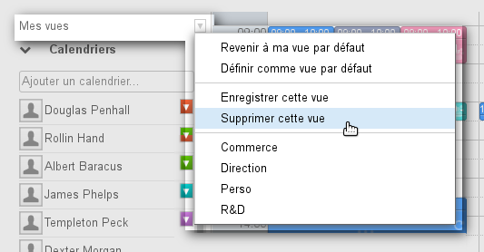

# Ansichten

## Präsentation

BlueMind ermöglicht es Ihnen, mehrere Ansichten zu speichern, um die angezeigten Kalendergruppen individuell anzupassen.

:::tip

Ausführlichere Informationen zur Anzeige von Kalendern finden Sie auf der Seite [Gemeinsame Nutzung von Kalendern - §3 Multi-Kalender-Anzeige](/Guide_de_l_utilisateur/L_agenda/Le_partage_d_agenda/)

:::

## Zugriff

Um zu speichern, zu löschen oder zur Standardansicht zurückzukehren, klicken Sie auf den Pfeil „Meine Ansichten“ in der Seitenleiste und wählen Sie die gewünschte Ansicht aus:

## Eine Ansicht erstellen

So erstellen Sie eine neue Ansicht:

- der aktuellen Ansicht die gewünschten Kalender hinzufügen
- wählen Sie im Menü „Meine Ansichten“ die Option „Diese Ansicht speichern“:
- benennen Sie diese Ansicht, indem Sie das Feld „Bezeichnung“ des Popup-Fensters ausfüllen:
- bestätigen Sie, indem Sie auf „Sicht erstellen“ klicken

## Ändern einer Ansicht

Zum Ändern einer Ansicht:

- der aktuellen Ansicht die gewünschten Kalender hinzufügen
- wählen Sie im Menü „Meine Ansicht“ die Option „Diese Ansicht speichern“
- geben Sie im Feld „Bezeichnung“ den Namen der zu ändernden Ansicht ein oder wählen Sie ihn in der Dropdown-Liste aus:

:::tip

Die Liste der vorhandenen Ansichten erscheint durch Klicken auf das Feld oder durch Autovervollständigung während der Eingabe

:::

- Die Quittiertaste ändert nun die Bezeichnung und schlägt „Ansicht aktualisieren“ vor. Um die neue Ansicht zu speichern, klicken:

## Löschen einer Ansicht

So löschen Sie eine Ansicht aus der Liste:

- Ansicht anzeigen
- Klicken Sie im Menü „Meine Ansicht“ auf „Diese Ansicht löschen“:
- Löschanfrage bestätigen

## Standardansicht

Die Standardansicht definiert die Ansicht, die angezeigt wird, wenn sich der Benutzer anmeldet. Diese Ansicht kann nicht gelöscht, aber jederzeit geändert werden. Sie wird über die ersten 2 Menüeinträge gesteuert:

- **Zu meiner Standardansicht zurückkehren**: ermöglicht jederzeit die Anzeige der Standardansicht
- **Als Standardansicht festlegen**: Die aktuelle Ansicht wird zur Standardansicht.

:::tip

Standardansicht zurücksetzen

Um die Standardansicht eines Benutzers zurückzusetzen, zeigen Sie den Kalender des Benutzers an und klicken Sie auf „Als Standardansicht festlegen“.

:::

