# Kalender

## Präsentation

BlueMind umfasst einen kompletten freigegebenen Kalender mit zahlreichen Funktionen wie z. B.:

- Tages-, Wochen-, Monats- und Listenansicht
- Multikalender-, Mehrbenutzer-, Gruppenansicht
- Ressourcen-Kalender
- Ansichtenverwaltung vom Typ Lesezeichen
- Suche nach freien Zeitfenstern
- Volltextsuche
- Verwaltung von Berechtigungen und Delegierungen
- Synchronisierung mit Outlook
- Integration in Thunderbird
- Verwaltung auf Smartphones und Tablets (iPhone, iPad, Android, Blackberry)
- Synchronisierung externer Kalender
- Externe Kalenderfreigabe
- Druckfunktion für Kalender
- Verwaltung von Wiederholungen, Ausnahmen, privaten Terminen usw.

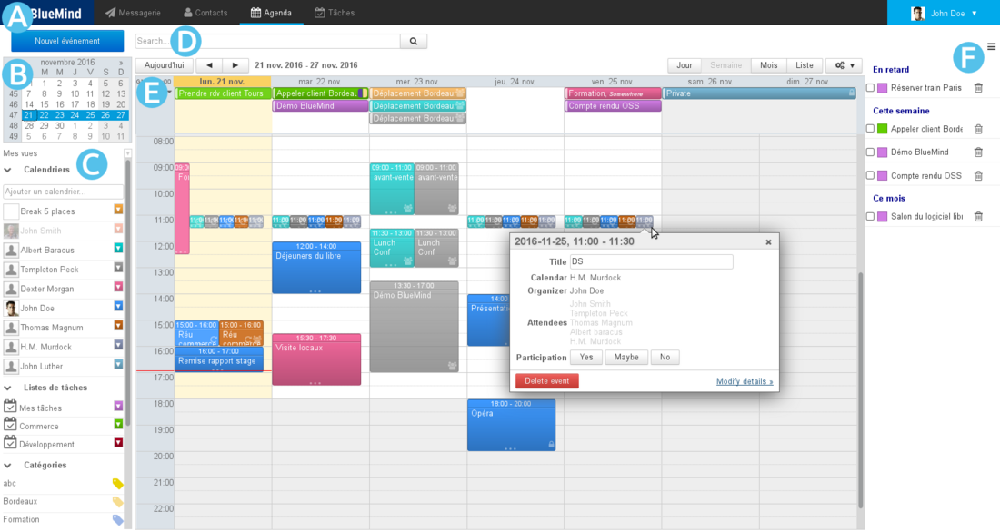

## Anzeige und Navigation

Die standardmäßige Hauptansicht des BlueMind-Kalenders besteht aus mehreren Teilen:

-  : Die Taskleiste gestattet den Wechsel zwischen den verschiedenen Anwendungen.
-  : Der Kalender gestattet, ein bestimmtes Datum zu suchen und aufzurufen, indem Sie die Monate mit den Pfeiltasten abrollen und auf das gewünschte Datum klicken. Im Hauptbereich wird der Zeitraum angezeigt, der das ausgewählte Datum enthält (Tag, Woche, Monat, je nach aktueller Einstellung).
-  : Dieser Bereich zeigt Liste der aktuell angezeigten Kalender und bietet Zugriff auf Ansichten und Kategorien.
-  : Die Suchmaschine gestattet, Termine nach Name, Kategorien, Details, Teilnehmer usw. zu suchen.
-  : Dieser Bereich ist diese Hauptanzeige des Kalenders des Benutzers sowie der von ihm abonnierten Kalender und/oder weiterer Kalender seiner Wahl (Benutzer, Ressourcen).
    - Mit den Schaltflächen oben links im Hauptbereich können Sie zu dem Zeitraum mit dem aktuellen Datum zurückkehren und zu davor oder danach liegenden Daten navigieren.
    - Die Schaltflächen oben rechts gestatten die Auswahl des Zeitraums und der Art der Darstellung: Tag, Woche, Monat, Liste (letztere zeigt nur die Liste der Termine an) und den Zugriff auf die Funktionen**Als PDF drucken** und **ICS-Datei importieren/Als ICS-Datei exportieren**. Das Toolmenü gestattet auch die Aktualisierung der aktuellen Ansicht: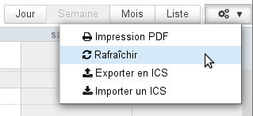
-  : Das Anzeigefeld der Aufgaben kann mit der Schaltfläche ||| oben rechts ein- oder ausgeblendet werden.

Die Symbole auf den Terminen gestatten, die Eigenschaften des Termins auf einen Blick zu erfassen:

-  Es gibt mehrere Teilnehmer.
-  Der Termin ist privat.
-  Der Terminist wiederkehrend.

## Verwaltung von Besprechungen

**In der Version 4.2** wurden das Modell und die Schnittstellen weiter verbessert. BlueMind hat das Risiko von Fehlern und Übereinstimmungsproblemen zwischen den Mitarbeitern mit der Klärung der Bezeichnungen und Benachrichtigungsoptionen beseitigt. Die Verwaltung von wiederkehrenden Terminen wurde ebenfalls erweitert: Die Wahl des Typs der Änderung an einer Serie (Änderung eines Termins, der gesamten Serie oder der nächsten Termine der Serie) wurde für alle in der Kalenderansicht ausgeführten Aktionen verallgemeinert:

### Personalisierte Verwaltung

Jeder Teilnehmer sieht in seinem Kalender eine eigene Version der gleichen Besprechung. So kann er eigene Änderungen vornehmen (Ort, Kategorie, Notiz usw.) oder eine **differenzierte Teilnahme** an einzelnen Besprechungen einer Serie von Besprechungen angeben: Er kann z. B. die gesamte Serie akzeptieren, aber angeben, dass er an einer oder mehreren Besprechungen nicht teilnehmen wird.

### Organisation und Teilnahme

:::info

Um eine Besprechung so gut wie möglich verwalten zu können, ist **der Organisator künftig obligatorisch Teilnehmer der Termine und Besprechungen, die von ihm organisiert werden**.

Um eine Besprechung oder ein Termin zu delegieren, d. h. um es direkt in einem Kalender (Benutzer-, Ressourcen- oder freigegebenen Kalender) zu erstellen, muss der Ersteller der Besprechung

1. über die **Schreibberechtigung** ("kann aktualisieren") für den gewünschten Kalender verfügen,
2. **ihn in seiner Ansicht anzeigen,**
3. **den Benutzer dieses Kalenders als Organisator angeben.**

:::

Wenn also John Doe einen Termin in John Smiths Kalender erstellen möchte, sind folgende Schritte erforderlich:

- Der Benutzer Smith erteilt dem Benutzer Doe die Berechtigung "Kann meine Termine aktualisieren".
- Doe zeigt in seiner Ansicht den Kalender von Smith an.
- Doe erstellt einen Termin, indem er Smith auswählt:
    - in der Dropdown-Liste "Kalender" für eine schnelle Erstellung: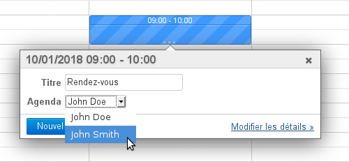 Hinweis: Die Farbe des Termins wird geändert und erhält die Farbe der Termine von J. Smith.
    - in der Auswahlliste "Organisateur" (Organisator) für das vollständige Formular: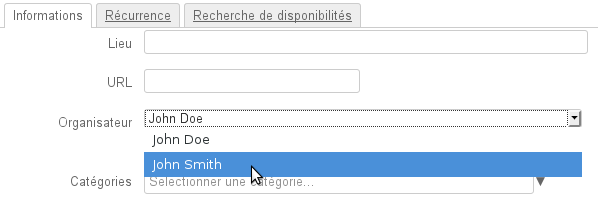

### Einladungen und Benachrichtigungen

#### Senden von Benachrichtigungen

Da Informationen per E-Mail verschickt werden, muss eine Benachrichtigung gesendet werden, damit der Organisator den Teilnehmern eine Information übermitteln kann oder damit die Teilnehmer dem Organisator antworten oder ihn über eine Statusänderung informieren können.

**Ab BlueMind 4.2** sind die Oberflächen übersichtlicher und einfacher gestaltet, um das Risiko von Verwechslungen oder Übereinstimmungsproblemen zwischen den Kalendern der Organisatoren und der Teilnehmer auszuschließen. Die Organisatoren verfügen jetzt über eindeutige Schaltflächen, um zwischen dem Senden und dem Speichern eines Entwurfs zu entscheiden. Sie können außerdem wählen, ob beim Hinzufügen oder Entfernen eines Teilnehmers alle Teilnehmer benachrichtigt werden sollen oder nicht. **Die Teilnehmer haben ihrerseits nicht mehr die Möglichkeit, ihre Anwesenheit (oder Abwesenheit) zu erklären, ohne eine Antwort an den Organisator zu senden.**

:::tip

Änderung und Benachrichtigung

Das Hinzufügen/Löschen/Ändern von Tags und Erinnerungen wird als private Änderung betrachtet, die nicht an die Teilnehmer gesendet wird. Bei anderen Änderungen werden aktualisierte Informationen an die Teilnehmer gesendet.

:::

Weitere Informationen finden Sie im Abschnitt zu [L'agenda](/Guide_de_l_utilisateur/L_agenda/).
Wir verweisen insbesondere auf die Seiten über [Termine](/Guide_de_l_utilisateur/L_agenda/Les_événements/) und die [Organisation von Besprechungen](/Guide_de_l_utilisateur/L_agenda/Organiser_une_réunion/).

:::info

Versionen vor 4.2

Wenn **der Organisator** beim Erstellen einer Besprechung **wählt, keine Einladungen zu senden,** erhalten die Teilnehmer keine Benachrichtigung und **sehen die Besprechung nicht in ihren Kalendern**.

Außerdem werden die Benachrichtigungen über die Annahme oder Ablehnung der Teilnahme an einer Besprechung nur vom Organisator der Besprechung empfangen, der die Informationen zentralisiert.

:::info

Wenn der Teilnehmer keine Benachrichtigung an den Organisator sendet, wird nur die Version des Teilnehmers geändert: Der Organisator sieht dessen Status nicht in seinem Kalender.

:::

:::

#### Abfrage des Teilnahmestatus

Da die Informationen der Teilnehmer nur den Organisator erreichen, **sieht ein anderer Teilnehmer in seiner Version der Besprechung den Status der anderen Teilnehmer erst **zu dem Zeitpunkt, zu dem der Organisator die letzte Version gesendet hat**** (Versand der Einladung oder einer Änderung). Wenn Sie sicher sein möchten, den aktuellen Status zu sehen, müssen Sie die Version der Besprechung **im Kalender des Organisators** einsehen (vorausgesetzt der Organisator hat die Leseberechtigung für seinen Kalender erteilt):

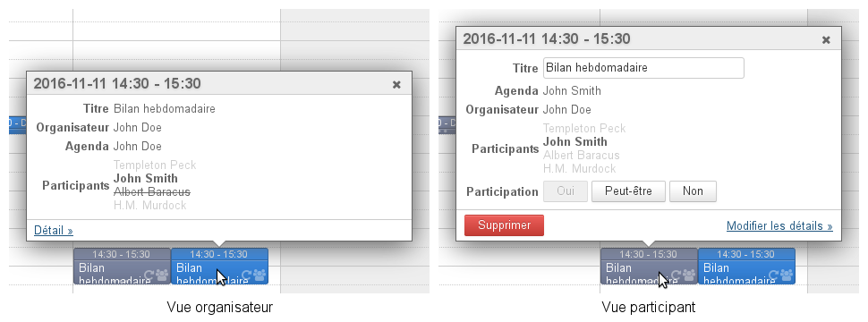

Une même réunion consultée par l'utilisateur John Smith sur l'agenda de l'organisateur et sur le sien.

### Ressourcen

Die Funktionsweise der Ressourcen entspricht der Funktionsweise der Benutzer.

Um also, wie im allgemeinen Fall, einen Termin direkt im Kalender der Ressource zu erstellen, muss der Benutzer über die Berechtigung "Kann meine Termine aktualisieren" verfügen und die Ressource als Organisator einstellen.

Wenn der Benutzer nur über eine einfache Reservierungsberechtigung verfügt, muss er ein Termin in seinem eigenen Kalender erstellen und die Ressource dazu einladen.

Darüber hinaus ermöglichen die Funktionen zur Ressourcenreservierung in einigen Fällen eine automatische Reservierung oder die Verhinderung von Doppelreservierungen. Weitere Details finden Sie auf der Seite, die den [Ressourcen](/Guide_de_l_utilisateur/Les_ressources/) gewidmet ist.

### Domain-Kalender

#### Verhalten

Domain-Kalender sind Kalender, die der Information der Benutzer dienen, z. B. zur Bekanntgabe von Feiertagen, Betriebsferientagen, kommerziellen Veranstaltungen (Messen, Präsentationen usw.) oder kommunalen Veranstaltungen (Sitzung, Ausstellung, Schulrat usw.), von Schulungen, Aktionen eines Teams usw.

 **Daher können Domain-Kalender nicht als Organisatoren von Besprechungen eingestellt oder zu Besprechungen eingeladen werden.** 

#### Bewährte Praktiken

Domain-Kalender können in 2 Fällen verwendet werden:

- Für den **Informationsplaner**, über den die Benutzer Informationen abrufen können. **Der Domain-Kalender eignet sich gut für die Verwaltung dieses Kalendertyps.** Er kann z. B. als Marketing-Kalender dienen und die Messen enthalten, an denen das Verkaufsteam teilnimmt, oder über öffentliche Versammlungen und Veranstaltungen informieren, die das Bürgermeisteramt organisiert.
- Für den **betrieblichen Terminplaner**, der zum Erstellen von Terminen für Benutzer verwendet wird. ** Um diese Funktionsweise zu ermöglichen, muss ein [Ressourcenkalender](/Guide_de_l_utilisateur/Les_ressources/) verwendet werden.** Zum Beispiel bei einem Bereitschaftsplaner: Es wird ein wöchentlicher Termin "Bereitschaft Wochenende" erstellt und jede Woche wird der betroffene Benutzer eingeladen. Dies ermöglicht eine Zentralisierung der Informationen und bietet den Benutzern die Möglichkeit, die Einladung anzunehmen, abzulehnen oder anzugeben, wann sie nicht verfügbar sind.

## Multikalender

Der BlueMind-Kalender gestattet einem Benutzer, beliebig viele persönliche Kalender zu erstellen und zu verwenden und deren [Freigabe](/Guide_de_l_utilisateur/L_agenda/Préférences_de_l_agenda/) auf die gleiche Weise zu verwalten wie seinen Standardkalender.

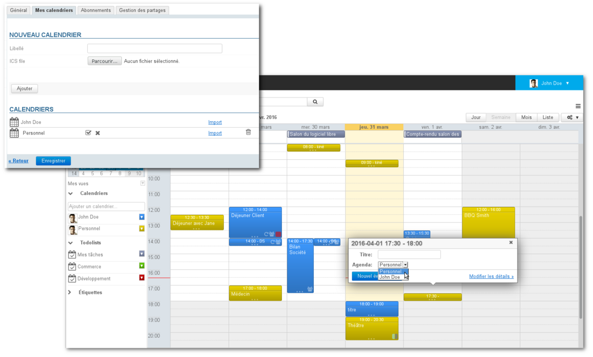

### Erstellung eines neuen Kalenders

So erstellen Sie einen neuen Kalender:

- Rufen Sie die Verwaltung der Einstellungen > Abschnitt "Kalender" > Registerkarte "Meine Kalender" auf.
- Wählen Sie im Formular "Neuer Kalender" oben auf der Seite den Kalendertyp "Standard" und geben Sie ihm einen Namen: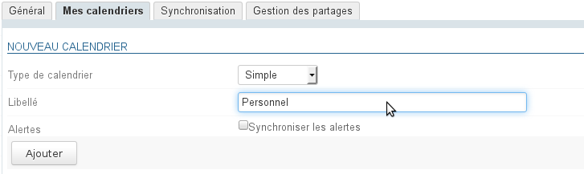
- Klicken Sie auf "Hinzufügen", der Kalender erscheint sofort in Ihrer Kalenderliste: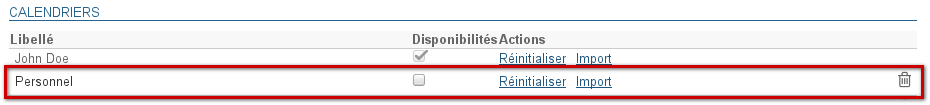

### Bearbeitung

So ändern Sie den Namen eines Kalenders:

- Rufen Sie die Verwaltung der Einstellungen > Abschnitt "Kalender" > Registerkarte "Meine Kalender" auf.
- Klicken Sie im Bereich "Kalender" auf den Namen des Kalenders, damit das Bearbeitungsfeld und die Aktionsschaltflächen angezeigt werden: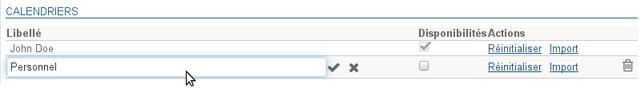
- Geben Sie den neuen Namen ein und 
    - bestätigen Sie mit der Eingabetaste oder indem Sie auf das Häkchen am Ende des Felds klicken.
    - oder annullieren Sie, indem Sie auf das Kreuz am Ende des Felds klicken.

### Löschen

So löschen Sie einen Kalender:

- Rufen Sie die Verwaltung der Einstellungen > Abschnitt "Kalender" > Registerkarte "Meine Kalender" auf.
- Klicken Sie im Bereich "Kalender" auf das Papierkorbsymbol  am Ende der Zeile.

:::info

Ihr Standardkalender kann nicht gelöscht werden.

:::

### Freigabe der Verfügbarkeit

In der Verwaltung der Kalendereinstellungen (siehe oben) kann der Benutzer in der Spalte "Freebusy" auswählen, welche(r) Kalender verwendet wird/werden, um seine Verfügbarkeit anzuzeigen, wenn andere Benutzer, die ihn zu einem Termin einladen möchten, danach suchen.

:::info

Die Freigabe der Verfügbarkeit des Standardkalenders kann nicht deaktiviert werden. Aus diesem Grund ist das Kontrollkästchen ausgegraut und kann nicht deaktiviert werden.

:::

Wenn die Kalender ausgewählt sind, füllen Sie das Formular zur Verwaltung der Freigabe aus:

- indem Sie entweder die öffentliche Freigabe aktivieren, um die Verfügbarkeiten für alle Benutzer der Domain sichtbar zu machen
- oder indem Sie die individuelle Freigabe aktivieren, um den Status nur bestimmten Benutzern oder Gruppen anzuzeigen.

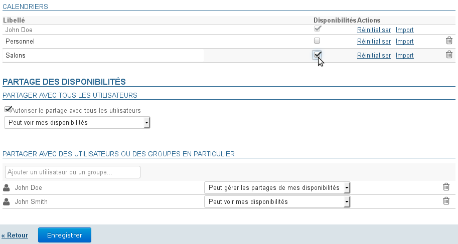

Mögliche Arten der Freigabe sind:

- Kann meine Verfügbarkeit einsehen
- Kann meine Verfügbarkeit freigeben

## Drucken

Um die aktuelle Ansicht zu drucken, öffnen Sie das Toolmenü oben rechts im Hauptanzeigebereich:

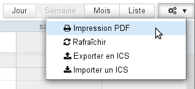

Das Dialogfeld „Als PDF drucken“ schlägt dann den Druck der aktuellen Ansicht in Kalender- oder Listenform vor, wobei die Druckoptionen eine direkte Vorschau der Auswahl erlauben:

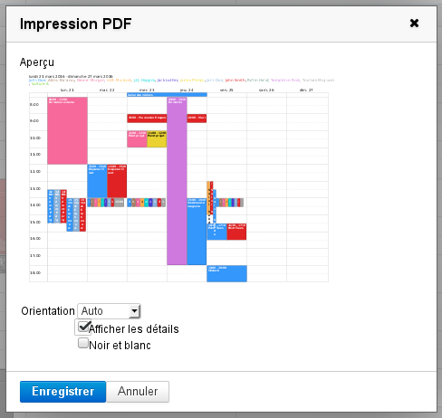

Die dargestellte Wochenansicht ergibt die folgende PDF-Datei: [calendarSemaine.pdf](../../attachments/57770444/72188584.pdf)

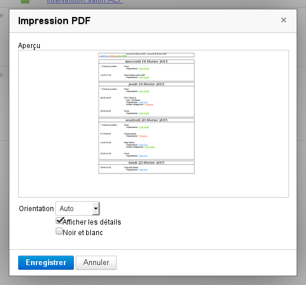

Die dargestellte Listenansicht ergibt die folgende PDF-Datei: [calendarListe.pdf](../../attachments/57770444/72188585.pdf)

Klicken Sie auf "Speichern", um die Datei herunterzuladen.

:::tip

- Die Dropdown-Liste gestattet, die Ausrichtung des Druckbilds im Hoch- oder Querformat zu forcieren. Standardmäßig ist die Ausrichtung "Automatisch" ausgewählt, die sich dem zu druckenden Inhalt anpasst.
- Das Feld "Schwarz und weiß" ermöglicht den Druck in Graustufen: Die verschiedenen Kalender werden in unterschiedlichen Graustufen gedruckt, um die Lesbarkeit zu verbessern und die Termine zu unterscheiden
- In der Ansicht "Liste" gestattet ein zusätzliches Kontrollkästchen, Termindetails in den Ausdruck aufzunehmen.

:::

## Als ICS-Datei exportieren und ICS-Datei importieren

Der Export und Import von ICS-Dateien erfolgt über das Toolmenü oben rechts im Hauptbereich:

### ICS-Export

Das Dialogfeld, das geöffnet wird, gestattet die Auswahl der zu exportierenden Termine. Wenn Sie auf "Export" klicken, wird die entsprechende ICS-Datei je nach Konfiguration der Umgebung des Benutzers zum Download oder Öffnen angeboten:

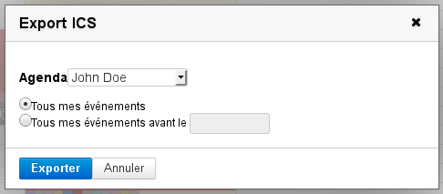

### TRP Import

Das Dialogfeld, das geöffnet wird, gestattet, eine Datei auf dem Computer zu suchen und anschließend den Kalender auszuwählen, in den die darin enthaltenen Termine importiert werden sollen. Vorgeschlagen werden alle Kalender, für die Sie die Schreibberechtigung haben:

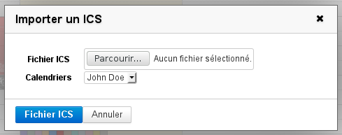

## ICS-Synchronisation

Siehe [Externe Kalender](/Guide_de_l_utilisateur/L_agenda/Les_calendriers_externes/)

