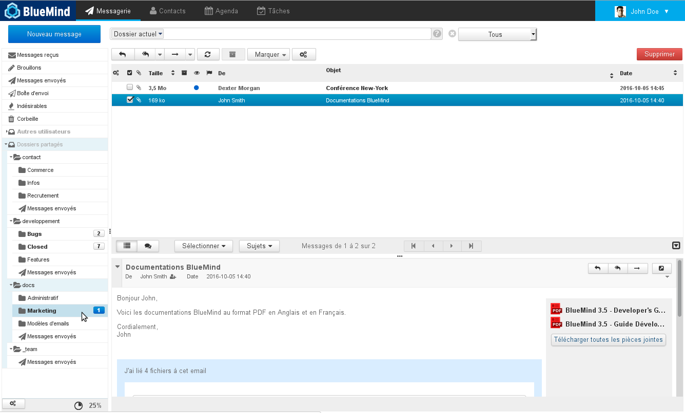
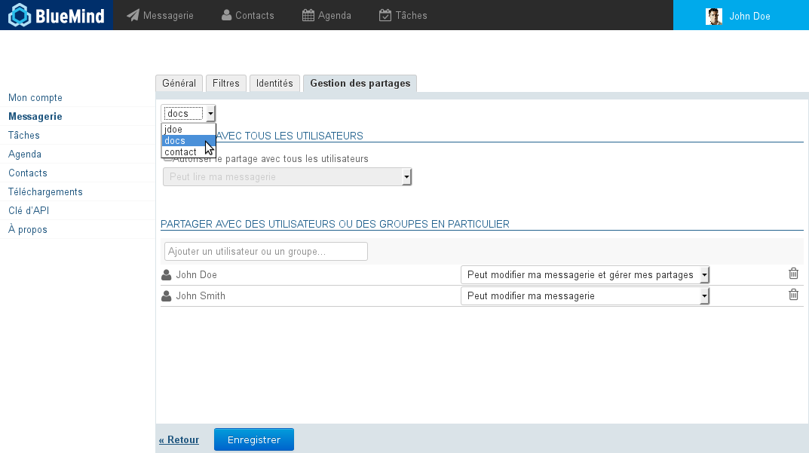
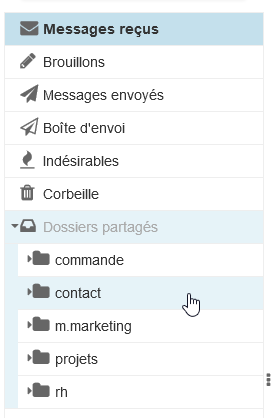
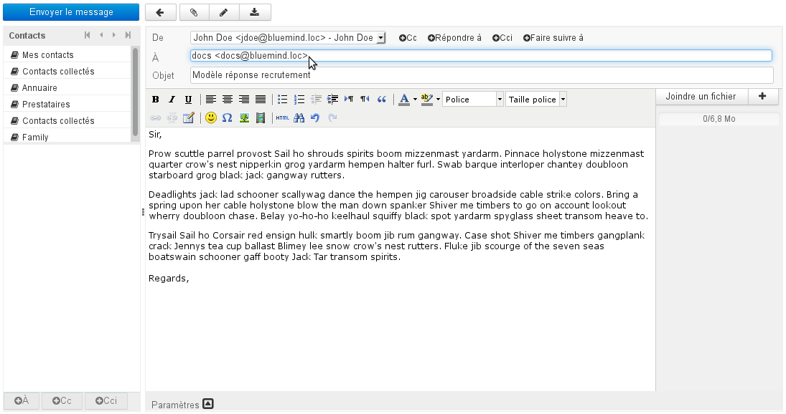
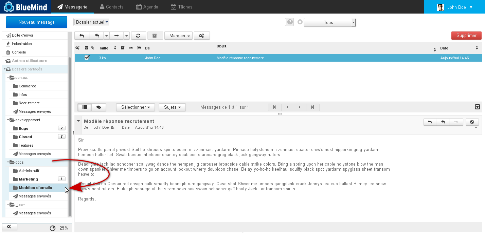
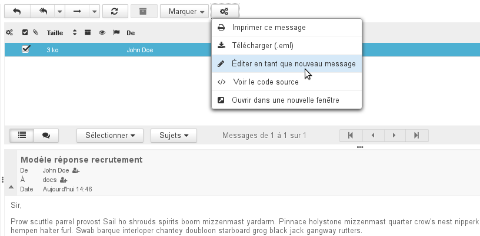
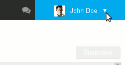
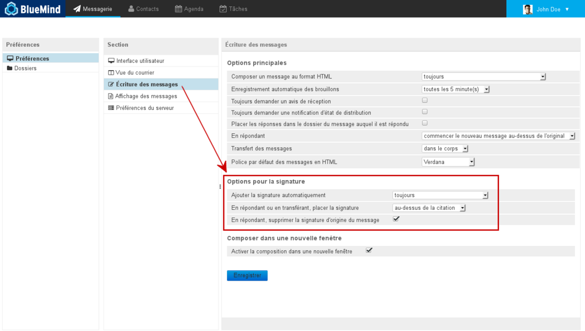
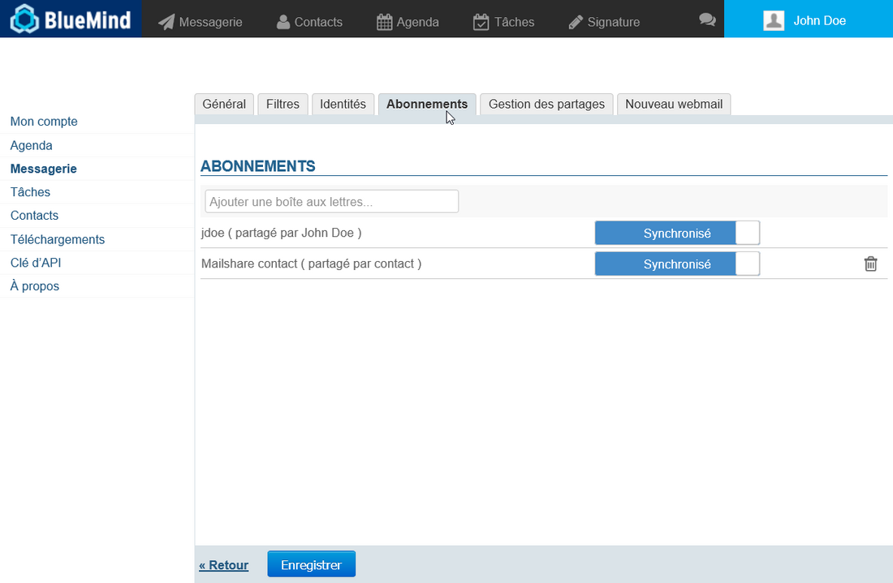
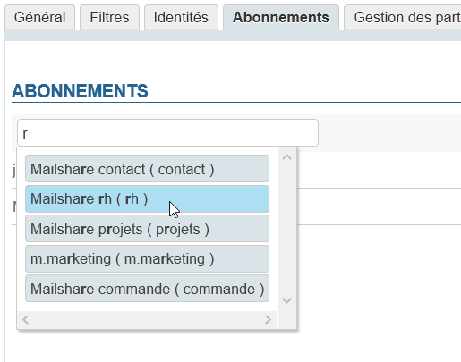

# Geteilte Posteingänge

## Präsentation

Geteilte Posteingänge sind im Gegensatz zu den Mailboxen von Benutzern nicht nominativ: Diesen Mailboxen können ein oder mehrere Benutzer zugeordnet werden.
Die Benutzer können auf die Mailbox zugreifen und sie gemäß den ihnen zugewiesenen Berechtigungen nutzen. Diese Mailboxen stehen jedem Benutzer mit Berechtigungen unter dem entsprechenden Eintrag der Baumstruktur des Mail-Clients zur Verfügung: "Dossiers partagés" (Freigegebene Ordner).

## Grundsätze

Freigegebene Mailboxen eignen sich für Teamarbeit: Alle Benutzer mit Berechtigungen für die freigegebene Mailbox können die darin gespeicherten E-Mails einsehen (und je nach ihren Berechtigungen auch weitere Aktionen durchführen).

Die Funktionsweise einer freigegebenen Mailbox bewirkt, dass sich die Leseinformationen (gelesene/ungelesen) der E-Mails auf den jeweiligen Benutzer beziehen: Jeder Benutzer erhält die für ihn zutreffenden Leseinformationen, unabhängig davon, ob die E-Mail von anderen Benutzern gelesen wurde oder nicht.

Andererseits gelten Antwort- und Weiterleitungsinformationen für alle Benutzer: Wenn einer der Benutzer auf eine E-Mail geantwortet hat, sehen alle Benutzer die Markierung "Réponse envoyée" (Antwort gesendet).

Diese Funktionsweise eignet sich gut, um für eine Zusammenarbeit einen freigegebenen Posteingang (z. B. eine Mailbox "Kontakt") zu verwalten, der z. B. die Unterordner "Bearbeitet", "Gesendete Nachrichten" oder auch "Antwortvorlagen" enthält.

## Verwaltung der Freigaben

Die Freigaben einer Mailbox können entweder vom Domain-Administrator oder von den Benutzern, an die er die Verwaltung delegiert hat, verwaltet werden.

Der Zugriff auf die Verwaltung der Freigaben für Administratoren und Benutzer ist jedoch unterschiedlich:

- Als Administrator verwenden Sie die Verwaltungskonsole > "Entrées d'Annuaires" (Verzeichniseinträge) > Auswahl der gewünschten Mailbox > Registerkarte "Gestion des partages" (Freigaben).
- Als Benutzer rufen Sie in der Verwaltung der Benutzereinstellungen > Email > Registerkarte "Freigaben" auf.

In dieser Registerkarte gehen Sie wie folgt vor:

1. Wählen Sie in der ersten Dropdown-Liste die Mailbox aus, deren Freigaben Sie verwalten möchten:

1. Vergeben Sie dann die gewünschten Berechtigungen entweder an alle Benutzer der Domain oder an bestimmte Benutzer oder Gruppen:
    - **Lesen**: Die Benutzer können die Nachrichten lesen.
    - **Ändern**: Die Benutzer können Nachrichten nicht nur lesen, sondern auch ändern (hinzufügen, löschen, verschieben usw.) sowie stellvertretend verfassen und beantworten.
    - **Verwalten**: Die Benutzer können nicht nur Nachrichten lesen und ändern, sondern auch die Freigaben der Mailbox verwalten.
2. Anschließend können Sie beliebig viele Benutzer und Gruppen hinzufügen.
3. **Klicken Sie dann auf "Speichern", damit die Änderungen berücksichtigt werden.**

 Die entsprechenden Benutzer erhalten dann per E-Mail eine Benachrichtigung, dass die Mailbox freigegeben wurde. Nach der nächsten Aktualisierung ihrer Benutzeroberfläche (möglicherweise muss hierfür die Verbindung getrennt/wiederhergestellt werden) erscheint die Mailbox dann im E-Mail-System in der Baumstruktur "Dossiers partagés" (Freigegebene Ordner):

Für detaillierte Informationen zur Funktionsweise des Formulars für die Freigabe siehe [Verwaltung der Freigaben](/Guide_de_l_utilisateur/Gestion_des_partages/).

## Verwendung einer freigegebenen Mailbox

### Versand im Namen der freigegebenen Mailbox

Damit Sie stellvertretend für eine freigegebene Mailbox, d. h. mit der Adresse der Mailbox als Absender, Nachrichten verfassen können, ist erforderlich:

- dass der Administrator oder ein Verwalter der Mailbox, Sie mindestens berechtigt, Nachrichten zu ändern,
- dass Sie für sich [eine Identität erstellen](/Guide_de_l_utilisateur/La_messagerie/Les_identités/#Lesidentites-mailshare) und diese Mailbox als Absenderadresse wählen.

:::tip

Wenn Sie möchten, dass Benutzer, die über Berechtigungen für diese Mailbox verfügen, die gesendeten Nachrichten einsehen können, vergessen Sie nicht, das dafür vorgesehene Kontrollkästchen im Fenster der Identitätsverwaltung zu aktivieren.

:::

### Anwendungsfälle

Freigegebene Mailboxen können für verschiedene Zwecke verwendet werden:

- ** **Projekte****: Eine Mailbox pro Projekt oder Abteilung, die von den verschiedenen Beteiligten gemeinsam genutzt wird, gestattet die Zentralisierung von Anfragen und Informationen auf eine vollständigere Weise als eine einfache Mailingliste oder eine Gruppe.
- ** **Kontakt****: Eine Mailbox, die den Austausch von Nachrichten für den Kontakt zwischen Geschäftsleitung und Vertriebsmitarbeitern ermöglicht, kann z. B. auch E-Mail-Vorlagen für Antworten oder für Informations- oder Angebotsanfragen teilen.
- ** **Support****: Eine Mailbox mit diesem Namen gestattet die Zentralisierung von Support-Anfragen und kann von Technikern für Interventionen und Vertriebsmitarbeitern für Analysen gemeinsam genutzt werden.
- ** **Verwaltung eingehender Anfragen****: Diese Mailbox kann so geplant werden, dass Anfragen nach Bearbeitern und Bearbeitungsstatus sortiert werden. Die Mailbox kann dann wie folgt organisiert werden: Der Posteingang nimmt Nachrichten von außen auf, ein Unterordner pro Person ermöglicht das Verschieben von Nachrichten, um die Bearbeitung der Nachricht zuzuordnen, und nach der Bearbeitung durch die betreffende Person wird die Nachricht in den Ordner "Bearbeitet" verschoben.Man könnte auch einen Unterordner pro Status anlegen. Zum Beispiel für Supportanfragen: Fehler, Informationen, Verbesserungen. Oder für die Mailboxen des Vertriebs: Angebote, Rechnungen, potenzielle Kunden usw.
- ** **E-Mail-Vorlagen****: Eine Mailbox kann den E-Mail-Vorlagen des Unternehmens gewidmet werden. Sie wird von den verschiedenen Beteiligten gemeinsam genutzt und enthält, sortiert in Unterordnern, technische Vorlagen, vertriebliche Vorlagen, einfache Vorlagen usw.

### E-Mail-Vorlage

Eine freigegebene Mailbox kann verwendet werden, um Nachrichten freizugeben, die von allen Benutzern der Mailbox als Vorlage für ihre eigenen Nachrichten verwendet werden.

Gehen Sie zunächst wie folgt vor:

- Erstellen Sie die Nachricht und senden Sie sie an die Mailbox, wenn sie eine E-Mail-Adresse hat, oder kopieren (oder verschieben) Sie sie direkt aus dem Webmailer- oder E-Mail-Client (Outlook, Thunderbird usw.) in die Mailbox:
- Die Nachricht ist in der freigegebenen Mailbox für alle Benutzer der Mailbox sichtbar und kann durch einfaches Ziehen und Ablegen in einem bestimmten Verzeichnis platziert werden, damit sie leichter gefunden wird:

- Der zweite Schritt: Wenn ein Benutzer die gespeicherte Nachricht verwenden möchte, muss er sie nur im Webmailer auswählen und dann auf "Mehr..." klicken und auf "Als neue Nachricht öffnen" klicken:

:::info

In Thunderbird ist diese Option über das Menü "Nachricht" oder direkt mit der rechten Maustaste > "Als neu bearbeiten" verfügbar.

:::
Das Fenster des Nachrichtenerstellung wird dann mit der vorausgefüllten Nachricht geöffnet: Die Adresse des Empfängers und der Inhalt entsprechen der ursprünglichen Nachricht; die Unterschrift des Benutzers wird bei Bedarf hinzugefügt.

:::tip

Die Position der Unterschrift hängt von den Benutzereinstellungen und dem verwendeten E-Mail-Client ab, sie wird nicht unbedingt am Ende der Nachricht positioniert.

Im Webmailer von BlueMind können Sie die Position der Unterschrift in den Benutzereinstellungen überprüfen/ändern, die Sie über das Symbol oben rechts auf dem Bildschirm erreichen:

Rufen Sie dann unter Email > Erweiterte Email-Einstellungen > Nachrichtenerstellung auf:

Wählen Sie folgende Einstellungen:

- Unterschrift automatisch einfügen: immer
- Beim Antworten die Unterschrift unter der Originalnachricht einfügen
- Beim Antworten Unterschrift der Originalnachricht entfernen

Um diese Optionen in Thunderbird zu ändern, rufen Sie das Menü Bearbeiten (Extras bei Windows) > Konten-Einstellungen > Abschnitt "Verfassen & Adressieren" auf.

**Achtung: Die Änderung dieser Option wirkt sich auf das Verhalten für alle Nachrichten aus.** Wenn Sie bei allen anderen Nachrichten die Unterschrift weiterhin über der Originalnachricht einfügen möchten, müssen Sie die automatisch oben eingefügte Unterschrift bei der Verwendung von Vorlagen ausschneiden und verschieben.

:::

## Abonnements und Software von Drittanbietern

Ab Version 4.3 von BlueMind ist es möglich, Abonnements für freigegebene Mailboxen so zu verwalten, dass die gewünschten Mailboxen in einem Outlook-Client, der [mit MAPI angebunden ist](/Guide_de_l_utilisateur/Configuration_des_clients_lourds/Synchronisation_avec_Outlook/), oder auf mobilen Geräten, [die per EAS verbunden](/Guide_de_l_utilisateur/Configuration_des_périphériques_mobiles/) sind, angezeigt werden.

:::info

Die Abonnements betreffen nur Tools von Drittanbietern, sie wirken sich nicht auf die Anzeige der Mailbox im Webmailer von BlueMind oder in einer Software von Drittanbietern aus, die über IMAP/POP synchronisiert wird.

:::

Sobald eine Mailbox freigegeben wurde und Sie die Informationsmail erhalten haben (siehe oben):

- Rufen Sie die Verwaltung der Einstellungen auf: Mein Konto > Email > Registerkarte "Abonnements":
- Tippen Sie die ersten Buchstaben des Namens der gewünschten Mailbox in das Eingabefeld oben in der Registerkarte ein. Die automatische Vervollständigung schlägt die Mailboxen vor, die der Eingabe entsprechen und für Sie freigegeben wurden:
- Wählen Sie die gewünschte Mailbox aus, um sie der Liste hinzuzufügen. Die Mailbox wird standardmäßig mit aktiver Synchronisierung hinzugefügt:

:::info

- **Synchronisierung aktiv**: Die Mailbox wird in Outlook (MAPI) und auf mobilen Geräten (EAS) sichtbar sein.
- **Synchronisierung inaktiv**: Die Mailbox wird nur in Outlook (MAPI) sichtbar sein.

:::

- **Klicken Sie auf "Speichern", damit die Abonnements berücksichtigt werden.**

:::info

Ein Abonnement kann jederzeit durch den Benutzer geändert (Aktivierung/Deaktivierung der Synchronisierung) oder gelöscht werden (klicken Sie auf das Symbol ).

:::

