# Konfiguration Instant-Messaging-Clients

## Präsentation

Die Verwendung des XMPP-Protokolls ermöglicht es Anwendern, ihre dedizierte Software mit dem Instant Messaging von BlueMind zu verbinden und so mit anderen Benutzern zu chatten, unabhängig davon, ob diese das integrierte Instant Messaging oder eine andere Software verwenden.

##  Thunderbird

1. Das Thunderbird-Menü aufrufen > Tools > Instant Messaging Status > Konten anzeigen...

2. Öffnen des Assistenten zur Kontoerstellung:
    - Wenn kein Konto vorhanden ist, öffnet sich der Assistent automatisch
    - Wenn bereits mindestens ein Konto existiert, unten links im Fenster der Kontoverwaltung auf „Neues Konto“ klicken
3. „XMPP“ wählen und auf „Weiter“ klicken
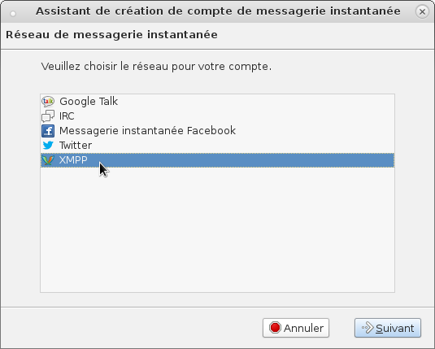

4. Als Benutzernamen die vollständige E-Mail-Adresse (einschließlich des Domänennamens) eingeben
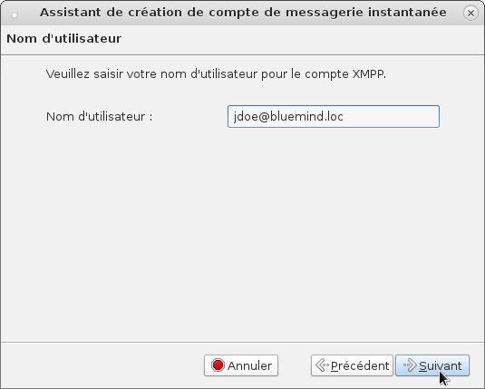

5. Das E-Mail-Passwort eingeben
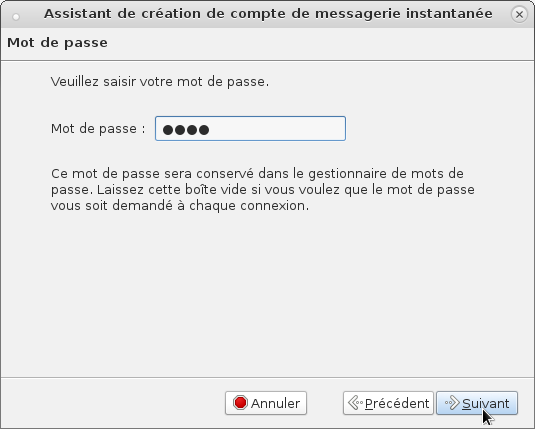

6. Der als nächstes angeforderte lokale Alias ist optional und nur für Sie sichtbar.
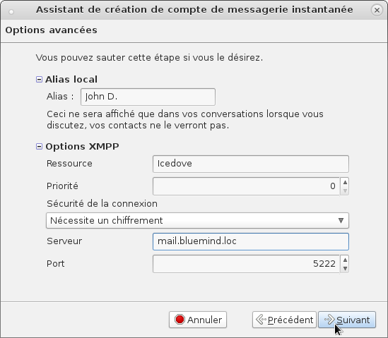
XMPP-Optionen:

    - Ressource > optional
    - Priorität > optional
    - Verbindungssicherheit > Erfordert Verschlüsselung
    - Server > die Adresse ist die gleiche wie die BlueMind-Adresse
    - Port > 5222
7. Übersichtsbildschirm > deaktivieren Sie das Häkchen bei „Jetzt in diesem Konto anmelden“, sonst wird das Fenster zur Zertifikatsannahme bei der ersten Anmeldung von Thunderbird nicht angeboten.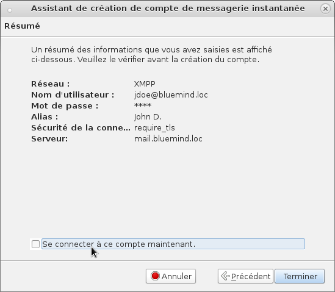

## Pidgin

1. Gehen Sie in das Menü Konten > „Konten verwalten“ und klicken Sie auf die Schaltfläche „Hinzufügen...“
2. Auf der Registerkarte „Wichtig“ die Anmeldeinformationen eingeben: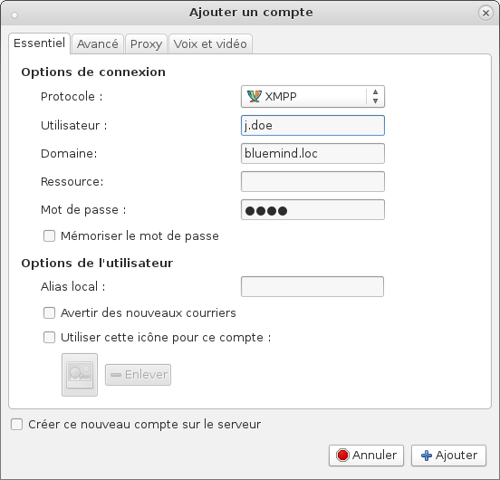
    - Protokoll: XMPP
    - Benutzer: nur Benutzername
    - Domäne: Domäne des BlueMind-Servers
    - Ressource: optional
    - Passwort: Benutzer-Passwort
Hinweis: Die „Benutzeroptionen“ sind optional und ermöglichen die Festlegung eines Avatars und eines Anzeigenamens, die für die Korrespondenten nicht sichtbar sind.3. Auf der Registerkarte „Erweitert“ sind Informationen einzugeben über: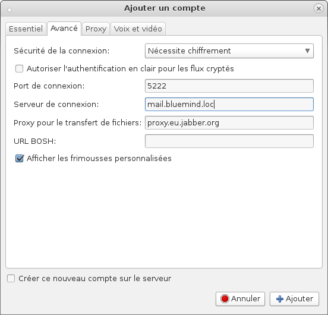
    - Verbindungssicherheit: „Erfordert Verschlüsselung“
    - Anschlussport: 5222
    - Verbindungsserver: vollständige Adresse des BlueMind-Servers, generell identisch mit der Adresse der Webanwendung

## Gajim

1. Öffnen des Assistenten zur Kontoerstellung:
    - Beim Start von Gajim wird, wenn kein Konto vorhanden ist, automatisch das Erstellungsfenster vorgeschlagen
    - Ansonsten gehen Sie in das Menü Bearbeiten > Konten > klicken Sie auf „Hinzufügen“
2. Wählen Sie „Ich habe bereits ein Konto, das ich verwenden möchte“ und klicken Sie auf „Weiter“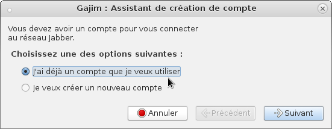
3. Die Anmeldeinformationen des Benutzers eingeben und auf „Weiter“ klicken: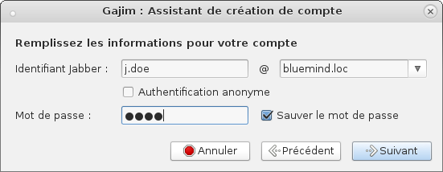
    - Jabber-ID: erster und zweiter Teil der E-Mail-Adresse des Benutzers
    - Passwort: identisch mit dem E-Mail-Passwort
4. Wenn das Konto erstellt ist, klicken Sie auf „Erweitert“: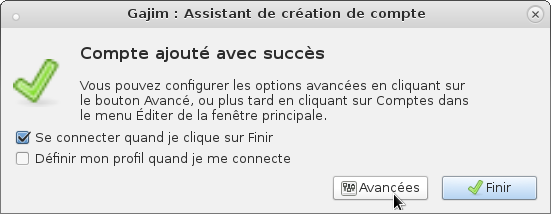
5. In die Registerkarte „Verbindung“ gehen und „Benutzerdefinierten Host-/Portnamen verwenden“ aktivieren, um die Serverinformationen einzugeben: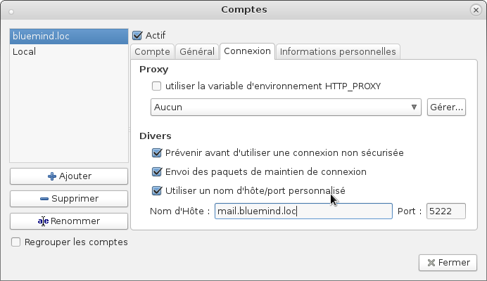
    - Hostname: vollständige Adresse des BlueMind-Servers, generell identisch mit der Adresse der Webanwendung

    - Port: 5222
6. Klicken Sie auf „Schließen“, um zur Gajim Hauptschnittstelle zurückzukehren
7. Bei der ersten Anmeldung (z. B. beim Wechsel in den Status „Verfügbar“) wird eine Warnung bezüglich des Sicherheitszertifikats angezeigt. Validieren Sie das Hinzufügen des Zertifikats, um eine Verbindung herstellen zu können: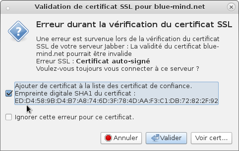

