# Die Kategorien (Tags)

## Präsentation

Mit Kategorien können Sie Kontakten und Kalenderterminen ein oder mehrere Schlüsselwörter (oder *Tags*) zuweisen, wobei diese Kategorien für beide Anwendungen gleich sind.

 

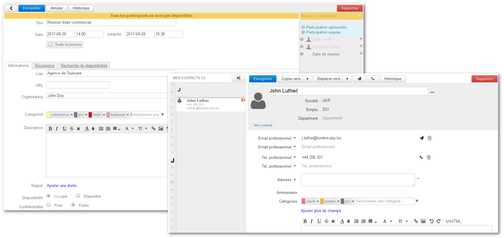

## Zuordnung der Kategorien

Bei Kalendertermin befindet sich das Feld auf der**Registerkarte „Informationen“ des** Formulars „Erstellen“:

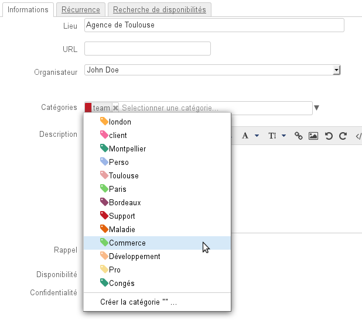

:::tip

Hinweis: Die folgenden Screenshots beziehen sich auf die Kontakte, die Bedienung im Kalender ist identisch

:::

Daten können auf mehrere Arten eingegeben werden:

- Bei bereits vorhandenen Kategorien können Sie diese **über ein Dropdown-Menü** einsehen und auswählen, klicken Sie dazu auf den Pfeil am Ende des Eingabefeldes: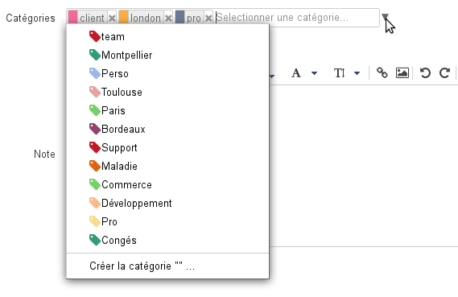
- **Mit der Tastatur** das gewünschte Wort eingeben:
    - Gibt es die Kategorie nicht, mit Eingabetaste bestätigen oder auf „Kategorie erstellen“ klicken: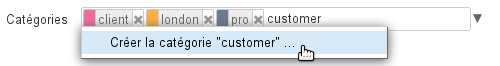
    - Existieren die Kategorien bereits, schlägt die Autovervollständigung beim Tippen die entsprechenden Wörter vor: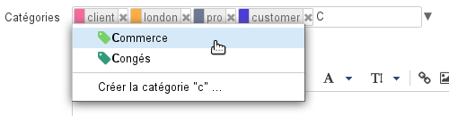

Nach der Auswahl wird die Kategorie mit der zugehörigen Farbe und einem Kreuz angezeigt, mit dem sie gelöscht werden kann. Wenn die Kategorie bereits existiert, behält sie ihre Farbe überall, wo sie verwendet wird, andernfalls wird ihr automatisch eine andere Farbe zugewiesen:

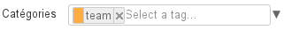

Beliebig viele Kategorien können eingegeben werden:

:::tip

Zum Löschen einer Kategorie auf das entsprechende Kreuz klicken oder die Backspace-Taste (*backspace*) verwenden.

:::

Die Kategorien werden in der Kontaktliste durch farbige Symbole (höchstens 2) angezeigt. Beim Mouse-Over wird die komplette Liste der dem Kontakt zugeordneten Kategorien angezeigt:

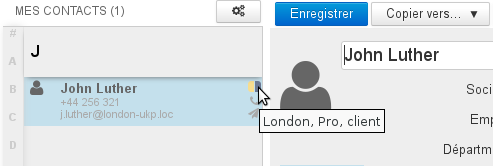

Ähnlich werden farbige Symbole bei Terminen mit Kategorien im Kalender angezeigt:

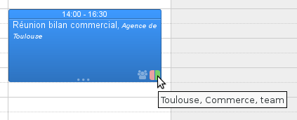

## Verwaltung der Kategorien

:::info

Domänenkategorien werden auf die gleiche Weise vom Administrator in der Administrationskonsole > Systemverwaltung > Überwachte Domänen > Domäne > Registerkarte „Kategorien“ verwaltet - siehe Administratorhandbuch - Domänen - [Kapitel 7: Kategorien](/Guide_de_l_administrateur/Présentation_du_produit/Messagerie_multi_domaines/)

:::

Die Verwaltung der Kategorien erfolgt in der Verwaltungsschnittstelle der Benutzereinstellungen > Rubrik „Mein Konto“ > Registerkarte „Kategorien“

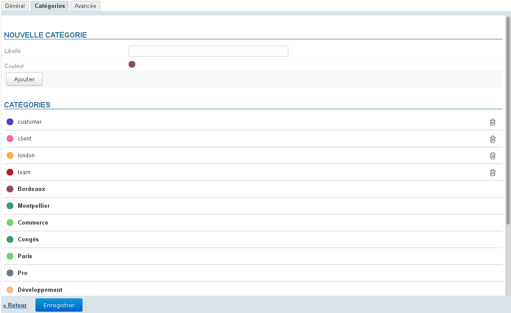

:::info

Gemeinsame Kategorien, die vom Domänenadministrator erstellt wurden, sind nicht veränderbar, sie werden fett gedruckt und es ist keine Betätigungsschaltfläche verfügbar.

:::

### Erstellen einer neuen Kategorie:

- Die Bezeichnung eingeben
- eine Farbe wählen (standardmäßig wird eine verfügbare Farbe vorgeschlagen)
- auf Hinzufügen klicken

### Bearbeiten einer Kategorie:

- beim Überfahren mit der Maus erscheint anstelle der Bezeichnung ein Eingabefeld: 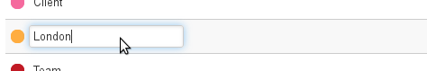 
    - zum Ändern der Bezeichnung in das Eingabefeld klicken, um es zu aktivieren und die neue Bezeichnung einzugeben
    - um die Farbe zu ändern, klicken Sie auf das entsprechende Pad und wählen Sie unter den vorgeschlagenen Farben eine neue aus: 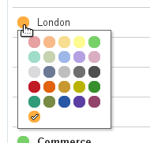
-  **Wurden die Änderungen vorgenommen, das ** **Feld zur Validierung verlassen: in der Tastatur über die Tabulatortaste, mit der Maus durch Anklicken an 
anderer Stelle auf der Seite** 
Hinweis: Die Änderung ist sofort wirksam, es ist nicht nötig, auf die Schaltfläche „Speichern“ unten auf der Seite zu klicken.

### Löschen einer Kategorie

Zum Löschen einer Kategorie auf das Papierkorbsymbol  am Ende der entsprechenden Zeile klicken und zur Bestätigung auf OK.

:::info

Nach der Bestätigung wird die Löschung sofort und unwiderruflich durchgeführt

:::

## Suche

### Suche nach Kontakten

Die Suche in der Anwendung „Kontakte“ erfolgt in allen Feldern, einschließlich den Kategorien. Zur Suche in den Kontakten geben Sie in das Suchfeld oben auf der Seite die gesuchte Kategorie ein und bestätigen Sie mit der Eingabetaste oder durch Klicken auf die Schaltfläche „Suchen“:

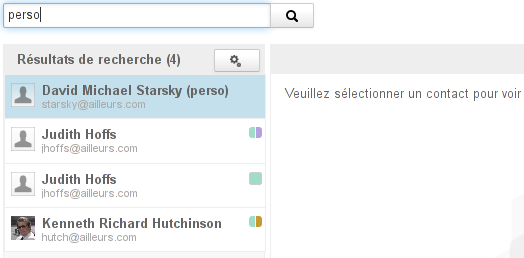

### Suche nach Kalendererterminen

Um im Kalender zu suchen, geben Sie in das Suchfeld oben auf der Seite die gesuchte Kategorie ein und bestätigen dann mit der Eingabetaste oder durch Klicken auf die Schaltfläche „Suchen“:

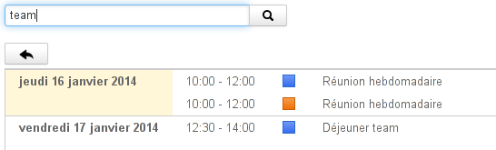

In der Hauptansicht des Kalenders können Sie in der Kategorienliste die Termine und Aufgaben, die diesen Kategorien entsprechen, ein- oder ausblenden:

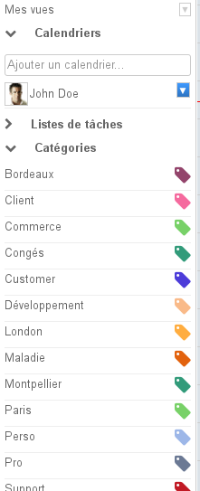

Standardmäßig werden alle Benutzer- und Domänenkategorien angezeigt:

- klicken Sie auf eine Kategorie, um die betreffenden Termine anzuzeigen, die anderen erscheinen dann ausgegraut in der Liste und die Termine, die nicht zu dieser Kategorie gehören, werden ausgeblendet.
- mehrere Kategorien können gleichzeitig ausgewählt werden: Termine mit einer **beliebigen** Kategorie erscheinen in der Ansicht
- erneut auf eine Kategorie klicken, um sie zu deaktivieren
- wenn alle Kategorien abgewählt werden, wird die Ansicht zurückgesetzt: alle Termine werden angezeigt und alle Kategorien erscheinen wieder in schwarz

Speichern

