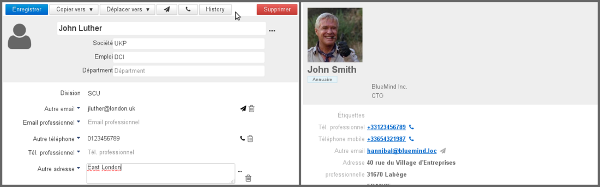
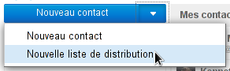
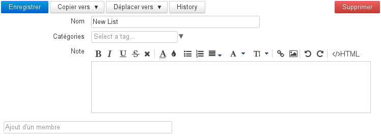
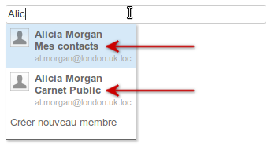
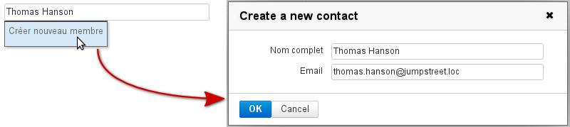
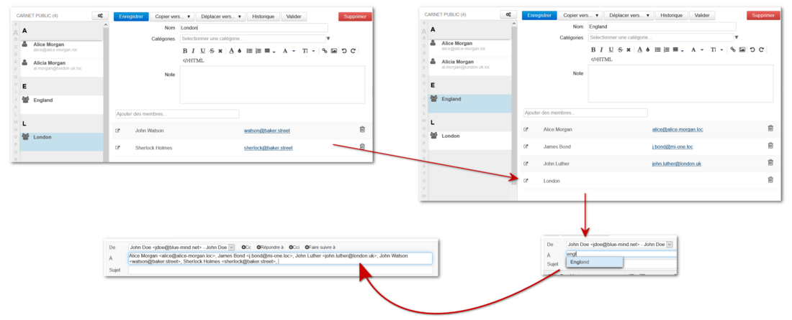
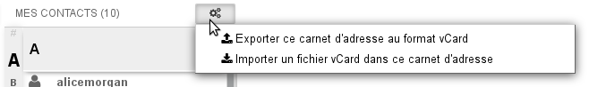

# Kontakte

## Präsentation

Die Verwaltung der Kontakte von BlueMind gestattet die Erstellung mehrerer Adressbücher, die Freigabe von Kontakten zwischen Gruppen oder Benutzern und den Zugriff auf ein Unternehmensadressbuch.

Die Adressbücher können mit Fat Clients (Outlook, Thunderbird) und Smartphones (IPhone, Android usw. entsprechend den Möglichkeiten der Geräte) synchronisiert werden.

BlueMind konfiguriert standardmäßig 3 Adressbücher:

- Ein persönliches Adressbuch "Meine Kontakte"

- Das Verzeichnis, ein globales Adressbuch mit allen öffentlichen Benutzern des Systems
- Ein weiteres persönliches Adressbuch "Gesammelte Kontakte", in das automatisch die Empfänger von Nachrichten des Benutzers aufgenommen werden, die nicht im Verzeichnis enthalten sind

Sie können eine unbegrenzte Anzahl weiterer Adressbücher anlegen und freigeben und hierfür präzise angeben, für welche Benutzer oder Gruppen sie mit Lese- oder Schreibberechtigungen freigeben werden.

## Schnittstelle

-  : In der ersten Spalte, unterhalb der Schaltfläche "Neuer Kontakt", befindet sich die Liste der Adressbücher, auf die der Benutzer zugreifen kann: seine Standardadressbücher, seine persönlichen Adressbücher, Adressbücher, die mit ihm geteilt wurden und die er abonniert hat.
-  : In der zweiten Spalte wird die Liste der Kontakte angezeigt, die in dem in der ersten Spalte ausgewählten Adressbuch enthalten sind.

:::tip

Das Alphabet, das links in der Spalte senkrecht angezeigt wird, ermöglicht eine schnellere Navigation durch die Kontakte; Buchstaben, für die Kontakte vorhanden sind, werden zur besseren Sichtbarkeit schwarz und fett hervorgehoben.

:::

-  : In der dritten Spalte, dem Hauptanzeigebereich, wird die Kontaktkarte des in der zweiten Spalte ausgewählten Kontakts angezeigt.
-  : Suchfeld

## Bearbeitung der Kontakte

Um einen Kontakt zu bearbeiten, rufen Sie seine Kontaktkarte auf, indem Sie zunächst das Adressbuch auswählen, in das er eingetragen ist, oder indem Sie das Suchfeld am oberen Rand der Seite verwenden.

Wenn Sie keine Schreibberechtigung haben, werden die Informationen nur angezeigt und die Aktionsschaltflächen fehlen. Wenn Sie berechtigt sind, die Kontaktkarte zu bearbeiten, sind die Aktionsschaltflächen vorhanden und die Eingaben in den Feldern können geändert werden:

Fiche éditable par l'utilisateur - Fiche non éditable par l'utilisateur

Mit der Schaltfläche "Felder hinzufügen" können Sie den standardmäßig vorgeschlagenen Informationen weitere Informationen hinzufügen: Geburtstag, Assistent, Instant-Messaging-Adresse usw.

## Hinzufügen von Kategorien zu einem Kontakt

Siehe [Kategorien (Tags)](/Guide_de_l_utilisateur/Les_catégories_tags_/).

## Verteilerliste

### Erstellung und Bearbeitung

Um eine Verteilerliste zu erstellen, klicken Sie auf den Pfeil der Schaltfläche "Neuer Kontakt" und wählen Sie "Neue Verteilerliste":

Geben Sie auf der Bearbeitungsseite einen Namen ein und fügen Sie dann die gewünschten Mitglieder über das Feld "Kontakte hinzufügen" hinzu.

Die automatische Vervollständigung sucht in allen Adressbüchern nach entsprechenden Kontaktkarten und gibt unter dem gefundenen Namen das Adressbuch an, aus dem dieser Kontakt stammt:

Unabhängig davon, ob der Name gefunden wird oder nicht, bietet das Dropdown-Menü die Option "Neuen Kontakt erstellen" an, die Zugriff auf ein Formular für die schnelle Erstellung eines neuen Kontakts mit Namen und E-Mail-Adresse bietet:

Ajout d'un membre pour une liste de distribution

Der Kontakt wird im abgefragten Adressbuch erstellt und der Verteilerliste hinzugefügt.

### Integration von Listen

Eine Verteilerliste kann in eine andere Verteilerliste aufgenommen werden: Wenn Sie an die "übergeordnete" Liste schreiben möchten, werden der Nachricht alle Adressen zugeordnet, sowohl die direkt in der Liste enthaltenen als auch die aus der aufgenommenen Liste:

:::info

Sie können nur Listen aus demselben Adressbuch integrieren, Listen aus einem anderen Adressbuch (vom selben Benutzer oder aus einem freigegebenen Adressbuch – siehe unten) können nicht aufgenommen werden.

Damit sind auch aus dem Verzeichnis stammende Gruppen ausgeschlossen, die als Listen betrachtet werden, obwohl sie eine E-Mail-Adresse haben.

:::

### Freigegebene Listen und Adressbücher

Es ist möglich, Kontakte in eine Verteilerliste aufzunehmen, die aus Adressbüchern stammen, die von anderen Benutzern freigegeben wurden (mindestens mit Leseberechtigung).

Um sicherzustellen, dass diese Kontakte in einer Verteilerliste auf dem neuesten Stand sind, können Sie mit der Schaltfläche "Validieren" alle Kontakte in der Liste aktualisieren. So wird im Fall einer Änderung im Originaladressbuch durch den Eigentümer oder einen Berechtigten sichergestellt, dass der Eintrag, der Ihnen vorliegt, aktuell ist:

:::tip

Wenn der Eigentümer des Adressbuchs, aus dem die in der Liste enthaltenen Kontakte stammen, die Freigabe des Adressbuchs zurückzieht,****bleiben die Kontakte in der Liste und können verwendet werden**,** sie werden aber nicht mehr mit der Schaltfläche "Validieren" aktualisiert. Gibt der Eigentümer das Adressbuch anschließend jedoch wieder frei, dann erhält die Schaltfläche "Validieren" ihre Funktion zurück und die Aktualisierung wird bei der Reaktivierung der Berechtigung automatisch durchgeführt.

:::

## Importieren und exportieren

Um ein Adressbuch im vCard-Format zu importieren oder zu exportieren, klicken Sie auf die Aktionsschaltfläche am oberen Rand der Liste der Kontakte im betreffenden Adressbuch:

Bei einem Export werden alle Kontakte des Adressbuchs in eine einzige Datei exportiert, die sofort zum Download bereitsteht.

Bei einem Import werden alle in der Datei vorhandenen Kontakte dem Adressbuch hinzugefügt. BlueMind kann Duplikate nicht erkennen und die Kontakte werden auch dann hinzugefügt, wenn sie bereits im Adressbuch vorhanden sind.

