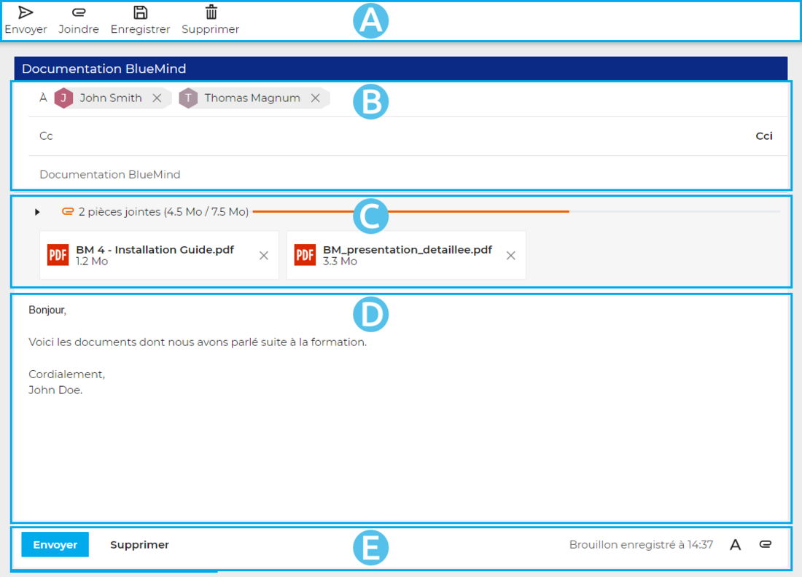
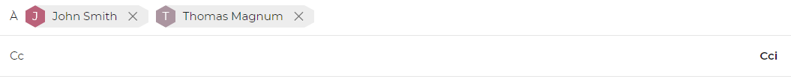
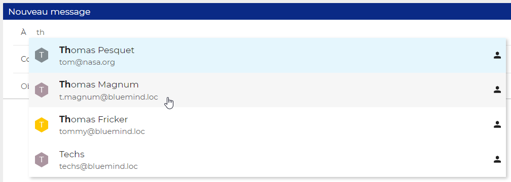
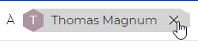

# Die BlueMind-Nachrichtenoberfläche

## Präsentation

Die BlueMind-Nachrichtenoberfläche öffnet sich auf der rechten Seite des Fensters:

-  Die Hauptsymbolleiste enthält die für die geschriebene Nachricht verfügbaren Aktionen: Senden, Datei anhängen, Entwurf speichern, Nachricht löschen
-  : Dieser Bereich zeigt die Adressfelder (An, cc, cci) sowie den Betreff der Nachricht an
-  : In diesem Bereich werden die Anhänge der Nachricht angezeigt. Dieser Bereich kann ein- und ausgeklappt werden, um die Informationsanzeige zu den angehängten Dateien zu erweitern oder zu reduzieren.
-  : Hier wird die Nachricht verfasst
-  : Neben den Speicherinformationen wiederholen sich für eine intuitive und vereinfachte Bedienung in diesem Bereich die wichtigsten Schaltflächen: Links befinden sich die Schaltflächen zum Speichern und Löschen der Nachricht, rechts der Zugriff auf das Layout und das Hinzufügen von Anhängen

## Empfänger der Nachricht

- Im Feld „**Empfänger**“ können Sie den/die Hauptempfänger der Nachricht eingeben.

- Im Feld „**CC**“ (von „Carbon Copy“ für Kopie) können Sie weitere Empfänger in Kopie setzen
- Mit der Schaltfläche **„CCi**“ (von „Carbon Copy invisible“) können Sie ein Eingabefeld für Empfänger in **verdeckter Kopie** hinzufügen.

##### Einen Empfänger hinzufügen

Nach der Eingabe der ersten Buchstaben in den Empfängerfeldern werden Ihre Adressbücher und das globale Adressbuch nach passenden Kontakten durchsucht:

Das Hinzufügen des Kontakts bestätigen:

- Auf den gewünschten Kontakt klicken
- Mit der Eingabetaste bestätigen

Ein Kontakt kann auch manuell eingegeben werden:

- Die E-Mail-Adresse in das Feld schreiben (oder kopieren/einfügen)
- Mit der Eingabetaste oder durch Eingabe eines Trennzeichens (Leerzeichen, Komma, Semikolon...) bestätigen

Der validierte Kontakt wird anschließend in einem Schriftfeld hinzugefügt:

##### Einen Empfänger löschen

Um einen Empfänger zu löschen:

- klicken Sie auf das Löschkreuz im Feld mit seinem Namen
- Mit der Tastatur löschen:
    - Die zuletzt eingegebene Adresse mit der Rücktaste („*Backspace*“) löschen
    - Mit den Pfeiltasten &lt;links> oder &lt;rechts> auswählen und dann mit einer Löschtaste („Delete" oder Backspace) löschen

## Anlagen

##### Einen Anhang hinzufügen

- Klicken Sie auf die Schaltfläche  der Symbolleiste oder das Büroklammer-Symbol  unterhalb des Eingabebereichs, um die Dateiauswahl auf Ihrem Computer zu öffnen.
- Ziehen Sie eine Datei direkt aus Ihrem Dateibrowser:

Wenn der Dialer ein Bild erkennt, schlägt er vor, das Bild in die Nachricht einzubinden:

Ziehen Sie es an die gewünschte Stelle in der Nachricht:

Bei Loslassen der Maus wird das Bild hinzugefügt:

:::tip

Die Bildbearbeitungsfunktionen (z.B. Größenänderung) sind noch in Entwicklung und in der aktuellen Beta-Version noch nicht verfügbar.

:::

##### Einen Anhang entfernen

Um einen Anhang zu entfernen, klicken Sie auf das entsprechende Kreuz im Schriftfeld der betreffenden Datei:

