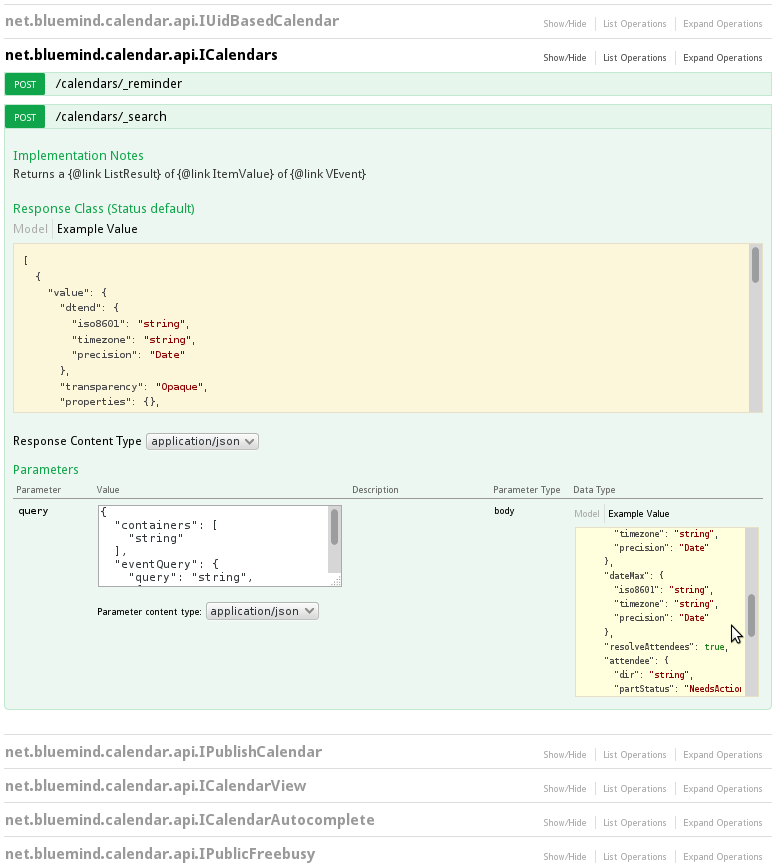

# BlueMind-API

## Präsentation

Die BlueMind-API wurde komplett überarbeitet und ist entweder direkt über HTTP-REST-Aufrufe oder über Clients (heute Java, Javascript, C#, Python und PHP) verfügbar. Das bluemind-samples Repository ist verfügbar und sammelt alles, was benötigt wird, um durch die Entwicklung eines Add-Ons zu BlueMind beizutragen. Ein Maven-Archetyp ist ebenfalls verfügbar, um die Definition eines neuen Projekts zu erleichtern.

Eine interaktive Dokumentation unserer neuen REST-API ist in das Installationsprogramm eingebettet: es handelt sich um das optionale Paket bm-docs. Nach der Installation wird die REST-API-Dokumentation für Benutzer mit dem Zugriffsrecht "Api docs" zugänglich sein. Diese Dokumentation wird auch [im Bereich BlueMind Docs](https://forge.bluemind.net/apidoc/) veröffentlicht.

  

 

 

## API-Clients

### Java-generierter Client

Siehe entsprechende Seite: [Java-Client](/Guide_du_developpeur/API_BlueMind/Client_Java/)

### Python-Client

Siehe entsprechende Seite: [Python-Client](/Guide_du_developpeur/API_BlueMind/Client_Python/)

### PHP-Client

Siehe entsprechende Seite: [PHP-Client](/Guide_du_developpeur/API_BlueMind/Client_PHP/)

## Anwendungsbeispiele

Weitere Informationen und Anwendungsbeispiele finden Sie auf den folgenden Seiten:

- [Authentifizierung](/Guide_du_developpeur/API_BlueMind/Authentification/)
- [Benutzer-API](/Guide_du_developpeur/API_BlueMind/API_d_utilisateurs/)

Speichern

Speichern

