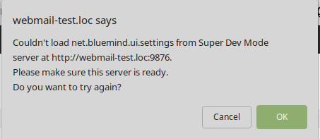
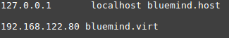

# Frontend / UI


## Präsentation


## Die verschiedenen Frontumgebungen


:::info

Voraussetzungen

VM mit Bluemind in der Version 3.5 oder höher ist einsatzbereit.

:::

### VueJS-Umgebung


:::info

Voraussetzungen

NodeJS von der [offiziellen Website](https://nodejs.org/en/download/package-manager/) installiert (Version 8 oder höher). NPM wird mit NodeJS installiert.

Yarn von der [offiziellen Website](https://yarnpkg.com/fr/docs/install) installiert (Version 1.12 oder höher).

:::

**Den Entwicklungsserver starten:**

- Gehen Sie im Plugin, das die Anwendung enthält, in den Ordner, in dem sich die Datei `package.json` befindet (normalerweise im Stammverzeichnis des Vue.js-Plugins)
- Führen Sie dann "`yarn dev`" aus (oder "`npm run dev`", wenn Sie sich nicht im bluemind-all Repository befinden): Es wird dann ein Entwicklungsserver *(live-reload enabled*) ausgeführt. Der Server wird unter [http://*:9180/](http://127.0.0.1:8080/) gestartet


**VSCode Editor (empfohlen)**
**VSCode-Konfiguration (editierbar über Datei > Voreinstellungen > Einstellungen)**

```
{
    "settings": {
        "prettier.eslintIntegration": true,
        "editor.tabSize": 4,
        "eslint.autoFixOnSave": true,
        "eslint.validate": [
            {
                "autoFix": true,
                "language": "javascript"
            },
            {
                "autoFix": true,
                "language": "vue"
            }
        ],
    },
    "extensions": {
        "recommendations": [
            "formulahendry.auto-close-tag",
            "formulahendry.auto-rename-tag",
            "msjsdiag.debugger-for-chrome",
            "dbaeumer.vscode-eslint",
            "eg2.vscode-npm-script",
            "christian-kohler.npm-intellisense",
            "esbenp.prettier-vscode",
            "dariofuzinato.vue-peek",
            "octref.vetur",
        ]
    },
}
```


:::info

- Wenn der dev Webpack-Server die Quelldateien bei einer Änderung nicht direkt neu kompiliert, liegt das wahrscheinlich an einer unzureichenden Anzahl von "inotify watchers": 
[https://github.com/guard/listen/wiki/Increasing-the-amount-of-inotify-watchers](https://github.com/guard/listen/wiki/Increasing-the-amount-of-inotify-watchers)


:::

### GWT-Umgebung


:::info

Voraussetzungen

Eclipse Oxygen oder Photon ist installiert.

:::

** 


**

**Installation:**

- Installieren Sie das "GWT Eclipse Plugin" (über Eclipse Marketplace)
- Bei der Installation des Plugins nur [GWT 2.8](http://www.gwtproject.org/download.html) aktivieren


** 


**

**Den Entwicklungsserver starten:**

- Klicken Sie mit der rechten Maustaste auf das Projekt, das das JS-Bundle bereitstellt (z.B. net.bluemind.ui.adminconsole.main für AC), dann auf "*Run As*" und schließlich "*GWT Development Mode with Jetty*"


:::info

- Wenn beim Start des Servers eine Meldung der Art *"could not find any host pages in project"* erscheint: Klicken Sie mit der rechten Maustaste auf das Projekt / Eigenschaften / GWT / Web Application und wählen Sie die Option "This directory has a WAR directory" (und konfigurieren Sie den Ordner, z.B. web-resources).
- Wenn diese Fehlermeldung erscheint: Dann gibt mehrere mögliche Gründe:
    - Im devmode kann es notwendig sein, dem dev GWT-Server eine IP-Adresse anzugeben. Sie kann in Run Configuration / Arguments durch Angabe eines Parameters "`-bindAddress 0.0.0.0`" (Beispiel) definiert werden
    - Sie haben ein Problem mit der Content Security Policy (in der Konsole nachsehen). Gehen Sie zum Abschnitt "Bei CSP-Problem" von Devmode
    - Sie haben ein Problem mit [Mixed Content Security](https://developer.mozilla.org/fr/docs/S%C3%A9curit%C3%A9/MixedContent) (in der Konsole nachsehen). Siehe Abschnitt "Im Falle eines Problems mit HTTPS" von Devmode


:::

### Environnement Closure


:::info

Voraussetzungen

- Erstellen Sie die leeren Dateien `/root/dev-unsecure-cookies und  /root/dev-no-csp` auf Ihrer VM und starten Sie den bm-hps-Dienst neu
- Kompilierung erfolgt in open/ui:


```
 mvn -Dmaven.test.skip=true clean install
```


:::

** 


**

**Den Entwicklungsserver starten:**

- Führen Sie in open/ui das Skript `plovr.sh` aus
- Auf [http://localhost:9810](http://localhost:9810) sind die verschiedenen Konfigurationen (~Anwendungen) aufgeführt, die von plovr verwaltet werden


:::info

- Bequeme Plovr-Konfigurationen (in der URL hinzuzufügen, direkt nach index.html, zum Beispiel: [https: //virt.bluemind.loc/contact/index.html?mode=RAW](https://virt2.bluemind.loc/contact/index.html?mode=RAW)) 
    - ?level=QUIET, um nur Warnungen oberhalb der Anwendung anzuzeigen,
    - ?mode=RAW ermöglicht, im nicht kompilierten Modus zu sein (alle JS im Klartext)
- Weitere Informationen über die Konfiguration und die in plovr verfügbaren Optionen: [http: //plovr.com/options.html](http://plovr.com/options.html)


:::

## Reverse Proxy konfigurieren


:::info

Konfigurieren Sie Ihre Entwicklungsumgebung so, dass die richtige (in Entwicklung befindliche) JS-Datei vom Bluemind-Webserver, der auf Ihrer VM installiert ist, aufgenommen wird.

:::

### Über das Devmode-Plugin (empfohlene Methode)

*Vorteil**: **erfordert keinen Reverse Proxy auf dem Entwicklungsrechner.*


:::info

Voraussetzungen

Das Paket [Bm-plugin-webserver-devfilter](https://jenkins2.bluemind.net/job/addons/job/devmode/) ist auf seiner VM installiert. Wenn Sie keinen Zugriff auf den Devmode haben, kompilieren Sie einfach das Paket, indem Sie in den Ordner "devmode/" gehen.

:::


**Implementierung:**

- Bei der Installation des Pakets wird automatisch eine conf-Datei erstellt `(/etc/bm/dev.json`) (nur wenn keine vorhandene conf-Datei erkannt wird)

- Fügen Sie "`IP_OF_YOUR_NET_HOST_VM dev.bluemind.test`" in `/etc/hosts` Ihres Hosts ein
- Bleiben Sie auf dem Host und starten Sie den Entwicklungsserver


**Anmerkungen*:* **

- Ändern Sie in der conf-Datei das Feld '`active`' der Filter, um sie zu aktivieren.
- Jedes Mal, wenn Sie die conf-Datei ändern, bm-webserver neu starten oder "?reload-devmode" an die URL anfügen (zum Beispiel: /cal/index.html?reload-devmode )
- Zwei besondere Filter, die zur Entwicklung in Closure immer aktiv gelassen werden: der Filter zur Deaktivierung des Appcache, der andere auf /input/
- Sie können die [Devmode-Standardkonfiguration](https://forge.bluemind.net/stash/projects/BM/repos/bluemind-all/browse/open/devmode/packaging/ROOT/usr/share/doc/bm-plugin-webserver-devfilter/dev.json) unter folgendem Link einsehen oder herunterladen


****Bei einem Problem mit HTTPS / **[Mixed Content Security](https://developer.mozilla.org/fr/docs/S%C3%A9curit%C3%A9/MixedContent)******: ****

Gibt es zwei mögliche Lösungen:

- Starten Sie den Browser im "*mode unsecure*":
    - Für Firefox setzen Sie auf der Seite "*about:config*“ den Parameter `security.mixed_content.block_active_content` auf *false*
    - Für Chrome lassen sie a priori keinen Mixed Content mehr zu (siehe [https://support.google.com/chrome/thread/25175839?hl=en](https://support.google.com/chrome/thread/25175839?hl=en) und [https://docs.adobe.com/content/help/en/target/using/experiences/vec/troubleshoot-composer/mixed-content.html](https://docs.adobe.com/content/help/en/target/using/experiences/vec/troubleshoot-composer/mixed-content.html))


- Wechseln Sie in den vollständigen HTTP-Modus:


Bluemind leitet standardmäßig von HTTP auf HTTPS um. Sie müssen also die folgende Konfiguration zu Ihrem nginx (auf Ihrer VM) hinzufügen.

In diesem Beispiel ist *bluemind.virt* die URL, die für den Zugriff auf Ihre VM verwendet wird, und *bluemind-dev.virt* ist die URL für den Zugriff per HTTP


```
server {
   listen 80;
   server\_name bluemind-dev.virt;

  location / {
    proxy\_pass https://bluemind.virt;
  }
}
```


**Im Falle eines CSP-Problems:**

Das CSP von Bluemind blockiert die Anfrage?

Führen Sie einfach einen touch /root/dev-no-csp aus und starten Sie HPS neu


**Im Falle eines Problems mit HSTS:**

- Auf der VM müssen Sie die Zeile entfernen, die den Header `add_header Strict-Transport-Security max-age=15768000;` in der nginx-Konfiguration hinzufügt: `/etc/nginx/sites-enabled/bm-client-access`
- Starten Sie dann nginx neu: `nginx -s reload`


**


**

**Debuggen:**

Wenn der Devmode nicht funktioniert, liegt es wahrscheinlich an den 2 oben genannten Problemen.

Wenn nicht, versuchen Sie die folgenden Schritte, um Ihr Problem zu erkennen:

- Ist die VM in Ordnung?
- Ist der Entwicklungsserver gestartet ?
- Host wird von der VM gepingt?
- Curl für das gesuchte JS ab der VM (Firewall-Problem?) ausführen
- Stimmen die in /etc/bm/dev.json definierten Regeln?


### Über einen Reverse Proxy


:::info

Voraussetzungen

Auf dem Entwicklungsrechner muss entweder *der*  Nginx- oder der Apache-Reverse-Proxy installiert sein .

:::

** *Anmerkungen:* **

- `bluemind.host`: URL für den Zugriff auf den BM-Server, der auf seiner VM installiert ist
- `bluemind.virt`: Verwendete URL, um das richtige JS aktiv zu haben (dasjenige, das Sie auf Ihrem Dev-Rechner modifizieren, kompilieren und im *Live-Reload* von *webpack-dev-server* geliefert wird).
- Beispiel für `/etc/hosts` (Linux):


#### Nginx

Hinweis: Die geänderte Konfiguration ist die Nginx-Konfiguration auf dem **Entwicklungsrechner**, nicht auf der VM.

Beispiel:


```
upstream core2 {
  server bluemind.virt:443;
}

server {  
  	listen 80;
  	server\_name bluemind.host;
	
	# SIGNATURE
	location /signature/js/compile/net.bluemind.ui.signature.application.js {    
		proxy\_pass http://127.0.0.1:8080/signature/js/compile/net.bluemind.ui.signature.application.js;
	}
}
```


#### Apache


```
RewriteEngine On

# SIGNATURE
RewriteRule "^/signature/js/compile/net.bluemind.ui.signature.application.js$" "http://127.0.0.1:8080/signature/js/compile/net.bluemind.ui.signature.application.js" [R]
 
```


