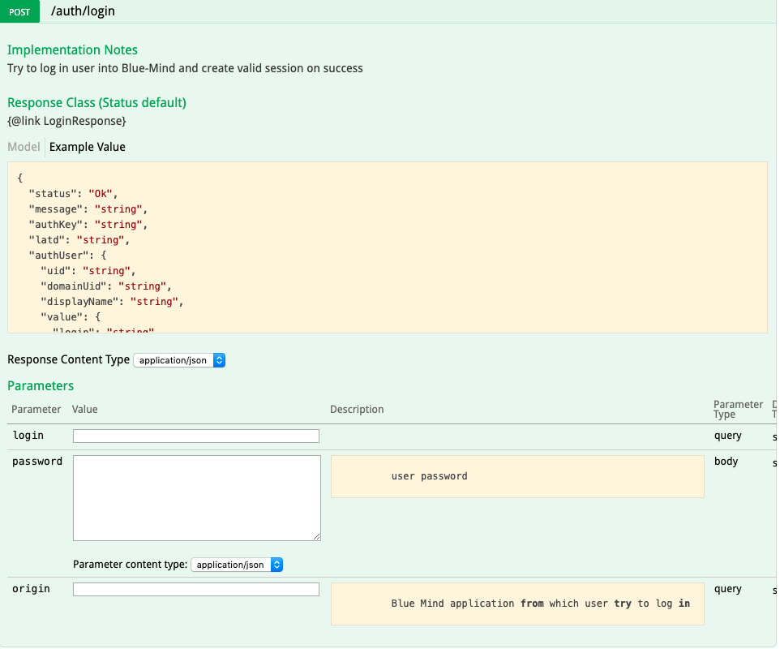

# Authentifizierung


## Präsentation

Die Authentifizierung ist der Einstiegspunkt für die Nutzung der API.

Die `Login-Methode` ermöglicht mit Hilfe eines Logins und eines Passworts das Abrufen eines Authentifizierungsschlüssels *(auth-key*). Dieser Schlüssel ist für die Dauer der Benutzersitzung gültig und verwendbar und wird zur Identifizierung des Benutzers bei nachfolgenden API-Aufrufen verwendet.

Es ist auch möglich, permanente API-Schlüssel in den [Benutzereinstellungen](/Guide_de_l_utilisateur/Paramètres_utilisateur/) zu erstellen.


## Verwendung

Bei HTTP-Aufrufen wird der Schlüssel über den Header `X-BM-ApiKey` übertragen.

Bei Java-Aufrufen wird der Schlüssel verwendet, um einen *Service-Provider* zu erstellen, der API-Instanzen erzeugt.
Beispiel:


```
IServiceProvider serviceProvider = ClientSideServiceProvider.getProvider(server, resp.authKey);
```


[https://forge.bluemind.net/staging/doc/openui-models/web-resources/?bm_version=4.1.42252#!/net.bluemind.authentication.api.IAuthentication/post_auth_login](https://forge.bluemind.net/staging/doc/openui-models/web-resources/?bm_version=4.1.42252#!/net.bluemind.authentication.api.IAuthentication/post_auth_login)



#### Beispiel in HTTP

| Methode | URL |
| --- | --- |
| POST | https://&lt;domain>/api/auth/login?login=&lt;login> |
| 


 | 
login = Benutzeridentifizierung
 |
| **Body** |
| 
Passwort
 |

#### Beispiel in Curl


```
curl -X POST -k --header 'Content-Type: application/json' --header 'Accept: application/json' -d '"<password>"' 'https://<domain>/api/auth/login?login=<login>'
```


#### Beispiel in Java (unter Verwendung des von Bluemind generierten Clients)


```
String serverUrl = "https://<domain>";
LoginResponse resp = ClientSideServiceProvider.getProvider(serverUrl, null).instance(IAuthentication.class).login(<login>, <password>, "");
IServiceProvider serviceProvider = ClientSideServiceProvider.getProvider(server, resp.authKey);

```


