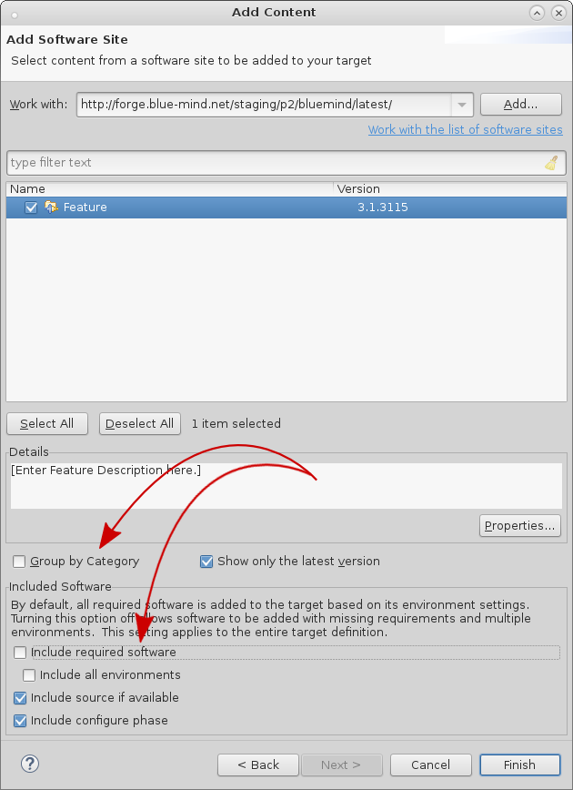
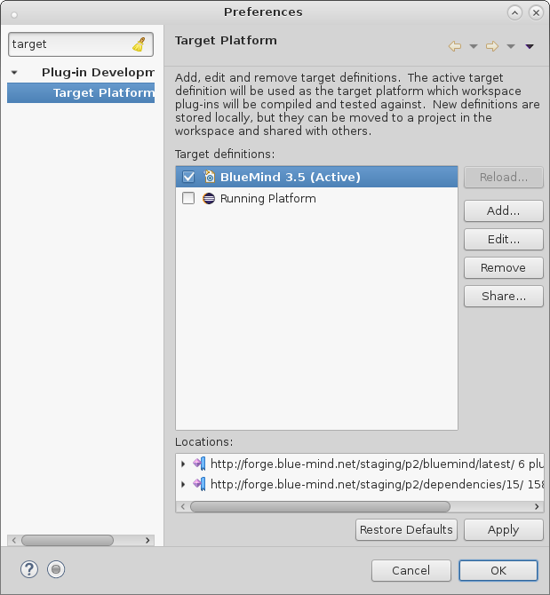

# Eclipse


## Voraussetzung

- [Maven installieren](https://maven.apache.org/)
- Die BlueMind-Quellen abrufen wie beschrieben auf der Seite [Zu BlueMind beitragen](/Guide_du_développeur/Contribuer_à_BlueMind/)


## Installation

Laden Sie die Version von [Eclipse](https://www.eclipse.org/downloads/packages/) für RCP- und RAP-Entwickler herunter und installieren Sie sie.

## Konfiguration

### Hinzufügen einer Ausführungsplattform

Die Eclipse-Laufzeitplattform muss mit BlueMind-Abhängigkeiten ergänzt werden:

1. Starten und initialisieren Sie einen Workspace mit der Version von Eclipse, die Sie für die Entwicklung verwenden möchten (z.B. mit dem zuvor installierten Eclipse Mars)
2. gehen Sie zu *Window*->*Preferences* und suchen Sie *Target*
3. klicken Sie auf *Target Platform*
4. klicken Sie auf *Add*, wählen Sie die Option *Nothing* und klicken Sie auf *Next*
5. Einen Namen angeben (z.B: BlueMind 3.5)
6. Klicken Sie auf die Schaltfläche *Add*, wählen Sie *Software Site* und klicken Sie auf *Next*
7. Geben Sie im Feld *"Work with"* [http://forge.blue-mind.net/staging/p2/bluemind/latest](http://forge.blue-mind.net/staging/p2/bluemind/latest) ein
    1. Deaktivieren Sie am unteren Rand des Fensters die Optionen *„Group by category“* und *„Include required Software“*
    2. In der aktualisierten Liste *Feature* aktivieren
8. Klicken Sie auf *Finish*
9. Klicken Sie erneut auf die Schaltfläche *Add*, wählen Sie *Software Site*und klicken Sie auf *Next*
10. Geben Sie im Feld Work with [http://forge.blue-mind.net/staging/p2/dependencies/current/](http://forge.blue-mind.net/staging/p2/dependencies/current/) ein
    1. Deaktivieren Sie am unteren Rand des Fensters die Optionen *„Group by category“* und *„Include required software“*
    2. Aktivieren Sie in der aktualisierten Liste *bm-eclipse-platform*
 *  *11. Klicken Sie auf *Finish*
12. Klicken Sie erneut auf *Finish*
13. Vergewissern Sie sich, dass die neue Plattform ausgewählt ist, und klicken Sie erst auf *Apply*, dann auf OK, um den Vorgang zu beenden 


### Konfiguration


 

#### Formatierung

Um eine einheitliche Code-Formatierung in Eclipse zu verwenden:

1. Gehen Sie zu *Window*, dann *Preference*
2. Suchen Sie Save Actions und klicken Sie auf *Java*->*Editor*->*Save Actions*
3. Aktivieren Sie *Perform the selected actions on save*
4. Aktivieren Sie Format source code und wählen Sie *Format all lines*
5. Aktivieren Sie *Organize imports*
6. Klicken Sie auf *Apply*, dann auf *OK*


#### Header

Es ist wichtig, dass die Quelldateien den richtigen Header haben. In Eclipse:

1. Gehen Sie zu *Window*, dann *Preference*
2. Suchen Sie *Template*, klicken Sie auf *Java*->*Code Style*->*Code Template*
3. Klappen Sie das Menü *Code* auf und klicken Sie auf *New Java files*
4. Klicken Sie auf *Edit*
5. Im Abschnitt *Pattern* tragen Sie ein:
**Pattern New Java file**

```
/\* BEGIN LICENSE
  \* Copyright © Blue Mind SAS, 2012-${year}
  \*
  \* This file is part of BlueMind. BlueMind is a messaging and collaborative
  \* solution.
  \*
  \* This program is free software; you can redistribute it and/or modify
  \* it under the terms of either the GNU Affero General Public License as
  \* published by the Free Software Foundation (version 3 of the License).
  \*
  \* This program is distributed in the hope that it will be useful,
  \* but WITHOUT ANY WARRANTY; without even the implied warranty of
  \* MERCHANTABILITY or FITNESS FOR A PARTICULAR PURPOSE.
  \*
  \* See LICENSE.txt
  \* END LICENSE
  \*/
${filecomment}
${package\_declaration}

${typecomment}
${type\_declaration}
```


6. Klicken Sie auf *OK*
7. Klicken Sie auf *Apply*, dann auf *OK*


### Initialisierung von Eclipse Workspace

#### "Package explorer"

Stellen Sie vor dem Importieren der Plugins sicher, dass zum Durchsuchen der Plugins die Ansicht  "Package explorer" ist (aus Leistungsgründen).

Ansicht öffnen:

1. Gehen Sie zu Window / Show View
2. Wenn es in diesem Bildschirm nicht erscheint, klicken Sie auf "Other", Sie befindet sich in der Kategorie "Java"
3. Schließen Sie die anderen Ansichten, in denen Plugins aufgelistet werden können, wie z.B. "Project Explorer" oder "Plugins ..."


#### Plugin-Import

In Eclipse

1. Gehen Sie in *File* in das Menü *Import*
2. *General* aufklappen und *Existing projects into Workspace* wählen
3. Klicken Sie auf *Next*
4. Aktivieren Sie *Select root directory* und klicken Sie auf *Browse*
5. Wählen Sie den Ordner *open* des BlueMind-Git und klicken Sie auf *OK*
6. wenn nur ein Projekt in der Liste *Projects* erscheint, das Git bereinigen. Wechseln Sie in das Git-Rootverzeichnis von BlueMind und führen Sie Folgendes aus: *git clean -f -d -n -x* und beginnen Sie wieder bei Schritt 1
7. Klicken Sie andernfalls auf Fertigstellen
8. Wiederholen Sie den Vorgang für das Verzeichnis *closed* des BlueMind git


#### Build maven

Es ist notwendig, einen Maven-Build zu erstellen:

1. Gehen Sie in einem Terminal in das Verzeichnis *open* des BlueMind git
2. Führen Sie den Befehl aus: *mvn -Dmaven.test.skip=true clean install*
3. Wiederholen Sie dies im Verzeichnis *open/ui/gwt-libs/*
4. In Eclipse alle Pakete auswählen und *F5* *(Refresh*) drücken


