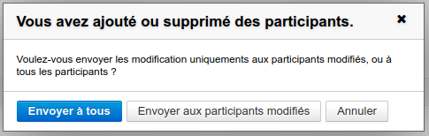
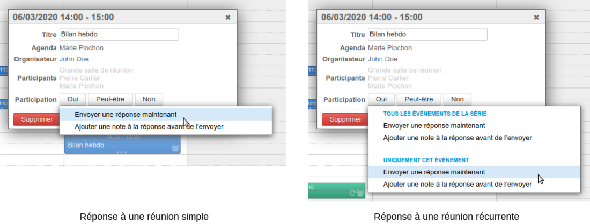
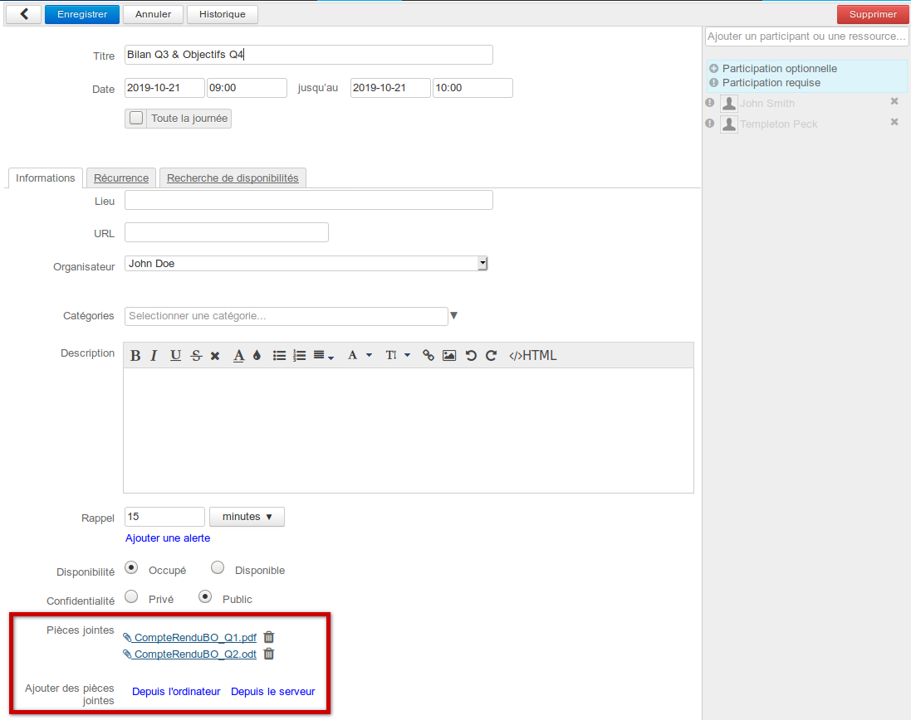
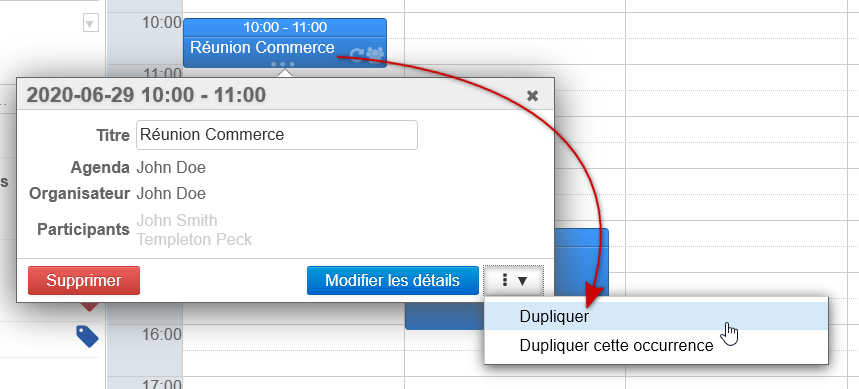
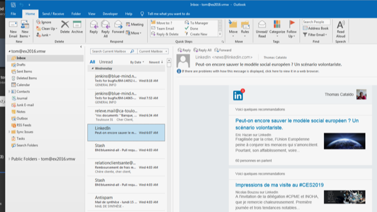
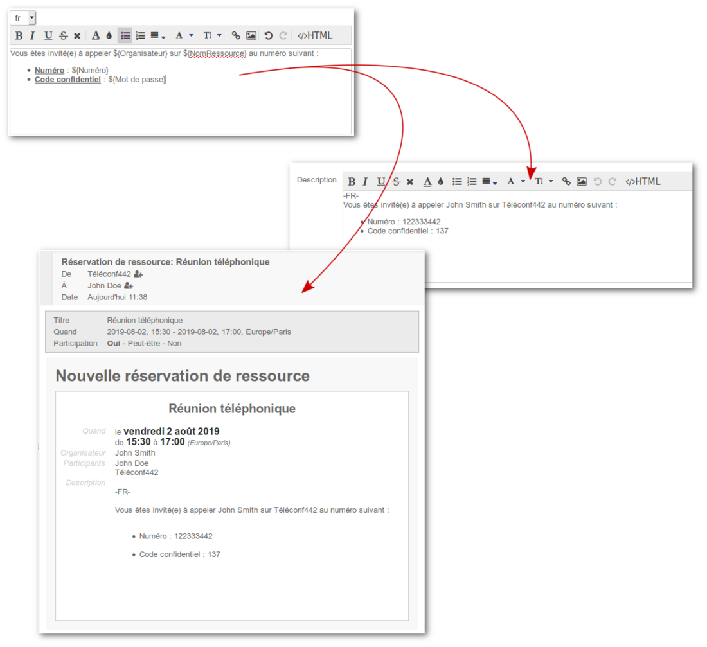

# Neuerungen BlueMind 4.0 -> 4.3

## Einleitung

BlueMind ist stolz Ihnen die neue Version seiner **Open Source Groupware** vorzustellen**.** 

Die lang erwartete Version 4 bietet durch die native Unterstützung von Outlook endlich die Möglichkeit, Souveränität und Anwenderzufriedenheit in Einklang zu bringen.

Diese neue Version ist als einzige in der Lage, Outlook im MAPI-Modus, also ohne Connector, zu verwenden, aber auch andere Clients wie Thunderbird, das Web oder Mobiltelefone kollaborativ anzureichern.

Außerdem bringt sie neue Funktionen wie die Verwaltung von Firmensignaturen, verbessert die Nutzung des Kalenders und bietet deutliche Performancesteigerungen.

Wir laden Sie ein, im Folgenden die weiteren wesentlichen Verbesserungen und Neuerungen dieser Version zu entdecken, die das Ergebnis einer mehrjährigen Arbeit ist.

Die Archivierung erfolgt nun vollautomatisch.

Sie erfolgt transparent für die Benutzer, die nicht mehr manuell archivieren und die in ihrer Mail-Oberfläche, im Gegensatz zu den Vorgängerversionen, weder ein Piktogramm sehen, das eine Nachrichtenarchivierung anzeigt, noch eine Schaltfläche, um eine Nachricht zu archivieren oder zu dearchivieren.

Der Benutzer muss diese mühsame Arbeit nicht mehr durchführen, um sein E-Mail-Kontingent nicht zu erschöpfen.

:::tip

Download BlueMind 4 : [https://download.bluemind.net/bm-download](https://download.bluemind.net/bm-download)

Im Falle eines Updates bitten wir Sie, die entsprechenden Versionshinweise zu beachten, um detaillierte Informationen über die vorgenommenen Korrekturen zu erhalten.

:::

## Kalender

### Verbesserungen der Termineinladungen und Management der Teilnehmer

**In der Version 4.2 **verringert BlueMind mögliche Fehler in der Abstimmung zwischen Organisator und Teilnehmer durch eine konsequente Normierung der Beschriftungen und Texte:

1. **Als Organisator:**
    - Der Organisator besitzt nun die Schaltflächen "Senden", "Als Entwurf speichern" und einen Pfeil-Zurück zum Abbrechen.
    - Das Speichern als Entwurf ist nur vor dem Versenden der Einladungen möglich. Sobald die Teilnehmer eingeladen sind, muss der Organisator nur noch auf die Schaltfläche "Senden" klicken und wird auf nicht gesendete Änderungen aufmerksam gemacht, sofern er auf die Schaltfläche "Abbrechen" klickt
    - Wenn die einzige Änderung das Hinzufügen oder Löschen von Teilnehmern ist, kann der Organisator wählen, ob er alle oder nur die davon direkt betroffenen Teilnehmer benachrichtigen will:
2. **Als Teilnehmer:**
    - Der Teilnehmer hat nicht mehr die Möglichkeit, ein Meeting anzunehmen oder abzulehnen, ohne eine Antwort zu senden, so dass sichergestellt ist, dass der Veranstalter einen aktuellen Überblick über die Teilnahmen besitzt.
    - Der Teilnehmer kann jeweils eine Nachricht an seine Antworten anhängen.
    - Im Falle einer Terminserie hat der Teilnehmer die Möglichkeit, seine Anwort spezifisch für eine gesammte Terminserie oder einen einzelnen Termin der Serie zu wählen.

### Vereinheitlichung der Behandlung von Terminserien

**In der Version 4.2 **wurde die Verwaltung von Terminserien erweitert: die Wahl der Art der Änderung einer Serie (Änderung eines Ereignisses, der gesamten Serie oder der folgenden Termine der Serie) wird auf allen durchgeführten Aktionen verallgemeinert:

**Weitere Details zu diesen neuen Funktionen finden Sie auf den Seiten, die sich mit der Agenda und speziell mit Veranstaltungen und dem Organisieren eines Meetings befassen.**

### Dateien an Termine anhängen

Einer der meistgeforderten Features, das Hinzufügen von Dateien zu Kalendererterminen, ist in BlueMind 4 mit der Version 4.1 endlich möglich geworden!

Entdecken Sie die Details zu diesem Feature auf der Seite [Terminverwaltung](/Guide_de_l_utilisateur/L_agenda/Les_événements/).

### Verbesserung der Performance

Ressourcenintensive Aufgaben wie Erinnerungen, Synchronisationen und Backups wurden in Version 4.1.4 neu gestaltet, um effizienter zu arbeiten und gleichzeitig die Serverlast zu reduzieren.

### Verbesserung der Terminerinnerungen

Mit der Neugestaltung der serverseitigen Tasks, einschließlich der Erinnerungsfunktion für Termine, die auf einigen Installationen besonders ressourcenintensiv sein kann, wurden auch Verbesserungen bei der Bedienung von Terminerinnerungen vorgenommen. Die Art der Erinnerung kann vom Benutzer angepasst werden, der zwischen dem Erhalt einer E-Mail oder einer Desktop-Benachrichtigung wählen kann:

Es können weiterhin mehrere Erinnerungen, auch verschiedenen Typs, angelegt werden. Erfahren Sie mehr auf der Seite [Termine](/Guide_de_l_utilisateur/L_agenda/Les_événements/).

### Synchronisierung von externen Kalendern

Der Synchronisations- und Aktualisierungsmodus von [externen Kalendern](/Guide_de_l_utilisateur/L_agenda/Les_calendriers_externes/) wurde in 4.1 komplett überarbeitet 

- Verbesserung der Performance von großen oder einer großen Anzahl von Kalendern.
- Ermöglichung einer nahezu augenblicklichen Darstellung synchronisierter Kalender bei Verwendung.

Dieses Redesign ist für die Benutzer transparent, die Oberfläche bleibt unverändert, aber es hat einen bemerkenswerten Effekt: Kalender werden jetzt bei Bedarf aktualisiert, jedes Mal, wenn sie in der Kalenderanwendung angezeigt werden. So muss nicht mehr auf die automatische Synchronisation gewartet werden, die früher einmal pro Stunde stattfand; Änderungen in der Fremdanwendung sind sichtbar, sobald der Benutzer den Kalender konsultiert, mit einer möglichen Verzögerung aufgrund von Serverüberlastung (z. B. besonders lange Warteschlangen) und Kommunikation (Netzwerkqualität).

Es ist immer möglich, eine Synchronisation aus der Kalenderverwaltung des Benutzers zu erzwingen.

### Duplikation von Terminen

BlueMind Version 4.3 bringt eine der meistgewünschten Funktionen der [Suggestion Box](https://community.bluemind.net/suggestions/details/SB-865): die Duplizierung von Terminen.

Es ist nicht mehr nötig, eine lange Liste von Teilnehmern eines Meetings oder die reservierten Ressourcen zu suchen, den Ort oder den Kalender neu einzugeben. Sie haben jetzt die Möglichkeit, einen Termin zu kopieren, um mit einem einfachen Klick einen neuen Termin nach demselben Muster zu erstellen!

Sie können einen einzelnen Termin, eine komplette Serie oder nur einen bestimmten Termin einer Serie von Meetings duplizieren.

Ausführliche Informationen zu dieser Funktion finden Sie auf der Seite, die den [Terminen](/Guide_de_l_utilisateur/L_agenda/Les_événements/) gewidmet ist.

## MAPI/Outlook

Zweifellos das am meisten erwartete Feature von BlueMind, es ist endlich verfügbar: volle Outlook-Unterstützung ohne Connector.

****

Weitere Informationen zur Implementierung der MAPI-Unterstützung finden Sie auf der entsprechenden Dokumentationsseite: [MAPI für Outlook](/Guide_de_l_administrateur/La_souscription_BlueMind/Mise_en_œuvre_de_MAPI_pour_Outlook/)

Weitere Informationen zu unterstützten Outlook-Versionen und bekannten Einschränkungen finden Sie auf der Seite [Kompatibilität](/FAQ_Foire_aux_questions_/Compatibilité/#Compatibilite-compat-outlook)

### Ordner unterhalb des Posteingangs

In früheren Versionen von BlueMind (4.0.x) waren die von Outlook unter dem Posteingang angelegten Ordner keine Mail-Ordner, sondern virtuelle Ordner. **BlueMind 4.1 bringt Unterstützung für Posteingangs-Unterordner**.

:::info

Mise à jour 4.0.x vers 4.1

**Achtung**: Beim Upgrade von BlueMind 4.0.x auf 4.1 werden die virtuellen Ordner nicht migriert und gelöscht.

Um dies zu verhindern, können Sie diese virtuellen Ordner vor dem Upgrade aus dem Posteingang verschieben, so dass sie wieder hineingestellt und als E-Mail-Ordner neu erstellt werden können.

:::

### Dateien an Termine anhängen

BlueMind 4.1 gestattet den Benutzern, ihren Terminen im Kalender (wie im Online-Kalender) Dateien hinzuzufügen, die dann in BlueMind und für alle Teilnehmer der jeweiligen Besprechung sichtbar sind.

### Integration einer E-Mail in eine E-Mail

Eine neue nützliche Funktion in Outlook: Eine E-Mail kann aus dem Posteingang in das Fenster der Nachrichtenerstellung gezogen werden. Die E-Mail wird dadurch ganz einfach als Anlage an den Empfänger gesendet, ohne dass eine Weiterleitung oder mehrere Export-/Hinzufügungsschritte erforderlich werden.

### Anhängen von Nachrichten löschen

Diese nützliche Funktion, um den Posteingang zu ordnen und nicht zu überfüllen, ist jetzt in 4.1 verfügbar: Benutzer können mit einer Nachricht verknüpfte Anhänge löschen, während die Nachricht selbst in ihrem E-Mail-System verbleibt.

### Technische und funktionale Verbesserungen

Besonderes Augenmerk wurde auf die Korrektur und Verbesserung der allgemeinen Funktionsweise und Unterstützung bestimmter Outlook-Funktionen gelegt. Verbessert wurden insbesondere die Verwaltung der Filter des E-Mail-Systems und die Unterstützung von Verteilerlisten.

## Abonnements für freigegebene Mailboxen

Im Active Sync-Protokoll für Exchange existiert der Begriff des gemeinsam genutzten Kalenders oder der gemeinsam genutzten Mailbox nicht. Die Version 4.3 von BlueMind ermöglicht, dank einer neuen Abonnementfunktion, die mit der für Kalender und Adressbücher identisch ist, die Anzeige von freigegebenen Mailboxen in Outlook-Clients, die mit MAPI angebunden sind, oder in mobilen Geräten, die per EAS verbunden sind.

Weitere Informationen zu dieser neuen Funktion finden Sie auf der Seite zu den [geteilten Mailboxen](/Guide_de_l_utilisateur/La_messagerie/Les_boites_aux_lettres_partagées/) im Leitfaden für Benutzer und im Abschnitt über Abonnements in der Dokumentation der [Einstellungen für das E-Mail System](/Guide_de_l_utilisateur/La_messagerie/Preferences_de_messagerie/).

## Vorlagen für Ressourceninhalte

Diese Funktion, die bereits in BlueMind 3.5.13 vorhanden war, wurde in BlueMind 4.1 aufgenommen. Sie ermöglicht die Definition von Vorlagen zur Beschreibung von Ereignissen. Wenn Sie eine Ressource dieses Typs zu einem Ereignis einladen, wird die Vorlage automatisch in die Ereignisbeschreibung eingefügt. Diese Vorlagen können Variablen enthalten und in mehreren Sprachen definiert werden, um sie an die Sprache des Meeting-Veranstalters anzupassen.

So ist es z. B. möglich, eine Vorlage des Inhalts für Ressourcen vom Typ Videokonferenz zu definieren und für jede Ressource die Telefonnummer und den vertraulichen Zugriffscode festzulegen. Die anschließend zum Zeitpunkt der Reservierung dieser Ressource generierte Mail enthält dann die Informationen der Ressource, formatiert gemäß der definierten Vorlage:

Weitere Informationen finden Sie auf der [Seite die den Ressourcen](/Guide_de_l_administrateur/Gestion_des_entites/Ressources/) im [Administratorhandbuch](/Guide_de_l_administrateur/) gewidmet ist.

## E-Mail-Signaturen von Unternehmen

ine neue Option vervollständigt das Finetuning der [E-Mail Signaturen für Unternehmen](/Guide_de_l_administrateur/Configuration/Signatures_d_entreprise/): Zusätzlich zur Auswahl von Gruppen ist es nun möglich, eine Unterschrift für eine oder mehrere einzeln benannte Einheiten zu konfigurieren.

## Verwaltung

### Begrenzte Gültigkeitsdauer von Passwörtern

Version 4.3.0 bietet die Verwaltung der begrenzten Gültigkeitsdauer von Benutzerpasswörtern. Wenn diese Funktion aktiviert ist, ist der Benutzer gezwungen, sein Passwort, sobald es abgelaufen ist, zu ändern. Ein Administrator kann die Gültigkeit eines Passworts sofort beenden, um einen Benutzer zu zwingen, das Passwort zu ändern.

Weitere Einzelheiten zur Implementierung finden Sie auf der folgenden Seite in unserer Wissensdatenbank : [Implementieren Sie eine Richtlinie in Bezug auf den Verfall von Passwörtern](/Base_de_connaissance/Mettre_en_place_une_politique_d_expiration_des_mots_de_passe/)

### Objektspeicherung

In der Version 4.3.0 sind verschiedene Verbesserungen am Objektspeichermedium enthalten. Die Leistung und Zuverlässigkeit des Systems wurden verbessert.

Beim Herunterladen von Nachrichten mit IMAP lädt der CYRUS-IMAPd-Server die Nachrichten zur Verbesserung der Leistung parallel in den Objektspeicher herunter.

Statustabellen, die anzeigen, in welchem Ordner sich eine Nachricht befindet, werden künftig direkt von BlueMind verwaltet, um die Zuverlässigkeit der IMAP-Speicherung zu verbessern.

### Datenverwaltung

Für die Unterstützung einer höheren Anzahl von Benutzern:

- trennt BlueMind 4 die Daten des globalen Adressbuchs von den Daten der Benutzer,
- ermöglicht BlueMind 4 die Definition mehrerer Speicherserver (*Backend*) für die Benutzerdaten.

Wie Sie ein solches System einrichten können, erfahren Sie auf der Seite, die der [Installation mit Datenverteilung auf mehrere Servern](/Guide_d_installation/Installation/Installation_avec_répartition_des_données_sur_plusieurs_serveurs/) gewidmet ist.

#### Trennung der Daten des globalen Adressbuchs von den Daten der Benutzer

BlueMind 4 trennt die Daten des globalen Adressbuchs (Benutzer, Gruppen usw.) von den Daten der Benutzer.

Den Daten des globalen Adressbuchs steht eine eigene Datenbank zur Verfügung. Die Daten der Benutzer werden in einer oder mehreren anderen Datenbanken gespeichert, die sich auf den Speicherservern befinden.

Nach der Authentifizierungsphase über die Datenbank des globalen Adressbuchs kommuniziert der Benutzer daher in erster Linie mit seinem Speicherserver.

#### Speicherung der Benutzerdaten

BlueMind 3.5 gestattete die Verteilung der Mailboxen der Benutzer auf mehrere Server.

BlueMind 4 geht noch einen Schritt weiter und erlaubt außerdem, die Daten aus Kalendern und Adressbüchern sowie andere Daten auf mehrere Server zu verteilen.

Alle Daten eines Benutzers (E-Mails, Kalender, Kontakte usw.) werden nun auf demselben Speicherserver für Daten gespeichert.

#### Automatisierte Verwaltung des Reverse-Proxy Servers

BlueMind kann künftig die komplette Konfiguration des Reverse Proxy (*Edge-Server* genannt) unterstützen. Der nginx-Server wird nun automatisch konfiguriert.

Eine vorhandene Installation wird nicht automatisch von BlueMind verwaltet, um ihren Betrieb nicht zu beeinträchtigen. Die Verwaltung eines Speicherservers durch BlueMind kann erreicht werden, indem Sie dem Server mithilfe der Verwaltungskonsole den Tag „bm/nginx-edge“ hinzufügen.

Beim Hinzufügen des Tags "bm/nginx-edge" wird die nginx-Konfiguration durch die BlueMind-Konfiguration überschrieben. Eventuelle Besonderheiten der nginx-Konfiguration müssen erneut angewendet werden.

### Archivierung

#### Vollautomatische Archivierung

Die Archivierung erfolgt nun vollautomatisch.

Sie erfolgt transparent für die Benutzer, die nicht mehr manuell archivieren und die in ihrer Mail-Oberfläche, im Gegensatz zu den Vorgängerversionen, weder ein Piktogramm sehen, das eine Nachrichtenarchivierung anzeigt, noch eine Schaltfläche, um eine Nachricht zu archivieren oder zu dearchivieren.

Der Benutzer muss diese mühsame Arbeit nicht mehr durchführen, um sein E-Mail-Kontingent nicht zu erschöpfen.

#### Kompatibilität mit allen E-Mail-Clients

Für die Archivierung wird nicht länger ein Plug-In auf dem Client benötigt. Die komplette Verwaltung erfolgt transparent auf der Serverseite.

Die Archivierung funktioniert mit allen E-Mail-Clients (Webmail, Fat Client oder mobiles Gerät): Die E-Mails werden unabhängig vom IMAP-Client archiviert und können eingesehen werden.

Weitere Informationen siehe: [Archivierung](/Guide_de_l_administrateur/Configuration/Archivage/)

## Entwicklung

BlueMind 4 fügt einen ganzen E-Mail-Verwaltungsbaustein in unserer REST-API hinzu, über die Sie sich auf der Seite mit de [API-Dokumentation](https://forge.bluemind.net/apidoc/).

Um Sie bei der Wartung von Add-Ons oder Skripten besser zu unterstützen, bietet diese Seite nun die Möglichkeit, Inkompatibilitäten zwischen Versionen anzuzeigen: So können Sie schnell erkennen, ob eine Entwicklung bei einer Aktualisierung eine Änderung erfordert.

