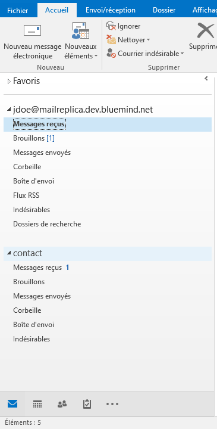
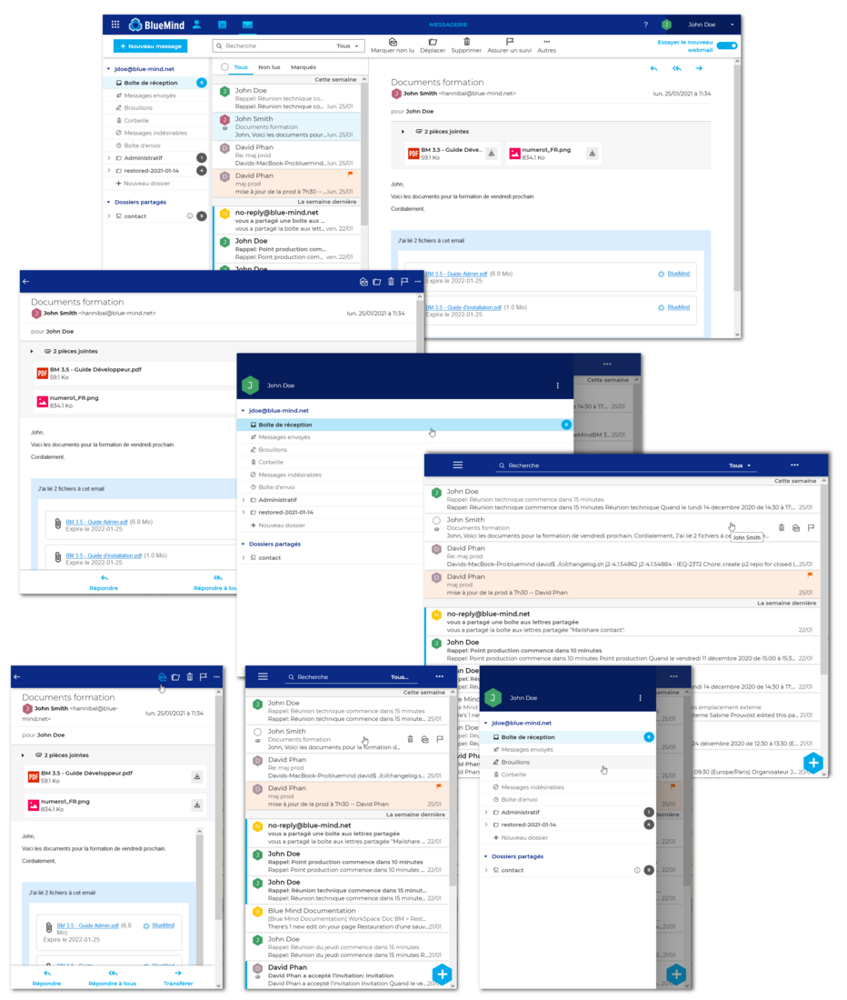
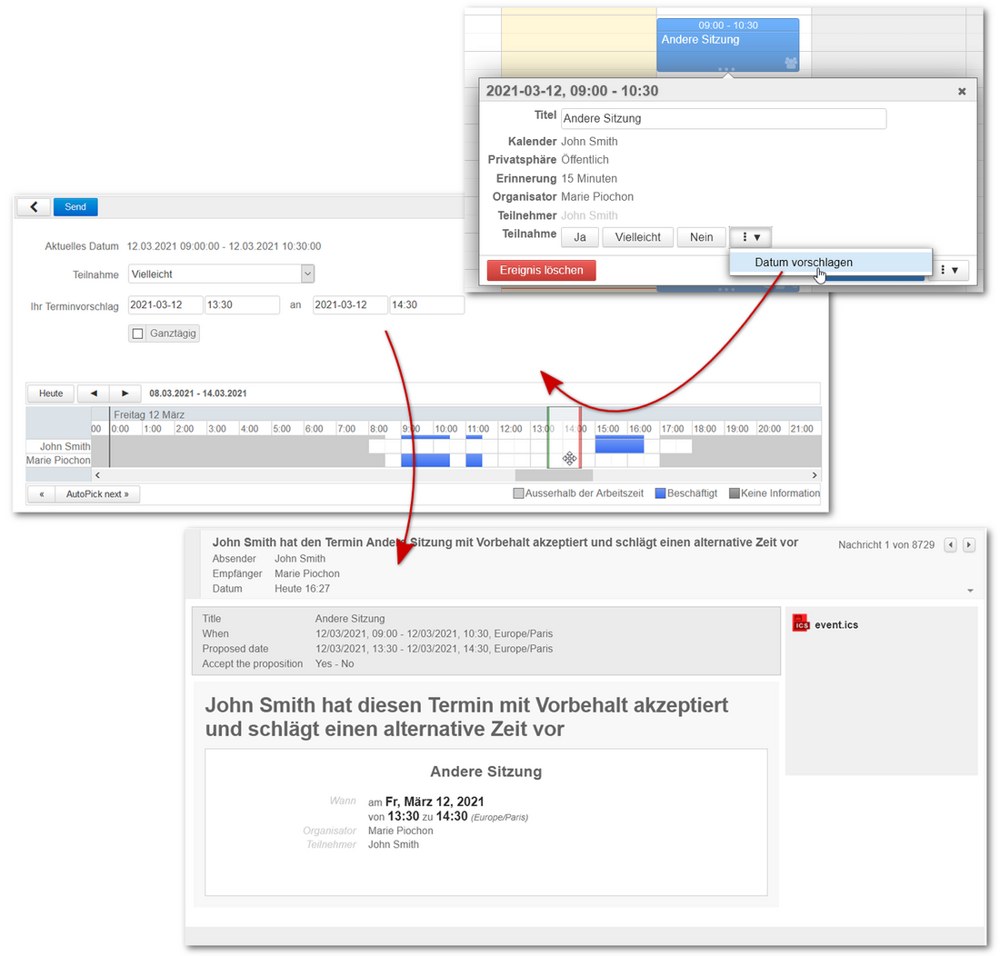
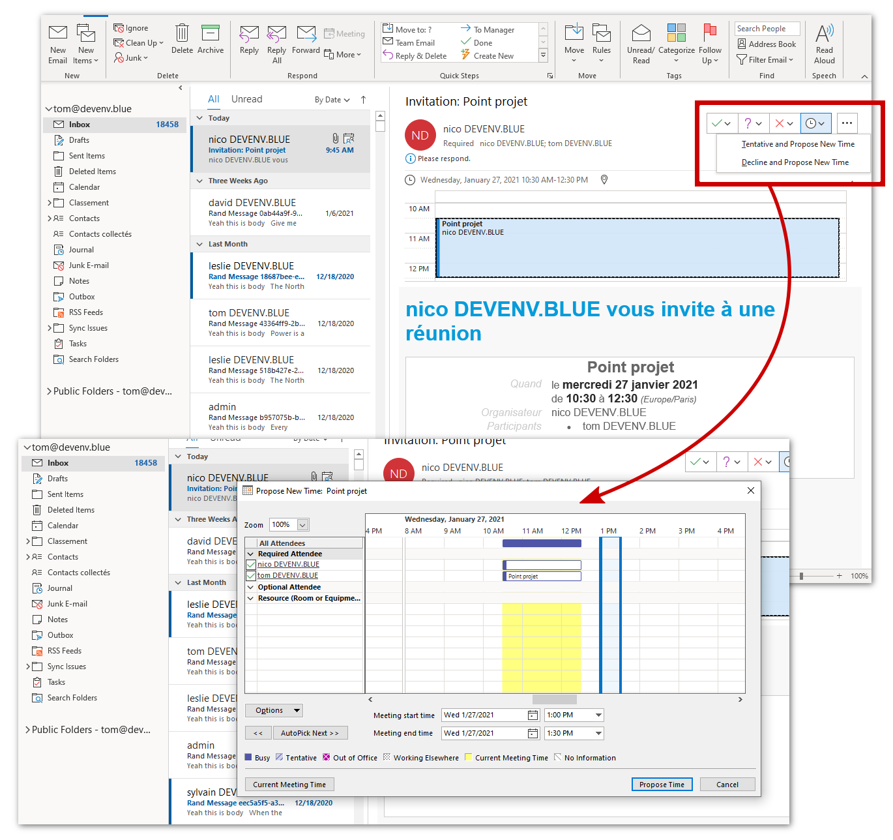
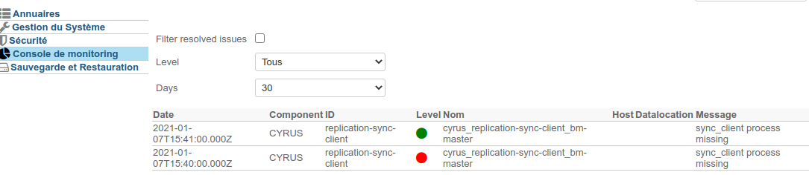

# Neuerungen BlueMind 4.4 und 4.5


## Einleitung

Das gesammte Team BlueMind ist stolz, Ihnen unsere neue Version der Groupware zu präsentieren!

In dieser Version 4.4, die auch besonders reich an neuen Funktionen sowohl für Benutzer als auch für Administratoren ist, wurde ebenso an der Verbesserung der Performance gearbeitet.

Heiß erwartet, der neue [Webmailer BlueMind](/Guide_de_l_utilisateur/Messagerie_BlueMind/) ist in Beta-Version verfügbar! Zögern Sie nicht und entdecken Sie die neue responsive Oberfläche, die sich an alle Bildschirme und Browser anpasst.

Die Benutzer haben Zugriff auf neue Funktionen, darunter:

- Vorschlag eines alternativen Termins für Teilnehmer eines Meetings
- Wiederherstellung von gelöschten Nachrichten (mittels Outlook oder als Administrator)
- Abwesenheitsnotizen im HTML-Format (Outlook)


Administratoren Ihrerseits können ihre Installation noch gezielter konfigurieren und von neuen Werkzeugen profitieren:

- Konfiguration einer Standard Zeitzone
- Modifikation und Anpassung von Domänennamen
- Konfiguration eines ausgehenden Proxy-Servers
- Erweiterung der BlueMind Kommandenzeilen-Tools
- Automatische Reparatur von geteilten Mailboxen
- Neue vordefinierte Monitoring-Dashboards
- Anzeige der wichtigsten Monitoring-Daten in der grafischen Administrationskonsole


Wir laden Sie ein, das [Changelog](https://download.bluemind.net/bm-download/4.4.0/changelog.html) zu konsultieren, um detaillierte Informationen über die technischen Verbesserungen und Fehlerbehebungen zu erhalten, die diese Version mit sich bringt.


:::info

Frühere Versionen

Sie finden die Neuerungen vorheriger BlueMind Versionen auf der Seite:  [Neuerungen BlueMind](/Nouveautés_BlueMind_4.0_à_4.3/)

:::


:::tip

Der direkte Link zum Download ist: [https://download.bluemind.net/bm-download](https://download.bluemind.net/bm-download)

Im Falle eines Updates empfehlen wir, dass Sie sich mittels des Changelogs über die Änderungen dieser Version informieren.

:::

## Neuerungen 4.5

### Videokonferenz mit Jitsi und StarLeaf

BlueMind 4.5 bringt die Möglichkeit, einen Jitsi-Server oder einen StarLeaf-Server mit einer Domain zu verknüpfen und so den Benutzern die Möglichkeit zu geben, Videokonferenzen zu erstellen und mit ihren Kalenderterminen zu verknüpfen:

Weitere Informationen zur Implementierung finden Sie auf den Seiten des Administrationshandbuchs [Visioconférence intégrée](/Guide_de_l_administrateur/Configuration/Visioconférence_intégrée/)

Um mehr über die Verwendung des Kalenders zu erfahren, lesen Sie die Seite Benutzerhandbuch [Lier une visioconférence à un événement](/Guide_de_l_utilisateur/L_agenda/Lier_une_visioconférence_à_un_événement/)

### Freigabe des Lesestatus von freigegebenen Boxen

Um Klarheit zu schaffen und um die Gewohnheiten von Benutzern, die mit anderen Mailsystemen gearbeitet haben, nicht zu verändern, sind die Anzeigen für "gelesene" oder "ungelesene" Nachrichten eines gemeinsamen Postfachs nun für alle Benutzer des gemeinsamen Postfachs gleich.

Dieses Verhalten kann von Administratoren nicht mehr konfiguriert werden.

### Freigegebene Postfächer in Outlook

Von nun an werden freigegebene Postfächer als freigegebene Postfächer in der Outlook-Hauptstruktur und nicht mehr im Bereich "Öffentliche Ordner" angezeigt:



### Administration

#### Heißes Update

Um die Arbeit von BlueMind-Integratoren und -Administratoren zu erleichtern, werden Wartungsarbeiten, wie z.B. Teilreparaturen von Anwendern, nun automatisch durch ein Hot-Update-System durchgeführt. Somit werden der Update-Vorgang und die Rückkehr zur Produktion des Systems durch diese Vorgänge nicht blockiert.

#### Störungsfreie Wartung

Die Datenbankwartung läuft jetzt parallel zur Produktion, ohne diese zu blockieren. So wird die Wartung nun durch einen geplanten Task gesteuert, ist für den Administrator sichtbar und deaktivierbar und verursacht keine Störungen mehr für die Benutzer.

#### Neustart ohne Unterbrechung

Ab sofort wird die Verbindung beim Neustart von BlueMind nicht mehr unterbrochen. Störungen beim Einspielen eines Patches oder eines Updates werden so für den Endanwender auf ein Maximum reduziert, der seine laufende Arbeit (z. B. das Schreiben von E-Mails) nicht verliert.

## Neuerungen 4.4

### Neuer Webmailer

Entdecken Sie den neuen [BlueMind Webmailer](/Guide_de_l_utilisateur/Messagerie_BlueMind/)!

BlueMind hat einen brandneuen Webmailer entwickelt, der auf den von aktuellen Browsern vorgeschlagenen Webtechnologien basiert: Web App Javascript. Der Webmailer bietet eine neu gestaltete und intuitive Ergonomie, wobei die 3 Bereiche an breite Bildschirme angepasst sind. Es ermöglicht vor allem eine schnellere und flüssigere Bedienung durch die Nutzung des lokalen Browser-Speichers.

Wir laden Sie ein, die Anwendung jetzt zu testen und zu experimentieren und freuen uns auf Ihr Feedback!



### Terminvorschläge

Ein sehr gewünschtes Feature, der Vorschlag eines alternativen Termins ist in BlueMind endlich möglich! Kompatibel mit allen Kalendermanagern, die diese Funktion anbieten, bietet BlueMind sie sowohl in seiner Webanwendung als auch in Outlook (verbunden in mapi) und Thunderbird!



Der Organisator einer Besprechung behält die Kontrolle darüber, ob er den Teilnehmern die Möglichkeit bietet, einen alternativen Termin vorzuschlagen oder nicht.

Weitere Details zum Verfahren zum Vorschlagen eines neuen Zeitplans finden Sie im entsprechenden Abschnitt in der Dokumentation der Kalendertermine: [Benutzerhandbuch](/Guide_de_l_utilisateur/) > [Kalender](/Guide_de_l_utilisateur/L_agenda/) > [Termine](/Guide_de_l_utilisateur/L_agenda/Les_événements/) [§.5.3 Termin vorschlagen](/Guide_de_l_utilisateur/L_agenda/Les_événements/#Lesevenements-newtime)

In Outlook verwenden die Teilnehmer und der Organisator die üblichen Menüs und Werkzeuge, um Vorschläge zu machen/anzunehmen/abzulehnen:



### Wiederherstellung gelöschter E-Mails

Der Papierkorb mit doppeltem Boden ist eine Funktion zum Wiederherstellen gelöschter E-Mails, die für jeden Benutzer zugänglich ist. Es bietet eine serverseitige Verzögerung, während der gelöschte E-Mails aufbewahrt werden; während dieser Verzögerung kann eine Wiederherstellung durch den Benutzer direkt von seinem Oulook-Client (verbunden in mapi) oder durch den Administrator vom Server in der Kommandozeile (siehe unten) erfolgen.

Diese Funktion wird in einer zukünftigen Version von BlueMind in das neue Webmail implementiert werden.

### Mapi

Neben Fehlerbehebungen bringt die Version neue Funktionen, die jetzt in Outlook verfügbar sind.

#### Abwesenheitsmeldung in Rich Text

Die aus Outlook eingerichteten automatischen Abwesenheitsantworten können jetzt in HTML geschrieben werden. Der Benutzer kann zwischen TEXT-Format (bisher verfügbar) und Rich-Text-Format (fett, kursiv, Farbe, Textgröße, Bild usw.) wählen.

#### Wiederherstellen von gelöschten Nachrichten

Mit dieser Version wird Outlook um eine Funktion erweitert: Der Benutzer kann auf die Liste der kürzlich gelöschten Nachrichten zugreifen und diese wiederherstellen (unexpunge).
Weitere Details finden Sie im vorherigen Kapitel "Wiederherstellung gelöschter E-Mails".

### Kalender

Kategorien (Tags) werden jetzt beim ICS-Import von Kalendern und Terminen importiert.

### Administration

#### Standardzeitzone einer Domaine

Es ist jetzt möglich, dass Administratoren eine Zeitzone für eine bestimmte Domain festlegen. Die Zeitzone wird zur Standardzeitzone für neue Benutzer und bestehende Benutzer, die die alte Zeitzone verwendet haben (im Falle einer Änderung).

Weitere Informationen finden Sie im Bereich [Domänenverwaltung](/Guide_de_l_administrateur/Configuration/Gestion_des_domaines/).

#### Ändern des angezeigten Domainnamens

Seit Version 4.3 BlueMinds werden alle neuen Domains mit einer eindeutigen generierten Kennung ("XXXXX.internal") angelegt, um Administratoren die Modifikation ihrer Domainen zu ermöglichen. In dieser Version stellte die Administrationsoberfläche den ersten Alias als Domänennamen dar, und der interne Bezeichner war in den meisten Bildschirmen noch vorhanden.

Ab Version 4.4 hat eine Domain einen Bezeichner (XXXXX.internal), einen oder mehrere Aliase einschließlich eines Standard-Alias. Dies kann in der Administrationskonsole ausgewählt und geändert werden.

Die Anzeigen zum Anlegen von E-Mail-Adressen wurden angepasst und vereinfacht, so dass nun der Standard-Alias verwendet wird und nicht mehr der technische Name der Domain angezeigt wird.

Weitere Informationen finden Sie im Bereich [Domänenverwaltung](/Guide_de_l_administrateur/Configuration/Gestion_des_domaines/).

#### Unterstützung eines ausgehenden Proxy-Servers

In verschiedenen Szenarien, z. B. bei der Abfrage von externen Kalendern, erfordern einige Installationen die Verwendung eines HTTP-Proxy-Servers.

Sobald der HTTP-Proxyserver in der Administrationskonsole (Systemverwaltung > Systemkonfiguration) eingerichtet und aktiviert ist, laufen die von BlueMind weitergeleiteten externen Anfragen über diesen Server.

Weitere Details finden Sie auf der entsprechenden Seite [Systemkonfiguration](/Guide_de_l_administrateur/Configuration/Configuration_système/).

#### BlueMind Kommandozeile (bm-cli)

##### Unterstützung der Wiederherstellung gelöschter E-Mails per Kommandozeile

Wie bereits erwähnt, bietet der Papierkorb mit doppeltem Boden eine Verzögerung auf der Serverseite: Er bewahrt gelöschte E-Mails für eine bestimmte Zeit auf, was eine Wiederherstellung über einige Clients oder durch den Administrator ermöglicht.

Ein neuer Befehl erlaubt es, vom Benutzer gelöschte, aber von cyrus noch nicht endgültig gelöschte Nachrichten wiederherzustellen: bm-cli mail unexpunge

Dieser bm-cli-Befehl ist notwendig, weil der cyrus-Befehl "unexpunge", der offensichtlich dasselbe tut, nicht genügend Informationen an das Replikationsprotokoll zurückgibt und die Verbindung zwischen Cyrus und BlueMind unterbricht.

Weitere Informationen finden Sie auf der entsprechenden Seite in unserer Wissensdatenbank: [Gelöschte E-Mails eines Benutzers wiederherstellen](/Base_de_connaissance/Restaurer_les_messages_supprimés_par_un_utilisateur/).

##### Neue Befehle

Die Version bringt neben der Wiederherstellung von gelöschten E-Mails einige Verbesserungen und neue Befehle:

###### Neue Befehle und Optionen:

- `server tag / untag / add` : erlaubt das, das Hinzufügen eines Servers und die Aktionen zu automatisieren, die es erlauben, einen Server zu markieren (z. B. mail/imap).
- `main reindexpending` : Neu-Indexation des index "mailspool_pending"
- `user import / export` : Im- und Export des Archivs IMAP (Cyrus)
- `setup install --admin0-pass` : Setzen des global Adminpassworts währen der Installation via Kommandozeile. Exemple : bm-cli setup install


```
bm-cli setup install --external-url bluemind.domain.net --domain domain.net --sw-pass Passw0rd --admin0-pass SuperSecurePassword
```


###### Verbesserungen:

- Der Befehl `bm-cli index info` berücksichtigt nicht mehr die gelöschten E-Mails
- Die Option --addressbook-uid der Befehle "`contact import`" und "`contact reset`" unterstützt nun auch Domänen-Adressbücher : ist es nun möglich, eine VCF-Datei in ein Domain-Adressbuch zu importieren und ein Domain-Adressbuch zurückzusetzen.
- Austausch der Bibliothek *airlift* durch *picocli*. Diese Bibliothek erlaubt eine benutzerfreundlichere Darstellung der Befehle und Parameter.
- Normierung des Farbschemas und konsequente Ausgabe von Fehlern über den Standard Fehler-Ausgabestream.
- Informationen zum Befehlsfortschritt werden jetzt an die Fehlerausgabe (stderr) gesendet. Dies ermöglicht die direkte Generierung von json-Daten für die entsprechenden Befehle, z. B. :


```
bm-cli user get test.lan | jq
```


#### Reparatur von geteilten Mailboxen

Les administrateurs ont désormais la possibilité de procéder à la [réparation d'une boîte partagée](/Guide_de_l_administrateur/Gestion_des_entités/Boites_aux_lettres_partagées/) de la même façon qu'ils en ont l'habitude avec les utilisateurs.

Administratoren haben nun die Möglichkeit, eine geteilte Mailbox auf die gleiche Weise zu [reparieren](/Guide_de_l_administrateur/Gestion_des_entités/Boites_aux_lettres_partagées/), wie sie es normalerweise mit Benutzern tun.

#### Monitoring mit TICK

Neue Dashboards für die Überwachung von Elasticsearch und Postgres wurden hinzugefügt:

- Das Dashboard "Elasticsearch" erlaubt die gezielte Überwachung des Elasticsearch-Clusters
- Das Dashboard "ElasticSearch Mailspool" informiert gezielt über Mail-spezifische Daten in Elasticsearch und ermöglicht ein mögliches Problem oder eine Disbalance der Verteilung der Benutzer innerhalb der verschiedenen Indizes zu diagnostizieren.
- Das Dashboard "PostgreSQL" erlaubt die Überwachung der Datenbank.


Außerdem enthält die Überwachungsseite der Administrationskonsole jetzt eine Darstellung von Tick-Alerts:



#### Technische Optimierungen

##### Indexation

1. Die Speicherung in ElasticSearch wurde verbessert, indem die Menge der in ElasticSearch gespeicherten Daten reduziert wurde: einige Felder wurden zuvor unnötigerweise mehrfach gespeichert. **Um die Vorteile der Reduzierung der gespeicherten Datenmenge zu nutzen, ist ein Re-Index erforderlich**.
2. Das Schema "mailspool_pending" wurde aktualisiert, so dass Dokumente aus mailspool_pending nicht indiziert werden können. Bei 339315 Dokumenten reduziert sich der belegte Speicherplatz von 741MB auf 267MB bei gleichzeitiger Reduzierung der benötigten CPU-Last.
3. Der ElasticSearch-Cluster kann in den Status "rot" übergehen, wenn der Speicherplatz knapp wird. Wenn Speicherplatz hinzugefügt wird, geht der Cluster jetzt dank eines Kapacitor-Alarms automatisch wieder auf "grün".


##### Sentry

Das Release bringt Unterstützung für das Sentry-Fehlerberichterstattungssystem für Java-Produkte: erweiterte Fehlerberichte, die ggf. Stacktraces enthalten, werden an den Sentry-Fehlerhandler gesendet.

Das Aktivieren von Fehlerberichten kann mit folgendem Befehl erfolgen:


```
# Activation
bm-cli sysconf set -v https://[dsnsentry] sentry\_endpoint
# Deactivation
bm-cli sysconf set -v "" sentry\_endpoint
```


Die Sentry-Fehlerberichterstattung ist standardmäßig deaktiviert.

##### Sicherheit von ausgehenden Ports

Die Ports für das Versenden von E-Mails (Port TCP 465 und 587) verwenden nun die Version TLS v1.2 minimum.

##### Mapi

Eine "Protokoll"-Testsuite wurde in BlueMind implementiert, um unsere Testwerkzeuge weiter zu verbessern und unsere Implementierung noch näher ans Microsoft-Protokoll anzupassen.


