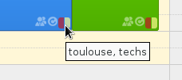
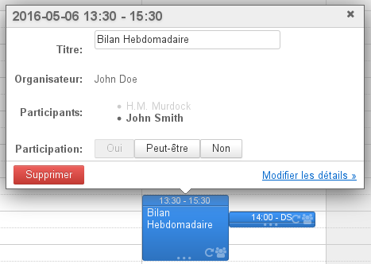
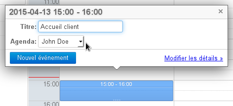
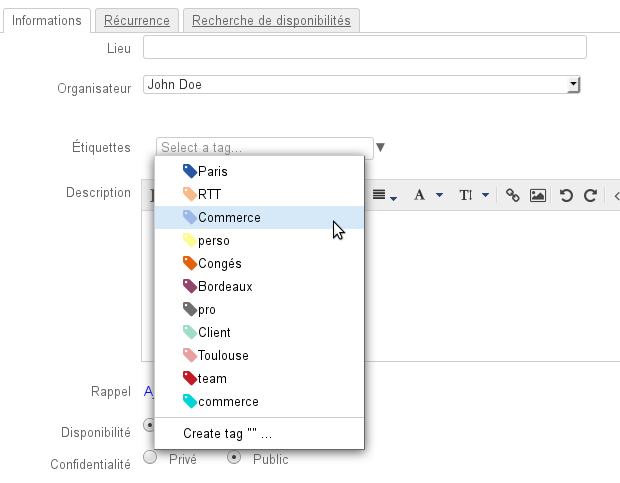
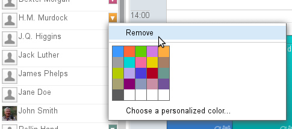
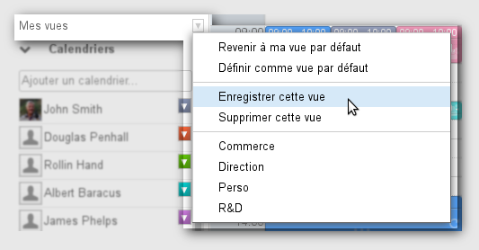
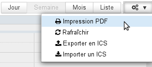
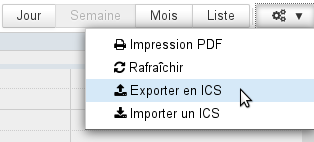

# Erste Schritte mit dem Kalender

## Navigation im Kalender

Die standardmäßige Hauptansicht des BlueMind-Kalenders besteht aus mehreren Teilen:

-  : Die Taskleiste gestattet den Wechsel zwischen den verschiedenen Anwendungen.
-  : Der Kalender gestattet, ein bestimmtes Datum zu suchen und aufzurufen, indem Sie die Monate mit den Pfeiltasten abrollen und auf das gewünschte Datum klicken. Im Hauptbereich wird der Zeitraum angezeigt, der das ausgewählte Datum enthält (Tag, Woche oder Monat, je nach aktueller Einstellung).
-  : Dieser Bereich zeigt Liste der aktuell angezeigten Kalender und bietet Zugriff auf Ansichten und Kategorien.
-  : Die Suchmaschine gestattet, Termine nach Name, Kategorien, Details, Teilnehmer usw. zu suchen.
-  : Dieser Bereich ist diese Hauptanzeige des Kalenders des Benutzers sowie der von ihm abonnierten Kalender und/oder weiterer Kalender seiner Wahl (Benutzer, Ressourcen).
    - Mit den Schaltflächen oben links im Hauptbereich können Sie zu dem Zeitraum mit dem aktuellen Datum zurückkehren und zu davor oder danach liegenden Daten navigieren.
    - Mit den Schaltflächen oben rechts können Sie den Zeitraum bzw. die Art der Darstellung wählen und die Funktionen **Als PDF drucken** und **ICS-Datei importieren/Als ICS-Datei exportieren** aufrufen. Das Toolmenü gestattet auch die Aktualisierung der aktuellen Ansicht.
-  : Das Anzeigefeld der Aufgaben kann mit der Schaltfläche  oben rechts ein- oder ausgeblendet werden.

## Termine

### Ansicht eines Termin

Ein Termin wird in der Farbe des zugehörigen Kalenders mit seinen Hauptinformationen dargestellt:

Am oberen Rand des Termin die Uhrzeit und der Titel.

Am unteren Rand des Termin  Symbole, um auf einen Blick die Merkmale des Termin zu erfassen:

-  Es gibt mehrere Teilnehmer.
-  Der Termin ist privat.
-  Der Terminist wiederkehrend.
- Ein Quadrat zeigt die Farbe(n) (maximal zwei) der zugehörigen Kategorie(n) an, bei Mouseover erscheint die komplette Liste der Kategorien: 

Wenn Sie auf den Termin klicken, werden zusätzliche Details angezeigt: Organisator (falls abweichend vom Besitzer des angezeigten Kalenders), betroffener Kalender (falls nicht der des Benutzers), Teilnehmer, Schaltflächen zur Änderung der Teilnahme usw.

In diesem Dialogfeld können Sie über den Link "Detail" (oder "Details ändern", wenn der Kalender nicht schreibgeschützt ist) auf weitere Informationen sowie auf die Seite zur Änderung des Termin zugreifen.

### Erstellen eines Termin

So erstellen Sie ein Termin:

- ** **Schnelle Erstellung:** **
    - Rufen Sie das gewünschte Datum und die Uhrzeit auf und klicken Sie, um den Termin zu erstellen.Die standardmäßige Dauer beträgt 30 Minuten; halten Sie die Maustaste gedrückt und ziehen Sie, um die gewünschte Dauer zu markieren. 
    - Tragen Sie den Titel und den betreffenden Kalender in das sich öffnende Fenster ein: 
    - Klicken Sie auf "Neuer Termin", um die Erstellung zu bestätigen.
- ** **Umfassende Erstellung:** **
    - Klicken Sie auf die Schaltfläche "Neuer Termin" oben links auf der Seite oder klicken Sie auf den Link "Details ändern" im Fenster für die schnelle Erstellung.
    - Füllen Sie die gewünschten Felder aus, definieren Sie ggf. eine Wiederholung, laden Sie Teilnehmer ein usw. **Hinweis: Nur der Titel und das Datum sind obligatorisch**.
    - Wenn Sie alle Informationen eingegeben und die Teilnehmer hinzugefügt haben, klicken Sie oben auf der Seite auf "Speichern", um den Termin zu erstellen und zur Kalenderansicht zurückzukehren.

:::tip

Wenn Teilnehmer eingeladen werden, werden Sie beim Speichern in einem Dialogfeld gefragt, ob Einladungen versendet werden sollen. Wenn dies der Fall ist, wird eine E-Mail an jeden Teilnehmer (auch an Teilnehmer außerhalb der BlueMind-Domain) gesendet.

:::

Für weitere Informationen über das Erstellen eines Termin und die möglichen Optionen siehe [Termine – Abschnitt 1 Erstellen eines Termins](/Guide_de_l_utilisateur/L_agenda/Les_événements/).

Für weitere Informationen zur Organisation und Verwaltung einer Besprechung und seiner Teilnehmer siehe [Organisation einer Besprechung](/Guide_de_l_utilisateur/L_agenda/Organiser_une_réunion/).

## Kategorien (Tags)

Kategorien werden verwendet, um Terminen und Kontakten ein oder mehrere Schlüsselwörter zuzuordnen, wobei für beide Anwendungen die gleichen Kategorien verwendet werden.

Die Liste der Kategorien kann in der Verwaltungsoberfläche der Benutzereinstellungen > Abschnitt "Mein Konto" > Registerkarte "Tags" angezeigt und geändert werden. Freigegebene Kategorien, die vom Domain-Administrator erstellt wurden, werden dort fett und mit einem Vorhängeschloss am Anfang der Liste angezeigt, sie können von den Benutzern nicht geändert werden.

Um einem Termin ein oder mehrere Kategorien zuzuweisen, verwenden Sie das entsprechende Feld der Registerkarte "Informationen" im Bearbeitungsformular des Termins:

- Das Eingabefeld schlägt während der Eingabe die automatische Vervollständigung vor.
- Wenn eine Kategorie nicht vorhanden ist, erscheint ein Tooltip, um sie zu erstellen
- Mit dem Pfeil am Ende der Felder können Sie die Dropdown-Liste der vorhandenen Kategorien anzeigen.

Die Kategorien einesTermin können in der Hauptansicht des Kalenders abgefragt werden, *siehe oben **Abschnitt 2.1 Ansicht eines Termin**. *

*Weitere Informationen über die Funktionsweise von Kategorien und deren Verwaltung finden Sie auf der Seite  [Kategorien (Tags)](/Guide_de_l_utilisateur/Les_catégories_tags_/).  *

## Kalender

### Kalender auswählen

Die Liste der angezeigten Kalender ist links auf der Seite zu sehen, in 

- Um einen Kalender **hinzuzufügen**, geben Sie seinen Namen in das Eingabefeld ein und wählen Sie den von der automatischen Vervollständigung vorgeschlagenen Kalender.
- Um einen Kalender vorübergehend **auszublenden**, klicken Sie auf seinen Namen in der Liste: Der Name wird ausgegraut und die Termine verschwinden aus der Ansicht.
- Um einen Kalender zu **entfernen**, klicken Sie auf das farbige Symbol neben seinem Namen und anschließend auf "Löschen“ im vorgeschlagenen im Anpassungsmenü: 

### Ansichten verwalten

In BlueMind können Sie einen oder mehrere Sätze von Kalendern als Ansichten speichern. Dann können Sie z.B. mit einem Klick die Kalender der Ressourcen, der Außendienstmitarbeiter, der Mitglieder der Geschäftsleitung anzeigen oder sie nach Niederlassung oder Team gruppieren.

Wenn die gewünschten Kalender in der aktuellen Ansicht hinzugefügt wurden, öffnen Sie das Menü "Meine Ansichten" und klicken Sie auf "Diese Ansicht speichern":

- Um **eine neue Ansicht zu erstellen**, geben Sie ihren Namen in das vorgeschlagene Eingabefeld ein.
- Um **eine Ansicht zu ändern**, geben Sie ihren Namen ein oder wählen sie aus der Dropdown-Liste aus.

:::tip

Standardansicht

Die Standardansicht definiert die Ansicht, die angezeigt wird, wenn sich der Benutzer anmeldet. Diese Ansicht kann nicht gelöscht, aber jederzeit geändert werden.

Wenn sie nicht angepasst wurde, enthält sie nur den Standardkalender des Benutzers.

:::

*Für weitere Informationen über die Anzeige des Kalenders und die Verwaltung der Ansichten siehe * * [Kalender-Freigabe](/Guide_de_l_utilisateur/L_agenda/Le_partage_d_agenda/) und [Kalender > Ansichten.](/Guide_de_l_utilisateur/L_agenda/Vues/)*

## Drucken

Um die aktuelle Ansicht zu drucken, öffnen Sie das Toolmenü oben rechts im Hauptanzeigebereich:

Das Dialogfeld „Als PDF drucken“ schlägt dann den Druck der aktuellen Ansicht in Kalender- oder Listenform vor, wobei die Druckoptionen eine direkte Vorschau der Auswahl erlauben: Seitenausrichtung, schwarz und weiß, Details der Termine in Listenform.

*Für weitere Informationen zur Einstellung der Druckvorgänge siehe * * [Kalender](/Guide_de_l_utilisateur/L_agenda/) * *.*

## Als ICS-Datei exportieren und ICS-Datei importieren

- **Als ICS-Datei exportieren** gestattet, eine Datei im Format ICS mit allen oder einem Teil der Termine Ihres Kalenders herunterzuladen.
- **ICS-Datei importieren** gestattet, Termine, die in einer Datei im Format ICS enthalten sind, in den Kalender Ihrer Wahl (Kalender des Benutzers oder delegierter Kalender) zu importieren.

Den Zugriff auf diese Funktionen erhalten Sie über das Toolmenü oben rechts im Hauptbereich:

*Für weitere Informationen über den Import oder Export von ICS-Dateien siehe * * [Kalender](/Guide_de_l_utilisateur/L_agenda/) * *.*

