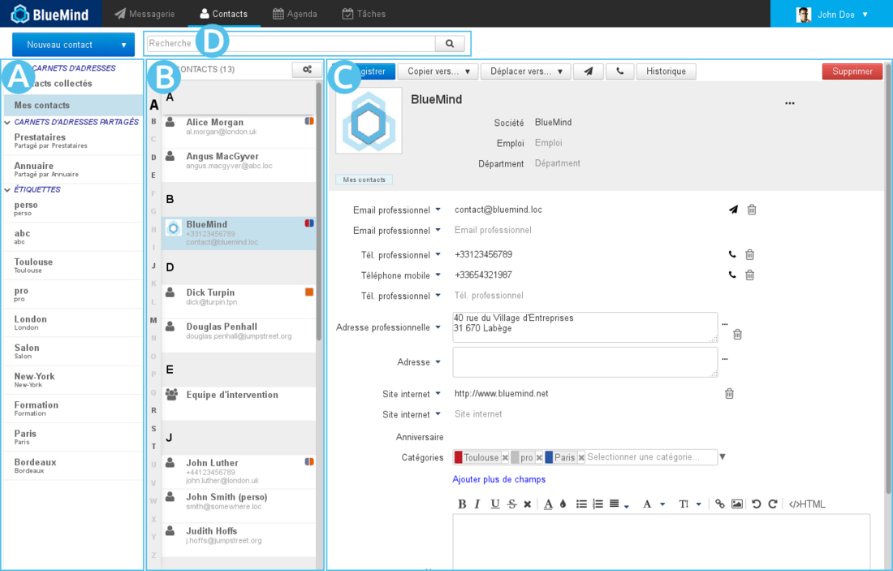
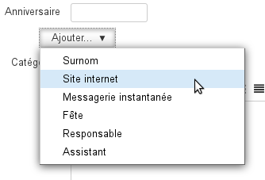
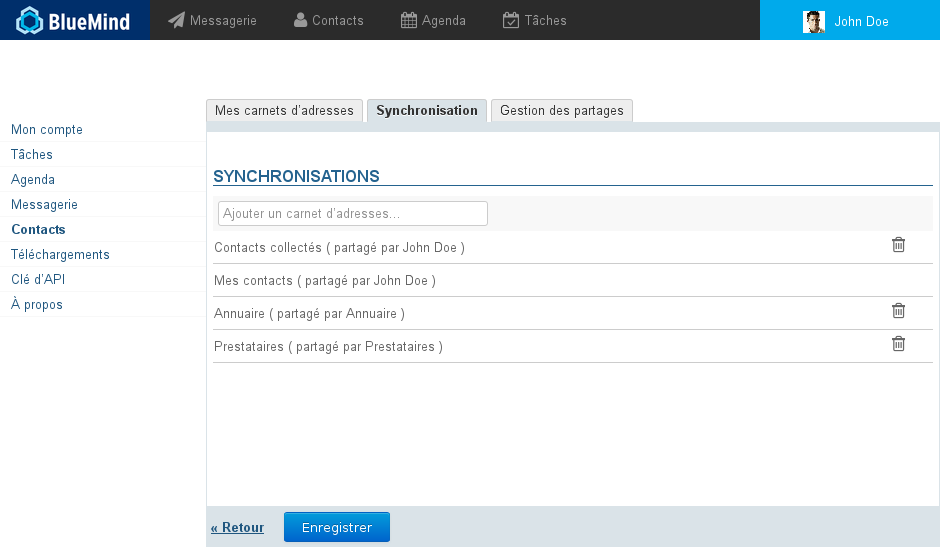

# Erste Schritte mit den Kontakten

## Navigation in den Kontakten

-  : In der ersten Spalte, unterhalb der Schaltfläche "Neuer Kontakt", befindet sich die Liste der Adressbücher, auf die der Benutzer zugreifen kann: seine Standardadressbücher, seine persönlichen Adressbücher, Adressbücher, die mit ihm geteilt wurden und die er abonniert hat.
-  : In der zweiten Spalte wird die Liste der Kontakte angezeigt, die in dem in der ersten Spalte ausgewählten Adressbuch enthalten sind.

:::tip

Das Alphabet, das links in der Spalte senkrecht angezeigt wird, ermöglicht eine schnellere Navigation durch die Kontakte; Buchstaben, für die Kontakte vorhanden sind, werden zur besseren Sichtbarkeit schwarz und fett hervorgehoben.

:::

-  : In der dritten Spalte, dem Hauptanzeigebereich, wird die Kontaktkarte des in der zweiten Spalte ausgewählten Kontakts angezeigt.

-  : Suchfeld

## Kontakte

Für ausführliche Informationen über die Anwendung Kontakte von BlueMind siehe [Kontakte](/Guide_de_l_utilisateur/Les_contacts/)

### Hinzufügen eines Kontakts

Wenn Sie oben links auf der Seite auf  klicken, erscheint eine leere Kontaktkarte in 

Füllen Sie die gewünschten Felder aus und klicken Sie dann auf  oben links in 

**Der Kontakt wird in dem Adressbuch angelegt, das gerade abgefragt wird.**

### Bearbeitung eines Kontakts

Wenn ein Kontakt bearbeitet werden kann, wird seine Kontaktkarte als bearbeitbares Formular angezeigt. Um einen Kontakt zu bearbeiten, müssen Sie lediglich seine Kontaktkarte aufrufen.

Füllen Sie die gewünschten Felder aus und klicken Sie dann auf  oben links in 

:::tip

Um ein Feld hinzuzufügen, das nicht standardmäßig angezeigt wird, verwenden Sie die Schaltfläche "Felder hinzufügen":

:::

### Löschen eines Kontakts

Um einen Kontakt zu löschen, ist es wie für die Bearbeitung ausreichend (siehe vorheriger Abschnitt), die Kontaktkarte dieses Kontakts aufzurufen.

Sobald die Kontaktkarte in angezeigt wird, klicken Sie oben rechts auf die Schaltfläche  und bestätigen anschließend den Löschvorgang.

## Adressbücher

### Standardadressbücher

BlueMind bietet dem Benutzer standardmäßig 3 Adressbücher an:

- **Meine Kontakte**: ein persönliches Adressbuch, in dem der Benutzer seine Kontakte ablegen und verwalten kann.

- **Verzeichnis**: ein öffentliches Adressbuch, in das alle öffentlichen Benutzer der Domain aufgenommen werden. Dieses globale Adressbuch ist nicht editierbar und wird von BlueMind automatisch gefüllt; es enthält die Benutzer, die Verteilerlisten und die freigegebenen Mailboxen.
- **Gesammelte Kontakte**: In dieses Adressbuch werden automatisch die Empfänger von Nachrichten des Benutzers aufgenommen, die nicht im Verzeichnis enthalten sind.

### Verwaltung der Adressbücher

Die Verwaltung der Adressbücher erfolgt ausgehend von der Verwaltung der Benutzereinstellungen:

#### Adressbücher des Benutzers

Die erste Registerkarte gestattet die Verwaltung der Adressbücher des Benutzers:

- Im ersten Teil der Registerkarte können Sie ein neues Adressbuch anlegen, indem Sie z. B. Kontakte importieren, die in einer vCard-Datei enthalten sind.Nachdem Sie den Namen und ggf. die betreffende Datei angegeben haben, klicken Sie auf "Hinzufügen", um das Adressbuch anzulegen.
- Im zweiten Teil der Registerkarte wird die Liste der Adressbücher des Benutzers angezeigt.

:::info

Zu beachten:

- Die Adressbücher "Kontakte" (bzw. "Meine Kontakte") und "Gesammelte Kontakte" können nicht gelöscht werden.
- Das "Verzeichnis" erscheint nicht, weil keine Aktion möglich ist: Der Benutzer kann es weder freigeben, noch Kontakte in das Verzeichnis importieren, es löschen oder sich davon abmelden.

:::

#### Abonnements geteilter Adressbücher

Die zweite Registerkarte ermöglicht die Verwaltung der Abonnements gemeinsam genutzter Adressbücher (Domain, Benutzer, Gruppen usw.). :

- **Um ein Abonnement hinzuzufügen**, geben Sie den Namen des geteilten Adressbuchs ein und bestätigen Sie mit der Eingabetaste. Die automatische Vervollständigung erleichtert das Auffinden der Adressbücher, die mit dem Benutzer geteilt wurden (der Eigentümer oder Administrator des Adressbuchs hat dem Benutzer die Lese- und/oder Schreibberechtigung erteilt).
- **Um ein Abonnement für** ein Adressbuch** zu entfernen**, klicken Sie auf das Symbol  der entsprechenden Zeile.

:::info

Zu beachten:

Die Abonnements des globalen Adressbuchs und der persönlichen Adressbücher können nicht gelöscht werden, alle Benutzer haben sie automatisch und obligatorisch abonniert.

:::

#### Freigabe von Adressbüchern

Die dritte Registerkarte der Einstellungen der Kontakte ermöglicht Ihnen, Ihre persönlichen Adressbücher für andere Benutzer oder Gruppen in der Domain freizugeben.

1. Wählen Sie das Adressbuch aus, das Sie freigeben möchten.Ein Benutzer kann freigeben:
    - Seine persönlichen Adressbücher: Kontakte (oder "Meine Kontakte"), "Gesammelte Kontakte" und die von ihm erstellten Adressbücher.
    - Adressbücher, die an ihn delegiert wurden: Er verfügt über die Berechtigung "Kann dieses Adressbuch sehen, ändern und die Freigaben verwalten".
2. Wenn Sie das Adressbuch für alle Benutzer der Domain freigeben möchten, aktivieren Sie das Kontrollkästchen "Öffentliches Teilen erlaubt" und wählen die Art der Berechtigungen, die die Benutzer erhalten sollen.
3. ** **Empfohlene Wahl:** ** Wenn Sie Berechtigungen lieber individuell an bestimmte Benutzer oder Gruppen vergeben möchten, suchen Sie die entsprechenden Personen über das Eingabefeld und wählen Sie die zu vergebende Berechtigung.
4. Wenn Sie alle Berechtigungen wie gewünscht vergeben haben, bestätigen Sie mit "Speichern".

#### Wenn Sie mehr erfahren möchten

Weitere Einzelheiten über die Verwaltung der Adressbücher und die Funktionsweise der verschiedenen Teile finden Sie auf der Seite, die den [Einstellungen für Kontakte](/Guide_de_l_utilisateur/Les_contacts/Gestion_des_carnets_d_adresses/) gewidmet ist.

