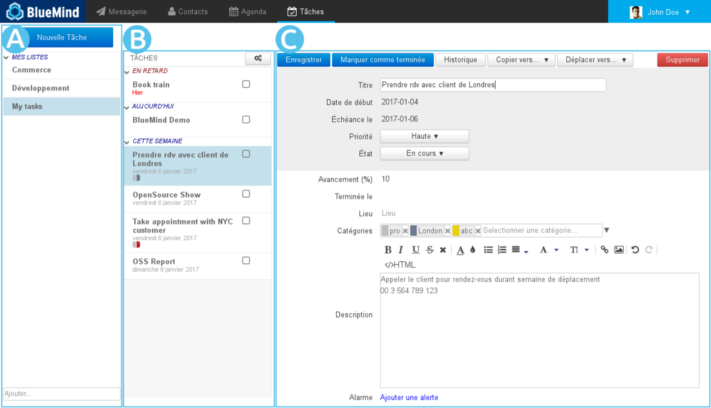
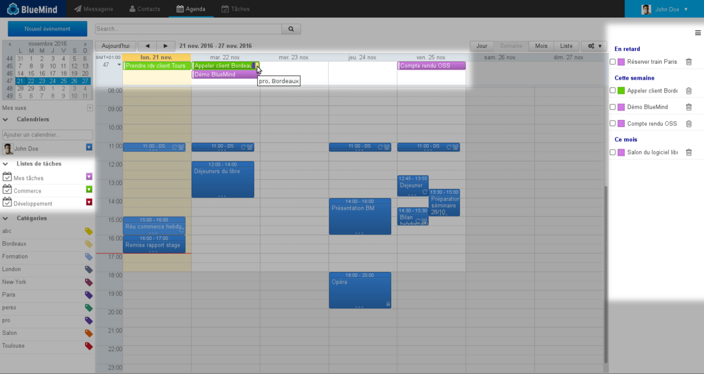

# Erste Schritte mit den Aufgaben

In dieser Anleitung werden die ersten Schritte mit der neuen BlueMind-Anwendung zur Verwaltung der Aufgaben erläutert.

Umfassende Informationen zur Verwaltung der Aufgaben finden Sie auf der Seite [Die Aufgaben](/Guide_de_l_utilisateur/Les_tâches/).

## Navigation in den Aufgaben

Die Hauptansicht der Verwaltung der Aufgaben umfasst drei Spalten:

-   : In der ersten Spalte befinden sich unter der Schaltfläche "Neue Aufgabe" die Aufgabenlisten, die der Benutzer abonniert hat: seine Standardliste "Meine Aufgaben" und andere Listen, die er erstellt hat oder die er (über die Verwaltung der Einstellungen) abonniert hat.
-  : In der zweiten Spalte befinden sich die in der ausgewählten Liste enthaltenen Aufgaben. Die Aktionsschaltfläche am oberen Rand der Spalte gestattet, Aufgaben aus der Liste zu exportieren oder in die Liste zu importieren.
-  : In der dritten Spalte, dem Hauptanzeigebereich, wird das Formular der in der zweiten Spalte ausgewählten Aufgabe angezeigt.

## Erstellen und Ändern einer Aufgabe

Über die Schaltfläche 

Wenn Sie auf eine Aufgabe klicken, werden deren Details in einem Formular angezeigt, das direkt bearbeitet werden kann:

- **Titel: Name oder Zusammenfassung der Aufgabe**
- Startdatum: Datum, an dem die Aufgabe beginnen soll
- Fällig am: Voraussichtliches Enddatum
- Priorität: niedrig, normal (Standard), hoch
- Status: aktueller Ausführungsstatus: nicht gestartet, abgeschlossen, in Bearbeitung, abgebrochen
- Fortschritt: der Prozentsatz der Fertigstellung einer Aufgabe kann während der Ausführung eingegeben werden
- Abgeschlossen am: effektives Enddatum
- Ort
- Tag: Tags werden mit den Kontakt- und Kalenderanwendungen geteilt, die zugänglichen Tags sind die der Domäne oder des Benutzers.
- Beschreibung: ausführlichere Beschreibung der Aufgabe, nützliche oder zusätzliche Informationen
- Alarm: Erinnerung, dass die Aufgabe in Angriff genommen werden muss

Wenn das Formular ausgefüllt ist, klicken Sie auf , um die Aufgabe zu erstellen oder Änderungen zu bestätigen.

## Eine Aufgabe abschließen

BlueMind bietet mehrere Möglichkeiten, um eine erledigte Aufgabe abzuschließen:

- Sie können auf die Schaltfläche  des Bearbeitungsformulars der Aufgabe klicken.
- verwenden Sie die Dropdown-Liste „Status“ im Bearbeitungsformular: 
- Sie können im Aufgabenbereich des Kalenders auf das Häkchen  klicken.

## Löschen einer Aufgabe

Wie für das Abschließen einer Aufgabe gibt es auch hier mehrere Möglichkeiten:

- Sie können auf die Schaltfläche  rechts oben im Bearbeitungsformular klicken.
- Sie können im Aufgabenbereich des Kalenders auf das Symbol des Papierkorbs   klicken.

## Integration von Aufgaben in den Kalender

Sie finden alle Ihre Aufgaben auch im Kalender vor. Die Listen werden wie die Kalender in der linken Spalte aufgeführt, die Aufgaben werden im Bereich "Tag" an ihrem Fälligkeitsdatum dargestellt und eine neue Spalte auf der rechten Seite der Ansicht gibt einen Überblick über die noch nicht abgeschlossenen Aufgaben:

Die Schaltfläche   ermöglicht Ihnen, den Aufgabenbereich ein- oder auszublenden:

Außerdem werden in diesem Bereich die wichtigsten Aktionen für Aufgaben vorgeschlagen: Abschließen oder Löschen.

