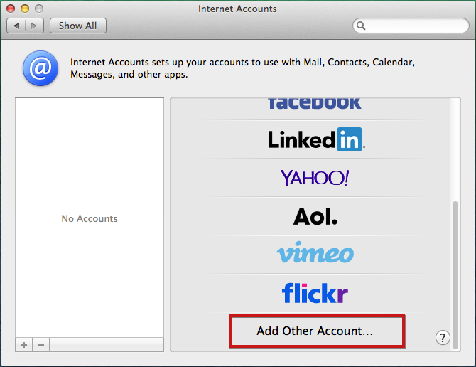
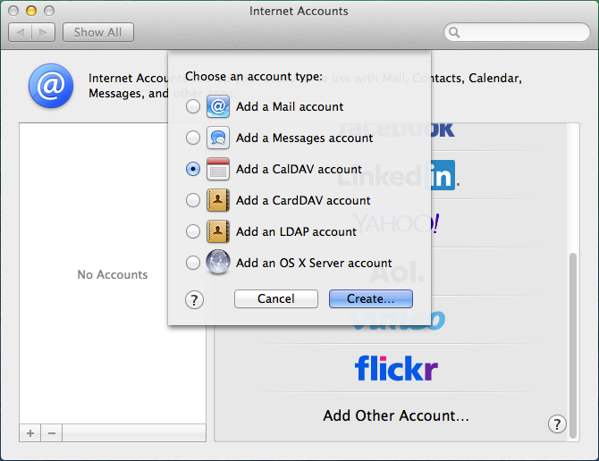
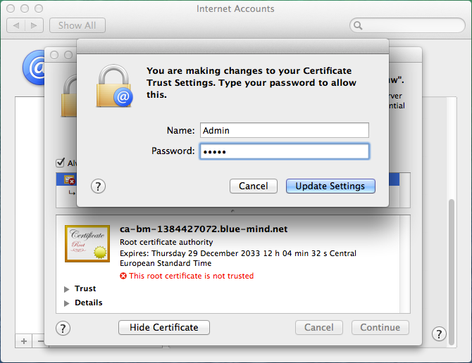
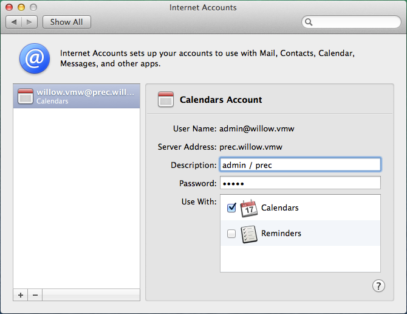
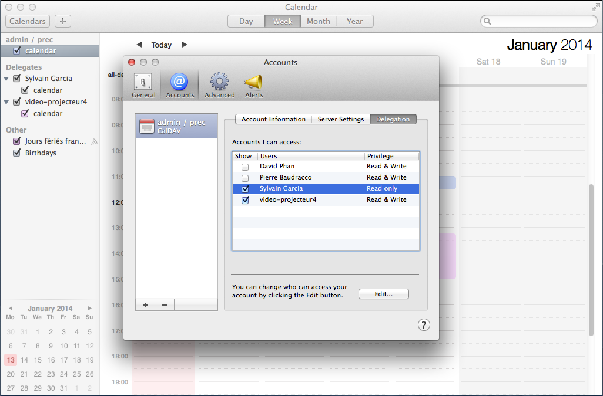

# Kalender-Konfiguration

## Präsentation

 

:::info

Die folgende Anleitung wurde unter OS X Mavericks erstellt.

Das CalDav-Protokoll ist derzeit nur mit **nativen** Mac OS X-Clients und vorzugsweise mit einem aktualisierten Betriebssystem validiert. Im Hinblick auf die Zulässigkeit der Norm ist es uns vorerst nicht möglich, den korrekten Betrieb bei anderen Kunden, die dieses Protokoll verwenden, zu zertifizieren.

:::

## Konfiguration eines CalDAV-Kontos

### Kontoerstellung

Gehen Sie in die Internetkonten-Verwaltung: Systemeinstellungen > „Internet Accounts“ („Internetkonten“):

Wählen Sie ‚Add other account“ („Anderes Konto hinzufügen“):

Wählen Sie „Add a CalDAV account“ („CalDAV-Konto hinzufügen“) und klicken Sie auf die Schaltfläche „Create“ („Erstellen“):

Wählen Sie den manuellen Kontotyp (ein automatisches Konto erfordert, dass DNS SRV-Einträge vorhanden sind) und geben Sie die Kontoinformationen ein:

- Der Benutzername muss der **vollständige **Benutzername mit der Domäne sein****. 
- Das Passwort ist das vom Administrator vergebene Passwort, mit dem Sie sich bei BlueMind anmelden.
- Die Adresse des Servers muss Ihnen von Ihrem Administrator mitgeteilt werden, sie hat in der Regel das Format &lt;Servername>.domain.com 

Klicken Sie auf „Create“ („Erstellen“).

Eine Warnung zeigt an, dass die Verbindung nicht sicher ist, was technisch nicht ganz richtig ist.

Bestätigen Sie die Warnmeldung.

Klicken Sie ein zweites Mal auf „Create“ („Erstellen“) und das System meldet, dass das Problem im „selbstsignierten“ Zertifikat besteht:

Ankreuzen „Always trust...“ („Immer vertrauen“), um dem Zertifikat zu vertrauen und klicken Sie auf „Continue“ („Weiter“), um fortzufahren:

Das Hinzufügen des Zertifikats durch Eingabe Ihres Benutzernamens und System-Passworts bestätigen.

Das Konto wird mit den folgenden Einstellungen erstellt:

:::info

Aktivieren Sie keine Erinnerungen, dies ist noch nicht implementiert.

:::

Starten Sie den Kalender, die Termine müssen angezeigt werden:

### Anzeigen gemeinsamer Terminkalender

Um sie im Kalender sehen zu können, muss der Benutzer die gewünschten Terminkalender zunächst in BlueMind abonnieren. Dazu muss der Vorgang unbedingt in der Web-Schnittstelle
durchgeführt werden:

- Gehen Sie zu Benutzereinstellungen > Rubrik Kalender > Registerkarte Abonnements
- Geben Sie den Namen des gesuchten Kalenders ein (Benutzer, Ressource usw.)
- Mit der Eingabetaste bestätigen oder in der von der Autovervollständigung vorgeschlagenen Liste wählen
- **Klicken Sie auf die Schaltfläche „Speichern“, um die Änderungen zu speichern.**

*Für weitere Informationen, siehe Seite **[Kalender-Einstellungen](/old/Guide_de_l_utilisateur/L_agenda/Préférences_de_l_agenda/)*.

Sind die Abonnements in BlueMind abgeschlossen, gehen Sie zu den Kalendereinstellungen > Registerkarte „Konten“ > wählen Sie das erstellte Konto > Rubrik „Delegation“: Die Kalender, auf die der Benutzer Zugriff hat (seine eigenen und die, für die er Freigabeberechtigungen erhalten hat), werden angezeigt.
Markieren Sie die Kästchen in der Spalte „Anzeigen“, um die anzuzeigenden Kalender auszuwählen:

 

 

 

 

 

 

 

 

 

 

Speichern

