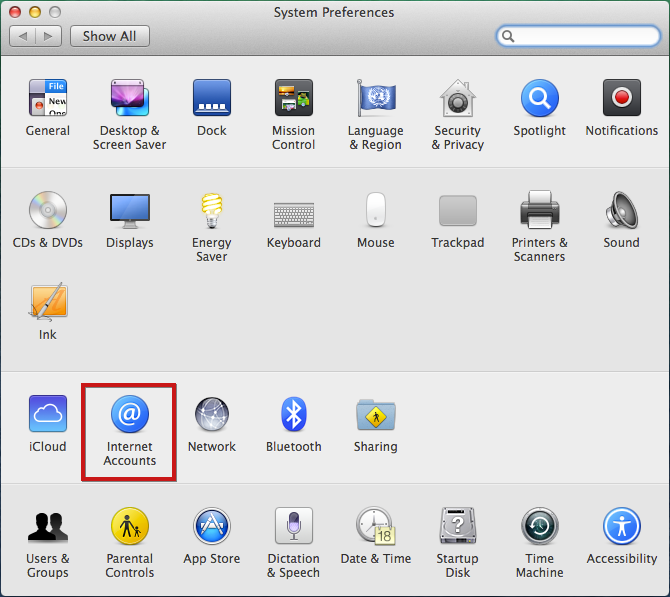
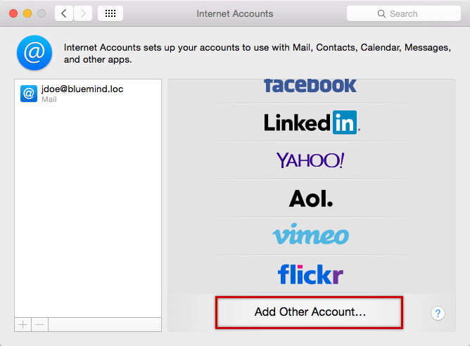
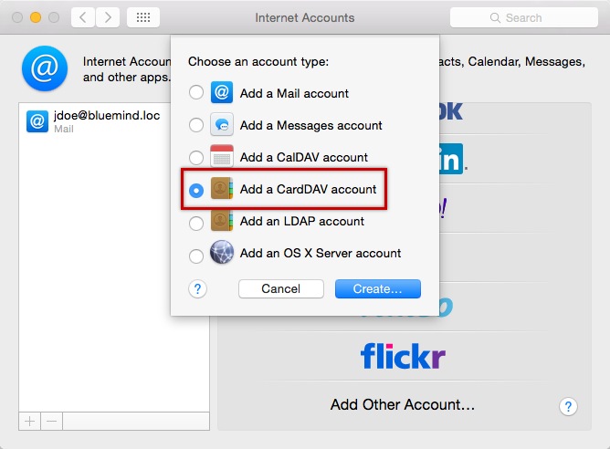
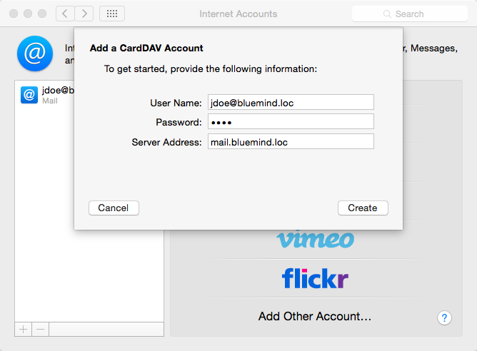
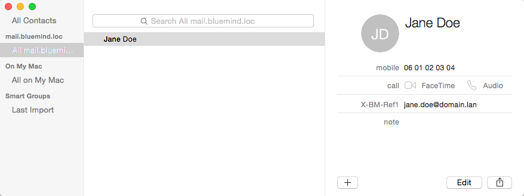

# Konfiguration der Kontakte

## Präsentation

:::info

Die folgende Anleitung wurde unter einem Yosemite OS X erstellt.

Das CardDav-Protokoll ist derzeit nur mit **nativen** Mac OS X-Clients und vorzugsweise mit einem aktualisierten Betriebssystem validiert. Im Hinblick auf die Zulässigkeit der Norm ist es uns vorerst nicht möglich, den korrekten Betrieb bei anderen Kunden, die dieses Protokoll verwenden, zu zertifizieren.

:::

## Konfiguration eines CardDAV-Kontos

### Kontoerstellung

Gehen Sie in die Internetkonten-Verwaltung: Systemeinstellungen > „Internet Accounts“ („Internetkonten“):

Wählen Sie „Add other account“ („Anderes Konto hinzufügen“):

Wählen Sie „Add a CardDav account“ („CardDav-Konto hinzufügen“):

Bestätigen Sie mit der Schaltfläche „Create“ („Erstellen“)

Geben Sie die Anmeldeinformationen für das Benutzerkonto ein:

- Benutzername: Benutzername (vollständiger Name einschließlich der Domäne, normalerweise die primäre E-Mail-Adresse des Benutzers)
- Passwort: Das Passwort ist das vom Administrator vergebene Passwort, mit dem Sie sich bei BlueMind anmelden.
- Server-Adresse: die Server-Adresse muss Ihnen von Ihrem Administrator mitgeteilt werden, sie hat im Allgemeinen das Format &lt;Servername>.domain.com

Bestätigen Sie durch Klicken auf „Create“ („Erstellen“)

Die Anwendung „Kontakte“ wird geöffnet, indem die Kontakte präsentiert werden:

:::info

Synchronisierte Elemente

Nur das persönliche Adressbuch des Benutzers („Meine Kontakte“) wird synchronisiert und steht für die Anzeige, Suche und Autovervollständigung in E-Mails zur Verfügung.

:::

