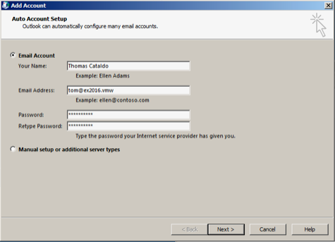
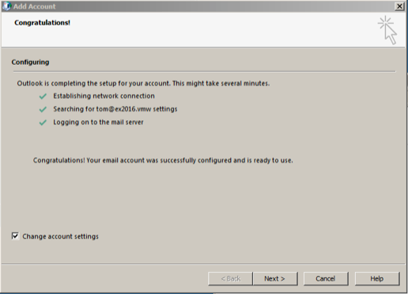
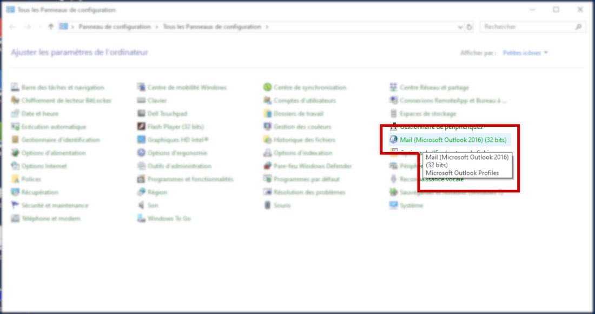
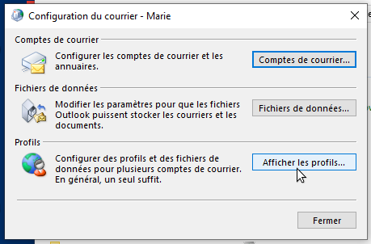
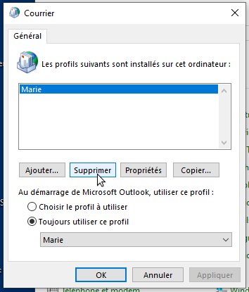
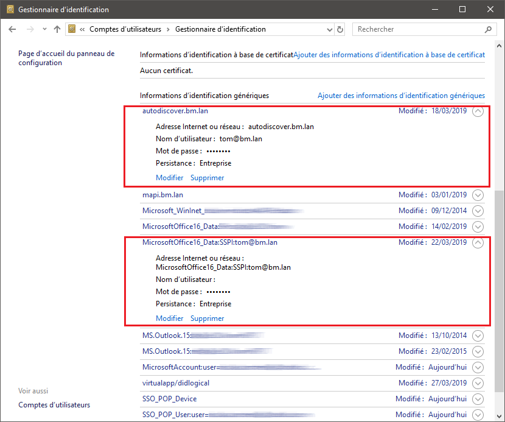
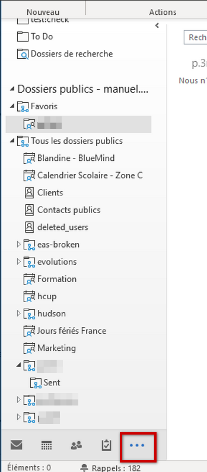

# Synchronisation mit Outlook


## Präsentation

Die Outlook-Synchronisation mit BlueMind 4.0 erfordert nicht mehr die Installation eines Connectors, der den Zugriff auf BlueMind-Funktionen aus Outlook ermöglicht. Von nun an können Sie alle Funktionen Ihres Outlooks in Verbindung mit Ihrer BlueMind-Mailbox voll nutzen.

Die Installation besteht aus 3 Teilen, von denen die ersten 2 von einem Administrator durchgeführt werden müssen:

1. [Serverseitige Installation](/Guide_de_l_administrateur/La_souscription_BlueMind/Mise_en_œuvre_de_MAPI_pour_Outlook/)
2. Konfiguration des Windows-Arbeitsplatzes, um die Verbindung mit dem Server herzustellen
3. Erstellen eines Kontos in Outlook


:::info

Wie bei den früheren Versionen von BlueMind wird die Nutzung von Outlook durch ein Abonnement ermöglicht. [Bitte kontaktieren Sie unser Vertriebsteam, um ein Testabonnement zu erhalten](https://content.bluemind.net/decouvrez-bluemind-4-0).

:::


:::info

Die Verwendung von Outlook in MAPI ohne Connector impliziert, dass der Connector keine [großen Anlagen abtrennen](/old/Guide_de_l_utilisateur/La_messagerie/Fichiers_volumineux_et_détachement_des_pièces_jointes/)kann, da dies eine BlueMind-Funktion ist, die derzeit vom Connector bereitgestellt wird.

:::

## Kompatibilität


:::info

Outlook für MacOS

Da die Kommunikationsprotokolle unterschiedlich sind, können wir nur die Kompatibilität mit Outlook **für Windows** garantieren.

**BlueMind 4 ist daher nicht mit Outlook-Versionen für MacOS kompatibel**.

:::

## Voraussetzung

1. Versionen:
    - [BlueMind 4.0](https://download.bluemind.net/bm-download/4.0) **mit Abonnement**
    - Client-Arbeitsplatz:
        - **Windows** 10 auf dem neuesten Stand
        - Outlook 2013 (oder höher) auf dem neuesten Stand
2. Externe und Autodiscover-URLs müssen vom Computer aus in HTTPS erreichbar sein: In einem Browser eingegeben müssen sie die BlueMind-Anmeldeseite anzeigen


## Outlook-Konfiguration

- Öffnen Sie die Software
- **Erstellen Sie ein neues Outlook-Profil: Das Konto darf nicht zu einem bereits existierenden Profil hinzugefügt werden **
- Hinzufügen eines neuen E-Mail-Kontos


:::info

Wählen Sie nicht die manuelle Konfiguration

:::

- Geben Sie die E-Mail-Adresse und das Passwort des Benutzers ein:



:::info

Es ist wichtig, die Standardadresse des Benutzers zu verwenden: Aliasnamen werden nicht korrekt berücksichtigt.

:::

- Nach wenigen Augenblicken meldet Outlook, dass das Konto erfolgreich hinzugefügt wurde:
- Aktivieren Sie „Kontoeinstellungen ändern“ und klicken Sie auf „Weiter“
-  **Aktivieren Sie „Exchange-Cache verwenden“ und bewegen Sie den Cursor so weit wie möglich nach rechts auf „Alle“:**  
- Klicken Sie auf „Beenden“


 **Es ist soweit! Ihr Outlook kommuniziert jetzt im nativen Modus mit BlueMind!** 

## Gemeinsam genutzte Mailboxen

BlueMind Version 4.3 ermöglicht dank einer neuen Abonnementfunktion, die mit der von Kalendern und Adressbüchern identisch ist, die Anzeige von freigegebenen Mailboxen in Outlook-Clients, die über MAPI verbunden sind.

Sie müssen sich nur mit Ihrem BlueMind-Konto verbinden und zu Ihrer Kontoverwaltung > Mailbox Registerkarte Abonnements gehen.

Weitere Details zum Anmeldeverfahren und dessen Auswirkungen finden Sie auf den entsprechenden Seiten:

- [Geteilte Posteingänge - Abonnements und Software von Drittanbietern](/old/Guide_de_l_utilisateur/La_messagerie/Les_boites_aux_lettres_partagées/#Lesboitesauxlettrespartagees-abonnements)
- [Einstellungen für das E-Mail-System - Abonnements](/old/Guide_de_l_utilisateur/La_messagerie/Preferences_de_messagerie/#Preferencesdemessagerie-abonnements)


## Bekannte Probleme

### Kompatibilität

BlueMind 4 ist nur mit Outlook **für Windows** kompatibel.

Outlook für MacOS-Versionen werden nicht unterstützt.

### Im Computer ist bereits ein Profil vorhanden

Gehen Sie in Outlook auf Datei > Konto verwalten > Profile verwalten


:::info

Je nach Outlook- und/oder Windows-Version kann es sein, dass es die Option „Profile verwalten“ in diesem Menü nicht gibt. Gehen Sie in diesem Fall in die Systemsteuerung des Computers und wählen Sie „Mail“ („Mail“ kann auch in französischen Systemen erscheinen):



:::

Klicken Sie auf die Schaltfläche „Profile anzeigen“:



Wählen Sie das Profil und löschen Sie es:



**Starten Sie Outlook neu.**


Bei Problemen und persistenten Daten können alle Daten wie folgt gelöscht werden:

Gehen Sie in einem Browser zu `%localappdata%\Microsoft` (kopieren Sie diese Zeichenfolge in das Zielfeld des Datei-Explorers) und löschen Sie das `Outlook-Verzeichnis` vollständig (Shift+Entf)

Gehen Sie dann zu `%APPDATA%%Roaming Microsoft` und löschen Sie das Outlook-Verzeichnis (Shift+Entf) (dies entspricht unter Windows10 `C:\users\[username]\AppData%Roaming Microsoft` )

### Fehlerhafte Kontoerstellung aufgrund eines falsch gespeicherten Passworts

** **Probleme/Symptome******:** Trotz Eingabe des Passworts kann das Konto nicht ertellt werden, Outlook zeigt immer an, dass das Passwort falsch ist

** **Ursache:** **  Der Benutzer hat bei einem früheren Versuch, ein Konto zu erstellen, ein falsches Passwort für dieses Konto gespeichert

** **Mögliche Überprüfung durch den Administrator:** ** In der Server-Protokolldatei `/var/log/nginx/access.log` befinden sich Zeilen wie diese:** **


```
192.168.61.133 - - [06/May/2019:16:57:53 +0200] "POST /autodiscover/autodiscover.xml HTTP/1.1" 401 0 "-" "Microsoft Office/16.0 (Windows NT 10.0; Microsoft Outlook 16.0.11601; Pro)"
```


oder


```
192.168.61.133 - tom@bm.lan [06/May/2019:16:58:31 +0200] "POST /mapi/nspi/?MailboxId=94a5c596-90a8-4985-91fd-57629ee06561@bm.lan HTTP/1.1" 200 149 "-" "Microsoft Office/16.0(Windows NT 10.0; Microsoft Outlook 16.0.11601; Pro)"
```


Diese Zeilen zeigen an, dass ein falsches Passwort für [tom@bm.lan](mailto:tom@bm.lan) bei der Kontoerstellung eingegeben wurde

** **Lösung:** **

Das falsche Passwort löschen:

- Sicherstellen, dass Outlook und der Bildschirm für Kontoerstellung geschlossen sind
- öffnen Sie den Identifikationsverwalter durch Eingabe von Windows + R
- `"control /name Microsoft.CredentialManager`" eingeben:
- Auf OK klicken (oder Taste &lt;Enter>)
- Löschen von Einträgen des Typs  `autodiscover.domaine.tld`  und  `MicrosoftOffice16\_SSPI:utilisateur@domaine.tld`  Zum Beispiel, um das Passwort aus *  [tom@bm.lan](mailto:tom@bm.lan)  * zu löschen:


### Freigegebene Mailboxen erscheinen nicht in den Ordnern des Benutzers

Geteilte Posteingänge befinden sich in den öffentlichen Ordnern. Diese finden Sie, indem Sie auf die Auslassungspunkte am unteren Ende des Baums klicken:




