# Synchronisation mit Android

## Präsentation

Die ActiveSync-Synchronisierung ist der bevorzugte Synchronisierungsmodus, da Sie damit sowohl Nachrichten als auch Kontakte und Kalender in einer einzigen Konfiguration synchronisieren, während Sie [bei der IMAP-Synchronisierung](/old/Guide_de_l_utilisateur/Configuration_des_peripheriques_mobiles/Synchronisation_avec_Android/Synchronisation_IMAP_sous_Android/) nur auf Ihre E-Mails zugreifen können.

Weitere Informationen finden Sie unter [Synchronisation externer Geräte](/old/Guide_de_l_utilisateur/Configuration_des_peripheriques_mobiles/).

:::info

Diese Anleitung wurde mit einem LG Nexus 5 unter Android 4.4.2 erstellt

Für andere Android-Handys ist die Bedienung gleich, auch wenn sich die Bildschirme erheblich unterscheiden können.

**Weitere Informationen über kompatible Modelle und bekannte Einschränkungen finden Sie auf Seite ** ** [Kompatibilität](/FAQ_Foire_aux_questions_/Compatibilité/) ** **.**

:::

## ActiveSync-Konto einrichten

:::info

Die Möglichkeit, ein Smartphone mit dem BlueMind-Server zu verbinden, hängt von der von den Administratoren festgelegten Berechtigungsrichtlinie ab. Vergewissern Sie sich, dass Sie berechtigt sind, eine Verbindung mit einem Smartphone herzustellen. Insbesondere erfordern einige Konfigurationen eine manuelle Autorisierung durch einen Administrator.

Siehe diese Seite: [EAS-Server-Konfiguration](/Guide_de_l_administrateur/BlueMind_et_mobilite/Configuration_du_serveur_EAS/).

:::

### Kontoerstellung

Gehen Sie in das Menü Ihres Handys und wählen Sie „Einstellungen“:

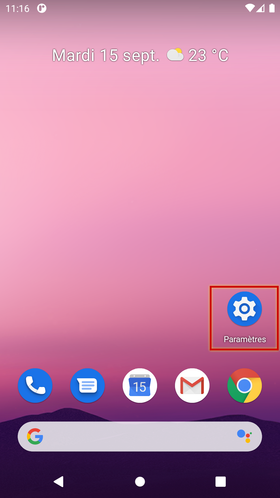

Zu Kontoverwaltung gehen:

Wählen Sie „Neues Konto hinzufügen“:

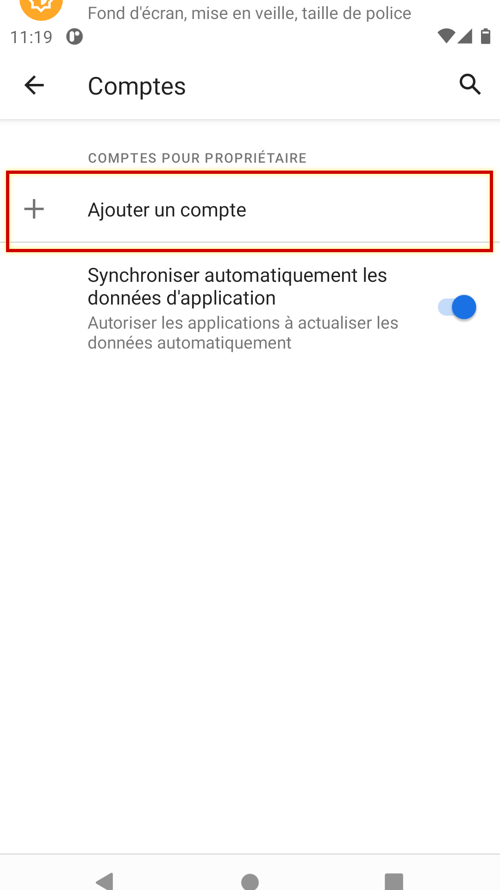

Erstellen Sie ein „Exchange“-Konto:

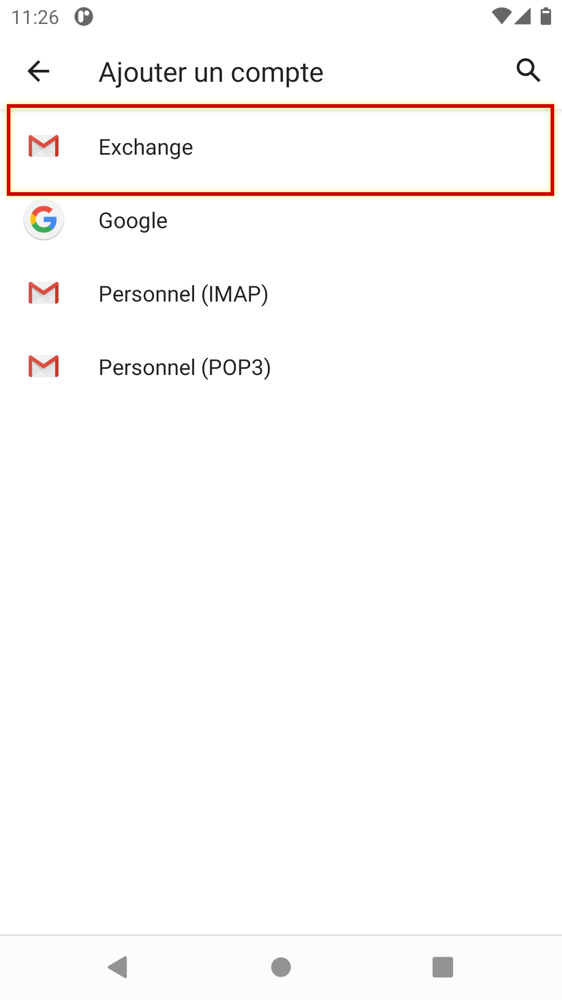

Geben Sie die E-Mail-Adresse und das Passwort des Benutzers ein und drücken Sie auf „Manuell konfigurieren“

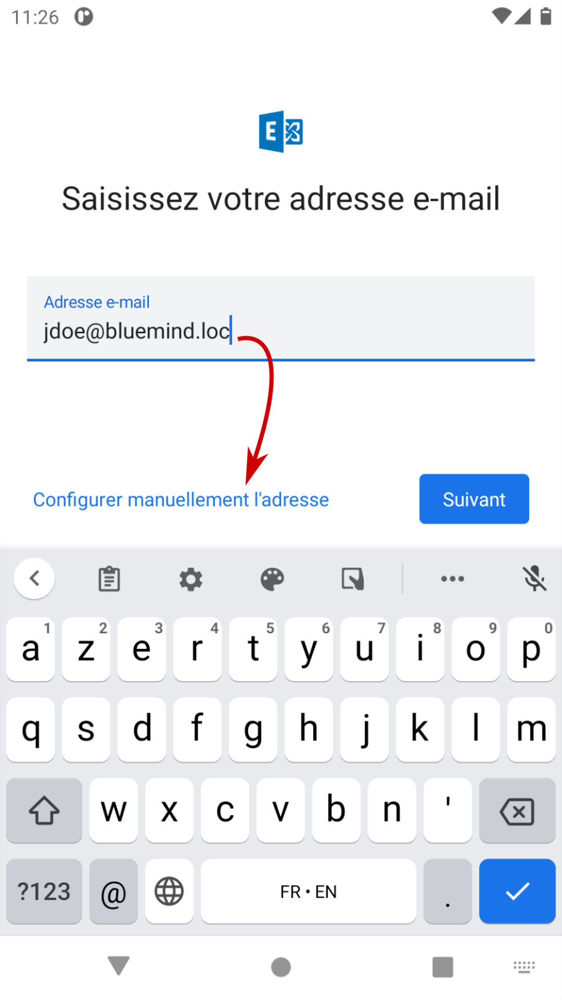

Die Informationen werden dann entsprechend der E-Mail-Adresse vorausgefüllt. Prüfen Sie, ob diese korrekt sind, ggf. muss die Serveradresse korrigiert werden:

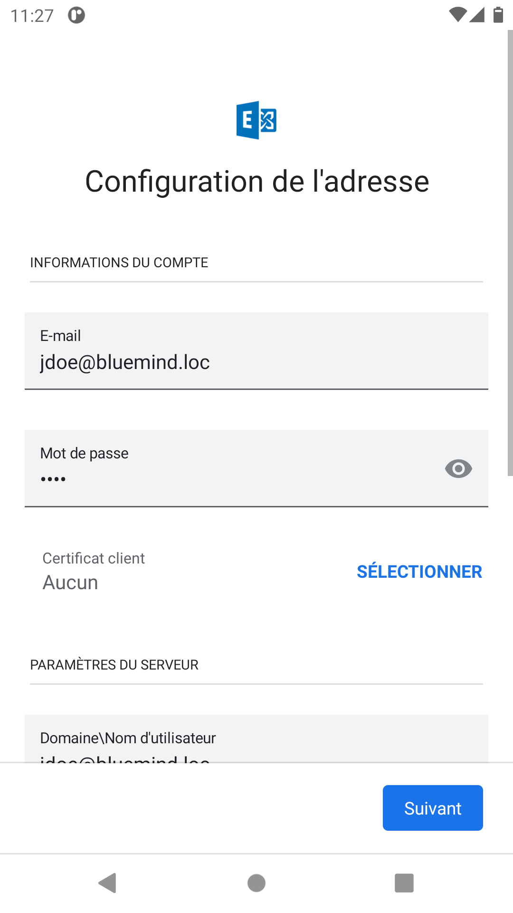 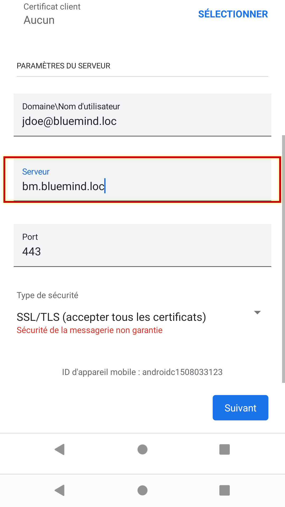

Außer in Sonderfällen:

- das Login ist identisch mit Ihrer E-Mail-Adresse
- die Serveradresse (hier *bluemind.loc*) ist identisch mit der Zugriffs-Url auf BlueMind ( https://entfernen). Wenn Sie zum Beispiel auf BlueMind über Ihren Browser unter  [https://bm.bluemind.loc](https://bm.domaine.com)  zugreifen, müssen Sie **bm.blumind.loc**eingeben

:::info

In einigen Android-Versionen ist ein zusätzliches Feld „Domäne\Benutzername“ erforderlich. In diesem Fall müssen die Domäne und der Benutzername in diesem Feld ohne den rechten Teil der E-Mail-Adresse angegeben werden.
Zum Beispiel in unserem Fall: `bluemind.loc\jdoe`

Einige Mobilgeräte akzeptieren auch die vollständige E-Mail-Adresse des Benutzers für dieses Feld.

:::

Bestätigen Sie ggf. die Zugangsberechtigung mit „OK“:

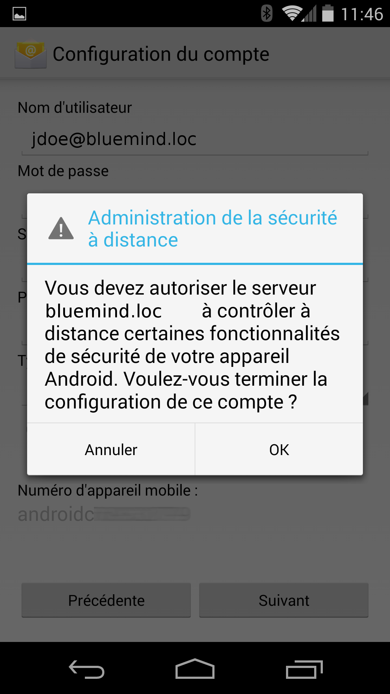

Das Gerät führt dann die Einstellungen durch und zeigt die Bestätigung des erfolgreichen Abschlusses an:

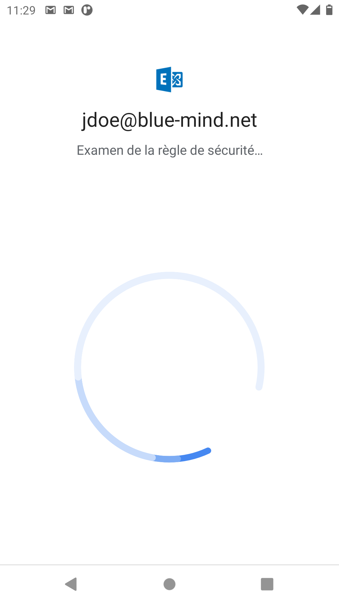 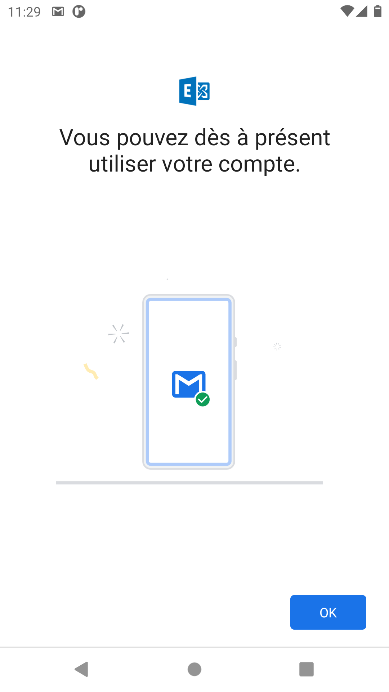

Klicken Sie zum Abschluss auf OK.

### Auswahl der zu synchronisierenden Elemente

:::info

Multi-Kalender

Da Android es nicht erlaubt, die verschiedenen Kalender farblich differenziert darzustellen, ist die Anzeige von gemeinsamen Kalendern standardmäßig nicht möglich, nur der Kalender des Benutzers wird angezeigt und funktioniert.

Die Funktion kann jedoch aktiviert werden, um sie mit einer Drittanwendung zu koppeln: [Mehrere Kalender auf Smartphones](/Base_de_connaissance/Multi_calendrier_sur_les_smartphones/)

:::

Die Synchronisationseinstellungen können in der Kontokonfiguration eingesehen und geändert werden:

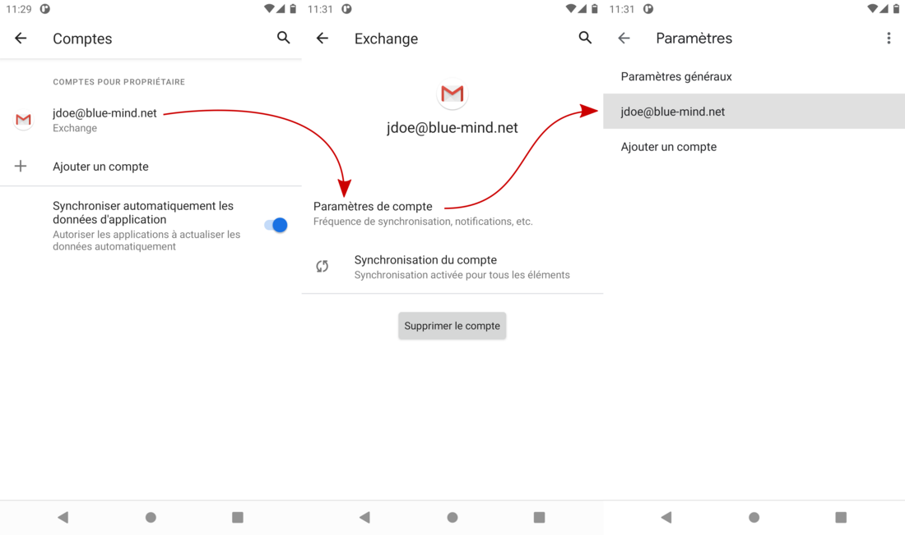

Drücken Sie auf „E-Mails synchronisieren ab“, um den Synchronisierungszeitraum zu wählen (die Standardeinstellung hängt vom Gerät ab, sie kann einen Monat oder nur eine Woche betragen):

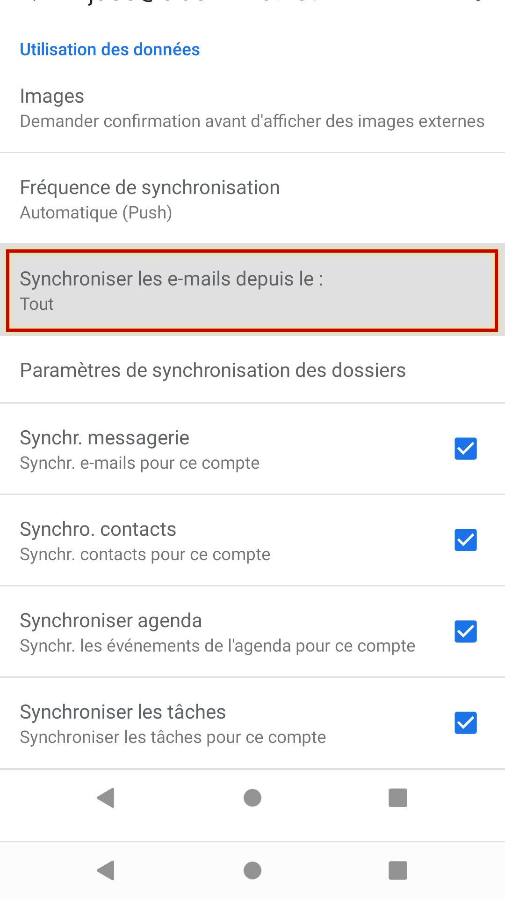 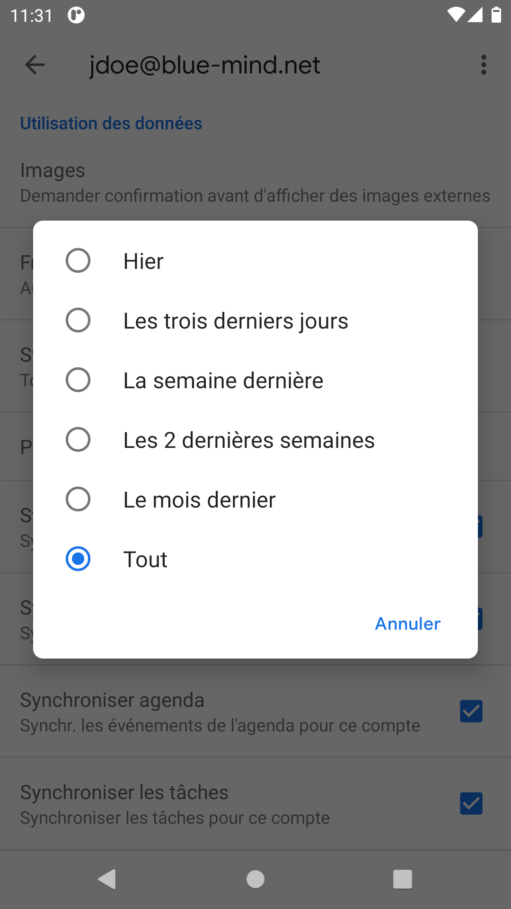

:::info

Synchronisationshäufigkeit

Standardmäßig ist dies die * [Push-Mail](http://fr.wikipedia.org/wiki/Push_mail) * die vorgeschlagen wird, d.h., dass der Server die E-Mails an das Telefon sendet, sobald sie empfangen werden. Bei den anderen Optionen prüft das Telefon in regelmäßigen Abständen den Server auf neue E-Mails.

:::

Weiter unten können Sie wählen, ob Sie alle Daten oder nur bestimmte aus der Mailbox (E-Mails), den Kontakten (Adressbuch „Meine Kontakte“) und dem Kalender (nur Ihren Kalender, siehe oben) synchronisieren möchten:

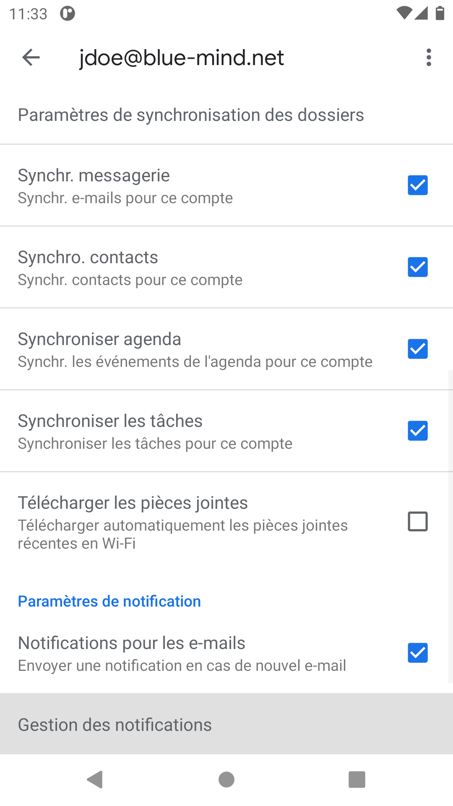
Hinweis: Obwohl die Auswahl „Aufgaben“ erscheint, erlauben nur sehr wenige Mobilgeräte unter Android die Synchronisierung von Aufgaben.

:::info

Kontakte

Nur das persönliche Adressbuch „Meine Kontakte“ wird mit dem Gerät synchronisiert, die Adressen der anderen Adressbücher, die [der Benutzer abonniert hat](/old/Guide_de_l_utilisateur/Les_contacts/Gestion_des_carnets_d_adresses/) (Verzeichnis, Gesammelte Kontakte usw.), sind jedoch über die Suchfunktionen des Smartphones zugänglich (Kontakte, E-Mail, Telefonanruf usw.)

:::

