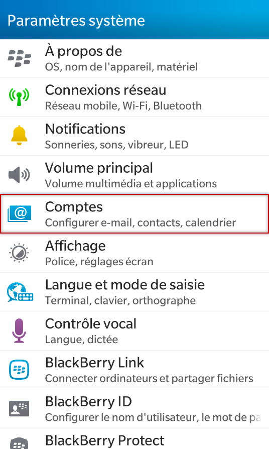
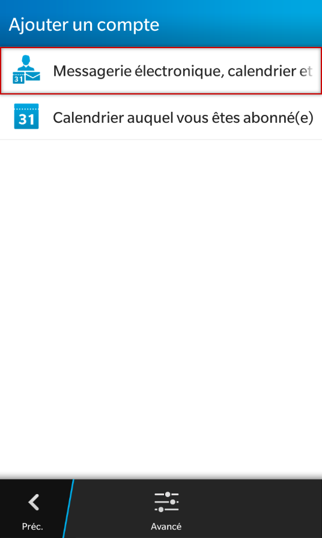
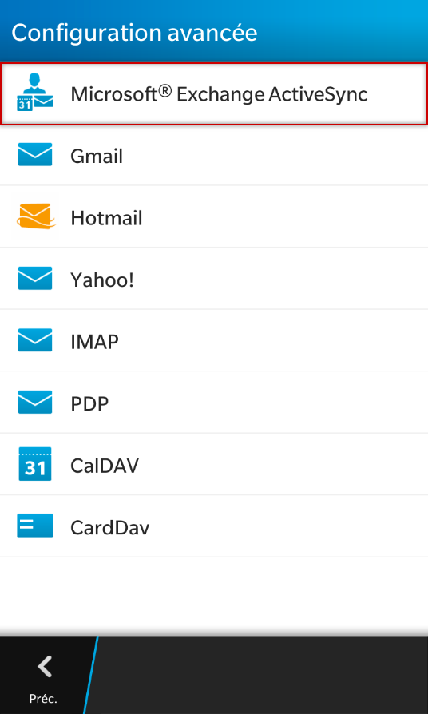
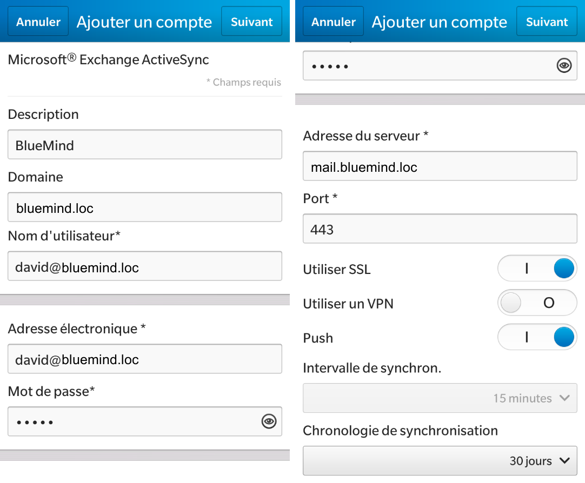
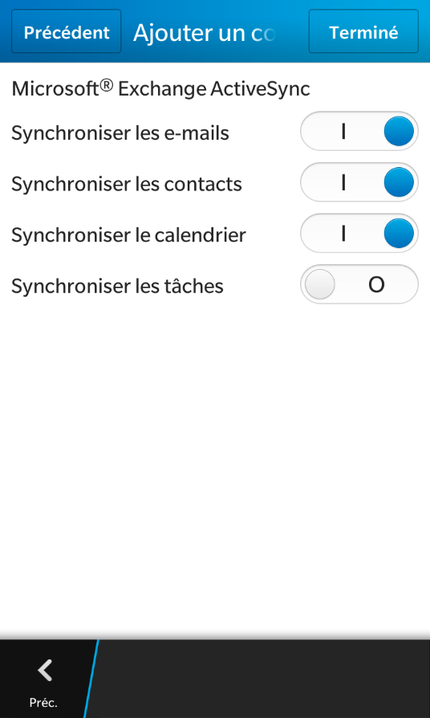
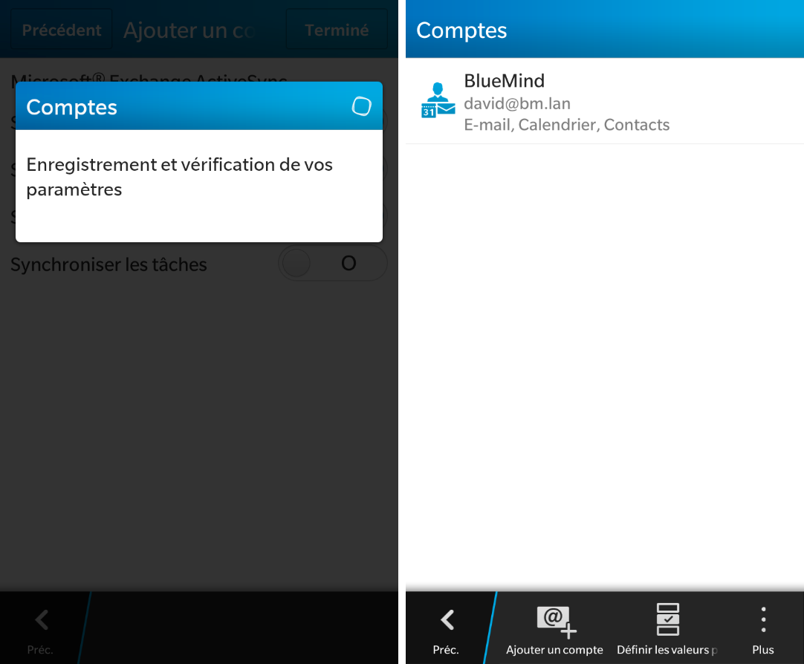
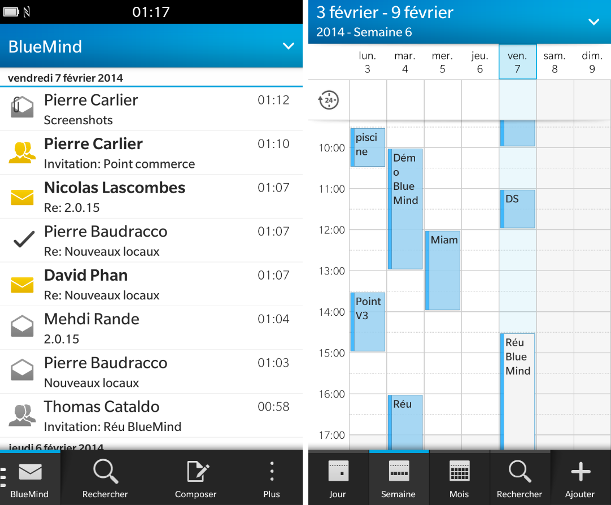
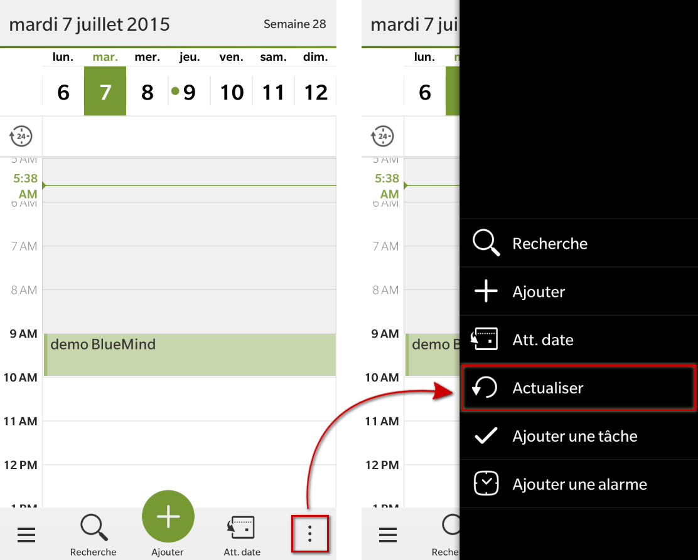

# Synchronisation mit Blackberry

:::info

Die Möglichkeit, ein Smartphone mit dem BlueMind-Server zu verbinden, hängt von der von den Administratoren festgelegten Berechtigungsrichtlinie ab. Vergewissern Sie sich, dass Sie berechtigt sind, eine Verbindung mit einem Smartphone herzustellen. Insbesondere erfordern einige Konfigurationen eine manuelle Autorisierung durch einen Administrator.

Siehe diese Seite: [EAS-Server-Konfiguration](/Guide_de_l_administrateur/BlueMind_et_mobilite/Configuration_du_serveur_EAS/).

:::

## Präsentation

Die ActiveSync-Synchronisierung ist der bevorzugte Synchronisierungsmodus, da Sie damit sowohl Nachrichten als auch Kontakte und Kalender in einer einzigen Konfiguration synchronisieren, während Sie [bei der IMAP-Synchronisierung](/old/Guide_de_l_utilisateur/Configuration_des_peripheriques_mobiles/Synchronisation_avec_Blackberry/Synchronisation_IMAP_du_Blackberry/) nur auf Ihre E-Mails zugreifen können.

Weitere Informationen finden Sie unter [Synchronisation externer Geräte](/old/Guide_de_l_utilisateur/Configuration_des_peripheriques_mobiles/).

:::info

Diese Anleitung wurde auf Blackberry 10 OS erstellt. Je nach verwendeter Version sind die Bedienvorgänge gleich, auch wenn sich die Bildschirme erheblich unterscheiden können.

:::

## BlackBerry unterstützt

Es werden nur Geräte mit BlackBerry OS 10 (Q5, Q10) unterstützt.

## ActiveSync-Konto einrichten

### Kontoerstellung

Gehen Sie in den Systemeinstellungen auf „Konten“:

Fügen Sie ein Konto „E-Mail, Kalender und Kontakte“ hinzu:

Wählen Sie den Kontotyp Microsoft&lt;sup>®&lt;/sup> Exchange ActiveSync:

Geben Sie die Konto- und Serverinformationen ein:

Außer in Sonderfällen:

- das Login ist identisch mit Ihrer E-Mail-Adresse
- die Domäne ist Ihre E-Mail-Domäne: *bluemind.loc* in diesem Beispiel
- Die Serveradresse (bei diesem Beispiel *mail.bluemind.loc*) ist identisch mit der Adresse, über die Sie auf BlueMind zugreifen ( https:// wird entfernt).Greifen Sie z.B. auf BlueMind über Ihren Browser unter der Adresse **https://bm.domaine.com** zu, müssen Sie bm.domaine.com eingeben

### Auswahl der zu synchronisierenden Elemente

Aktivieren oder deaktivieren Sie im nächsten Bildschirm die zu synchronisierenden Elemente:

Klicken Sie abschließend auf „Fertig“

:::info

Nur die persönlichen Adressbücher werden mit den Smartphone-Kontakten synchronisiert, die Adressen der anderen Adressbücher (Verzeichnis, gesammelte Kontakte usw.) sind jedoch über die Suchfunktionen des Smartphones (Kontakte, E-Mails usw.) zugänglich

:::

### Ende der Erstellung

Das System speichert Ihre Konfiguration und Ihr Konto wird angezeigt:

Sie können jetzt Ihre E-Mails und Ihren Kalender auf Ihrem Blackberry abrufen!

## Erzwingen der Terminkalender-Aktualisierung

Um die Synchronisierung des Kalenders zu erzwingen, rufen Sie in der Kalenderanwendung das Menü unten rechts auf und drücken Sie „Aktualisieren“:

 

 

 

 

