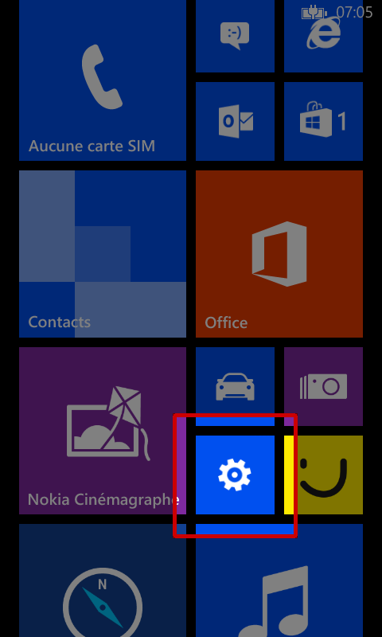
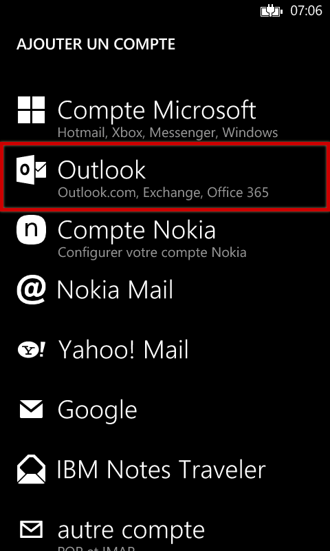
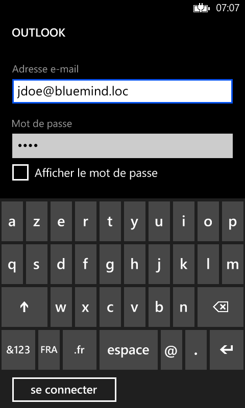
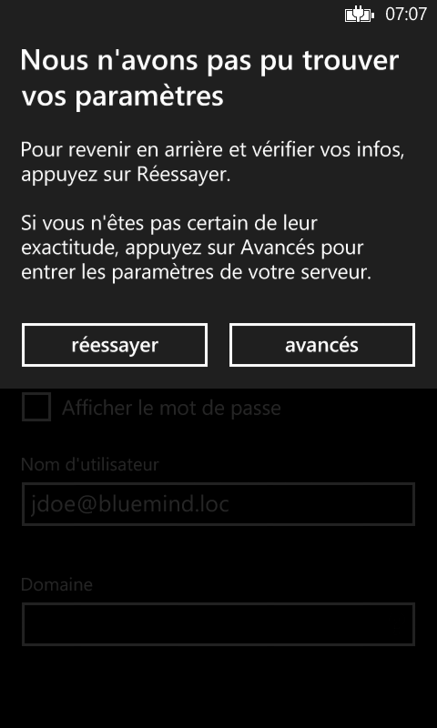
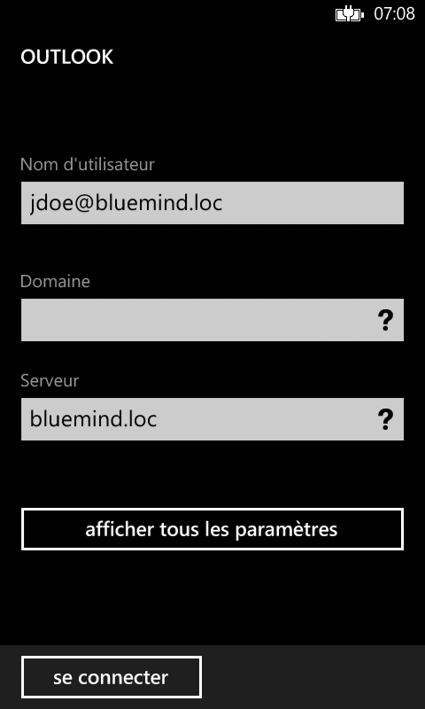
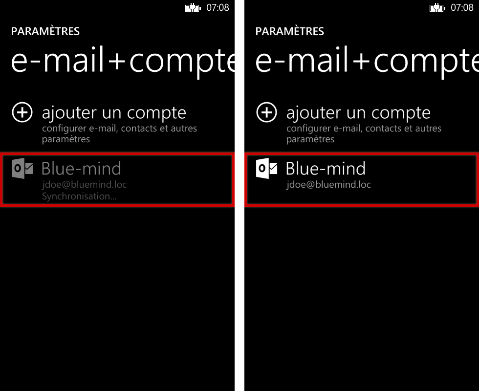
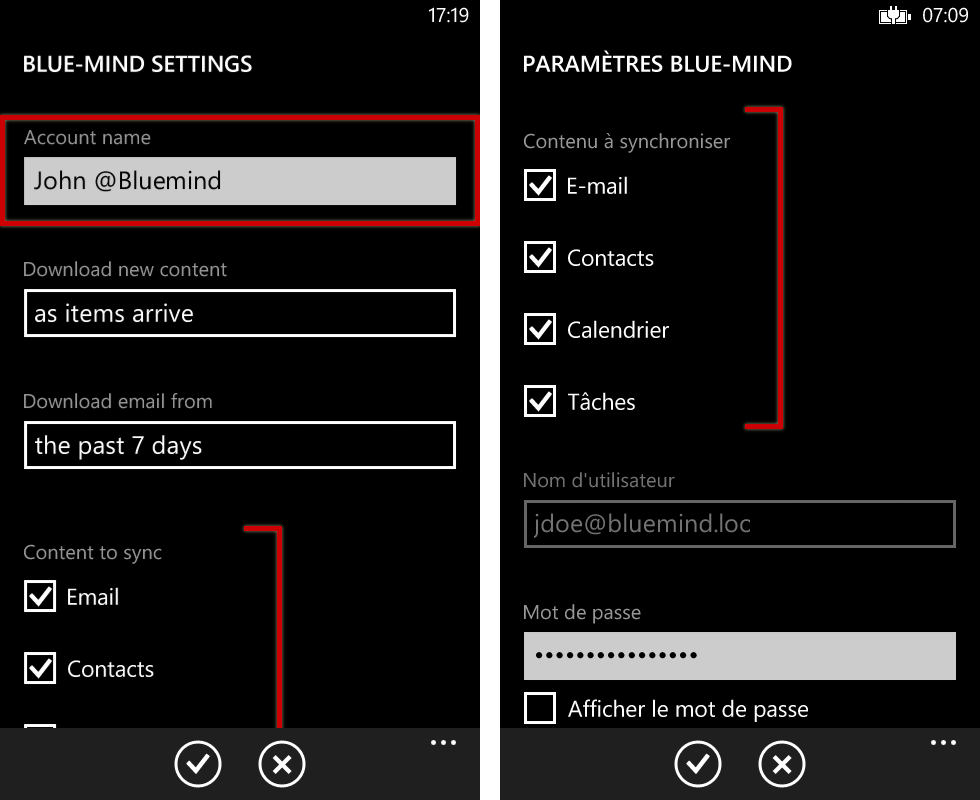
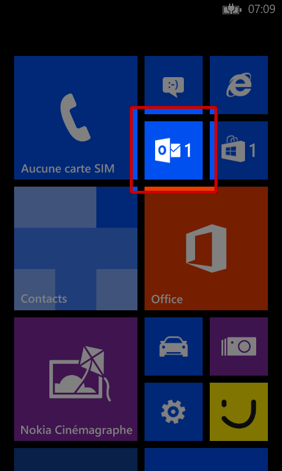
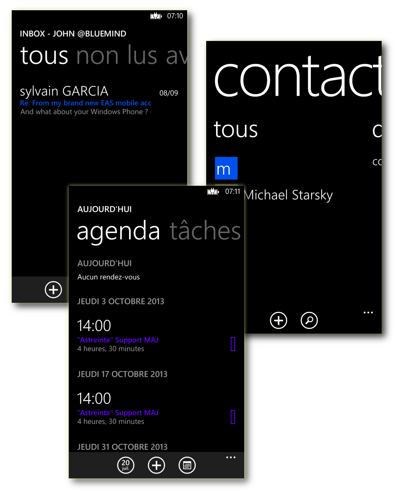
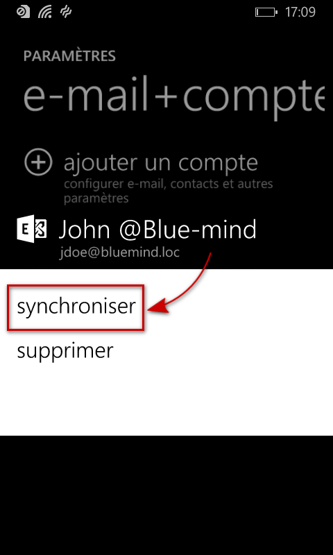

# Synchronisation mit Windows Phone

## Präsentation

Die ActiveSync-Synchronisierung ist der bevorzugte Synchronisierungsmodus, da Sie damit sowohl Nachrichten als auch Kontakte und Kalender in einer einzigen Konfiguration synchronisieren, während Sie bei der IMAP-Synchronisierung nur auf Ihre E-Mails zugreifen können.

Weitere Informationen finden Sie unter [Synchronisation externer Geräte](/old/Guide_de_l_utilisateur/Configuration_des_peripheriques_mobiles/).

 

:::info

Diese Anleitung wurde mit einem Nokia Lumia 520 unter Lumia Black (Windows Phone 8.0) erstellt

Bei anderen Windows Phone-Handys ist die Bedienung gleich, auch wenn sich die Bildschirme erheblich unterscheiden können.

:::

## Konfiguration des Kontos

:::info

Die Möglichkeit, ein Smartphone mit dem BlueMind-Server zu verbinden, hängt von der von den Administratoren festgelegten Berechtigungsrichtlinie ab. Vergewissern Sie sich, dass Sie berechtigt sind, eine Verbindung mit einem Smartphone herzustellen. Insbesondere erfordern einige Konfigurationen eine manuelle Autorisierung durch einen Administrator.

Siehe diese Seite: [EAS-Server-Konfiguration](/Guide_de_l_administrateur/BlueMind_et_mobilite/Configuration_du_serveur_EAS/).

:::

### Kontoerstellung

Gehen Sie auf dem Startbildschirm oder in der Anwendungsliste zu den Einstellungen:

Wählen Sie „E-Mail+Konten“:

Wählen Sie „Neues Konto hinzufügen“:

Wählen Sie ein „Outlook“-Konto:

Geben Sie Ihre E-Mail-Adresse und Ihr Passwort ein und tippen Sie „Verbinden“:

Windows Phone testet dann die Einstellungen für die automatische Verbindung.

Gelingt dies nicht, wechseln Sie in den erweiterten Modus:

Den Benutzernamen und Server korrigieren:

Außer in Sonderfällen:

- das Login ist identisch mit Ihrer E-Mail-Adresse
- die Serveradresse (hier *bluemind.loc*) ist identisch mit der Zugriffs-Url zu BlueMind ( https://wird entfernt).Wenn Sie z. B. auf BlueMind über Ihren Browser unter der Adresse [https://bm.bluemind.loc](https://bm.domaine.com) zugreifen, müssen Sie **bm.bluemind.loc**eingeben

Dann muss die Verbindung hergestellt werden; Windows Phone führt eine erste Synchronisation durch und das Konto erscheint in den Einstellungen:

### Auswahl der zu synchronisierenden Elemente

Nachdem das Konto korrekt erstellt wurde, können Sie den Namen in den Einstellungen anpassen, die zu synchronisierenden Elemente sowie die Häufigkeit (wann die Elemente ankommen, alle 30 Minuten, jede Stunde usw.) oder den Umfang (die letzten 7 Tage, der letzte Monat usw.) auswählen:

Von da an erscheint der Zugriff auf die Mailbox auf dem Startbildschirm mit einem Hinweis bei ungelesener Mail:

Alle Kontodaten sind synchronisiert und zugänglich: Nachrichten, Kontakte, Kalender:

## Erzwingen der Terminkalender-Aktualisierung

Um die Synchronisation des Terminkalenders zu erzwingen:

- gehen Sie zu Einstellungen > „E-Mail + Konten“
- drücken Sie lange auf das gewünschte Konto
- drücken Sie im angezeigten Menü auf „Synchronisieren“:

 

 

 

 

 

 

 

 

 

