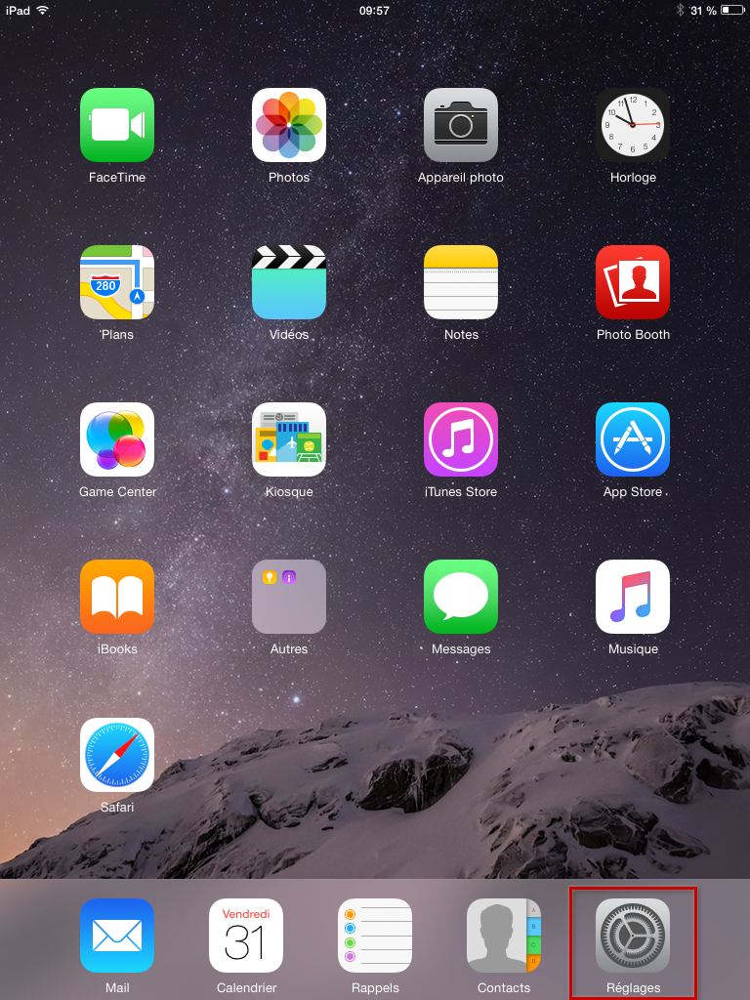
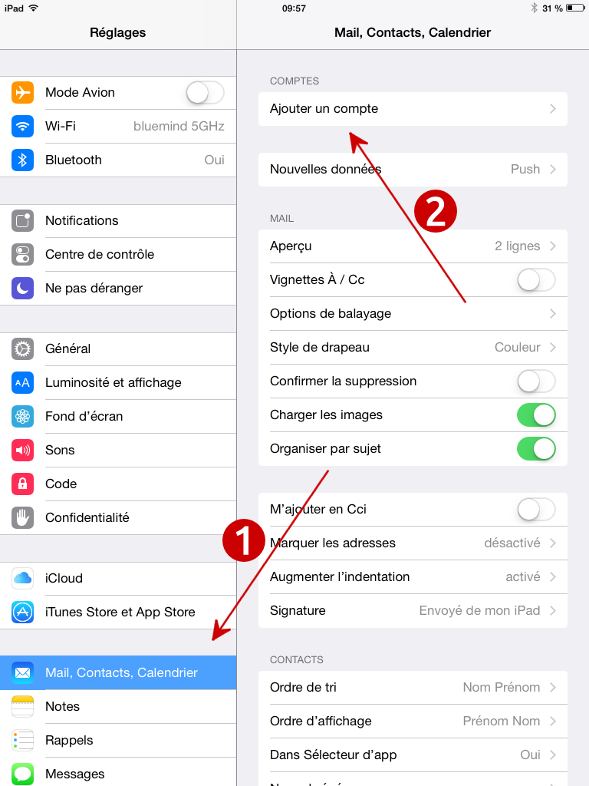
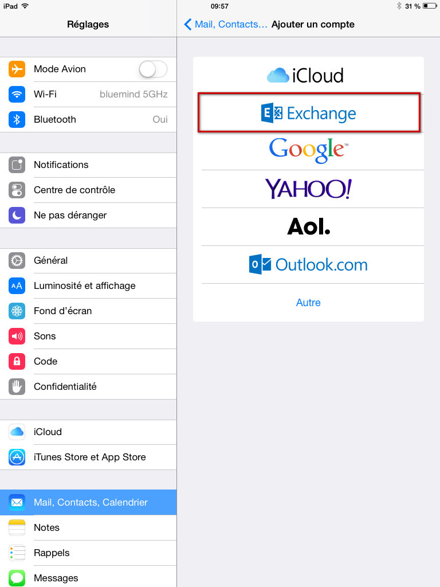
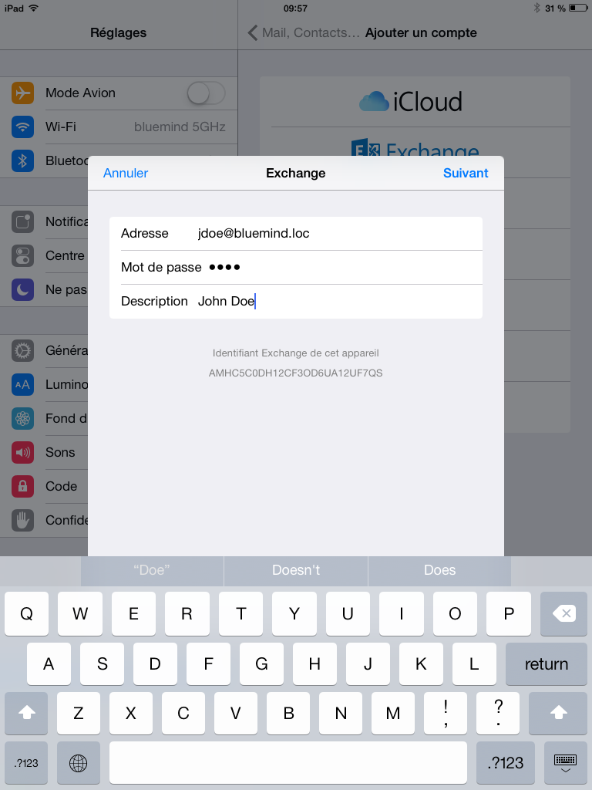
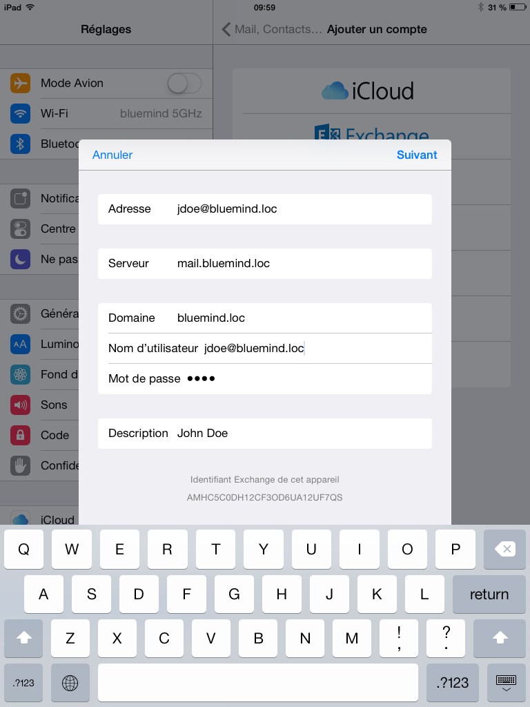
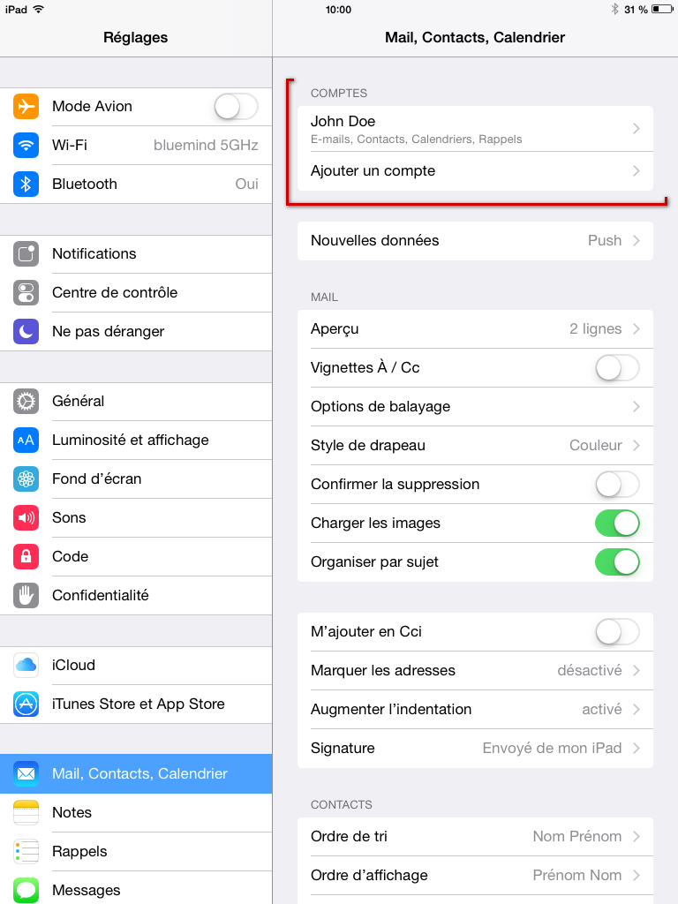
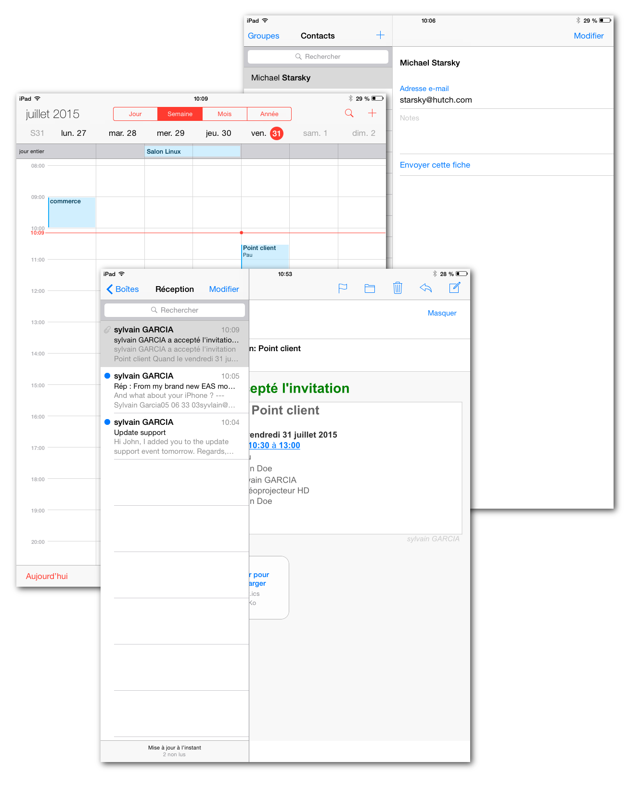
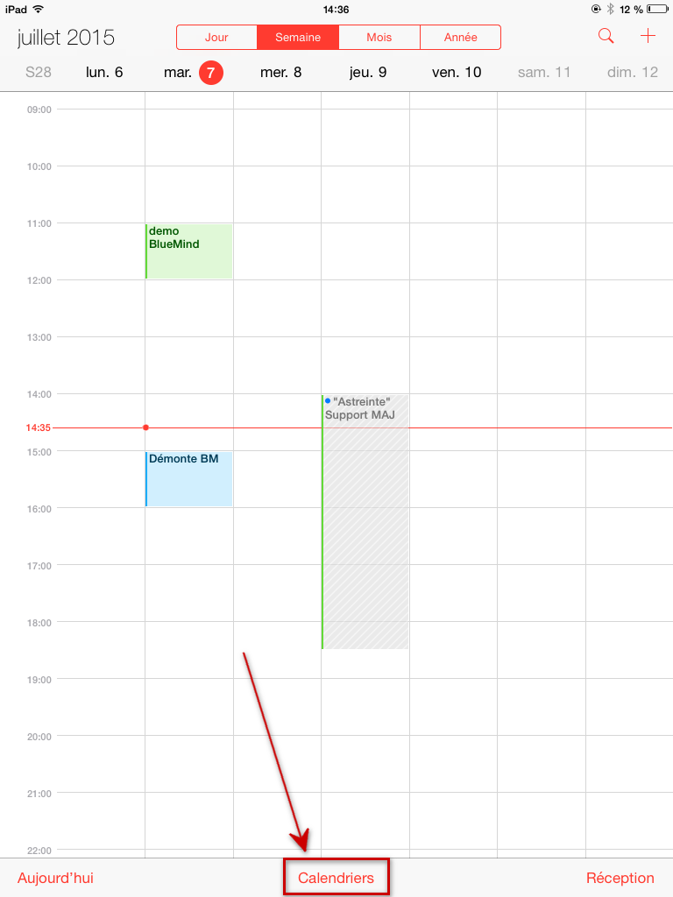
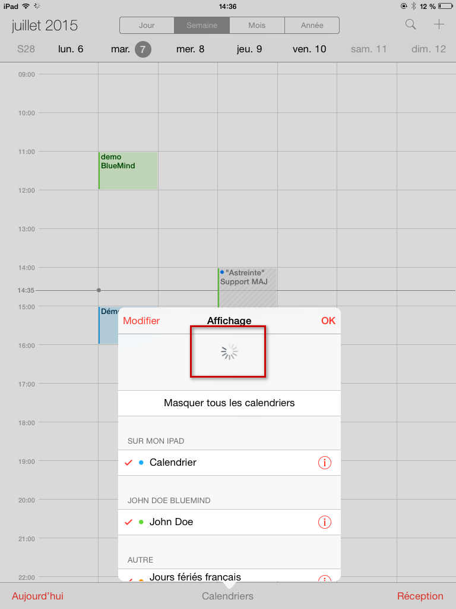

# Synchronisation mit iOS

## Präsentation

### Die Synchronisation

Die ActiveSync-Synchronisierung ist der bevorzugte Synchronisierungsmodus, da Sie damit sowohl Nachrichten als auch Kontakte und Kalender in einer einzigen Konfiguration synchronisieren, während Sie bei der [IMAP-Synchronisierung](/old/Guide_de_l_utilisateur/Configuration_des_peripheriques_mobiles/Synchronisation_avec_iOS/Synchronisation_IMAP_avec_iOS/) nur auf Ihre E-Mails zugreifen können.

Weitere Informationen finden Sie unter [Synchronisation externer Geräte](/old/Guide_de_l_utilisateur/Configuration_des_peripheriques_mobiles/).

:::info

Diese Anleitung wurde mit einem IPad-Modell erstellt. Die Bildschirme sind im Allgemeinen bei allen Apple-Produkten identisch, können aber je nach Version abweichen.

:::

### Synchronisierte Elemente

#### Kontakte

Apple-Mobilgeräten, die über EAS synchronisiert werden, kommt nun die Synchronisation mehrerer Adressbücher zugute: persönliche und gemeinsame Adressbücher.

So können alle Adressbücher des Benutzers (außer dem Sammeladressbuch und dem Verzeichnis) synchronisiert werden.

Die Datensätze der gesammelten Adressbücher und des Verzeichnisses sind jedoch über die E-Mail-Anwendung zum Versenden von Nachrichten, Kalender zum Einladen von Teilnehmern und Kontakte zum Abrufen der Aufzeichnungen per Suche und durch Autovervollständigung zugänglich. Gehen Sie dazu in Gruppen > Globale Mailingliste > und geben Sie die gewünschte Suche in das entsprechende Feld ein.

:::tip

Unter iOS wird die Suche erst ab dem 4. eingegebenen Zeichen gestartet.

:::

#### Kalender

iOS ermöglicht die Synchroniserung aller persönlichen und für den Benutzer freigegebenen Kalender.

## ActiveSync-Konto einrichten

:::info

Die Möglichkeit, ein Smartphone mit dem BlueMind-Server zu verbinden, hängt von der von den Administratoren festgelegten Berechtigungsrichtlinie ab. Vergewissern Sie sich, dass Sie berechtigt sind, eine Verbindung mit einem Smartphone herzustellen. Insbesondere erfordern einige Konfigurationen eine manuelle Autorisierung durch einen Administrator.

Siehe diese Seite: [EAS-Server-Konfiguration](/Guide_de_l_administrateur/BlueMind_et_mobilite/Configuration_du_serveur_EAS/).

:::

Gehen Sie zu den Geräteeinstellungen > „E-Mails, Kontakte, Kalender“ und drücken Sie „Konto hinzufügen“:

 

Fügen Sie ein „Exchange“-Konto hinzu:

Geben Sie die Benutzerinformationen ein (die Beschreibung ist frei und wird zur Identifizierung des Kontos auf dem Gerät verwendet) und drücken Sie oben rechts auf „Weiter“:

Geben Sie detaillierte Informationen zur Serververbindung ein:

- **Adresse**: Ihre E-MailAdresse
- **Server**: Die Adresse (URL), unter der Ihr Telefon auf den Active-Sync-Dienst zugreifen muss. Dies ist im Allgemeinen das, was als *„externe URL“* bezeichnet wird, sie ist identisch mit der Adresse, unter der Sie auf BlueMind zugreifen (https:// wird entfernt).

- **Domäne**: Ihre E-Mail-Domäne, normalerweise die rechte Seite Ihrer E-Mail-Adresse.

- **Benutzername und Passwort**: Ihre BlueMind-E-Mail-Kennungen, die Ihnen von Ihrem Administrator mitgeteilt wurden. Normalerweise entspricht die Kennung Ihrer **vollständigen**E-Mail-Adresse, einschließlich der Domäne.

- **Beschreibung:** optional, ermöglicht die Identifizierung des erstellten Kontos in der Kontenliste

Drücken Sie auf „Weiter“.

Ihr iOS-Gerät versucht nun, eine Verbindung zu Ihrem BlueMind-Server herzustellen.

Danach können Sie die zu synchronisierenden Elemente auswählen, bevor Sie auf „Weiter“ oder „Speichern“ drücken:

Ihr Konto wird dann in der Kontoliste des Geräts angezeigt:

Durch Drücken dieser Taste können Sie auf die Änderung der Synchronisationseinstellungen (zu synchronisierende Elemente, Dauer) zugreifen:

Herzlichen Glückwunsch! Ihr Gerät ist nun mit BlueMind synchronisiert!

## Das Erzwingen der Kalenderaktualisierung

:::info

Dieser Teil der Anleitung wurde mit einem iPad unter iOS 8.4 erstellt

:::

Rufen Sie in der Anwendung das Kalenderfenster auf:

Verschieben Sie den Inhalt, indem Sie ihn nach unten ziehen:

Das Aktualisierungsrad erscheint und zeigt an, dass das Gerät die Kalender synchronisiert:

Wenn es verschwindet und der Inhalt wieder angezeigt wird, ist die Aktualisierung abgeschlossen.

