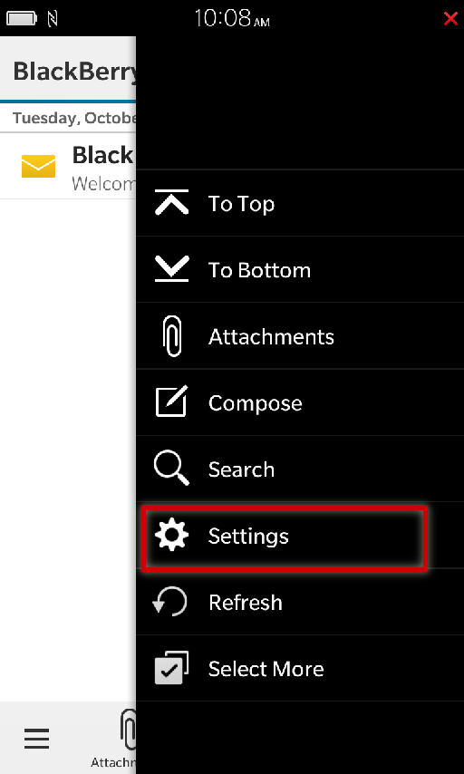
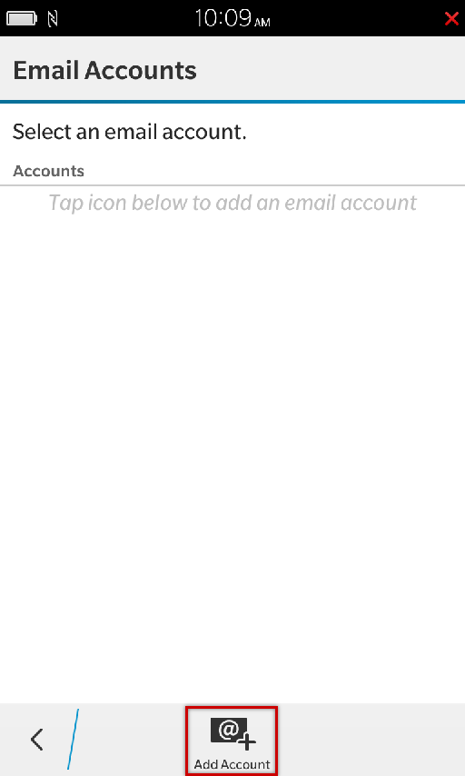
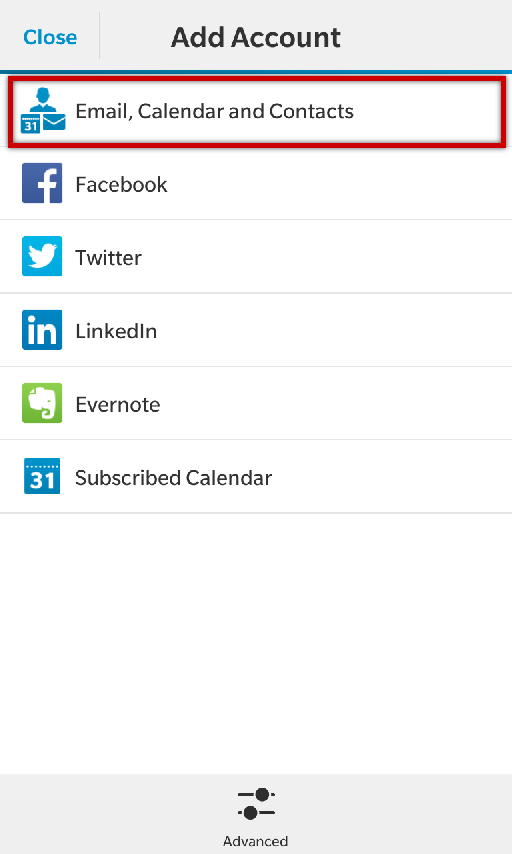
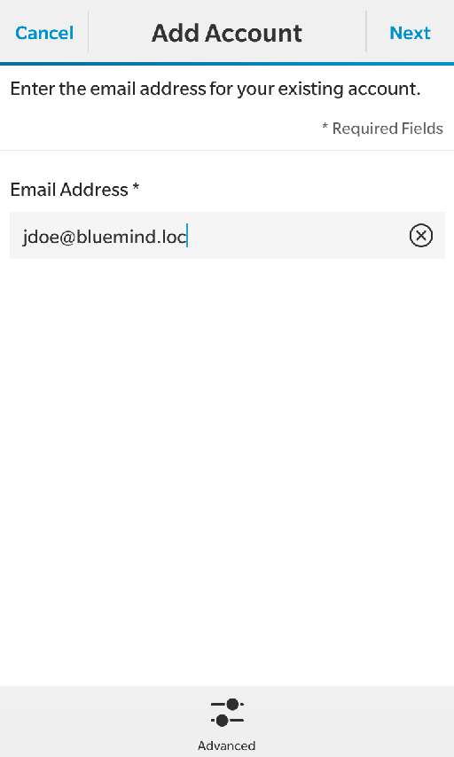
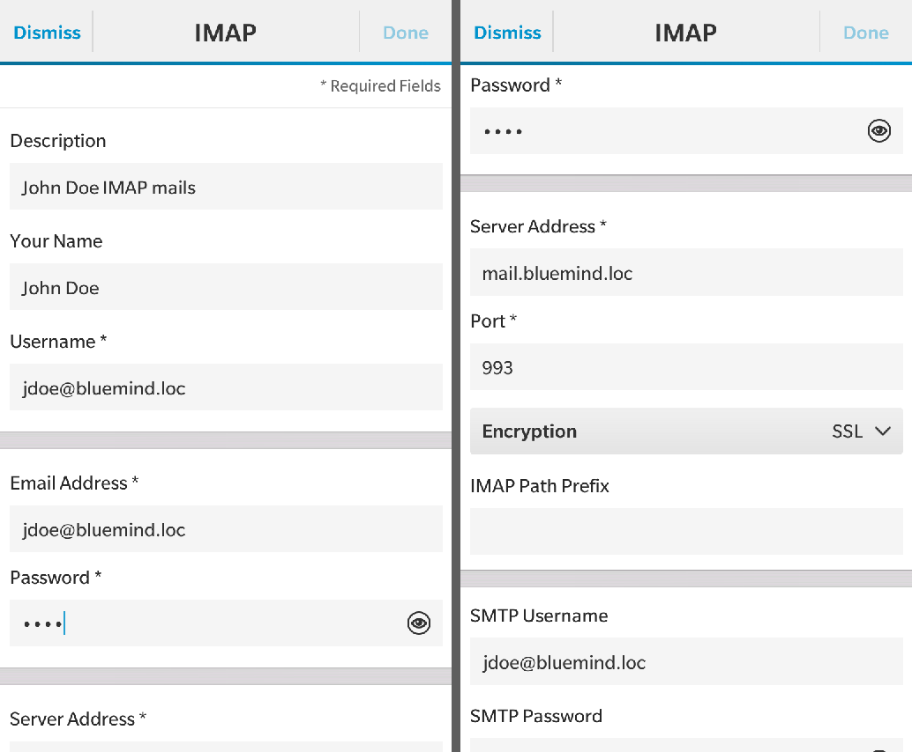
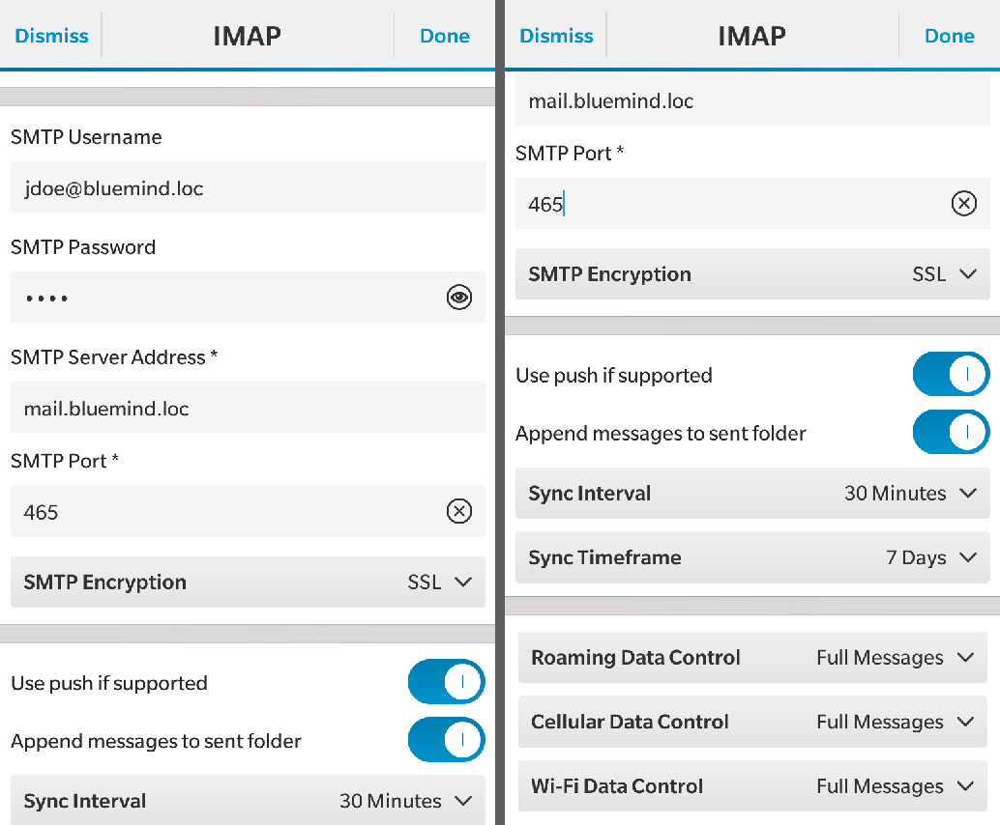
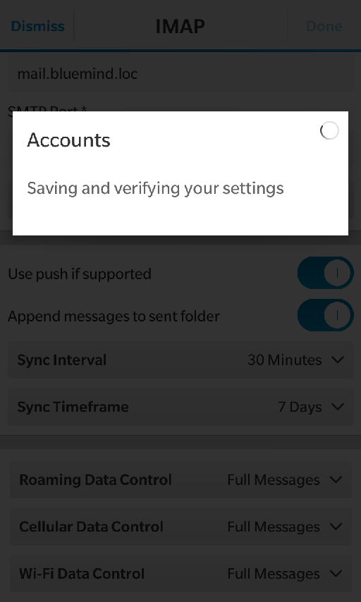
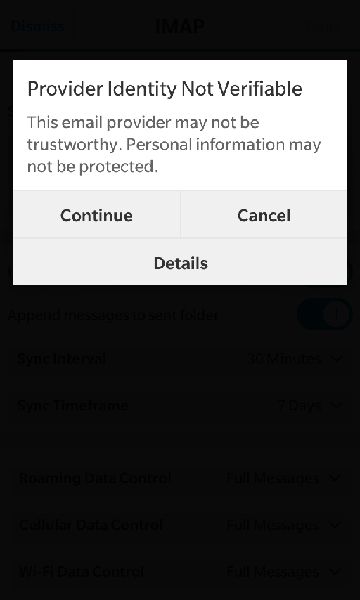
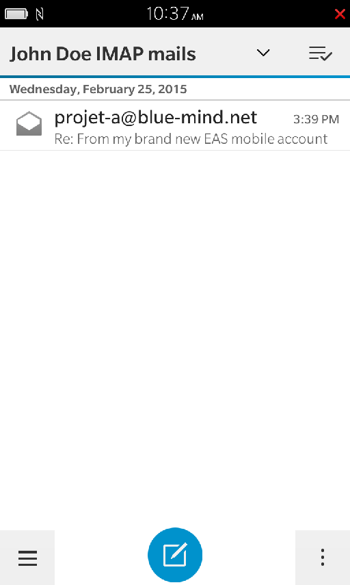

# Blackberry IMAP-Synchronisation

:::info

Diese Anleitung wurde auf Blackberry 10 OS erstellt. Je nach verwendeter Version sind die Bedienvorgänge gleich, auch wenn sich die Bildschirme erheblich unterscheiden können.

:::

## Konfiguration des E-Mail-Kontos

Die E-Mail-Synchronisation im Blackberry erfolgt im Blackberry Hub.
Öffnen Sie in dieser Anwendung das Menü:

Gehen Sie zu Einstellungen („Settings“):

Gehen Sie in die E-Mail-Konten-Konfiguration („Email-Accounts“):

Fügen Sie ein neues Konto hinzu („Add account“):

Wählen Sie das Hinzufügen des Kontotyps „Email, Calendar and Contacts“ (E-Mail, Kalender und Kontakte):

Geben Sie die E-Mail-Adresse des Benutzers ein und drücken Sie „Weiter“:

Wählen Sie den Kontotyp IMAP:

Auf dem nächsten Bildschirm können Sie die Verbindungsparameter zu den Ein- und Ausgangsservern eingeben und die Synchronisationsoptionen konfigurieren, scrollen Sie nach oben, um auf die Felder zuzugreifen:

Auf dem ersten Teil des Bildschirms:

- „Description“ (Beschreibung) und „Your Name“ Beschreibung“ („Ihr Name“) sind frei  wählbar, diese Informationen werden auf dem Gerät oder in ausgehenden Nachrichten angezeigt.
- „Username“ („Benutzername“) ist, außer in Sonderfällen, identisch mit der **vollständigen**E-Mail-Adresse, einschließlich des Domänennamens

Im folgenden Abschnitt können Sie den Posteingangsserver einstellen:

- Die Serveradresse (*mail.bluemind.loc* bei diesem Beispiel) ist identisch mit der Adresse, über die Sie auf BlueMind zugreifen ( https:// wird entfernt).Greifen Sie z.B. auf BlueMind über Ihren Browser unter der Adresse **[https://bm.domaine.com](https://bm.domaine.com)** zu, müssen Sie[bm.domaine.com](http://bm.domaine.com) eingeben
- der Sicherheitstyp kann SSL oder TLS sein, je nach Konfiguration (siehe unten, Kasten *„Ports und Sicherheit“*)

Im folgenden Abschnitt können Sie den Postausgangsserver (SMTP) zum Versenden von Nachrichten einrichten. Außer in Sonderfällen sind die Verbindungs- und Adressinformationen die gleichen wie beim Eingangsserver, nur die Portnummer ändert sich.

Im folgenden Abschnitt können Sie die wichtigsten Optionen des Kontos einstellen:

- „Use push if supported“: *„Push* verwenden, wenn unterstützt“: aktiviert *Push-Benachrichtigungen* vom Server, wenn neue Nachrichten eintreffen.Mit dieser Option fragt das Telefon nicht mehr den Server ab, ob neue Nachrichten eingetroffen sind, sondern der Server informiert das Telefon, sobald eine Nachricht eingetroffen ist.
- „Append messages to send folder“: „Nachrichten in den Ordner ‚Gesendet‘ kopieren“: legt eine Kopie der Nachricht im Ordner „Gesendete Nachrichten“ ab.Bitte beachten Sie, dass diese Option nicht nur Speicherplatz auf dem Telefon und dem Server verbraucht, sondern auch mobile Daten beim Kopieren auf den Server.
- „Sync-Intervall“: Synchronisationsintervall
- „Sync timeframe“: Anzahl der zu synchronisierenden Tage

Der letzte Teil ermöglicht die Einstellung des Verhaltens je nach Netzwerktyp, an welches das Gerät angeschlossen ist:

- „Roaming“: „Roaming“: wenn der Benutzer mit einem anderen Mobilfunknetz als dem seines Betreibers verbunden ist, z. B. mit einem Partnernetz im Ausland. Dies ist in der Regel mit zusätzlichen Kosten im Vergleich zu einer regulären Verbindung verbunden.
- „Cellular“: „Mobilfunk“: wenn der Benutzer mit dem Mobilfunknetz verbunden ist (Edge, 3G, 4G, usw.)
- „Wi-Fi“

Für jeden Verbindungstyp kann gewählt werden, ob ganze Nachrichten, nur die Kopfzeilen oder nur eine bestimmte Größe abgerufen werden sollen.

:::info

Ports und Sicherheit

Bei den oben aufgeführten Optionen handelt es sich um Standardinformationen. Ports und Verbindungsmethoden können variieren, bei Problemen wenden Sie sich bitte an Ihren Administrator, der Ihnen die einzugebenden spezifischen Informationen übermittelt.

IMAP (Posteingangsserver):

- 143: TLS möglich
- 993: SSL

SMTP (Postausgangsserver):

- 25: TLS möglich, aber nicht zwingend erforderlich
    - ohne Authentifizierung: kann nur an eine der BlueMind-Domänen gesendet werden
    - mit Authentifizierung oder von einer IP, die in der Administratorschnittstelle unter Systemverwaltung > Systemkonfiguration > Registerkarte „Mailbox“ > Felder „Meine Netzwerke“ aufgeführt ist: kann an jeden Empfänger gesendet werden
- 465: SSL + Authentifizierung erforderlich - kann an jeden Empfänger gesendet werden
- 587: TLS + Authentifizierung erforderlich - kann an jeden Empfänger gesendet werden

:::

Nach der Eingabe aller Parameter drücken Sie „Done“ („Bestätigen“) oben auf dem Bildschirm.

Das Gerät prüft die Verbindungen zu den Servern und informiert Sie über ein mögliches Zertifikatsproblem. Drücken Sie „Continue“ („Weiter“):

 

Die Anwendung kehrt dann zur Hub-Startseite zurück und zeigt die Nachrichten für alle Konten an. Um nur die des neuen Kontos anzuzeigen, öffnen Sie das Menü und wählen Sie das erstellte Konto:

 

 

 

 

 

