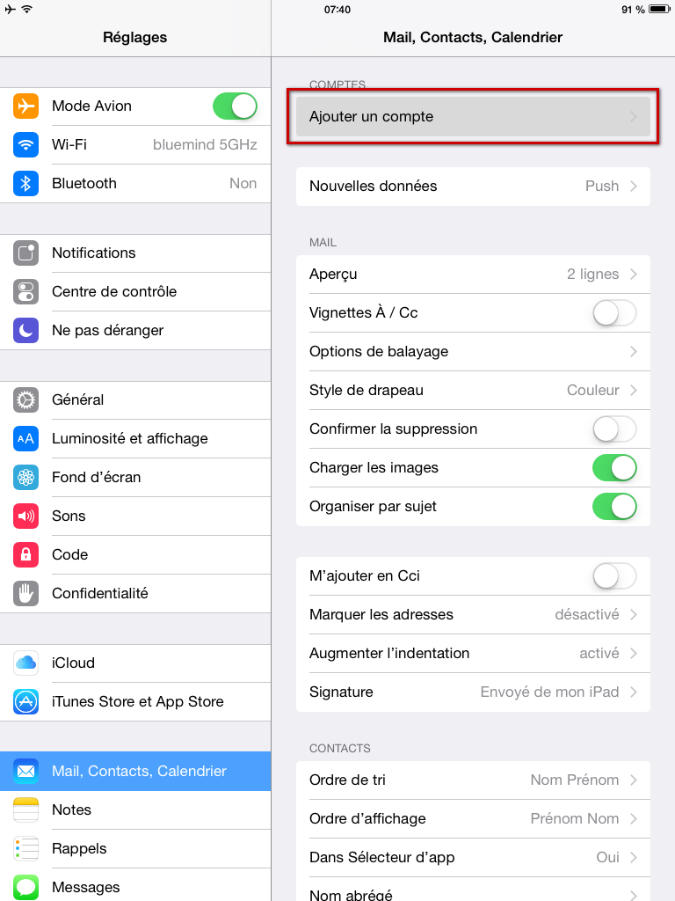
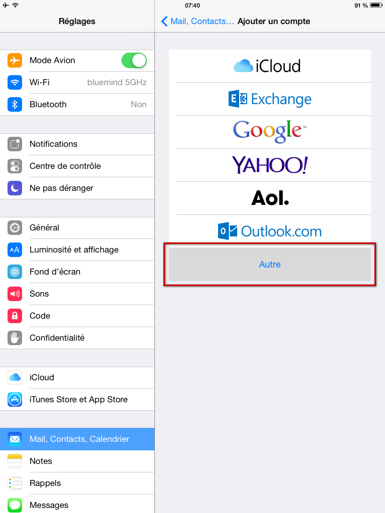
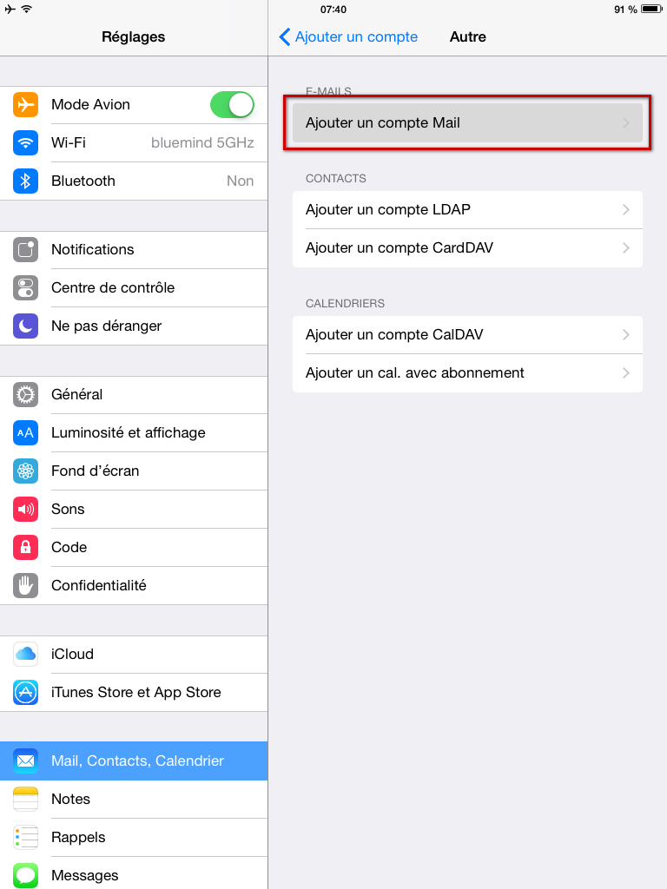
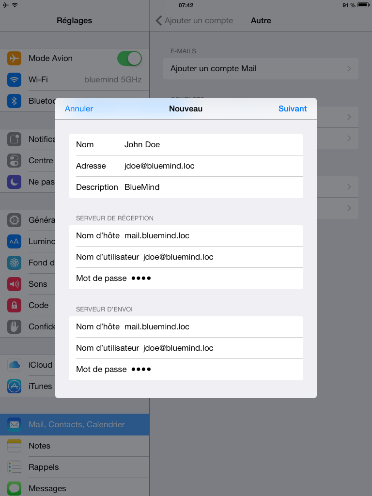

# IMAP-Synchronisation mit iOS

:::info

Diese Anleitung wurde mit einem IPad-Modell erstellt. Die Bildschirme sind im Allgemeinen bei allen Apple-Produkten identisch, aber bei einem iPhone wird das Menü auf der linken Seite aufgrund der Breite des unteren Bildschirms ausgeblendet.

:::

## Konfiguration des neuen E-Mail-Kontos

Gehen Sie zu den Einstellungen > „E-Mail, Kontakte, Kalender“ und drücken Sie auf „Konto hinzufügen“:

Wählen Sie den Kontotyp „Andere“:

Wählen Sie „Hinzufügen eines E-Mail-Kontos“:

Die wichtigsten Informationen für das Benutzerkonto eingeben:

Prüfen und korrigieren Sie ggf. die Anmeldeinformationen:

Außer in Sonderfällen:

- der Benutzername ist identisch mit Ihrer E-Mail-Adresse
- der Hostname (hier *mail.bluemind.loc*) ist identisch mit der Zugangs-Url zu BlueMind (https:// wird entfernt).Wenn Sie z. B. auf BlueMind über Ihren Browser unter der Adresse https://mail.bluemind.loc zugreifen, müssen Sie **mail.blumind.loc** eingeben

Wählen Sie, dass nur E-Mails synchronisiert werden sollen, da BlueMind keine Synchronisierung von Notizen anbietet:

 

