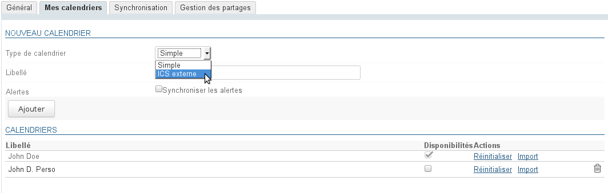
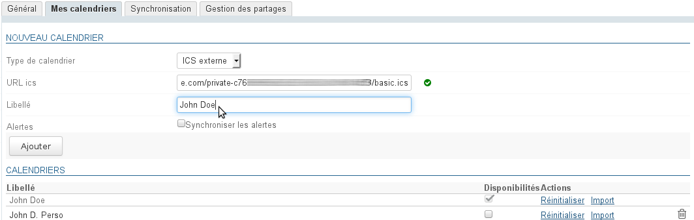
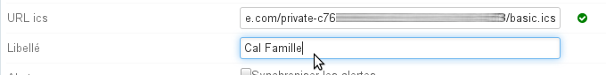
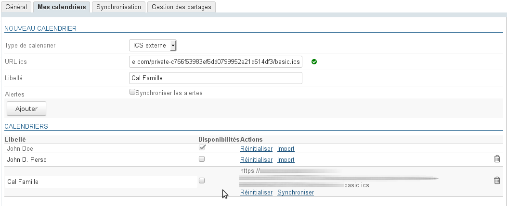
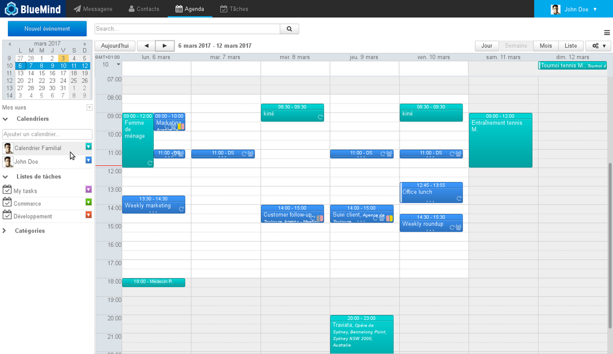
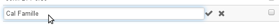
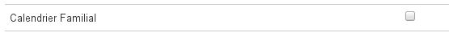
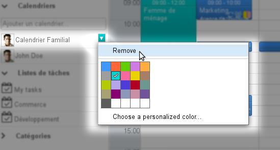

# Externe Kalender

## Präsentation

BlueMind bietet die Möglichkeit, externe Kalender über eine Kalender-URL im iCalendar-Format (.ics-Erweiterung) anzuzeigen.

Die Synchronisation dieser Kalender ist einseitig: Die Kalender sind schreibgeschützt, Änderungen können nicht im Originalkalender gespeichert werden.

## Voraussetzung

- Stellen Sie sicher, dass Sie die Kalender-Url zum Synchronisieren im ics-Format und mit dem richtigen Freigaberecht haben: Der Kalender muss außerhalb Ihres Kalenderanbieters zugänglich sein.
- Einige Provider bieten Urls mit dem Präfix webcal:// an, diese Urls werden von BlueMind nicht unterstützt, Sie müssen sie ändern, indem Sie ‚webcal‘ durch ‚http‘ ersetzen

## Hinzufügen eines externen Kalenders

So fügen Sie einen externen Kalender hinzu:

- zu Einstellungen Verwaltung > Kalender > Registerkarte „Meine Kalender“ gehen
- wählen Sie im Formular zum Anlegen eines neuen Kalenders den Typ „external ics“ („xternes ics“): Das Feld Feld „ICS url“ wird angezeigt, gefolgt von einem Symbol, das die Gültigkeit der eingegebenen Url anzeigt (das Symbol ist zunächst eine rote „Warnung“, das Feld ist leer):

- Kopieren Sie in das Feld „ICS url“ die Adresse des externen Kalenders und verlassen Sie das Feld zum Bestätigen (Taste „tab“ oder klicken Sie in einen leeren Bereich der Seite)
- die Engine validiert dann die Url und füllt das Feld „Label“ aus, wenn sie auf den Kalender zugreift und der in ihm enthaltene Kalendername korrekt ist:

:::tip

Hinweis: Das Feld „Label“ bleibt editierbar, der Kalendername kann angepasst oder hinzugefügt werden, wenn er nicht automatisch ausgefüllt wurde:

:::

- Klicken Sie abschließend auf „Hinzufügen“, um den Kalender zu erstellen, er wird in die Liste der persönlichen Kalender des Benutzers eingefügt: Der externe Kalender hat 2 spezielle Links:
    - Zurücksetzen: ermöglicht das Zurücksetzen der Synchronisation, wenn bei ihr Probleme auftreten
    - Synchronisieren: ermöglicht das Erzwingen der Kalendersynchronisation

:::tip

In der Spalte „Verfügbarkeiten“ kann der Benutzer auswählen, welche(r) Kalender verwendet werden soll(en), um seinen Status bei der Suche nach Verfügbarkeiten durch andere Benutzer anzuzeigen, die ihn zu einem Termin einladen möchten.

Siehe [Kalender](/old/Guide_de_l_utilisateur/L_agenda/)

:::

Der Terminkalender kann dann wie jeder andere Kalender durchsucht und per Autovervollständigung in die Ansicht des Benutzers eingefügt werden:

:::info

Aktualisierungszeit

**In BlueMind 4.0**werden die externen Kalender automatisch jede Stunde aktualisiert. Diese Zeit kann nicht verändert oder eingestellt werden. Möchten Sie nicht auf die nächste automatische Synchronisation warten, klicken Sie beim Anlegen des Kalenders auf den Link „Synchronisieren“.

**Ab BlueMind 4.1**werden externe Kalender „auf Anfrage“ aktualisiert, d.h. wenn sie eingesehen werden: Werden sie in der Kalenderanwendung angezeigt, wird eine Synchronisationsanforderung gestartet.
Hinweis: Je nach Server und Netzwerkauslastung kann die Synchronisation einige Sekunden dauern, bevor neue Termine erscheinen.

:::

## Änderung

Die einzige gestattete Änderung an einem externen Kalender ist die Namensänderung:

- zu Einstellungen Verwaltung > Kalender > Registerkarte „Meine Kalender“ gehen
- klicken Sie in der Kalenderliste auf die Zeile des betreffenden Kalenders, um das Eingabefeld anzuzeigen: 
- das Kalender-Label ändern und dann mit dem Häkchen bestätigen (oder durch Verlassen des Feldes) oder mit dem Kreuz abbrechen. 

:::info

Die Url eines Kalenders kann nicht geändert werden. Um eine neue Url zu laden, löschen Sie diese und erstellen Sie einen neuen Kalender.

:::

## Löschung

### Entfernen eines Terminkalenders aus der Ansicht

Ein externer Kalender kann wie jeder andere Kalender aus der Standardansicht entfernt werden, indem Sie auf sein farbiges Symbol und dann auf „Remove“ klicken:

### Löschen eines Terminkalenders

So löschen Sie einen Kalender aus seiner Konfiguration:

- zu Einstellungen Verwaltung > Kalender > Registerkarte „Meine Kalender“ gehen
- klicken Sie auf das Symbol  am Ende der entsprechenden Zeile

Der Kalender wird sofort gelöscht und aus der Ansicht entfernt.

Ist dies nicht der Fall, [setzen Sie die lokalen Daten zurück](/old/Guide_de_l_utilisateur/Paramètres_utilisateur/)   und/oder entfernen Sie den Kalender aus der Ansicht (siehe vorheriger Absatz).

