# Termine

## Erstellung eines Termins

### Schnelle Erstellung

- Rufen Sie in der Kalenderansicht das gewünschte Datum und die Uhrzeit auf und klicken Sie, um den Termin zu erstellen (oder halten Sie die Maustaste gedrückt und ziehen Sie, um die gewünschte Dauer zu markieren):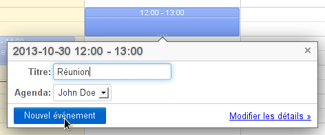

- Für einen Termin, der den ganzen Tag dauert, klicken Sie oberhalb der Zeitfenster auf den entsprechenden Tag: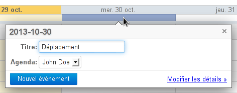 Wenn sich der Termin über mehrere Tage erstreckt, ziehen Sie die Maus über die entsprechenden Tage.
- Machen Sie die erforderlichen Angaben:
    - Titel
    - Kalenderauswahl: Die persönlichen Kalender des Benutzers oder Kalender, die mit Schreibberechtigung für ihn freigegeben wurden, können ausgewählt werden.**Es werden nur die in der aktuellen Ansicht angezeigten Kalender aufgeführt.**
- Klicken Sie auf "Neuer Termin".
 Der Termin wird erstellt.

:::info

Standardmäßige Verfügbarkeit

Ein kurzer Termin mit Datum und Uhrzeit für Beginn und Ende wird standardmäßig mit "Beschäftigt" angezeigt.

Ein ganztägiges Termin wird standardmäßig mit "Verfügbar" angezeigt.

:::

Wenn Sie auf die Schaltfläche "Details ändern" klicken, wechseln Sie zur umfassenden Erstellung des Termins.

### Umfassende Erstellung:

Klicken Sie auf die Schaltfläche "Neuer Termin" oben in der Seitenleiste, um das Fenster für die Erstellung eines Termins aufzurufen:

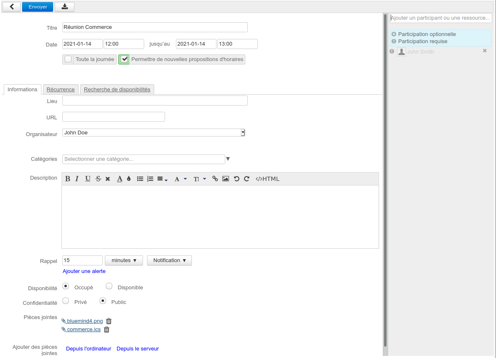

Im oberen Teil können Sie die wichtigsten Informationen des Termins eingeben:

- **Titel**
- **Start- und Enddatum und -Uhrzeit**
- **Ganztägig**: Die Veranstaltung ist nicht durch Stunden begrenzt
-  **Neue Zeitplanvorschläge zulassen**: Bei Aktivierung dieses Kontrollkästchens wird den Teilnehmern eine Schnittstelle vorgeschlagen, über die sie in der Antwort auf die Einladung eine neue Uhrzeit vorschlagen können

Über die rechte Fensterseite können Teilnehmer eingeladen werden.
Wenn Sie auf das Symbol am Anfang der Zeile jedes Teilnehmers klicken, können Sie angeben, ob seine Teilnahme optional oder erforderlich ist:

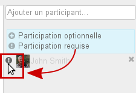

Zu beachten:

- Sie können alle Ihnen bekannten Personen aus der Domain einladen, die Ihnen diese Berechtigung erteilt haben (Freigabe "Kann mich einladen" siehe Abschnitt [Freigabe des Kalenders](https://forge.blue-mind.net/confluence/display/DA/L%27agenda#L%27agenda-Lepartaged%27agenda)).
- Sie können jede Person einladen, die in einem Ihrer Adressbücher aufgeführt ist, und jede externe Person, indem Sie ihre E-Mail-Adresse eingeben.
- Es ist auch möglich, den Terminen Ressourcen zuzuordnen, indem Sie sie auf die gleiche Weise hinzufügen wie Benutzer. Dann wird eine [Reservierungsanfrage](/old/Guide_de_l_utilisateur/Les_ressources/) an ihren Verwalter gesendet.
- Beim Hinzufügen einer Gruppe werden die Mitglieder einzeln hinzugefügt.

Die Registerkarten "Wiederholen" und "Zeit finden" gestatten den Zugriff auf zusätzliche Funktionen.

#### Eigenschaften eines Termins

Die erste Registerkarte, "Informationen", gestattet die Definition der wichtigsten Eigenschaften eines Termins:

- **Ort** des Termin
- **Organisator** (hier werden Benutzer angezeigt, die Schreibberechtigungen für ihre Termine erteilt haben UND deren Kalender in der Hauptansicht angezeigt wird)
- [Kategorien (Tags)](/old/Guide_de_l_utilisateur/Les_catégories_tags_/)
- **Beschreibung des Termin**
- **Erinnerung**: Gestattet die Definition einer Erinnerung, damit der Termin nicht vergessen wird. In einer Dropdown-Liste können Sie die Art der Erinnerung auswählen:
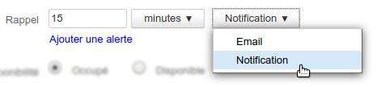
    - **Email**: Eine Nachricht wird an den Benutzer gesendet (vorheriges Standardverhalten).
    - **Display**: Ein Popup-Fenster mit einer  [Browser-Benachrichtigung](/old/Guide_de_l_utilisateur/Paramètres_utilisateur/#Parametresutilisateur-Parametresutilisateurs-Notifications) wird angezeigt.

:::tip

Es ist auch möglich, eine Standarderinnerung für Termine einzurichten (eine vorkonfigurierte Erinnerung für jeden neuen Termin). Für weitere Informationen siehe [Einstellungen für den Kalender](/old/Guide_de_l_utilisateur/L_agenda/Préférences_de_l_agenda/).

:::

- **Mich anzeigen als**: Gestattet Benutzern, die Ihren Kalender anzeigen, zu sehen, ob Sie während des Termin erreichbar sind.
**Standardmäßig werden Sie bei kurzen Veranstaltungen als "Beschäftigt" und bei ganztägigen Veranstaltungen als "Verfügbar" angezeigt**. 
Wenn ein Benutzer sich als "Verfügbar" erklärt, wird der Termin in seinem Kalender mit einem hellen Rand auf der linken Seite angezeigt:

- **Privatsphäre**: Gestattet, den Inhalt des Termin vor anderen Benutzern zu verbergen, sie sehen nur das reservierte Zeitfenster:
- ** **Anhänge****: Dieser Teil des Fensters gestattet, den Terminen im Kalender Anhänge hinzuzufügen.

:::tip

 Diese Funktion ist ab Version 4.1 verfügbar. Weitere Informationen finden Sie im Abschnitt [Anhänge](#Lesevenements-pjevents).

:::

#### Wiederholung

Die Registerkarte "Wiederholen" gestattet die Definition eines Wiederholungsintervalls für einen Termin: keine, täglich, wöchentlich, monatlich oder jährlich.

- Das **Intervall der Wiederholung** (z. B. alle 2 Wochen) wird im Feld "Wiederholen alle" unterhalb der Wiederholung angegeben.
- Geben Sie bei einer **wöchentlichen Wiederholung** den/die Wochentag(e) der Wiederholung an.
- Geben Sie bei einer **monatlichen Wiederholung** an, ob der Termin am jeweiligen Tag des Monats (z. B. am 3. eines jeden Monats) oder am entsprechenden Wochentag (z. B. am 2. Dienstag des Monats) wiederholt werden soll.

:::tip

Über der Registerkarte wird eine Zusammenfassung der Wiederholungsinformationen angezeigt und beim Ausfüllen des Formulars aktualisiert:

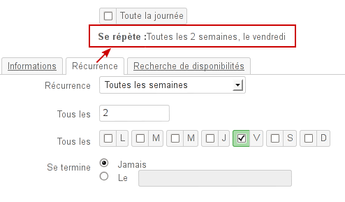

:::

So **löschen Sie ein Termin**:

- Zeigen Sie der entsprechender Termin an.
- Klicken Sie darauf und klicken Sie im angezeigten Dialogfeld auf "Löschen".
- Wählen Sie "Nur dieser Termin", um alle anderen Wiederholungen des Termins zu behalten.

#### Ermitteln der Verfügbarkeit

Die Registerkarte "Zeit finden" gestattet die Suche nach einem freien Zeitfenster für alle Teilnehmer:

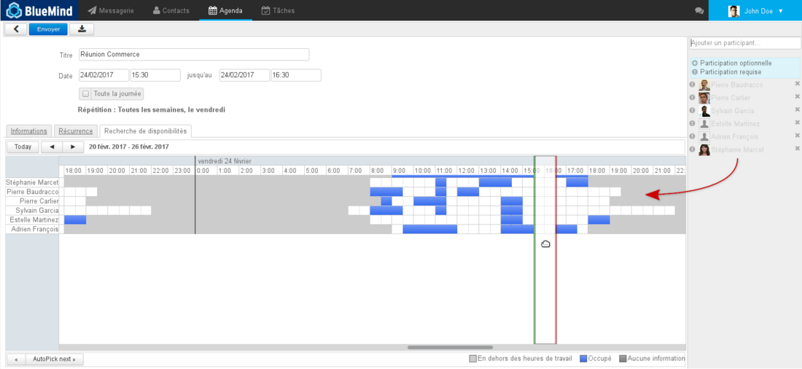

BlueMind schlägt automatisch, grün und rot umrahmt, das erste Zeitfenster vor, das für das im Formular eingegebene Datum verfügbar ist.

Das Zeitfenster kann durch Ziehen der Maus verschoben und durch Ziehen der grünen und der roten Linie verkleinert oder vergrößert werden.
Wenn das Zeitfenster einen Termin von mindestens einem Benutzer enthält, erscheint oben auf der Seite eine Informationsmeldung:

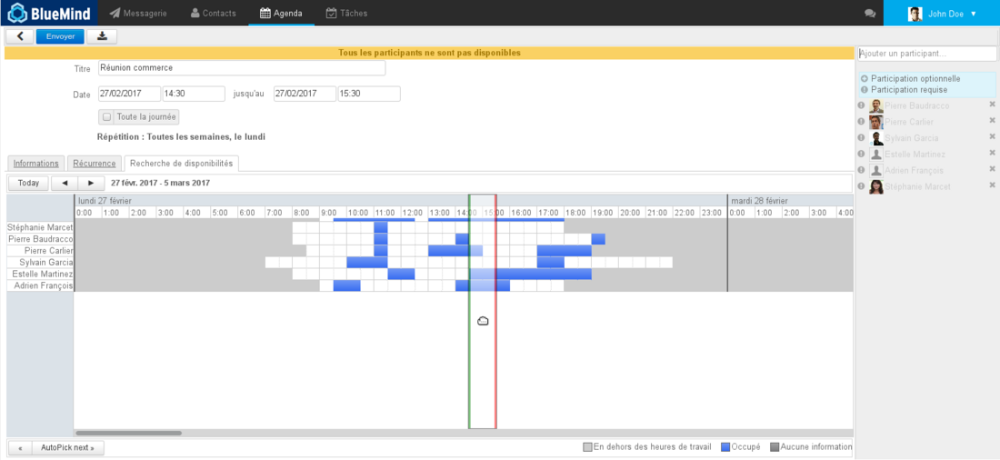

### Anlagen

Ab Version 4.1 können Sie mit der Funktion[Abtrennen von Anlagen](/old/Guide_de_l_utilisateur/La_messagerie/Fichiers_volumineux_et_détachement_des_pièces_jointes/) des E-Mail-Systems auch Dateien an Kalendertermin anfügen.

:::info

Verfügbarkeit

Um diese Funktion verwenden zu können, müssen die Benutzer über folgende [Rollen](/Guide_de_l_administrateur/Gestion_des_entites/Utilisateurs/Les_rôles_droits_d_accès_et_d_administration/) verfügen:

- **Verlinkte Anhänge**: ermöglicht das Anfügen von Dateien
- **Drive**: ermöglicht die Nutzung des Speicherplatzes von BlueMind

Wenn Sie den unten angezeigten Bereich oder einen der Links nicht sehen, wenden Sie sich an Ihren Administrator.

:::

Sobald eine Datei mit einem Termin verknüpft ist, steht sie jederzeit in den Termindetails zum Download bereit und wird ggf. in der elektronischen Einladung an die Teilnehmer versendet.

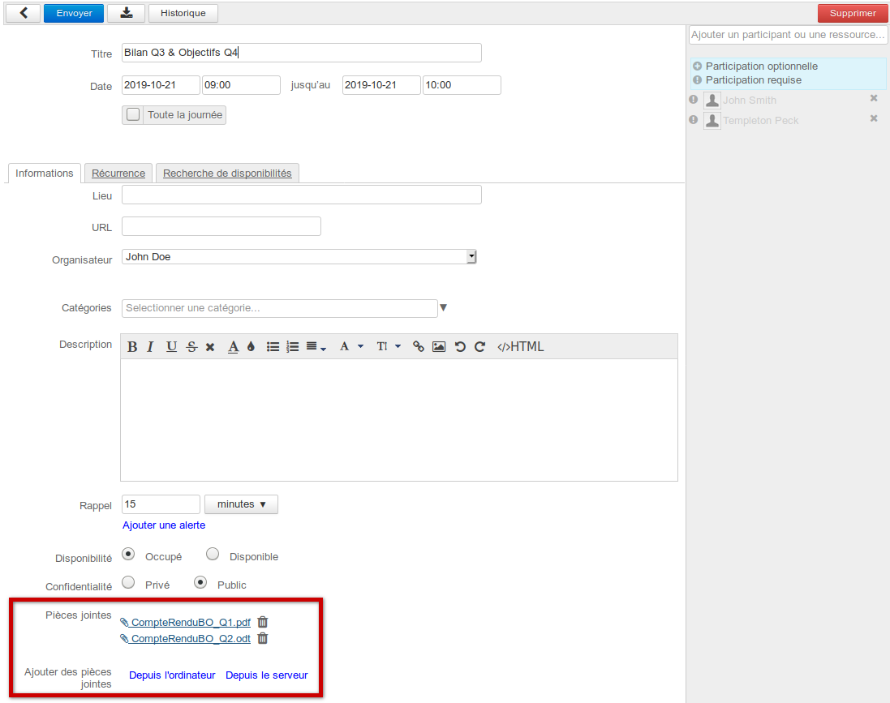

#### Dateien hinzufügen/entfernen

So fügen Sie eine Datei hinzu:

- Klicken Sie für "Anhang hinzufügen" auf "Computer", um eine neue Datei hochzuladen.

Wenn der Benutzer über die dedizierte Rolle ("Drive") verfügt, wird ein zweiter Link angezeigt:

- Klicken Sie auf "Server", um die BlueMind-Dateiauswahl zu öffnen und eine bereits im Speicherplatz des Benutzers vorhandene Datei hinzuzufügen. Die Dateien können anschließend über die Dateiauswahl gefunden werden, um sie anderen Kalendertermin [oder Nachrichten](/old/Guide_de_l_utilisateur/La_messagerie/Fichiers_volumineux_et_détachement_des_pièces_jointes/) hinzuzufügen.

Klicken Sie auf das Papierkorbsymbol  vor dem Dateinamen, um diese Datei zu löschen.

#### Übertragung von Dateien an Teilnehmer

Einer Besprechung hinzugefügte Dateien werden in der elektronischen Einladung an die Teilnehmer übermittelt:

- als Anlagen, wenn die Gesamtgröße der Nachricht die vom Server zugelassene Größe nicht überschreitet: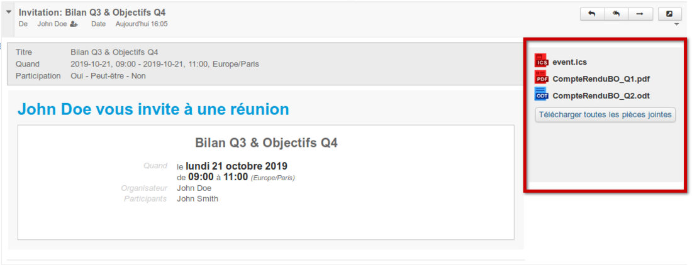
- als Download-Links, wenn die Gesamtgröße der Nachricht die vom Server zugelassene Größe überschreitet: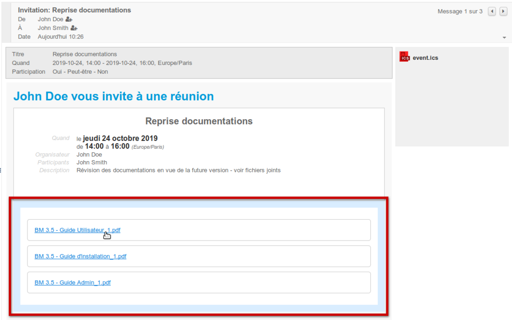

:::info

Die Funktion des Anfügens/Abtrennens erfolgt automatisch und kann nicht gesteuert werden. Sie wird je nach Gesamtgröße aller als Anlage beigefügten Dateien angewendet, unabhängig davon ob einzelne Dateien dieser Anlage klein sind.

:::

#### Download einer Datei

Wenn ein Termin einen Anhang hat, wird der Anhang durch ein Piktogramm in der Kalenderansicht angezeigt:

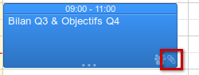

Die Dateien in der Anlage zu einem Termin können jederzeit über das Abfrage-/Bearbeitungsformular heruntergeladen werden:

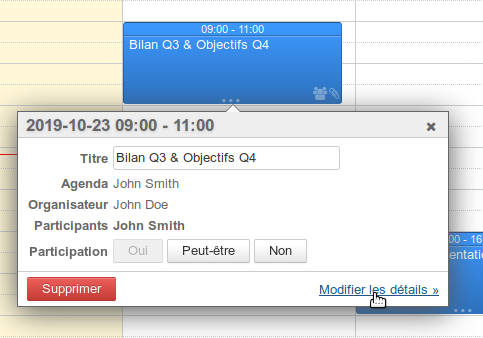

:::tip

Für Teilnehmer

Die Funktionsweise für die eingeladenen Teilnehmer einer Besprechung ist identisch: Sie finden die Dateien mit den Download-Links in ihrem Kalender.

Sie können selbst Dateien hinzufügen, aber wie alle anderen Änderungen, die sie vornehmen, werden diese nicht an den Organisator oder an andere Teilnehmer weitergegeben.

:::

## Änderung eines Termins

So ändern Sie ein Termin:

- Klicken Sie in der Kalenderansicht auf den Termin.
    - Ändern Sie den Titel und klicken Sie auf Speichern
    - oder klicken Sie auf den Link "Details ändern": Angezeigt wird das vollständig ausgefüllte Formular, das für die Erstellung verwendet wurde (siehe oben).
- Wenn die erforderlichen Änderungen vorgenommen wurden, klicken Sie auf die Schaltfläche "Speichern" (oder "Senden", wenn es weitere Teilnehmer gibt) oben links auf der Seite, damit die Änderungen berücksichtigt werden.

:::tip

Änderung und Benachrichtigung
Das Hinzufügen/Löschen/Ändern von Tags und Erinnerungen wird als private Änderung betrachtet, die nicht an die Teilnehmer gesendet wird. Bei anderen Änderungen werden aktualisierte Informationen an die anderen Teilnehmer (falls vorhanden) verschickt.
:::

Im Fall einer Änderung eines wiederkehrenden Termins durch Verschieben in der Kalenderansicht oder durch Aufrufen des ausgefüllten Formulars werden verschiedene Arten der Änderung zur Auswahl angeboten:

- **Nur dieser Termin**: Die Änderung bezieht sich nur auf der Termin, das der Benutzer angeklickt hat, alle anderen Termine dieser Serie bleiben unverändert.
- **Alle folgenden**: Die Änderung bezieht sich auf der Termin, das der Benutzer angeklickt hat und alle darauf folgenden Termine dieser Serie. Alle davor liegenden Termine der Serie bleiben unverändert.
- **Alle Termine in dieser Serie**: Die gesamte Serie wird geändert

## Duplizieren eines Termin

 Ab BlueMind 4.3 ist es möglich, ein Termin oder eine Besprechung zu duplizieren, um eine Kopie zu erstellen, die unabhängig vom ursprünglichen Termin geändert oder an einen anderen Organisator delegiert werden kann.

### Im Allgemeinen

So duplizieren Sie einen Termin:

- Klicken Sie auf der Termin in der Kalenderansicht.
- Rollen Sie das Menü unten rechts ab und wählen Sie die Option "Duplicate":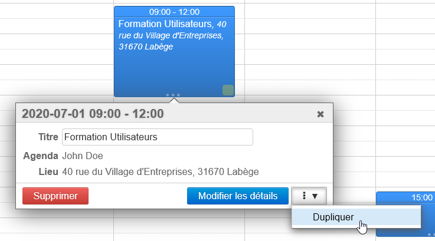
- Das Formular zur Erstellung eines Termins wird mit den Informationen des ursprünglichen Termins (Tag, Uhrzeit, Beschreibung, Organisator, Teilnehmer usw.) angezeigt.
- Nehmen Sie die gewünschten Änderungen vor:
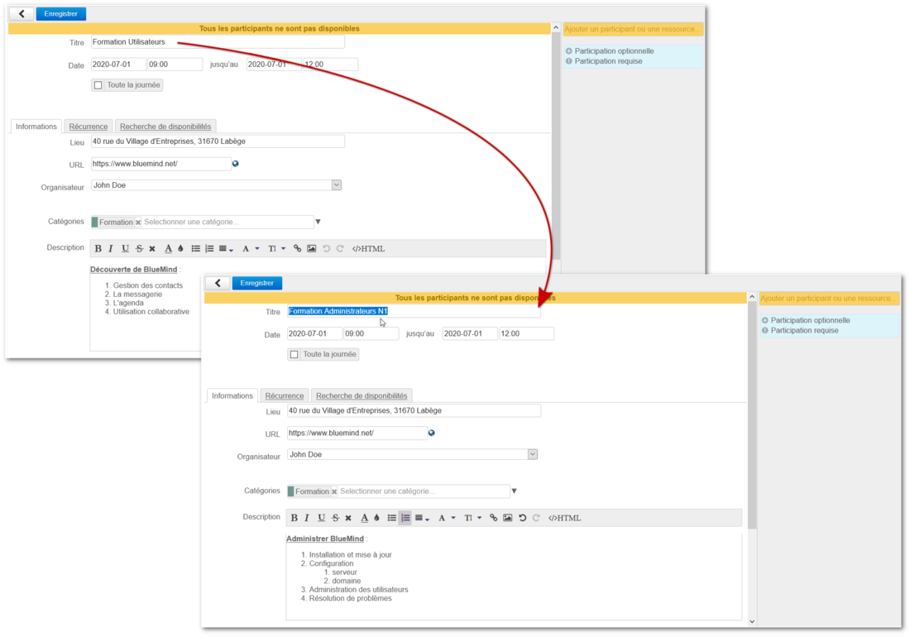

:::info

Vorgenommene Änderungen werden wie Änderungen an einem bereits bestehenden Termin behandelt (siehe vorheriger Abschnitt).

Bei freigegebenen Kalendern erscheinen daher nur die Benutzer in der Dropdown-Liste der Organisatoren, die eine [Schreibberechtigung für](/old/Guide_de_l_utilisateur/L_agenda/Le_partage_d_agenda/) ihren Kalender erteilt haben und deren Kalender gerade in der Hauptansicht angezeigt wird.
Weitere Informationen zu diesem Thema finden Sie weiter unten im Abschnitt *Freigegebene Kalender*.

:::

- **Klicken Sie auf "Speichern", um die Erstellung des neuen Termins zu bestätigen:** * 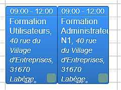 *  In unserem Beispiel wurde der Termin "Benutzerschulung" dupliziert und in "Administratorschulung" umbenannt, die Beschreibung wurde ebenfalls angepasst: So wurde ein neuer Termin mit den gleichen Zeit- und Ortsangaben und einer angepasster Beschreibung erstellt, das jetzt zur passenden Uhrzeit verschoben werden kann.

### Wiederkehrender Termin

Bei einem wiederkehrende Termin bietet das Dropdown-Menü für die Duplizierung zwei Optionen:

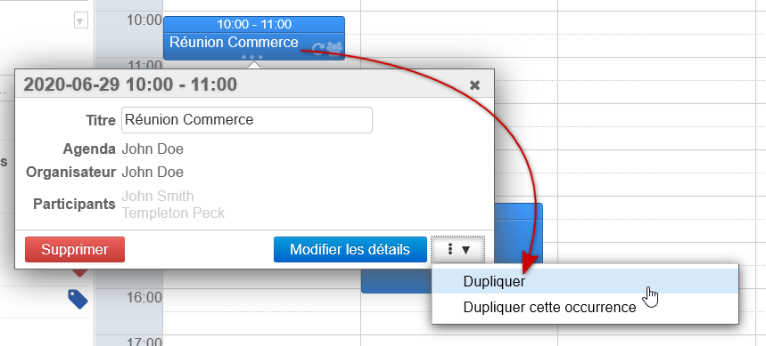

- **Duplicate**: Die gesamte Serie wird mit ihrer Wiederholung dupliziert.

:::info

Die neue Serie wird mit der Uhrzeit des erster Termin und seiner Wiederholung erstellt. Es handelt sich daher um eine regelmäßige Serie, ohne die Ausnahmen, die in der ursprünglichen Serie enthalten sein könnten.

:::

- **Duplicate occurrence**: Ein einmaliger (d. h. nicht wiederkehrendes) Termin mit der Uhrzeit des duplizierten Termin wird erstellt.

### Besprechungen (Termine mit Teilnehmern)

Beim Duplizieren einer Besprechung wird eine identische Besprechung mit ihren Teilnehmern neu angelegt.

Die neue Besprechung wird als neue unabhängige Besprechung betrachtet:

- Die Teilnehmer erhalten **bei der Speicherung des Formulars** eine neue Einladung.
- Der Teilnahmestatus der ursprünglichen Besprechung wird nicht beibehalten: Alle Teilnehmer erhalten den Status "en attente de réponse" (Antwort steht aus).
- Änderungen an einer der beiden Besprechungen (Original oder Kopie) wirken sich nicht auf die andere aus.

:::info

Änderungen des Organisators oder der Teilnehmer können entsprechend den freigegebenen Berechtigungen für den Kalender, in dem der Termin dupliziert wird, sichtbar sein (Einzelheiten siehe nächster Abschnitt).

:::

### Freigegebener Kalender

Wenn sich der zu duplizierende Termin im Kalender eines anderen Benutzers befindet, sind mehrere Szenarien denkbar:

- **Der Benutzer hat die Schreibberechtigung für seinen Kalender erteilt**: Er wird dann als Organisator den duplizierten Termin angegeben, unabhängig davon ob er bereits Organisator oder nur Teilnehmer ist.
- **Der Benutzer hat die Schreibberechtigung für seinen Kalender nicht erteilt**: Die Duplizierung erfolgt auf dem Kalender der duplizierenden Person, die automatisch als Organisator angegeben wird.

:::tip

Wenn der Benutzer ursprünglich Organisator war, wird er in diesem Fall Teilnehmer der Besprechung und erhält eine Einladung.

:::

**Beispiele**

Zwei Benutzer führen folgende Schritte durch:

- Nathalie: Sie ist Abteilungsleiterin und gibt ihren Kalender im schreibgeschützten Modus frei (Berechtigung "Kann einladen und meine Termine einsehen").
- Jean-Claude: Er ist Trainer und hat Nathalie berechtigt, seinen Kalender zu ändern (Berechtigung "Kann meine Termine aktualisieren").

##### Fall 1: Nathalie möchte eine neue Schulung für Jean-Claude erstellen, die auf einer bestehenden Schulung basiert.

Nathalie zeigt den Kalender von Jean-Claude an und klickt auf den Termin "Benutzerschulung" und dann auf "Duplicate":

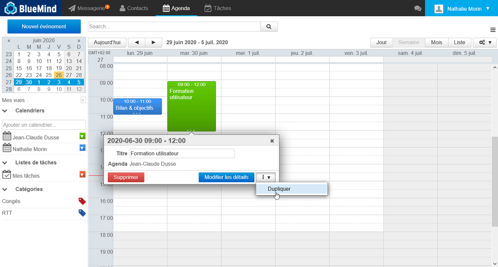

Da Nathalie über die Schreibberechtigung verfügt, wird der Organisator beibehalten, der duplizierte Termin verbleibt auf dem Kalender von Jean-Claude. Nathalie ändert der Termin in eine "Administratorschulung", die am nächsten Tag stattfindet:

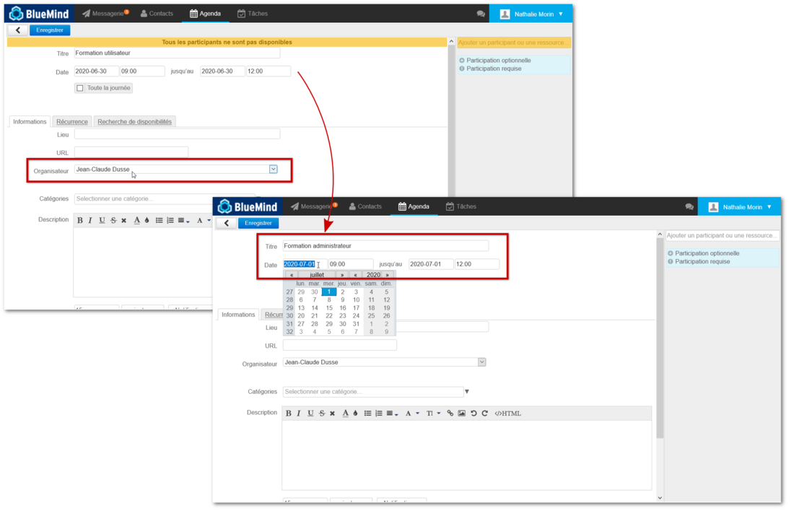

Nach der Speicherung erscheint der neue Termin im Kalender von Jean-Claude:

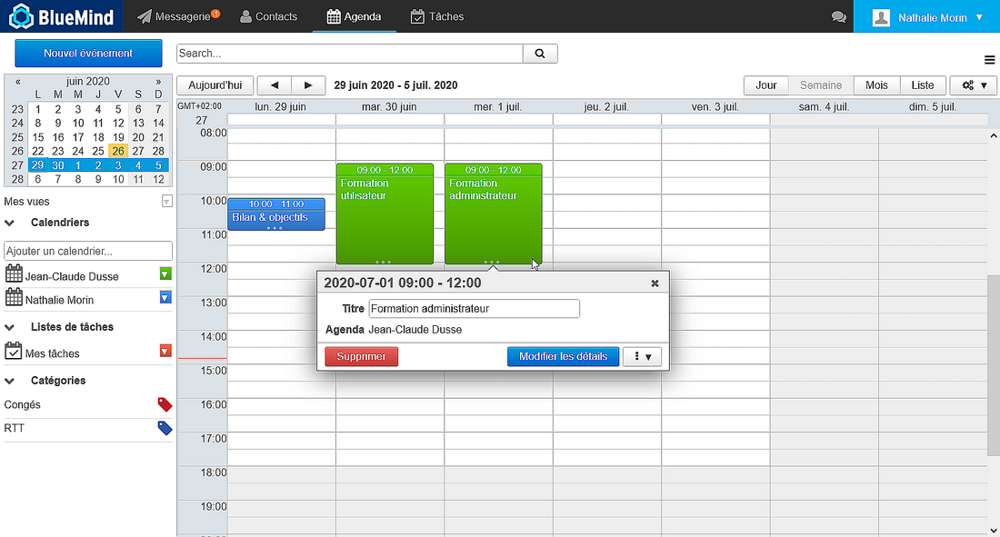

##### Fall 2: Jean-Claude möchte eine von Nathalie organisierte Besprechung kopieren, um sie in der folgenden Woche selbst zu organisieren.

Auch wenn Jean-Claude den Kalender von Nathalie nicht verändern darf, hat er doch die Möglichkeit, ihre Termine zu duplizieren:

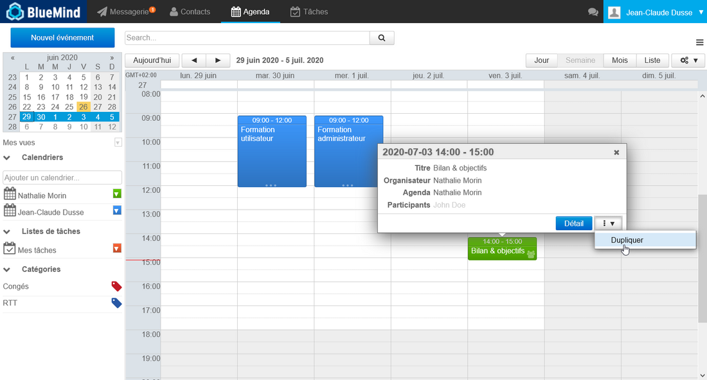

DerTermin wird dann in seinen Kalender kopiert (= er wird zum Organisator bestimmt) und Nathalie wird zur Besprechung eingeladen:

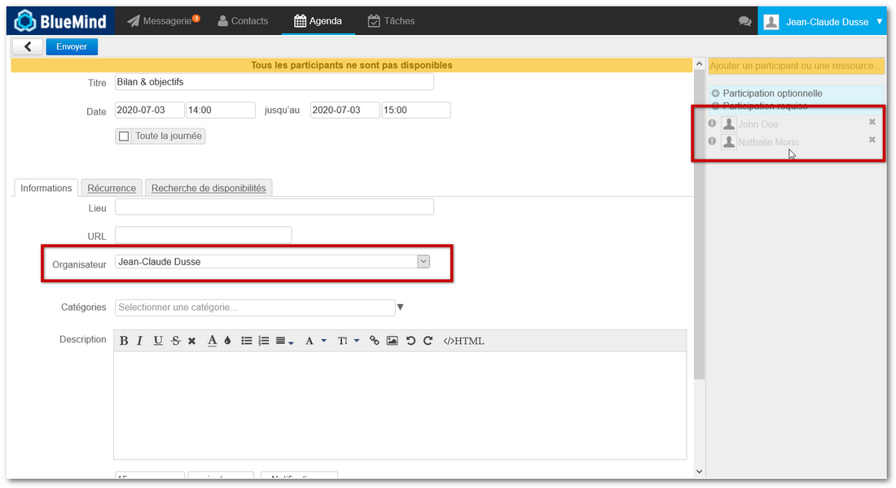

Jean-Claude ändert das Datum, um in der darauffolgenden Woche die Organisation dieser Besprechung zu übernehmen:

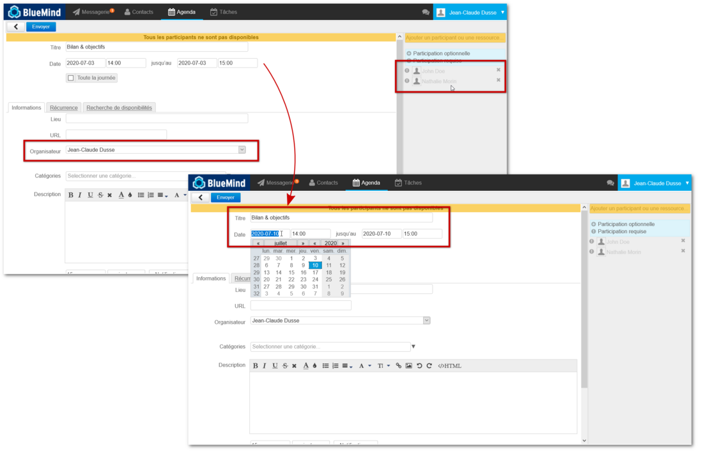

Nach dem Speichern erscheint die Besprechung wie konfiguriert in ihren Kalendern:

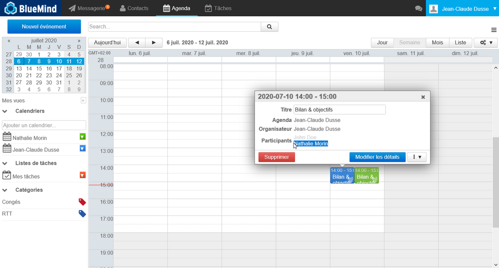

Die ursprüngliche Besprechung hat sich nicht geändert:

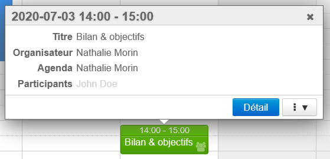

## Löschen eines Termins

So löschen Sie ein Termin:

- Klicken Sie im Hauptfenster auf der Termin.
- Klicken Sie im angezeigten Popup-Fenster auf die Schaltfläche "Löschen".
    - Wenn Sie der Organisator sind und mehrere Teilnehmer eingeladen haben, wird der Termin bei allen Teilnehmern gelöscht und sie erhalten eine Mail zur Information.
    - Wenn Sie einfacher Teilnehmer des Termin sind, wird nur Ihre Teilnahme abgesagt, bei den anderen Teilnehmern bleibt der Termin weiterhin vorhanden.Der Organisator erhält keine Mail zur Information, aber in der Teilnehmerliste des Termin werden Sie als nicht teilnehmend markiert.
- Wählen Sie beim Löschen eines wiederkehrenden Termins die gewünschte Option:
    - Nur dieser Termin
    - Alle Termine in dieser Serie
    - Alle folgenden Termine

:::info

ACHTUNG
  Wenn ein Teilnehmer einen Termin löscht, erscheint er nicht mehr im Kalender, so dass es diesem Teilnehmer nicht mehr möglich ist, seine Teilnahme nachträglich zu ändern.
:::

## Teilnahme an einem Termin

### Anzeige

Wie ein Termin im Kalender angezeigt wird, ist abhängig von der Teilnahme des Benutzers:

- Termin akzeptiert: Vollfarbe
- Antwort steht noch aus: Transparenz
- Teilnahme wurde mit "vielleicht" gekennzeichnet: Volltonfarbe und Umrandung mit einer gepunkteten Linie
- Termin abgelehnt: Transparenz, durchgestrichener Inhalt

:::tip

Der Benutzer kann wählen, ob abgelehnte Termine angezeigt werden sollen oder nicht. Diese Option ist in der Verwaltung der Benutzereinstellungen > Kalender > Registerkarte "Allgemein" zu finden: "Abgelehnte Termine anzeigen".

Diese Einstellung ist nicht standardmäßig aktiviert, kann aber nützlich sein, um den Teilnahmestatus für ein Termin zu ändern, das zuvor abgelehnt wurde.

:::

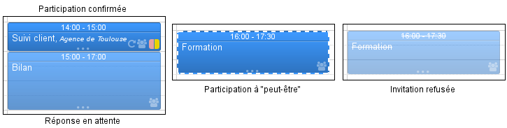

Affichage des événements selon la participation de l'utilisateur

### Teilnahme angeben

Um die Teilnahme an einem Termin zu bestätigen oder abzulehnen, gehen Sie wie folgt vor:

- Klicken Sie im Hauptfenster auf der Termin.
- Klicken Sie im angezeigten Popup-Fenster auf die Schaltfläche Ihrer Wahl: 
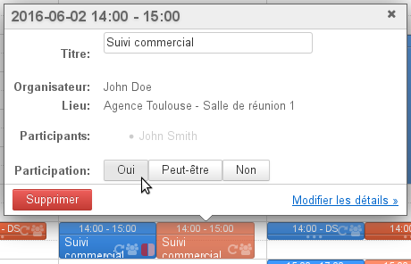 
 Der Organisator der Besprechung erhält eine Nachricht, in der Ihre Wahl angegeben wird.
 Ihr Status wird in der Kalenderansicht des Organisators aktualisiert.

:::info

Änderung ab BlueMind 4.2

In den Versionen vor 3.5.15 ist es möglich, die eigene Teilnahme zu ändern, ohne den Organisator zu informieren: Dieses Vorgehen wird nicht empfohlen, da der Organisator in diesem Fall den Status dieses Teilnehmers nicht in seinem Kalender sieht.

:::

Weitere Informationen zur Darstellung der Teilnahme an einer Besprechung finden Sie auf der Seite   [Kalender - Abschnitt 3 Verwaltung von Besprechungen](/old/Guide_de_l_utilisateur/L_agenda/#L'agenda-Modèledegestiondesréunions)

### Eine neue Uhrzeit vorschlagen

 Zu Version 4.4 gehört die Möglichkeit, dass Teilnehmer einen neuen Zeitplan für ein Meeting vorschlagen können.

:::info

Diese Funktion ist sowohl mit Outlook (ohne Connector) als auch mit allen Kalendermanagern kompatibel, die dieselbe Funktion ermöglichen.

Genauso funktioniert es auch mit BlueMind in Thunderbird.

:::

Wenn der Organisator den Gästen das Recht dazu eingeräumt hat (siehe oben **§1.2 Vollständige Erstellung**), haben diese ein eigenes Menü im Popup des Termins im Kalender:

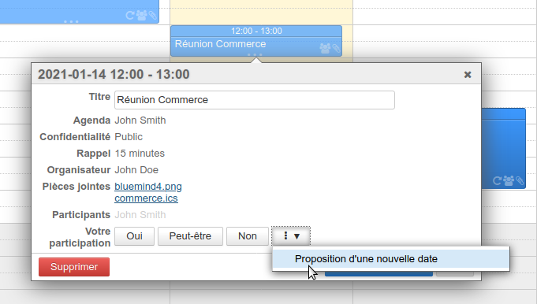Durch Anklicken gelangt der Benutzer in das komplette Such- und Vorschlagsformular.

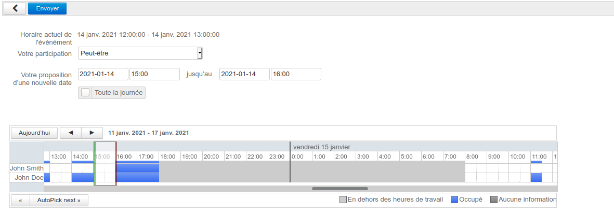

Dort kann der Benutzer Folgendes angeben:

- **Seine Teilnahme**:
    - Nein: wird mit der heutigen Uhrzeit nicht an der Besprechung teilnehmen
    - Vielleicht: wird mit der heutigen Uhrzeit vielleicht an der Besprechung teilnehmen
- **Das neue gewünschte Datum** und/oder die neue gewünschte UhrzeitHierfür steht dem Benutzer für die Suche nach Verfügbarkeit dieselbe Suchoberfläche zur Verfügung wie bei der Erstellung eines neuen Termins (siehe [§1.2.c](#Lesevenements-rechdispo) oben)

Klicken Sie nach Ausfüllen des Formulars oben auf der Seite auf „**Senden**“, um den Vorschlag an den Organisator zu senden.

 Im Termin-Popup wird sowohl beim Organisator als auch beim Teilnehmer der Vorschlag des Teilnehmers in orange in Klammern neben seinem Namen angezeigt:

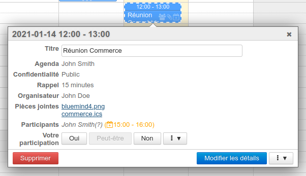

Der Organisator erhält eine Meldung dieser Art:

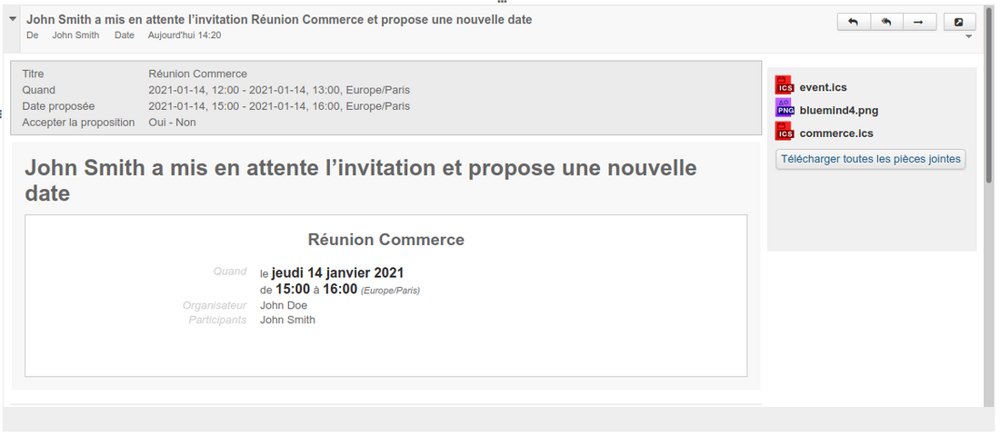

Die Kopfzeile der Nachricht fasst die Informationen zusammen und bietet Links, um die neue Uhrzeit direkt zu akzeptieren oder abzulehnen.

- **Wenn der Organisator den Vorschlag annimmt**:
    - wird die Besprechung geändert
    - erhalten alle Teilnehmenden eine E-Mail mit Terminänderung.
- **Wenn der Organisator den Vorschlag ablehnt**:
    - bleibt die Besprechung unverändert
    - erhält Teilnehmer, der einen Vorschlag gemacht hat, eine Nachricht, die anzeigt, dass der Organisator die Änderung ablehnt
    - der Vorschlag verschwindet aus dem Popup der Kalender, in denen er erschienen ist
    - die anderen Teilnehmenden keine Nachricht

:::info

Änderung der Antwort

Ein Vorschlag kann nur einmal bearbeitet werden, der Organisator kann seine Entscheidung nicht rückgängig machen. Sobald er geantwortet hat, wird der Kopfzeilen-Block nicht mehr angezeigt; stattdessen erscheint eine Information, die anzeigt, dass der Vorschlag bearbeitet wurde:

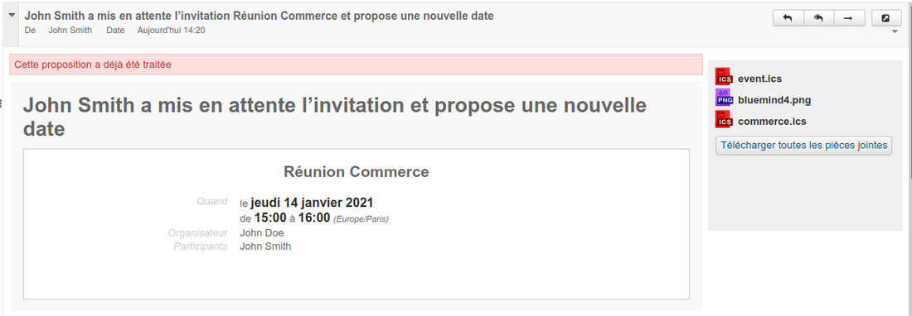

:::

:::tip

Wiederkehrende Besprechungen

Ein Gast kann nicht nur für einen Termin eine neue Uhrzeit vorschlagen: die neue Uhrzeit wird automatisch für die gesamte Besprechungsserie vorgeschlagen.

:::

## Chronologischer Verlauf eines Termin

Es ist jetzt möglich, den Erstellungs- und Änderungsverlauf einen Termin  anzuzeigen.

Klicken Sie in der Detailansicht einen Termin auf die Schaltfläche "Historie":

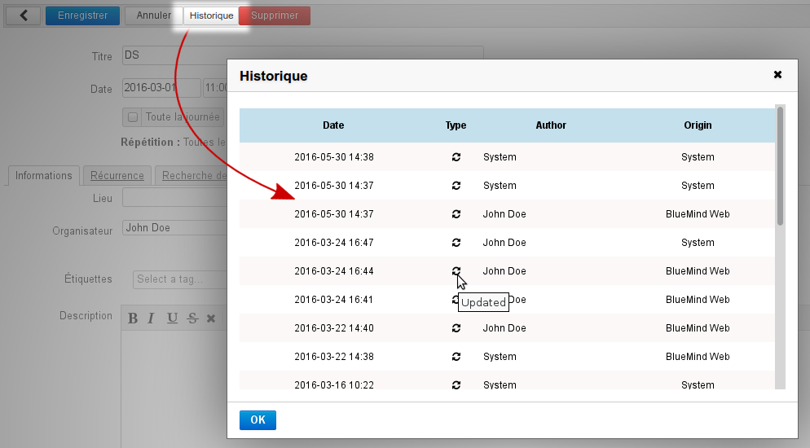Im Verlauf sind folgende Informationen enthalten:

- Datum der Aktion
- Art der Aktion: Erstellung ("Created") oder Änderung ("Updated")
- Benutzer, der die Aktion durchgeführt hat ("Author")
- Herkunft: BlueMind-Client, Drittanbieter-Client (Fat Client oder mobiles Gerät) usw.

