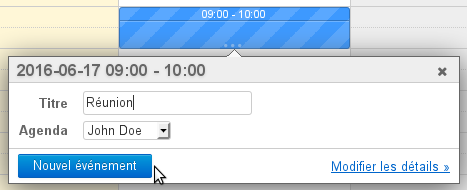
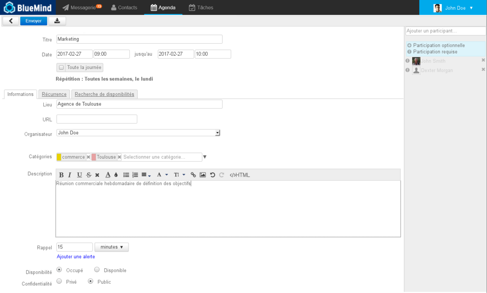
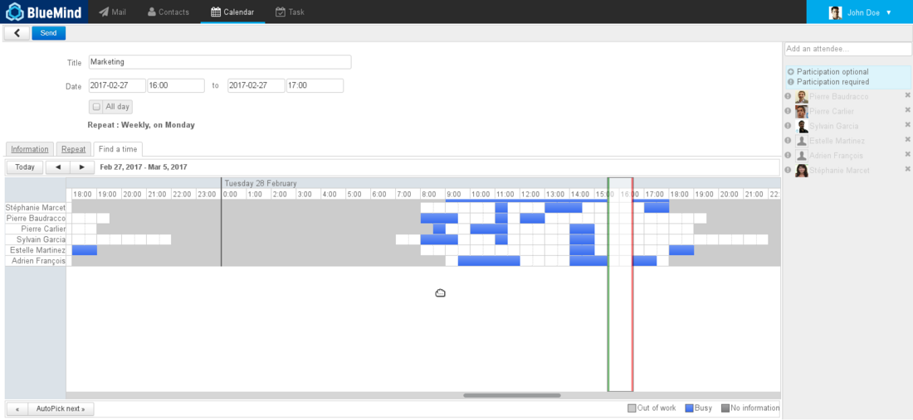
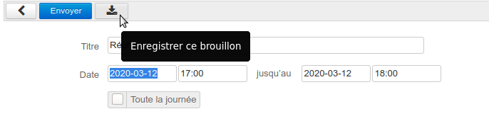
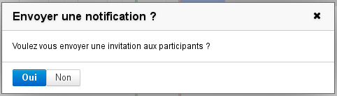
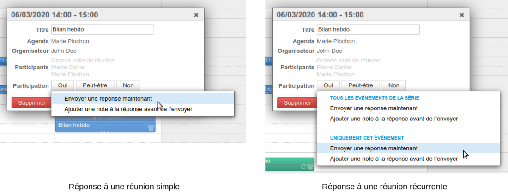

# Organisation einer Sitzung

## Erstellen der Sitzung

### Erstellen des Termins

Beginnen Sie mit der Erstellung des Termin im Kalender, entweder in der vollständigen Erstellung, indem Sie auf „Neuer Termin“ klicken, oder in der Schnellerstellung, indem Sie die Uhrzeit der Sitzung festlegen und dann über den Link „Details ändern“ auf die vollständige Erstellung zugreifen:

Geben Sie im Bildschirm zum Anlegen eines Termins die gewünschten Informationen ein: Ort, Bezeichnung, Beschreibung usw.

### Definieren einer Wiederholung

Möchten Sie eine regelmäßig stattfindende Sitzung erstellen, gehen Sie auf die Registerkarte „Wiederholung“, um die Sitzungshäufigkeit festzulegen:

:::tip

Die Wiederholung der Sitzung kann vor oder nach dem Hinzufügen von Teilnehmern und der Suche nach einem Termin eingegeben sowie später durch Bearbeiten des Termins hinzugefügt werden.

:::

### Einladung der Teilnehmer

Fügen Sie im rechten Bereich der Seite die Benutzer oder Gruppen hinzu, die Sie einladen möchten.

Durch das Klicken auf das Symbol vor ihrem Namen können Sie ihnen mitteilen, ob ihre Anwesenheit erforderlich (Standardauswahl) oder optional ist, nachdem Sie sie hinzugefügt haben:

### Reservierung von Ressourcen

Zum Reservieren einer Ressource ist sie auf die gleiche Weise wie ein Teilnehmer zur Sitzung einzuladen.

:::tip

Um mehr über die Ressourcenreservierung zu erfahren, lesen Sie bitte die Seite [Die Ressourcen](/old/Guide_de_l_utilisateur/Les_ressources/)

:::

### Suche nach einem verfügbaren Zeitfenster

Wenn ein oder mehrere Teilnehmer für das festgelegte Zeitfenster nicht verfügbar sind, oder wenn Sie ein anderes suchen möchten, können Sie die Verfügbarkeitssuche über die entsprechende Registerkarte nutzen:

Hier können Sie die belegten und verfügbaren Zeitfenster der eingeladenen Teilnehmer und Ressourcen einsehen.

- Schieben Sie die Leiste von rechts nach links, um das Zeitfenster zu verschieben
- Auf die grünen und roten Balken klicken und ziehen, um die Dauer zu verlängern oder zu verkürzen
- Die Navigationstasten oben links auf der Registerkarte verwenden, um den Zeitraum zu ändern, und den horizontalen Scrollbalken unten auf der Registerkarte, um im Zeitraum zu navigieren

### Verschicken der Einladung

Nachdem die Sitzung erstellt wurde, muss die Einladung an jeden Teilnehmer verschickt werden.

**Ab der Version 4.2**wurde die BlueMind-Schnittstelle überarbeitet und klarer gestaltet. Der Veranstalter, der eine Sitzung erstellt, hat folgende Auswahlmöglichkeiten:

- ****Senden****

    - sendet eine E-Mail-Einladung an die Teilnehmer

    - sendet eine Reservierungsanfrage an die Ressourcen
    - fügt die Sitzung in den Gäste-Kalender ein

- ****Diesen Entwurf speichern****

    - der Termin ist im Kalender des Veranstalters eingetragen

    - die Gäste erhalten keine E-Mail

    - die Ressourcen sind nicht reserviert
    - die Sitzung wird nicht im Terminkalender der Gäste und Ressourcen angezeigt

- ****Abbrechen (Zurück-Pfeil)****

    - es wird kein Vorgang durchgeführt

Beim Ändern einer Sitzung, wiederum im Bestreben, Fehler und Unstimmigkeiten zu vermeiden, ist das Speichern des Entwurfs nicht mehr möglich. Der Veranstalter, der eine Sitzung ändert, hat folgende Möglichkeiten:

- ****Senden****
    - die Teilnehmer (Benutzer, externe Teilnehmer und Ressourcen) erhalten eine E-Mail zur Information
    - die Sitzung wird in ihrem Kalender aktualisiert
- ****Abbrechen (Zurück-Pfeil)****

    - es wird kein Vorgang durchgeführt

Besteht die einzige an einer Sitzung vorgenommene Änderung im Hinzufügen und/oder Löschen eines oder mehrerer Teilnehmer, bietet ein Popup-Fenster 2 Möglichkeiten:

- ****Senden an alle****: dank dieser Option erhalten alle Teilnehmer eine aktualisierte Gästeliste in ihrem Kalender, einschließlich ihres Teilnehmerstatus (der dem Veranstalter zum Zeitpunkt des Sendens bekannt ist)
- ****Senden an geänderte Teilnehmer****: Nur hinzugefügte oder gelöschte Teilnehmer werden benachrichtigt.
Diese Auswahl begrenzt den Versand von Nachrichten, wenn nicht jeder die vollständige Liste und den Status der Teilnehmer kennen muss.

:::tip

Im Kalender jedes Benutzers oder jeder Ressource wird der Termin in Farbe angezeigt, wenn die Teilnahme des Benutzers bestätigt wird, transparent, wenn sie aussteht (oder wenn der Benutzer mit „vielleicht“ geantwortet hat) und schraffiert transparent, wenn der Benutzer den Termin abgelehnt hat:

:::

:::info

Versionen vor 4.2

Bei früheren Versionen von BlueMind bitte auf „Speichern“ oben auf der Seite klicken. Folgendes Dialogfeld wird angezeigt:

- Wenn Sie auf **„Ja“** klicken, wird eine E-Mail an jeden Teilnehmer und Ressourcenverwalter gesendet, der Termin wird ihrem Kalender hinzugefügt, bis sie ihre Teilnahme bestätigen (oder ablehnen)
- ** Bei Klicken auf „Nein“ wird die Einladung nicht per E-Mail verschickt und nicht dem Kalender der Teilnehmer hinzugefügt **So kann der Termin als Entwurf mit Änderungen fertiggestellt werden, bevor die Einladungen verschickt werden.

:::

## Teilnahme-Verwaltung

### Antwort auf die Einladung

Wenn ein Teilnehmer die Teilnahme bestätigt, ablehnt, in die Warteschleife stellt (Antwort „vielleicht“), wird der Veranstalter der Sitzung per E-Mail informiert.

Um die Gefahr von Verwechslungen oder Diskrepanzen zwischen den Terminen von Veranstaltern und Teilnehmern auszuschließen, ist es ab BlueMind 4.2 **nicht mehr möglich, seine Teilnahme zu ändern, ohne den Veranstalter zu informieren**.

Der Teilnehmer kann noch eine einfache Antwort senden oder eine Notiz hinzufügen. Bei regelmäßig stattfindenden Sitzungen hat er die Möglichkeit, für die gesamte Sitzungsfolge oder nur für einen Termin zu antworten:

:::info

Versionen vor 4.2

Ändert ein Teilnehmer nachträglich seine Teilnahme, kann er dies dem Veranstalter mitteilen. Wenn er sich dafür entscheidet, den Veranstalter nicht zu benachrichtigen, wird nur seine Version des Termin geändert, **der Veranstalter wird nicht informiert und kann die Änderung in seiner Sitzungsansicht nicht sehen**.

:::

### Teilnahmestatus einsehen

Ein Teilnehmer, der nicht der Veranstalter ist, sieht in seiner Version der Sitzung nicht den Status der anderen Teilnehmer. Um ihn zu sehen, muss er die Version des Veranstalters der Sitzung einsehen, wenn er über Leserechte im Terminkalender des Veranstalters verfügt:

- Benutzer, die ihre Teilnahme **bestätigt** haben, werden in schwarz angezeigt
- Benutzer, die in der **Warteschleife** sind (oder mit „vielleicht“ geantwortet haben), sind ausgegraut
- Benutzer, die den Termin**abgelehnt haben** , erscheinen ausgegraut und durchgestrichen

:::info

- Die Teilnehmer sehen die Teilnahmedetails anderer Teilnehmer nicht mehr, nur der Veranstalter wird informiert.
- Die Teilnehmer können bei regelmäßig stattfindenden Sitzungen **ihre Teilnahme entsprechend dem jeweiligen Termin** angeben. So **können sie die ganze Reihe von Sitzungen akzeptieren und gegebenenfalls angeben, dass sie an bestimmten Terminen nicht teilnehmen werden**.
- Jeder Teilnehmer verfügt über eine eigene Sitzungsansicht und kann diese ändern (den Titel anpassen, eine Beschreibung hinzufügen, den Ort aufführen usw.), ohne dass die Änderungen für die anderen Teilnehmer sichtbar sind****ACHTUNG** **Die Informationen des Veranstalters haben Vorrang, wenn der Veranstalter Änderungen sendet, gehen die Anpassungen der Teilnehmer wahrscheinlich verloren.

:::

### Teilnehmer einladen/entfernen

Um neue Teilnehmer einzuladen oder bereits eingeladene Personen auszuschließen, bearbeiten Sie den Termin:

- klicken Sie im Kalender auf der Termin, um das Informationsfenster aufzurufen
- klicken Sie auf den Link „Details bearbeiten“
- Hinzufügen und Entfernen von Teilnehmern auf der rechten Seite des Fensters
- klicken Sie auf „Senden“, um die Änderungen zu bestätigen und neue Einladungen zu verschicken.

Besteht die einzige an einer Sitzung vorgenommene Änderung im Hinzufügen und/oder Löschen eines oder mehrerer Teilnehmer, bietet ein Popup-Fenster 2 Möglichkeiten:

- ****Senden an alle****: dank dieser Option erhalten alle Teilnehmer eine aktualisierte Gästeliste in ihrem Kalender, einschließlich ihres Teilnehmerstatus (der dem Veranstalter zum Zeitpunkt des Sendens bekannt ist)
- ****Senden an geänderte Teilnehmer****: Nur hinzugefügte oder gelöschte Teilnehmer werden benachrichtigt.
Diese Auswahl begrenzt den Versand von Nachrichten, wenn nicht jeder die vollständige Liste und den Status der Teilnehmer kennen muss.

Speichern

Speichern

Speichern

Speichern

Speichern

