# Große Dateien und Abtrennung von Anlagen

## Präsentation

BlueMind bietet die Möglichkeit, Anlagen von Nachrichten abzutrennen, um sie den Empfängern in Form eines Download-Links zu präsentieren. Dadurch wird die gesendete Nachricht verkleinert und die Server und Kommunikationsnetze werden weniger stark belastet: Die Datei wird nicht mehr zusammen mit der E-Mail gesendet und nicht mehr (zusätzlich zum sendenden Server) auf dem empfangenden Server gespeichert und möglicherweise durch Weiterleitungen und Antworten dupliziert und multipliziert.

Außerdem gestattet diese Funktion den Versand von Dateien, die die maximale Größe von E-Mail-Anhängen weit übersteigen.

:::info

Diese Funktion wird nicht standardmäßig mit BlueMind installiert. Der Administrator muss sie installieren, damit die Benutzer sie verwenden können.

Weitere Informationen siehe [Abtrennen von Anlagen](/Guide_de_l_administrateur/Configuration/Détachement_des_pièces_jointes/)

:::

## Hinzufügen von Anlagen mit Webmailer

Eine Anlage kann einer Nachricht entweder durch Klicken auf die Schaltfläche "Datei anfügen" oder durch Ziehen und Ablegen im rechten Bereich der [Nachrichtenerstellung](/old/Guide_de_l_utilisateur/La_messagerie/Le_composeur/) hinzugefügt werden:

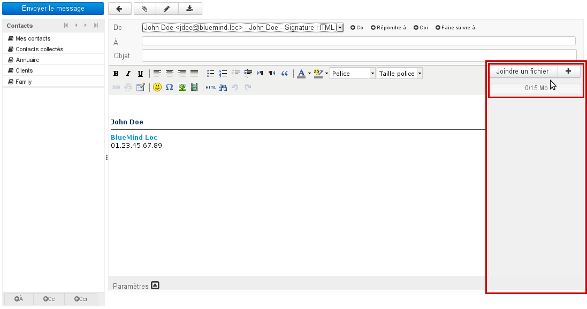

:::tip

Neu

Eine Anzeige am oberen Rand der Liste informiert über die Gesamtgröße der angehängten Dateien im Verhältnis zur maximal zulässigen Größe:

:::

### Hinzufügen durch Ziehen und Ablegen

Sie können eine oder mehrere Anlagen aus einem Dateibrowser in den rechten Bereich der Nachrichtenerstellung ziehen und dort ablegen.

Die Dateien werden dann entweder als eingebettete Anlage oder als Download-Link (je nach dem Schwellenwert, den der Administrator für das automatische Abtrennen eingestellt hat) mit der Nachricht verknüpft:

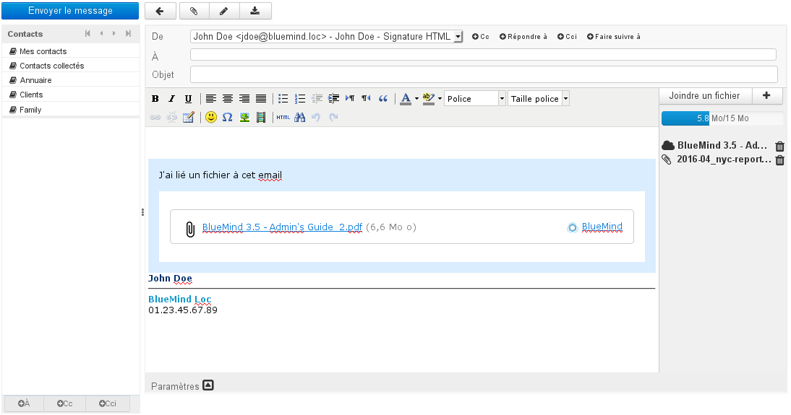

Das Piktogramm vor jeder Anlage zeigt an, ob sie eingebettet oder verlinkt ist:

- ** 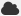 ** Abgetrennte Anlage (wird auch im blauen Kasten im Nachrichtentext aufgeführt)
-  Eingebettete Anlage

Mit dem Symbol 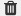 am Ende der Zeile können Sie eine Anlage löschen.

### Hinzufügen mit der Schaltfläche "Datei anfügen"

Durch Klicken auf die Schaltflächen "Datei anfügen" und   wird das Dialogfeld "Datei anfügen" angezeigt, mit dem Sie Dateien, die sich auf dem Computer oder Server befinden, anfügen können:

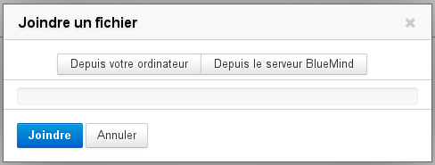

- "**Vom lokalen PC**" öffnet den Standardbrowser für Dateien des Systems.
- "**Server**" öffnet die Dateiauswahl von BlueMind:
 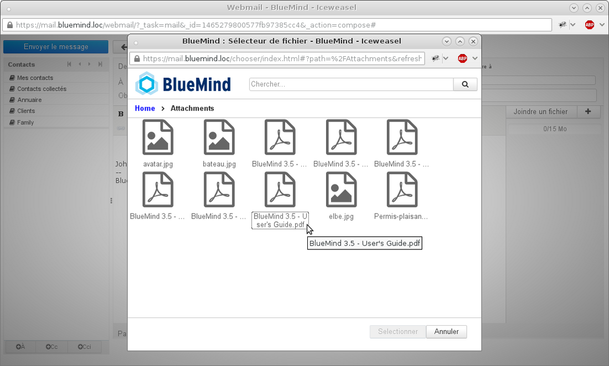 
Diese Dateiauswahl gestattet, Dateien zu finden, die zuvor an Nachrichten angehängt und auf dem BlueMind-Server im Bereich des Benutzers gespeichert wurden.

:::tip

Um mehrere Dateien auszuwählen, klicken Sie sie an, während Sie die Taste Strg auf Ihrer Tastatur gedrückt halten.

:::

Sobald die Datei(en) ausgewählt ist/sind, wird/werden sie automatisch in die Nachricht eingebettet. Eine Schaltfläche gestattet das manuelle Abtrennen jeder einzelnen Anlage:

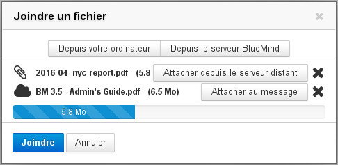

- Wenn eine Datei abgetrennt wurde, können Sie sie über die Schaltfläche "Attacher au message" (An Nachricht anhängen) wieder einbetten.
- Das Kreuz  am Ende der Zeile ermöglicht das Löschen einer eingebetteten oder verlinkten Anlage.
- Mit den Schaltflächen "Vom lokalen PC" und "Server" können Sie neue Anlagen hinzufügen.

:::info

Wenn die Größe der Anlage vom zulässigen Höchstwert nicht mehr weit entfernt ist, wird die Fortschrittsleiste orange, wenn er erreicht ist, wird sie rot.

:::

Klicken Sie nach der Auswahl der Dateien auf die Schaltfläche "Hochladen", um zu bestätigen. Die abzutrennenden Dateien werden dann an den Server gesendet und der Download-Link wird in die Nachricht eingefügt. Die Anlagen sind auf der rechten Seite der Nachrichtenerstellung zu sehen:

## Anzeigen von Anlagen

Beim Empfang einer Nachricht werden in die Nachricht eingebettete Anlagen auf der rechten Seite der Nachricht aufgelistet, die Download-Links für abgetrennte Anlagen werden in einem Feld in der Nachricht aufgeführt:

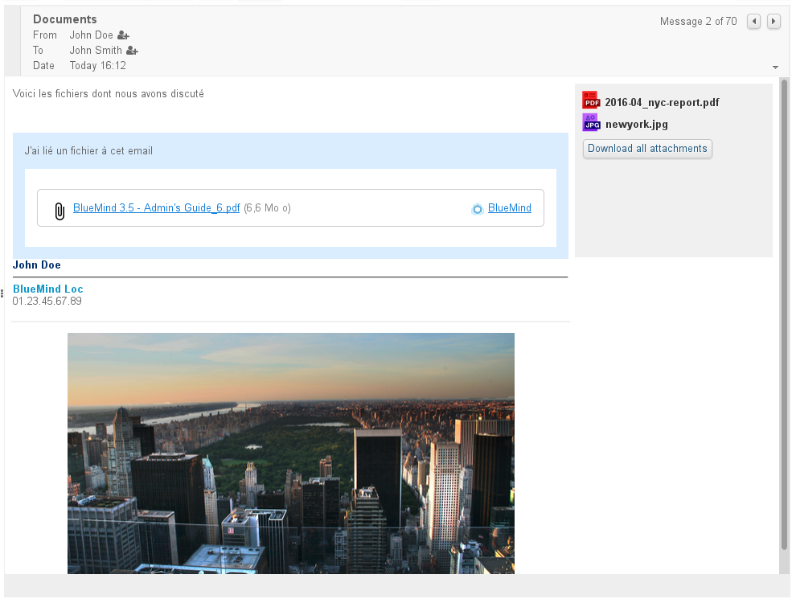

Klicken Sie auf den Dateinamen, um die Anlage auf die übliche Weise herunterzuladen:

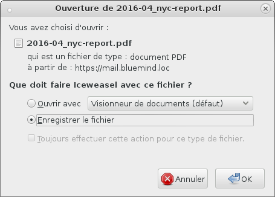

:::info

Die Präsentation der in die Nachricht eingebetteten Anlagen kann bei Verwendung eines Fat Client variieren. Das blaue Feld der verlinkten Anlagen ist jedoch integraler Bestandteil der Nachricht und daher auf den verschiedenen E-Mail-Clients identisch, wenn die Anzeige von HTML-Nachrichten aktiviert ist.

:::

## Abtrennen von Anlagen bei Fat Clients

Der BlueMind Connector ermöglicht Thunderbird-Benutzern ebenfalls den Zugriff auf die Funktion zum Abtrennen von Anlagen.

Weitere Informationen zur Funktionsweise finden Sie auf der Seite zu Ihrer Client-Software:[ Synchronisierung mit Thunderbird](/old/Guide_de_l_utilisateur/Configuration_des_clients_lourds/Configuration_de_Thunderbird/).

:::info

Outlook und MAPI

Die Funktion zum Abtrennen von Anlagen ist eine BlueMind-Funktion. Sie kann daher nur funktionieren, wenn Sie den BlueMind-Connector für Outlook verwenden, aber nicht im Rahmen einer Verwendung von [Outlook mit MAPI](/Guide_de_l_administrateur/La_souscription_BlueMind/Mise_en_œuvre_de_MAPI_pour_Outlook/).

:::

## Verbindung mit einem NextCloud-Konto

Es ist möglich, ein NextCloud-Konto zu verbinden, wenn es auf der Domain installiert und funktionsfähig ist.

:::tip

Diese Funktion muss vorher vom Administrator konfiguriert worden sein. Weitere Informationen zur Implementierung finden Sie auf der entsprechenden Seite des Leifadens für Administratoren: [Verbindung mit Nextcloud](/Guide_de_l_administrateur/Configuration/Détachement_des_pièces_jointes/Connecter_avec_Nextcloud/)

:::

Rufen Sie in der Verwaltung der Benutzereinstellungen "Mein Konto" die Registerkarte "Externe Konten" auf.

- Wenn noch kein Konto verbunden ist, gibt es eine Schaltfläche "Configurer un compte" (Konto einrichten). Klicken Sie darauf, um ein neues Konto hinzuzufügen: 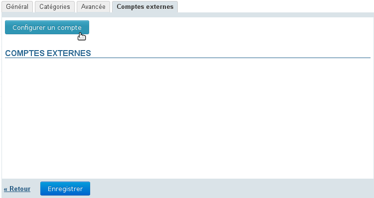
- Geben Sie das Login und das Passwort des NextCloud-Kontos ein, das verbunden werden soll: 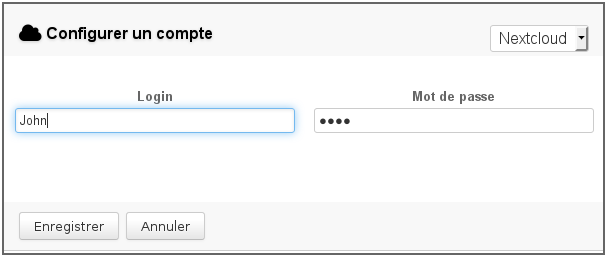
- **Speichern**
- Die Konfigurationsschaltfläche verschwindet und das Konto wird angezeigt:  Hinweis: Sie können die Verbindung jederzeit mit dem Symbol  löschen. Sie können die Verbindungsdaten ändern, indem Sie auf den Link "Nextcloud" oder die Schaltfläche "Modifier" (Bearbeiten) klicken.
-  **Klicken Sie auf "Speichern", um die Erstellung des Kontos zu bestätigen.** 

Die folgenden Schritte entsprechen dem üblichen Verlauf des Abtrennens von Anlagen, wobei die BlueMind-Dateiauswahl jetzt die Dateien des NextCloud-Kontos und ihre Baumstruktur zeigt:

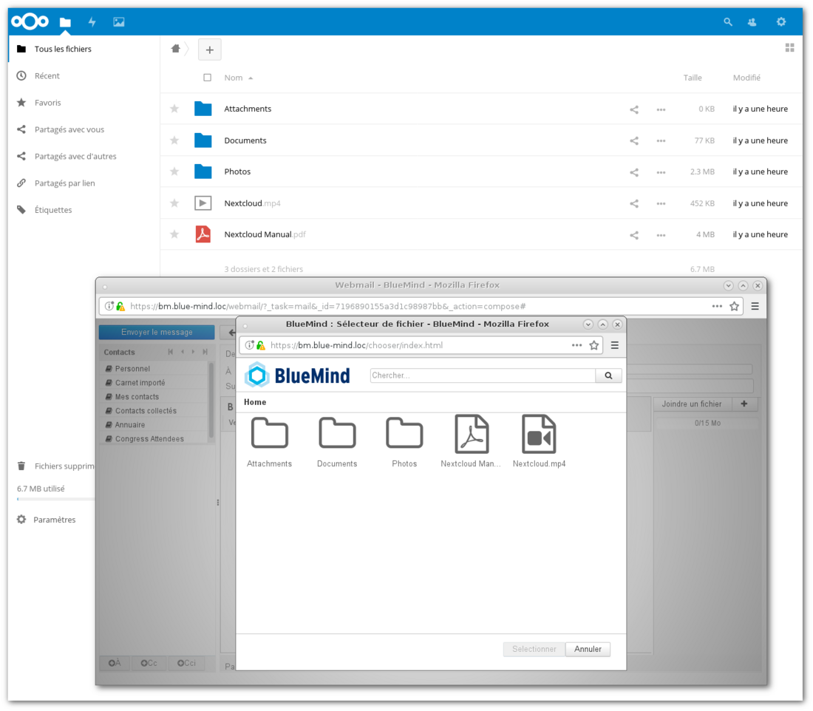

:::tip

Dateien, die als abgetrennte Anlagen von BlueMind hinzugefügt werden, werden im Ordner "Attachments" im Stammverzeichnis des NextCloud-Kontos abgelegt.

:::

