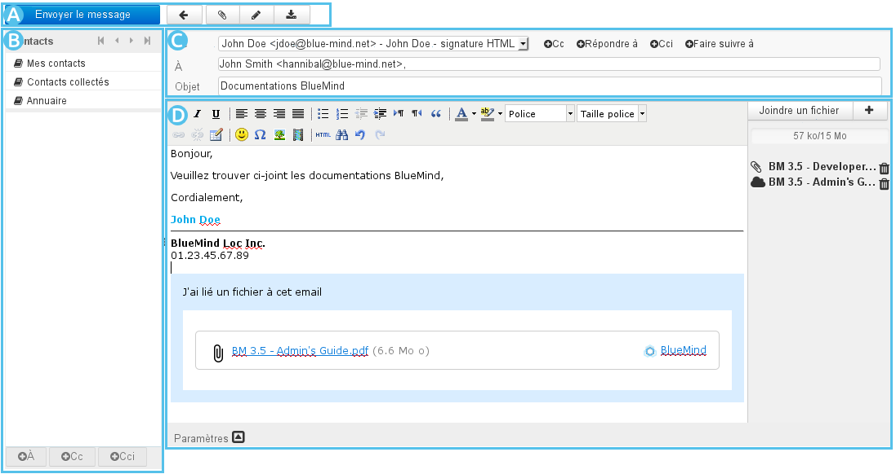
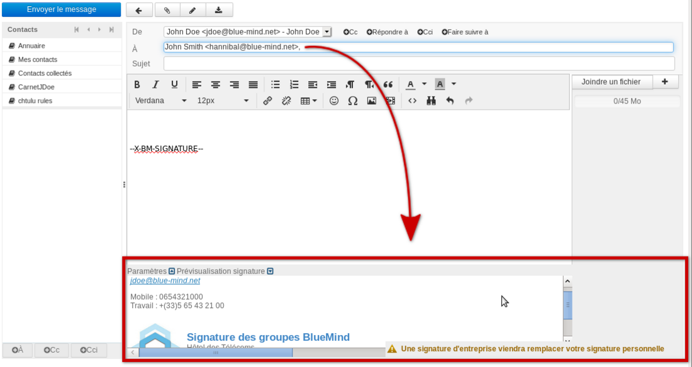
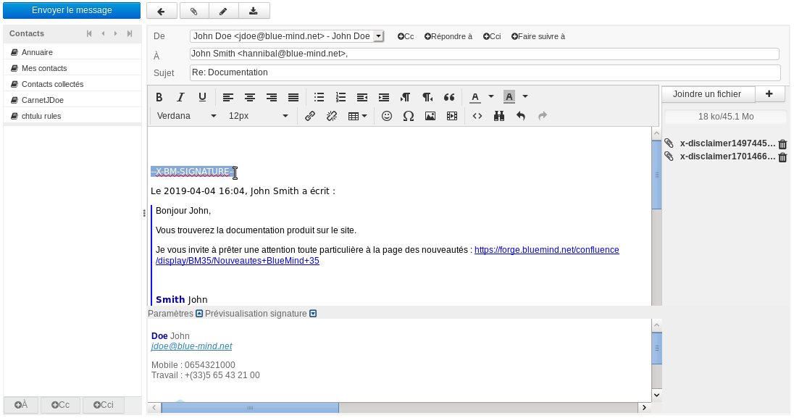

# Nachrichtenerstellung

## Präsentation

-  : In diesem Bereich befinden sich die Aktionsschaltflächen für die Nachricht: Senden, Abbrechen, Datei anfügen, Unterschrift einfügen, Speichern.
-  : Dieser Bereich ermöglicht den Zugriff auf Ihre Kontakte, um sie als Empfänger der Nachricht hinzuzufügen (Hauptempfänger, Kopie oder Blindkopie).
-  : Dieser Bereich zeigt die Adressfelder sowie den Betreff der Nachricht.
    - Hier können Sie [die Identität](/old/Guide_de_l_utilisateur/La_messagerie/Les_identités/) auswählen, mit der Sie Ihre Nachricht senden möchten.
    - Die Felder der Empfänger (klicken Sie auf "Cc hinzufügen" oder "Bcc hinzufügen", um die entsprechenden Felder anzuzeigen) können ausgehend von den Kontakten   oder direkt von Hand ausgefüllt werden. Die automatische Vervollständigung schlägt nach Eingabe der ersten Buchstaben entsprechende Kontakte vor.
-  : Hier wird die Nachricht verfasst.
    - Für die Formatierung der Nachricht steht eine Symbolleiste zur Verfügung.
    - Rechts befindet sich die Verwaltung der Anlagen: Klicken Sie auf "Datei anfügen" oder ziehen Sie eine Anlage per Drag & Drop in die Nachricht.
    - Am unteren Rand des Bereichs der Nachrichtenerstellung stehen erweiterte Einstellungen für weitere Versandoptionen zur Verfügung.

## Empfänger der Nachricht

- Im Feld "**Empfänger**" können Sie den/die Hauptempfänger der Nachricht eingeben.

- Zwei Links ermöglichen das Hinzufügen weiterer Empfänger:  und 

    - **Cc hinzufügen**: Empfänger, die eine Kopie erhalten (Cc = Carbon Copy)

    - **Bcc hinzufügen**: **versteckte** Empfänger, die eine Kopie erhalten (Blind Carbon Copy)

- Mit zwei weiteren Links können Sie zusätzliche Felder hinzufügen:
    - **Antwort an**: Hier können Sie eine oder mehrere Adressen angeben, die verwendet werden, wenn der Empfänger die Funktion "Antwort verfassen" verwendet.
    - **Follow-up to**: Hier können Sie eine oder mehrere Adressen anzugeben, die hinzugefügt werden, wenn der Empfänger die Funktion "Antwort an Mailingliste oder an Absender und alle Empfänger verfassen" verwendet.

:::info

Automatische Vervollständigung

Nach der Eingabe der ersten Zeichen in den Empfängerfeldern werden Ihre Adressbücher und das globale Adressbuch nach passenden Kontakten durchsucht und in den Empfängerfeldern vorgeschlagen.

:::

## Anlagen

So fügen Sie Anlagen hinzu:

- Klicken Sie auf die Schaltfläche , die einen Dateibrowser öffnet.

- **Ziehen** Sie eine oder mehrere Dateien aus dem Dateibrowser und **legen** Sie sie im rechten Teil des Bearbeitungsfensters ab.

So löschen Sie einen Anhang:

- Klicken Sie auf das entsprechende Symbol .

## Erweiterte Einstellungen

Mit dem Link  am unteren Rand der Nachricht können Sie ein Feld mit erweiterten Optionen öffnen, die folgende Möglichkeiten bieten:

- Sie können den **Editor-Typ** wählen: Nachrichten werden standardmäßig im HTML-Modus mit Formatierung bearbeitet. Um einen Bearbeitungsmodus ohne Formatierung zu verwenden, wählen Sie den Editor-Typ "Nur-Text".

- Sie können die **Priorität** der Nachricht ändern.

- Sie können eine **Empfangsbestätigung (MSN)** anfordern (die gesendet wird, wenn der Empfänger die Nachricht öffnet und diese Anforderung akzeptiert).

- Sie können eine **Übermittlungsbestätigung (DSN)** anfordern (die gesendet wird, wenn der Server des Empfängers die Nachricht erhalten hat).

- Sie können für die **Kopie der gesendeten Nachricht** einen anderen Ordner als den Ordner "Gesendet" wählen.

## Speichern der Nachricht

- Während der Verfassung werden die Nachrichten in regelmäßigen Abständen automatisch gespeichert.

- Um **das Speichern einer Nachricht während der Verfassung zu erzwingen**, klicken Sie auf die Schaltfläche   "**Nachricht speichern**".
Die Nachricht wird dann im Ordner "**Entwürfe**" gespeichert.

- Mit der Schaltfläche  "**Unterschrift einfügen**" können Sie der Nachricht die Unterschrift hinzuzufügen, die der verwendeten Identität zugeordnet ist.

- Das Feld "**De**" (Von), das dem Absender entspricht, wird automatisch mit Ihrer Standardidentität ausgefüllt.
Wählen Sie bei Bedarf eine andere [Identität](/old/Guide_de_l_utilisateur/La_messagerie/Les_identités/).

## Senden der Nachricht

Klicken Sie auf die Schaltfläche  oben links im Fenster der Nachrichtenerstellung.

## Firmenunterschrift

### Präsentation

Wenn beim Einfügen von Empfängern [E-Mail-Unterschriften von Unternehmen](/Guide_de_l_administrateur/Configuration/Signatures_d_entreprise/) konfiguriert sind und den Absender- und Empfängerkriterien für die E-Mail entsprechen, dann informiert ein Fenster wie folgt über das Hinzufügen einer Unterschrift:

So können Sie steuern, welche Unterschrift verwendet wird, falls mehrere Unterschriften konfiguriert sind und Ihnen entsprechen könnten (wenn Sie z. B. Mitglied in mehreren Gruppen sind oder eine temporäre Terminunterschrift eingerichtet wurde).

### Einfügen der Unterschrift

Die Unterschrift wird standardmäßig am Ende der Nachricht platziert. Es gibt jedoch Einstellungen, um diese Platzierung zu optimieren.

Wenn die Option aktiviert wurde, die Ihnen gestattet, die Unterschrift selbst zu positionieren, wird die Zeichenfolge "--X-BM-SIGNATURE-" an der Stelle angezeigt, an der die Unterschrift erscheinen wird. Diese Information ist von besonderem Interesse, wenn Sie auf einen Thread antworten:

Sie können die Unterschrift verschieben, indem Sie einfach diese Zeichenkette auf eine der folgenden Arten verschieben:

- auswählen/verschieben
- oder ausschneiden und einfügen
- oder löschen/neu schreiben.

:::info

Entfernen von Mehrfachunterschriften

Um Threads mit mehreren ausgetauschten Antworten übersichtlicher zu machen, können frühere Versionen der Unterschrift des Benutzers im Thread automatisch vom System gelöscht werden.

Diese Option muss vom Administrator aktiviert werden, sie wird nicht standardmäßig systematisch verwendet.

:::

