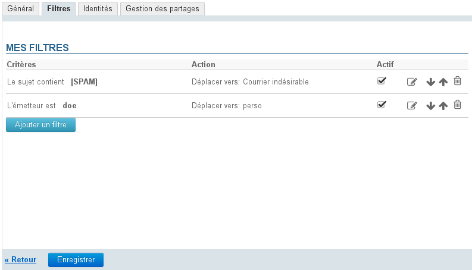
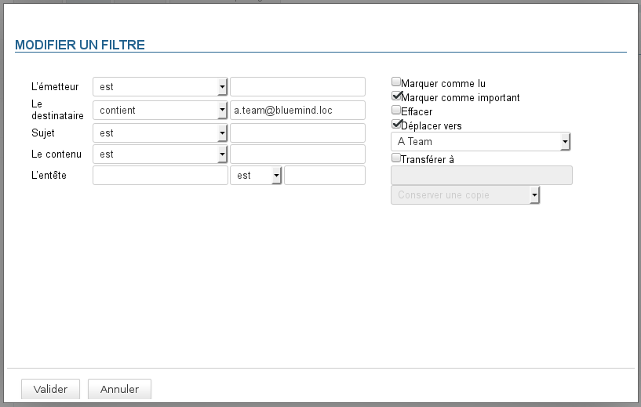
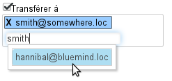
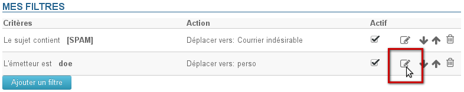
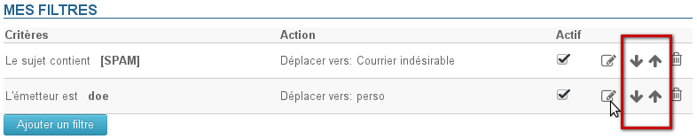

# Nachrichtenfilter

## Präsentation

Filter gestatten die Anwendung von Sortierregeln und von Aktionen, die automatisch für neu eingehende Nachrichten ausgeführt werden.

Sie ermöglichen z. B. das Ablegen in einem Unterordner nach Absender oder das Löschen nach Betreff, ohne dass Sie diese Aktion für jede Nachricht, die dem oder den Kriterien entspricht, manuell selbst durchführen müssen.

Seit BlueMind Version 3 können Filter sortiert und geändert, aber auch aktiviert und deaktiviert werden.

Die Verwaltung der Nachrichtenfilter erfolgt in der Verwaltung der Benutzereinstellungen, auf die Sie über den Link "Mein Konto" in der rechten oberen Ecke der Navigationsleiste zugreifen können: 

Rufen Sie im Abschnitt "Email" die Registerkarte "Filter" auf:

:::info

Die Schaltfläche "Speichern" wird auf jeder Seite der einzelnen Schritte am unteren Seitenrand angezeigt. Wenn mehrere Aktionen (Erstellung, Änderung, Reihenfolge usw.) durchgeführt werden müssen, ist es nicht notwendig, nach jeder Aktion auf diese Schaltfläche zu klicken, Sie können speichern, nachdem alle Änderungen vorgenommen wurden.

:::

## Filter erstellen

Wenn Sie einen neuen Filter erstellen möchten, klicken Sie auf die Schaltfläche "Filter hinzufügen", um das Popup-Fenster für die Erstellung zu öffnen:

1. Bestimmen Sie das Kriterium oder die Kriterien, auf das/die der Filter angewendet wird. (Wenn die Regel mehrere Kriterien umfasst, müssen alle Kriterien erfüllt werden, damit eine Regel angewendet wird.)
2. Geben Sie die Bedingung an, die erfüllt werden muss:
    - ist: Der Wert muss dem angegebenen Wert genau entsprechen.
    - ist nicht: Der Wert muss sich vom angegebenen Wert unterscheiden.
    - enthält: Die Zeichenkette kommt im Vergleichswert vor.

:::info

Beispielsweise werden im oben definierten Filter Nachrichten in den Ordner "a team" verschoben und als wichtig markiert, wenn mindestens einer der Empfänger die Adresse "a.team@bluemind.loc" hat. Die Auswahl "ist" hätte dazu geführt, dass nur die Mails verschoben werden, die diese Adresse als einzigen Empfänger haben.

:::

    - enthält nicht: Die Zeichenkette kommt im Vergleichswert nicht vor.

3. Geben Sie die Aktion(en) an, die ausgeführt wird/werden:
    - Als gelesen kennzeichnen
    - Als wichtig kennzeichnen
    - Verwerfen
    - Verschieben + Wahl des Ordners
    - Weiterleiten an + E-Mail-Adresse(n): Sie können mehrere Adressen angeben, an die die Nachrichten weitergeleitet werden sollen.
        - Die automatische Vervollständigung sucht in allen Adressbüchern (globales Adressbuch/Verzeichnis, persönliche Adressbücher usw.) nach passenden Adressen.
        - Es ist möglich, manuell externe Adressen hinzuzufügen, die während der Sendevorgänge nicht in das Adressbuch "Gesammelte Kontakte" aufgenommen werden.
4. Klicken Sie auf die Schaltfläche "Validieren".
5. **Wenn alle gewünschten Filter erstellt sind, klicken Sie auf die Schaltfläche "Speichern", um den/die neuen Filter zu berücksichtigen.**

## Filter ändern

Ab BlueMind 3 können vorhandene Filter geändert werden. Gehen Sie dazu wie folgt vor:

1. Klicken Sie auf das Bleistiftsymbol  in der Zeile des zu ändernden Filters:
2. Das Popup-Fenster für die Änderung wird geöffnet. Nehmen Sie hier die gewünschten Änderungen vor.
3. Klicken Sie auf die Schaltfläche "Validieren".
4. **Wenn alle gewünschten Filter auf dem neuesten Stand sind, klicken Sie auf die Schaltfläche "Speichern", um die Änderungen zu speichern.**

## Filter anordnen

Die Filter werden in der Reihenfolge, in der sie aufgelistet sind, auf die Nachrichten angewendet. Sie können die Reihenfolge ändern, indem Sie die Filter mithilfe der Pfeile am Ende der Zeile in der Liste nach oben oder nach unten verschieben:

**Wenn die Filter die gewünschte Reihenfolge haben, klicken Sie auf die Schaltfläche "Speichern", um die Änderungen zu speichern.**

:::info

Es kann nur ein Filter auf ein und dieselbe Nachricht angewendet werden: Sobald ein Filter angewendet wurde, haben die folgenden keine Wirkung mehr.

:::

## Filter löschen

1. Klicken Sie auf das Papierkorbsymbol am Ende der Zeile 
2. **Klicken Sie auf die Schaltfläche „Speichern“, um die Änderungen zu speichern.**

