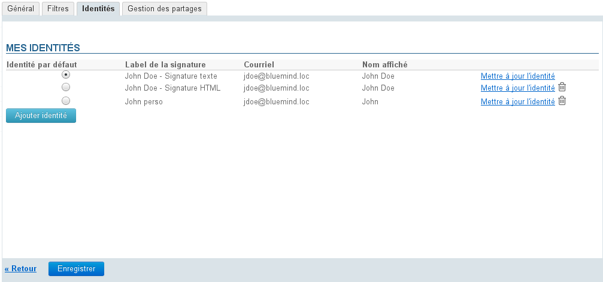
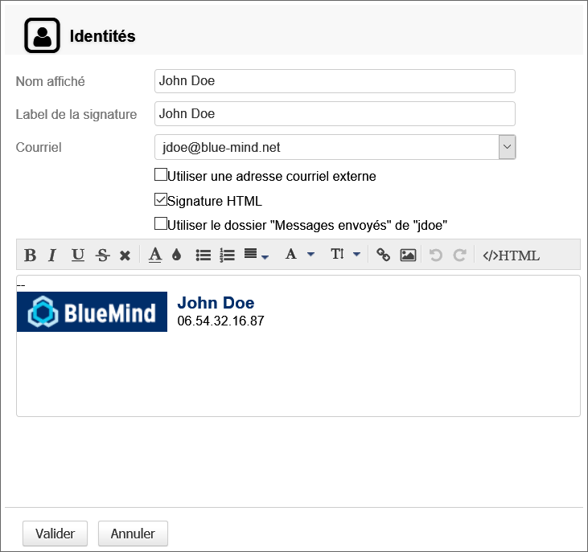
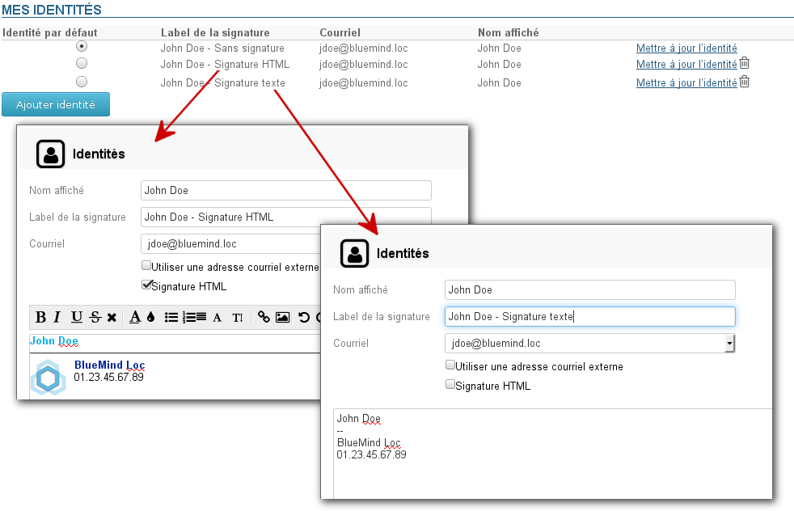

# Identitäten

## Präsentation

BlueMind gestattet die Erstellung mehrerer Identitäten für dasselbe Benutzerkonto.

Wenn mehrere Identitäten erstellt wurden, kann der Benutzer die Identität (und damit die Adresse) auswählen, die beim Senden einer E-Mail verwendet wird.

Diese Identitäten können zugeordnet werden:

- zur Hauptadresse
- zu einem der Aliasnamen des Benutzers
- zu einer Adresse, die einer freigegebenen Mailbox entspricht

Es kann eine Standardidentität festgelegt werden, die beim Erstellen einer neuen Nachricht standardmäßig ausgewählt wird.

## Verwaltung der Identitäten

Dern Zugriff auf die Verwaltung der Identitäten erhalten Sie in der Verwaltungsoberfläche der Benutzereinstellungen:

Gehen Sie dann zur Rubrik Email > Registerkarte "Identitäten".

Standardmäßig hat der Benutzer eine Identität bestehend aus seiner E-Mail-Adresse und seinem Benutzernamen (Vorname+Name).
Die Unterschrift hat einen Namen, ist aber leer.

- Um eine Identität zu erstellen, klicken Sie auf die Schaltfläche "Neue Identität hinzufügen" unter den Einträgen des Formulars.
- Um eine Identität zu ändern, klicken Sie auf den Link "Aktualisieren" am Ende der Zeile.

Beide Aktionen rufen dasselbe Formular zur Verwaltung einer Identität auf:

- Der **Absendername** ist der Name, der in den vom Benutzer gesendeten Nachrichten erscheint.
- Der **Name der Unterschrift** dient zur Unterscheidung in der Liste der Identitäten, da mehrere Identitäten die gleiche Adresse und den gleichen Anzeigename verwenden können.
- Der Benutzer kann **aus allen E-Mail-Adressen**, die ihm zugewiesen oder für ihn freigegeben wurden, wählen: Domain-Aliase, freigegebene Mailboxen usw.

:::tip

Durch Aktivieren des Kontrollkästchens "Externe Email verwenden" können Sie eine Identität für eine Adresse außerhalb von BlueMind erstellen.

Damit diese Option zur Verfügung steht, muss der Administrator dem Benutzer die Rolle "Messagerie" (E-Mail) > "Identité externe" (Externe Identität) zuweisen.
Für weitere Informationen zur Vergabe von Berechtigungen siehe [Administratorhandbuch](/Guide_de_l_administrateur/) > [Benutzer](/Guide_de_l_administrateur/Gestion_des_entites/Utilisateurs/)

:::

- Wählen Sie das **Format der Unterschrift** (HTML oder nicht) und geben Sie eine Unterschrift ein.

- **Mit dem Kontrollkästchen "Benutzen Sie den Sent-Ordner von &lt;Benutzer>, um gesendete Nachrichten zu speichern"** können Sie die Verwendung des Ordners "Gesendet" des Kontos (Benutzer oder freigegebene Mailbox) erzwingen, das der im Feld "E-Mail" ausgewählten E-Mail-Adresse entspricht. Wenn dieses Kontrollkästchen nicht aktiviert ist, wird der Standardordner für gesendete Nachrichten des Benutzers verwendet.
- **Validieren**

:::info

Wenn die Identitäten erstellt sind, müssen Sie die Änderungen mit der Schaltfläche "Speichern" am unteren Rand der Seite speichern, damit sie berücksichtigt werden.

:::

:::tip

Ein Benutzer kann mehrere Identitäten mit demselben Absendernamen für dieselbe E-Mail-Adresse anlegen, um z. B. Empfänger in unterschiedlichen Formaten anzuschreiben: vollständige HTML-Unterschrift für geschäftliche Nachrichten, keine Unterschrift für persönliche Nachrichten, einfache Unterschrift im Textformat für Mailinglisten usw.

Die Unterschrift ist dann das Unterscheidungsmerkmal dieser Identitäten und ihr Name gestattet, sie in der Liste der Identitäten zu erkennen:

:::

## Identitäten und freigegebene Mailboxen

Wenn Sie einer freigegebenen Mailbox mit Änderungs- oder Verwaltungsberechtigungen zugeordnet sind, können Sie eine Identität für sich erstellen, um diese Mailbox als Absender von Nachrichten zu verwenden.

Dazu müssen Sie in der Verwaltung der Identitäten (siehe oben) wie folgt vorgehen:

- Klicken Sie auf die Schaltfläche "Neue Identität hinzufügen".
- Geben Sie einen Absendernamen ein.
- Wählen Sie aus der Liste der verfügbaren E-Mail-Adressen die Adresse der freigegebenen Mailbox aus.
- Die Unterschriftinformationen der freigegebenen Mailbox werden dann automatisch eingefügt.
Diese Informationen entsprechen den Informationen, die der Administrator in der Standardidentität der freigegebenen Mailbox eingetragen hat.

:::info

Wenn eine freigegebene Mailbox mehrere E-Mail-Adressen hat, erscheinen alle in der Liste der verfügbaren Adressen, es werden aber nur die Daten der Standardidentität der Mailbox eingefügt, unabhängig davon, ob es eine Identität gibt, die dieser Adresse in der Konfiguration der freigegebenen Mailbox entspricht oder nicht.

:::

- Wählen Sie den Ordner, der zum Speichern gesendeter Nachrichten verwendet werden soll: Aktivieren Sie das Kontrollkästchen, um den Ordner der freigegebenen Mailbox zu verwenden, oder lassen Sie es deaktiviert, um den Standardordner des Benutzers zu verwenden.
- Validieren

