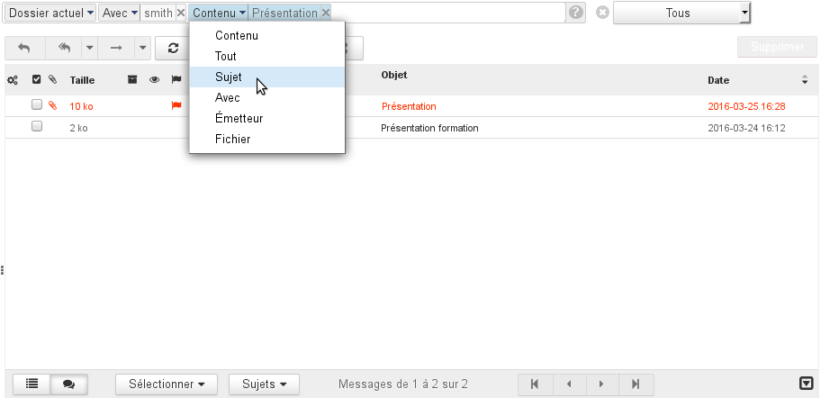
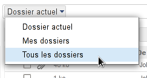
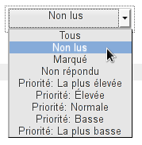
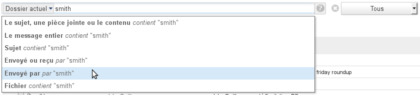
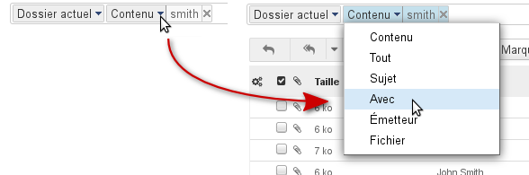
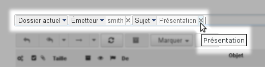
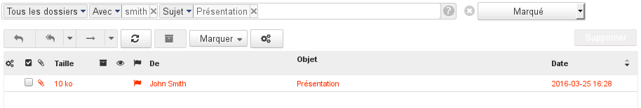

# Erweiterte Suchmaschine

## Präsentation

BlueMind 3 ist mit einer neuen und leistungsstarken Suchmaschine ausgestattet, die eine Volltextsuche mit mehreren Kriterien in den Nachrichten ermöglicht und dabei alle für den Benutzer zugänglichen Ordner abdeckt.

## Funktionsweise

Vor dem Suchfeld befindet sich ein Dropdown-Menü, mit dem Sie den zu durchsuchenden Bereich auswählen können:

Hinter dem Suchfeld befindet sich eine Dropdown-Liste, in der Sie den Status der anzuzeigenden Nachrichten angeben:

:::info

Diese Dropdown-Liste wird, im Gegensatz zu den übrigen Elementen der Suche, nicht zurückgesetzt, wenn Sie den Ordner wechseln, der Anzeigefilter bleibt wirksam.

:::

Im Verlauf der Eingabe werden mehrere Optionen vorgeschlagen, die Ihnen helfen, die Suche zu verfeinern. Wenn keine Option ausgewählt wird, wird die Suche in allen Feldern durchgeführt:

Wenn die Suche gestartet ist und eine Suchoption ausgewählt wurde, kann diese jederzeit über das Menü, das vor dem Suchbegriff im Eingabefeld eingefügt ist, geändert werden:

Das Eingabefeld ist immer verfügbar, sodass eine Suche anhand mehrerer Kriterien, z. B. nach Absender und Betreff der Nachricht, möglich ist:

Jeder Suchbegriff kann durch Anklicken des Kreuzes hinter ihm entfernt werden:

Um eine Suche zu löschen und zur vollständigen Anzeige der Nachrichten zurückzukehren, klicken Sie auf das Kreuz  am Ende der Suchfelder.

:::info

Die Filter sind kumulativ: Im Suchergebnis werden die Nachrichten angezeigt, die ALLEN definierten Kriterien entsprechen.

Wie zum Beispiel die folgende Suche:

Diese Suche zeigt Nachrichten in allen Ordnern (Posteingang, Unterordner, Gelöscht, freigegebene Ordner usw.), die von einer Person mit "smith" im Namen oder in der E-Mail-Adresse gesendet oder empfangen wurden, das Wort "Präsentation" im Betreff enthalten und eine Markierung aufweisen.

:::

:::info

Details zur Suchmaschine

Die Suche in BlueMind:

- basiert auf dem genauen Wortlaut: Das Wort "Einladung" wird im Singular gesucht,
- Akzente werden jedoch nicht berücksichtigt: "Réservation" und "Reservation" führen zu denselben Ergebnissen.

Es ist möglich, das Zeichen * als Platzhalter für einen Teil eines Wortes in einer Suche zu verwenden. Zum Beispiel:

- Einlad*: sucht nach Wörtern, die mit "Einlad" beginnen und findet z. B. "Einladung" oder "Einladungen".
- E*dung: sucht nach Wörtern, die mit "E" beginnen und mit "dung" enden und findet z. B. "Einladung" oder "Erfindung".

Achtung: Die Antwortzeiten sind bei Suchen mit dem Zeichen "*" deutlich länger als bei einer einfachen Suche.

Hinweis: Sie erhalten diese Informationen auch jederzeit in der Webmailer, wenn Sie auf das Fragezeichen ** am Ende der Suchfelder klicken.

:::

